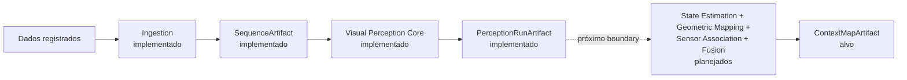

# ContextMap2

O ContextMap2 é uma implementação de pesquisa para gerar artefatos persistentes de mapas contextuais 3D a partir de dados sincronizados de sensores robóticos.

O repositório está intencionalmente focado no **canonical pipeline**: construir um caminho mínimo ponta a ponta, medir a qualidade do mapa gerado e validar a representação antes de expandir o sistema.

## Objetivo

O sistema recebe observações sincronizadas, como RGB, LiDAR ou profundidade, pose, calibração e timestamps, e produz um artefato contextual portátil e versionado contendo as evidências necessárias para pesquisas robóticas downstream.



O artefato gerado é a fronteira deste repositório. Visualização, busca em linguagem natural, navegação, planejamento, agentes e outros consumidores devem existir em projetos separados e consumir o mapa exportado.

## Escopo atual

O canonical pipeline deve estabelecer e validar:

- contratos canônicos de sensores e observações;
- um caminho de entrada reproduzível;
- percepção visual e associação geométrica;
- agregação de evidência multi-view;
- entidades contextuais e relações necessárias ao mapa;
- schema, serialização, validação e provenance do artefato;
- avaliação que meça a qualidade do mapa final, não apenas saídas isoladas de modelos.

Um componente não deve entrar no pipeline principal apenas porque funciona qualitativamente. Adições experimentais precisam de uma hipótese explícita e de efeito mensurável sobre a qualidade do mapa.

## Estado do repositório

**Pre-alpha.** Interfaces e schemas de artefato podem mudar enquanto o canonical pipeline estiver sendo validado. Releases permanecem na série `v0.x.y` até que a primeira representação esteja estável o suficiente para consumidores externos.

## Estado implementado

A branch `dev` já contém dois módulos de domínio completos no nível de core:

- [`contextmap.ingestion`](src/contextmap/ingestion/docs/README.md), com contratos canônicos, adapters ROS 1/ROS 2, sincronização, calibração, seleção/replay, provenance, validação e `SequenceArtifact`;
- [`contextmap.visual_perception`](src/contextmap/visual_perception/docs/README.md), com contratos de evidência, ports, preset canônico versionado, executor de DAG, Region Discovery concreto e o core de Feature Extraction, incluindo `EmbeddingSpace`, feature store, dense sampling/pooling, diagnostics e enhancement opcional; `PerceptionRunArtifact` e `PerceptionEvidenceSet` preservam esses resultados sem fusão implícita.
- [`contextmap.evaluation`](src/contextmap/evaluation/docs/README.md), com protocolos determinísticos já implementados para Region Discovery e Feature Extraction.

Os adapters concretos DINOv2, DINOv3, CLIP e AlphaCLIP ainda não estão integrados na `dev`; a infraestrutura de Feature Extraction não deve ser confundida com suporte a esses modelos.

Os demais estágios do mapa contextual permanecem arquitetura alvo e serão integrados por milestones posteriores.

## Desenvolvimento

Python 3.11 ou superior é obrigatório.

```bash
python -m venv .venv
source .venv/bin/activate
python -m pip install -e '.[dev]'
make check
```

Comandos úteis:

```bash
make lint
make format
make typecheck
make test
make build
```

## Fluxo de branches

O desenvolvimento segue issues e milestones:

```text
<type>/<issue-number>-<slug>
    ↓
milestone/<milestone-slug>
    ↓
dev
    ↓
main
```

- `main`, estado validado e origem das releases;
- `dev`, integração de milestones concluídas;
- `milestone/*`, integração das issues de um marco específico;
- branches de issue como `feat/38-canonical-sensor-contract` ou `docs/187-development-workflow`.

A branch `qa` não faz parte do fluxo padrão atual.

Consulte [CONTRIBUTING.md](CONTRIBUTING.md) para a entrada rápida e [docs/development.md](docs/development.md) para as regras completas.

## Documentação

O ponto de entrada canônico é [docs/README.md](docs/README.md).

Para entender o sistema, a ordem principal é:

1. [Pipeline completo](docs/PIPELINE.md), fluxo da fonte registrada até o `ContextMapArtifact`.
2. [Arquitetura](docs/architecture.md), capabilities, ownership, dependências e boundaries.
3. [Contratos](docs/CONTRACTS.md), tipos públicos, identidades e semântica dos dados entre módulos.
4. [Artefatos e lineage](docs/ARTIFACTS.md), persistência, immutability, debug, integridade e reprodutibilidade.

Documentação específica de uma capability fica junto ao módulo:

```text
src/contextmap/<module>/docs/
```

A documentação é fragmentada por responsabilidade, mas integrada por links a partir do índice global.

Para detalhes implementacionais, use os READMEs de [`ingestion`](src/contextmap/ingestion/docs/README.md), [`visual_perception`](src/contextmap/visual_perception/docs/README.md) e [`evaluation`](src/contextmap/evaluation/docs/README.md). Dentro de Visual Perception, as visões de [Region Discovery](src/contextmap/visual_perception/docs/region-discovery.md) e [Feature Extraction](src/contextmap/visual_perception/docs/feature-extraction.md) descrevem o estado implementado de cada milestone. Os documentos em `docs/` integram esses módulos ao pipeline global e distinguem explicitamente o que já existe do que ainda é alvo arquitetural.

## Versionamento

Tags Git usam Semantic Versioning no formato `vMAJOR.MINOR.PATCH`. Durante a fase de validação, releases usam `v0.MINOR.PATCH`.

Uma tag válida deve apontar para `main` e dispara o pipeline de release.

Consulte [docs/versioning.md](docs/versioning.md) para a política completa.

## Licença

GNU Affero General Public License v3.0. Consulte [LICENSE](LICENSE).
