# ContextMap2

O ContextMap2 é uma implementação de pesquisa para gerar artefatos persistentes de mapas contextuais 3D a partir de dados sincronizados de sensores robóticos.

O repositório está intencionalmente focado no **canonical pipeline**: construir um caminho mínimo ponta a ponta, medir a qualidade do mapa gerado e validar a representação antes de expandir o sistema.

## Objetivo

O sistema recebe observações sincronizadas, como RGB, LiDAR ou profundidade, pose, calibração e timestamps, e produz um artefato contextual portátil e versionado contendo as evidências necessárias para pesquisas robóticas downstream.

```mermaid
flowchart LR
    A["Dados registrados"] --> B["Ingestion<br/>implementado"]
    B --> C["SequenceArtifact<br/>implementado"]
    C --> D["Visual Perception Core<br/>implementado"]
    D --> E["PerceptionRunArtifact<br/>implementado"]
    C --> S["State Estimation<br/>implementado"]
    S --> T["StateEstimationRunArtifact<br/>implementado"]
    C --> M["Geometric Mapping<br/>implementado"]
    T --> M
    M --> MA["GeometricMapArtifact<br/>implementado"]
    E --> SEN["Sensor Association<br/>implementado"]
    MA --> SEN
    T --> SEN
    SEN --> SENA["SensorAssociationRunArtifact<br/>implementado"]
    MA --> PTR["Point Representation<br/>implementado, opcional"]
    PTR --> PTRA["PointRepresentationRunArtifact<br/>implementado"]
    SENA --> FUS["Semantic Fusion<br/>implementado"]
    PTRA -.-> FUS
    FUS --> FUSA["SemanticFusionRunArtifact<br/>implementado"]
    FUSA --> SMP["Semantic Mapping<br/>implementado"]
    SMP --> SMPA["SemanticMappingRunArtifact<br/>implementado"]
    SMPA --> ER["Entity Resolution<br/>implementado"]
    ER --> ERA["EntityResolutionRunArtifact<br/>implementado"]
    ERA --> F["Spatial Relations<br/>implementado"]
    F --> G["ContextMapArtifact<br/>alvo"]
```



O artefato gerado é a fronteira deste repositório. Visualização, busca em linguagem natural, navegação, planejamento, agentes e outros consumidores devem existir em projetos separados e consumir o mapa exportado.

## Escopo atual

O canonical pipeline deve estabelecer e validar:

- contratos canônicos de sensores e observações;
- um caminho de entrada reproduzível;
- percepção visual e associação geométrica;
- agregação de evidência multi-view;
- entidades contextuais e relações necessárias ao mapa;
- schema, serialização, validação e provenance do artefato;
- avaliação que meça a qualidade do mapa final, não apenas saídas isoladas de modelos.

Um componente não deve entrar no pipeline principal apenas porque funciona qualitativamente. Adições experimentais precisam de uma hipótese explícita e de efeito mensurável sobre a qualidade do mapa.

## Estado do repositório

**Pre-alpha.** Interfaces e schemas de artefato podem mudar enquanto o canonical pipeline estiver sendo validado. Releases permanecem na série `v0.x.y` até que a primeira representação esteja estável o suficiente para consumidores externos.

## Estado implementado

A branch `dev` já contém nove módulos de domínio, além da capability de avaliação que mede seus resultados:

- [`contextmap.ingestion`](src/contextmap/ingestion/docs/README.md), com contratos canônicos, adapters ROS 1/ROS 2, sincronização, calibração, seleção/replay, provenance, validação e `SequenceArtifact`;
- [`contextmap.visual_perception`](src/contextmap/visual_perception/docs/README.md), com contratos de evidência, ports, preset canônico versionado, executor de DAG, Region Discovery concreto, Feature Extraction com adapters DINOv2, DINOv3, CLIP e AlphaCLIP e o boundary canônico de Semantic Interpretation, com requests auditáveis, prompt/parser versionados, adapters Qwen/Gemini/Florence-2 e `SemanticScore` separado das claims; `PerceptionRunArtifact` e `PerceptionEvidenceSet` preservam esses resultados sem fusão implícita.
- [`contextmap.state_estimation`](src/contextmap/state_estimation/docs/README.md), com `PoseEstimate`/`Trajectory`, lookup temporal auditável, frame graph estático e preflight de geometria, os backends `ExternalPose` e FAST-LIO atrás do port `StateEstimator` (este com o wrapper de implantação em container e uma execução real sobre a janela de referência do `corridor-02`) e o `StateEstimationRunArtifact`;
- [`contextmap.geometric_mapping`](src/contextmap/geometric_mapping/docs/README.md), com `GeometryPoint`, `GeometryReference` e `GeometricMap`, estado explícito de correção de movimento, montagem de inputs, transformação fonte→mapa com traces, acumulação com referências estáveis, acesso espacial por `GeometrySource` e o `GeometricMapArtifact`;
- [`contextmap.sensor_association`](src/contextmap/sensor_association/docs/README.md), com `SpatialObservation` (a geometria persistente que uma região enxerga, por referência), modelos de câmera calibrados (pinhole, fisheye e MEI), a cadeia mapa→câmera→imagem preparada, visibilidade e oclusão, pertencimento à máscara de `Region2D`, amostragem de features densas, `ObservationQuality` (medidas separadas, nunca confiança semântica), diagnósticos e o `SensorAssociationRunArtifact`; teve uma primeira execução real sobre 20 frames do `corridor-02`, com a trajetória de referência do dataset como `ExternalPose` e uma calibração MEI derivada, enquanto a cadeia canônica sobre um mapa construído com a trajetória real do FAST-LIO (que já existe) continua pendente;
- [`contextmap.point_representation`](src/contextmap/point_representation/docs/README.md), capability **opcional** com `PointRepresentation` e `RepresentationSpace`, extração de suporte local sobre `GeometrySource`, o port `PointEncoder`, o descritor geométrico determinístico (baseline), a fronteira do backend PTv3 com seu runtime real sobre o Pointcept e o `PointRepresentationRunArtifact`; o PTv3 foi medido em geometria real (custo e comparação com `off` e com o descritor) e o efeito downstream está pendente;
- [`contextmap.semantic_fusion`](src/contextmap/semantic_fusion/docs/README.md), com `FusionSupport` (onde a evidência é acumulada, sem identidade de objeto), `EvidenceContribution`, agrupamento por observação física (inferência repetida é correlacionada, não votos independentes), a política baseline de acumulação, a preservação de ambiguidade, contradição, empate e abstenção, canais de evidência tipados, uma política opcional ciente de qualidade e o `SemanticFusionRunArtifact`; a verificação é sintética mais uma execução real sem claims nem anotações, e nenhuma decisão sobre a política ciente de qualidade foi tomada;
- [`contextmap.semantic_mapping`](src/contextmap/semantic_mapping/docs/README.md), com `Entity` (suporte 3D exato por referência, estado semântico sem colapso, vínculos de evidência e estado temporal), `EntityReference` com escopo de identidade explícito, a materialização `one-support-one-entity-v1` a partir da evidência fundida **sem nenhuma resolução entre suportes** e o `SemanticMappingRunArtifact`; entidades de suportes diferentes continuam distintas até Entity Resolution, e toda a verificação usa fixtures sintéticos;
- [`contextmap.entity_resolution`](src/contextmap/entity_resolution/docs/README.md), com a recuperação de candidatos, a evidência tipada por canal (geometria, semântica, aparência, temporal e, opcional, representação 3D) sem score único, as decisões `MATCH`/`DISTINCT`/`UNRESOLVED`, a política baseline conservadora, `ResolvedEntity` com linhagem de fusão (uma contradição de transitividade impede a fusão), a detecção opcional de candidatos a divisão e o `EntityResolutionRunArtifact`; toda a verificação usa dados sintéticos, sem run de resolução sobre dados reais;
- [`contextmap.spatial_relations`](src/contextmap/spatial_relations/docs/README.md), com `Relation` e `RelationEvidence` entre entidades resolvidas, a taxonomia versionada de 11 predicados, as convenções de frame declaradas pela execução, candidatos, avaliadores geométricos e de contato por pontos, a evidência de observação (corroborante, nunca decisiva), a política de decisão conservadora com consistência de inverso e simetria e o `SpatialRelationsRunArtifact`; lê o run de Entity Resolution pela API pública dela e toda a verificação usa fixtures sintéticos;
- [`contextmap.evaluation`](src/contextmap/evaluation/docs/README.md), com protocolos determinísticos já implementados para Region Discovery, Feature Extraction, Semantic Interpretation, State Estimation, Geometric Mapping, Sensor Association, Point Representation, Semantic Fusion e Semantic Mapping, e com a infraestrutura de avaliação controlada (reference set versionado, anotações e QA, registro de métricas, manifestos de experimento e avaliação das técnicas opcionais). Ainda não há reference set real nem execução real de experimento.

Os adapters de Feature Extraction usam carregamento lazy e checkpoints locais por default. A CI valida contratos e transformações com runtimes determinísticos injetados. DINOv2, DINOv3 e CLIP foram executados com pesos reais em frames de `corridor-02`, com resultados nos documentos de cada adapter; AlphaCLIP (sem checkpoint de origem e integridade verificáveis) continua sem execução real. Essas validações dos adapters não equivalem a uma avaliação científica comparativa da qualidade dos embeddings.

Os demais estágios do mapa contextual permanecem arquitetura alvo e serão integrados por milestones posteriores.

## Instalação

O pacote ainda não é publicado no PyPI: instale a partir de um clone ou da wheel de uma GitHub Release.

```bash
python -m pip install .              # base: só NumPy
python -m pip install '.[ros1]'      # + leitura de bags ROS 1/ROS 2 (rosbags); '.[ros2]' é equivalente
python -m pip install '.[vision]'    # + DINOv2, DINOv3 e CLIP (torch, torchvision, transformers, Pillow)
```

A instalação base importa os contratos públicos e lê artifacts persistidos sem ROS, Torch ou modelos, e instala o comando `contextmap` (também `python -m contextmap`; veja `contextmap --help`), a interface da capability `runtime`. Extras, runtimes que não vêm do PyPI (SAM 2, AlphaCLIP, PTv3, FAST-LIO) e erros de dependência opcional estão em [docs/installation.md](docs/installation.md).

## Desenvolvimento

Python 3.11 ou superior é obrigatório.

```bash
python -m venv .venv
source .venv/bin/activate
python -m pip install -e '.[dev]'
make check
```

Comandos úteis:

```bash
make lint
make format
make typecheck
make test
make build
make smoke-install   # constrói e testa a wheel em um venv novo
```

## Fluxo de branches

O desenvolvimento segue issues e milestones:

```text
<type>/<issue-number>-<slug>
    ↓
milestone/<milestone-slug>
    ↓
dev
    ↓
main
```

- `main`, estado validado e origem das releases;
- `dev`, integração de milestones concluídas;
- `milestone/*`, integração das issues de um marco específico;
- branches de issue como `feat/38-canonical-sensor-contract` ou `docs/187-development-workflow`.

A branch `qa` não faz parte do fluxo padrão atual.

Consulte [CONTRIBUTING.md](CONTRIBUTING.md) para a entrada rápida e [docs/development.md](docs/development.md) para as regras completas.

## Documentação

O ponto de entrada canônico é [docs/README.md](docs/README.md).

Para entender o sistema, a ordem principal é:

1. [Pipeline completo](docs/PIPELINE.md), fluxo da fonte registrada até o `ContextMapArtifact`.
2. [Arquitetura](docs/architecture.md), capabilities, ownership, dependências e boundaries.
3. [Contratos](docs/CONTRACTS.md), tipos públicos, identidades e semântica dos dados entre módulos.
4. [Artefatos e lineage](docs/ARTIFACTS.md), persistência, immutability, debug, integridade e reprodutibilidade.

Documentação específica de uma capability fica junto ao módulo:

```text
src/contextmap/<module>/docs/
```

A documentação é fragmentada por responsabilidade, mas integrada por links a partir do índice global.

Para detalhes implementacionais, use os READMEs de [`ingestion`](src/contextmap/ingestion/docs/README.md), [`visual_perception`](src/contextmap/visual_perception/docs/README.md), [`state_estimation`](src/contextmap/state_estimation/docs/README.md), [`geometric_mapping`](src/contextmap/geometric_mapping/docs/README.md), [`sensor_association`](src/contextmap/sensor_association/docs/README.md), [`point_representation`](src/contextmap/point_representation/docs/README.md), [`semantic_fusion`](src/contextmap/semantic_fusion/docs/README.md) e [`evaluation`](src/contextmap/evaluation/docs/README.md). Dentro de Visual Perception, [Region Discovery](src/contextmap/visual_perception/docs/region-discovery.md), [Feature Extraction](src/contextmap/visual_perception/docs/feature-extraction.md) e [Semantic Interpretation](src/contextmap/visual_perception/docs/semantic-interpretation.md) descrevem os boundaries implementados. Dentro das demais capabilities, o README é o ponto de entrada para contratos, policies, artifacts, backends e validação realmente existentes. Os documentos em `docs/` integram esses módulos ao pipeline global e distinguem explicitamente o que já existe do que ainda é alvo arquitetural.

## Versionamento

Tags Git usam Semantic Versioning no formato `vMAJOR.MINOR.PATCH`. Durante a fase de validação, releases usam `v0.MINOR.PATCH`.

Uma tag válida deve apontar para `main` e dispara o pipeline de release.

Consulte [docs/versioning.md](docs/versioning.md) para a política completa. As mudanças por versão ficam em [CHANGELOG.md](CHANGELOG.md).

## Licença

GNU Affero General Public License v3.0 (`AGPL-3.0-only`). Consulte [LICENSE](LICENSE). Modelos, pesos e runtimes de terceiros não são redistribuídos e mantêm as licenças de seus fornecedores: veja [docs/third-party-licenses.md](docs/third-party-licenses.md).
