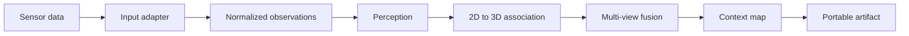

# ContextMap2

ContextMap2 is a research implementation for generating persistent 3D contextual map artifacts from synchronized robotic sensor data.

The current repository is intentionally focused on **Solution 1**: build one minimal end-to-end path, measure the quality of the generated map, and validate the representation before expanding the system.

## Goal

The system receives synchronized observations such as RGB, LiDAR or depth, pose, calibration, and timestamps, then produces a portable and versioned contextual map artifact containing the evidence required by downstream robotics research.



The generated artifact is the boundary of this repository. Visualization, natural-language search, navigation, planning, agents, and other consumers should live in separate projects and consume the exported map.

## Current scope

Solution 1 should establish and validate:

- canonical sensor and observation contracts;
- one reproducible input path;
- visual perception and geometric association;
- multi-view evidence aggregation;
- contextual entities and relations required by the map;
- artifact schema, serialization, validation, and provenance;
- evaluation that measures the quality of the final map, not only isolated model outputs.

A component should not become part of the main pipeline only because it works qualitatively. Experimental additions should have an explicit hypothesis and measurable effect on map quality.

## Repository status

**Pre-alpha.** Interfaces and artifact schemas may change while Solution 1 is being validated. Releases remain in the `v0.x.y` series until the first representation is considered stable enough for external consumers.

## Development

Python 3.11 or newer is required.

```bash
python -m venv .venv
source .venv/bin/activate
python -m pip install -e '.[dev]'
make check
```

Useful commands:

```bash
make lint
make format
make typecheck
make test
make build
```

## Branches

- `main`, validated state intended to remain reproducible;
- `qa`, candidate changes under validation;
- `dev`, integration branch for active development;
- short-lived branches such as `feat/*`, `fix/*`, `research/*`, `experiment/*`, `refactor/*`, `docs/*`, and `chore/*`.

Changes should normally move through `dev` and `qa` before reaching `main` once the initial repository bootstrap is complete.

## Versioning

Git tags use Semantic Versioning in the form `vMAJOR.MINOR.PATCH`. During the validation stage, releases use `v0.MINOR.PATCH`. Pushing a valid version tag triggers the release pipeline and generates build artifacts automatically.

See [docs/versioning.md](docs/versioning.md) for the release policy and [CONTRIBUTING.md](CONTRIBUTING.md) for the development workflow.

## License

GNU Affero General Public License v3.0. See [LICENSE](LICENSE).