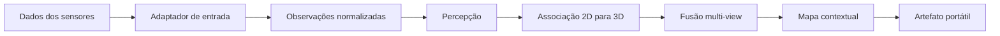

# ContextMap2

O ContextMap2 é uma implementação de pesquisa para gerar artefatos persistentes de mapas contextuais 3D a partir de dados sincronizados de sensores robóticos.

O repositório está intencionalmente focado na **Solution 1**: construir um caminho mínimo ponta a ponta, medir a qualidade do mapa gerado e validar a representação antes de expandir o sistema.

## Objetivo

O sistema recebe observações sincronizadas, como RGB, LiDAR ou profundidade, pose, calibração e timestamps, e produz um artefato contextual portátil e versionado contendo as evidências necessárias para pesquisas robóticas downstream.



O artefato gerado é a fronteira deste repositório. Visualização, busca em linguagem natural, navegação, planejamento, agentes e outros consumidores devem existir em projetos separados e consumir o mapa exportado.

## Escopo atual

A Solution 1 deve estabelecer e validar:

- contratos canônicos de sensores e observações;
- um caminho de entrada reproduzível;
- percepção visual e associação geométrica;
- agregação de evidência multi-view;
- entidades contextuais e relações necessárias ao mapa;
- schema, serialização, validação e provenance do artefato;
- avaliação que meça a qualidade do mapa final, não apenas saídas isoladas de modelos.

Um componente não deve entrar no pipeline principal apenas porque funciona qualitativamente. Adições experimentais precisam de uma hipótese explícita e de efeito mensurável sobre a qualidade do mapa.

## Estado do repositório

**Pre-alpha.** Interfaces e schemas de artefato podem mudar enquanto a Solution 1 estiver sendo validada. Releases permanecem na série `v0.x.y` até que a primeira representação esteja estável o suficiente para consumidores externos.

## Desenvolvimento

Python 3.11 ou superior é obrigatório.

```bash
python -m venv .venv
source .venv/bin/activate
python -m pip install -e '.[dev]'
make check
```

Comandos úteis:

```bash
make lint
make format
make typecheck
make test
make build
```

## Fluxo de branches

O desenvolvimento segue issues e milestones:

```text
<type>/<issue-number>-<slug>
    ↓
milestone/<milestone-slug>
    ↓
dev
    ↓
main
```

- `main`, estado validado e origem das releases;
- `dev`, integração de milestones concluídas;
- `milestone/*`, integração das issues de um marco específico;
- branches de issue como `feat/38-canonical-sensor-contract` ou `docs/187-development-workflow`.

A branch `qa` não faz parte do fluxo padrão atual.

Consulte [CONTRIBUTING.md](CONTRIBUTING.md) para a entrada rápida e [docs/development.md](docs/development.md) para as regras completas.

## Documentação

A documentação global começa em [docs/README.md](docs/README.md).

Documentação específica de capabilities fica junto ao módulo em:

```text
src/contextmap/<module>/docs/
```

O índice global integra os documentos existentes sem duplicar decisões transversais.

## Versionamento

Tags Git usam Semantic Versioning no formato `vMAJOR.MINOR.PATCH`. Durante a fase de validação, releases usam `v0.MINOR.PATCH`.

Uma tag válida deve apontar para `main` e dispara o pipeline de release.

Consulte [docs/versioning.md](docs/versioning.md) para a política completa.

## Licença

GNU Affero General Public License v3.0. Consulte [LICENSE](LICENSE).
