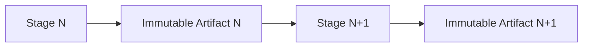
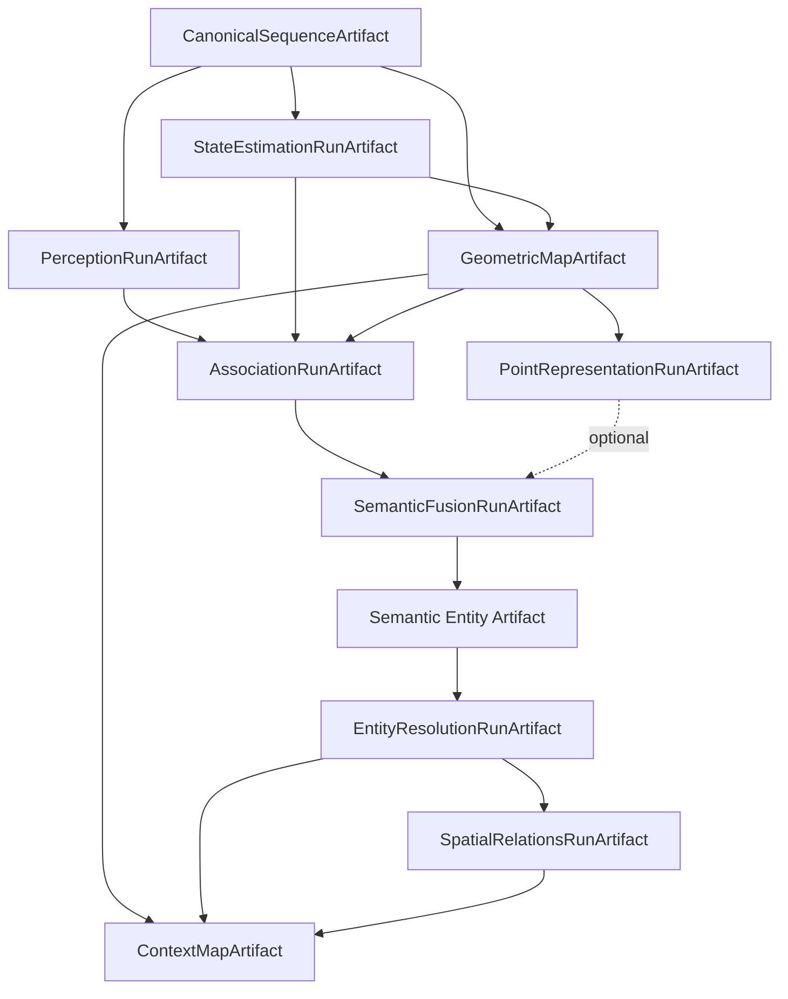
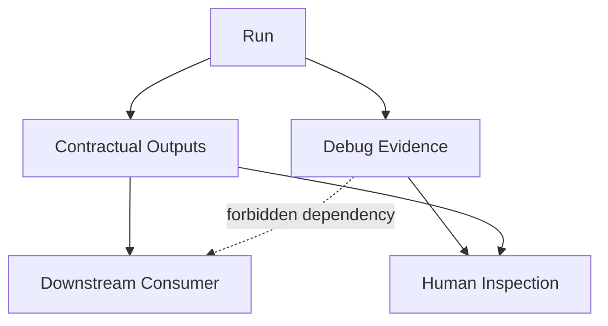
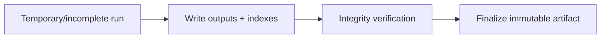
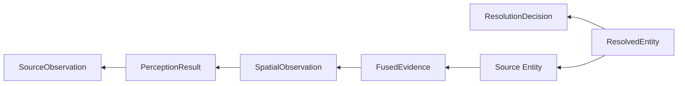
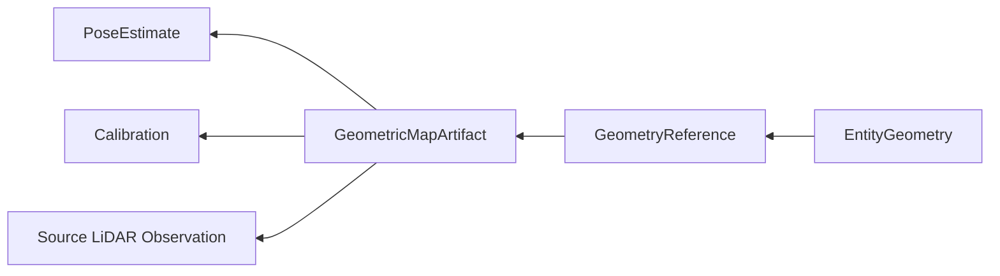
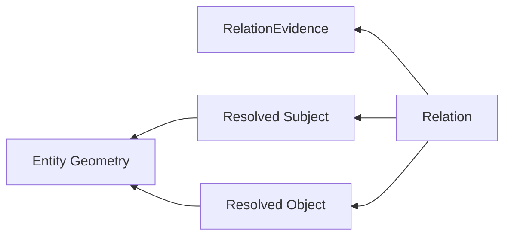

# Artefatos, lineage e reprodutibilidade

Este documento descreve como o ContextMap2 persiste resultados intermediários e o mapa final.

A regra base é simples:

> Cada estágio produz um artefato imutável, versionado e auditável. Reexecutar um estágio gera um novo resultado, não sobrescreve o anterior.

Para o fluxo que produz esses artefatos, consulte [PIPELINE.md](PIPELINE.md). Para os contratos armazenados neles, consulte [CONTRACTS.md](CONTRACTS.md).

## Por que artifacts são parte da arquitetura

O projeto é uma pipeline de pesquisa. É necessário conseguir:

- executar percepção várias vezes sobre os mesmos frames;
- trocar um backend sem destruir o baseline;
- reutilizar state estimation e geometria quando apenas a semântica mudou;
- comparar outputs antigos e novos;
- localizar a origem de um erro downstream;
- abrir resultados sem reinstalar todos os modelos que os produziram.

Artifacts são, portanto, fronteiras de execução e de auditoria.



## Workspace local

A Solution 1 usa filesystem local como storage primário.

```text
workspace/
├── sequences/
├── runs/
├── maps/
├── experiments/
└── tmp/
```

### `sequences/`

Contém canonical sensor sequences produzidas por Ingestion.

### `runs/`

Contém artifacts das capabilities executáveis, separados por capability e sequence.

### `maps/`

Pode conter os produtos finais `ContextMapArtifact` ou bundles finais, conforme o schema consolidado.

### `experiments/`

Pode conter manifests/reports que referenciam runs imutáveis usados em comparações e ablations.

### `tmp/`

Conteúdo efêmero. Nada em `tmp/` pode ser dependência contratual de um artifact válido.

Remote storage, S3, MinIO, database ou distributed registry não são requisitos da Solution 1.

## Artefatos principais



## Immutability

Depois da finalização bem-sucedida de um artifact:

- arquivos contratuais não são alterados;
- IDs não são reciclados;
- evidence não é apagada porque uma interpretação posterior mudou;
- reexecução cria outro artifact/run;
- cache/reuse referencia um artifact anterior, nunca o modifica.

Exemplo:

```text
run-0003  # immutable
run-0004  # nova execução com configuração diferente
```

## Identidade de run

Artifacts de execução devem usar índices monotônicos por capability + sequence quando aplicável.

Exemplo:

```text
workspace/runs/visual-perception/corridor-02/
├── run-0001__frames-0120-0260__sam3-dinov2-gemini/
├── run-0002__frames-0120-0260__sam3-dinov2-qwen/
└── run-0003__frames-0120-0260__sam3-dinov2-gemini-prompt-v2/
```

O run index é conveniente e legível, mas não substitui artifact identity, hashes e manifest.

Timestamp de criação pertence ao manifest. Ele não precisa ser o identificador principal do diretório.

## Estrutura comum de run

Cada capability pode ter payloads diferentes, mas a organização conceitual deve permanecer previsível:

```text
run-000N__<selection>__<profile>/
├── README.md
├── manifest.json
├── config.yaml
├── lineage.json
├── environment.json
├── events.jsonl
├── outputs/
├── metrics/
└── debug/
```

Nem todo artifact precisa de todos os arquivos físicos acima, mas os conceitos devem estar representados quando relevantes.

## `manifest.json`

É o ponto autoritativo de metadata do artifact.

Deve permitir responder:

```text
quem sou eu?
qual schema/version uso?
quais inputs consumi?
qual selection processei?
qual código/configuração/backend produziu o resultado?
quais outputs existem?
quais hashes garantem integridade?
quais warnings/errors ocorreram?
```

Metadata mínima conceitual:

```text
artifact_id
artifact_type
schema_version
run_index, when applicable
created_at
repository / commit SHA
effective configuration reference/hash
selected upstream artifacts
source sequence/selection
backend/model/policy identities
output inventory
content hashes
warnings/errors summary
```

## `config.yaml`

Registra a configuração efetivamente resolvida para o estágio.

Não deve conter secrets.

Exemplos que precisam ser persistidos como valores efetivos quando relevantes:

```text
backend selection
model/checkpoint
thresholds
prompt/template version
sampling policy
fusion policy
relation thresholds
debug level
```

API keys, bearer tokens e credentials nunca devem ser persistidos.

## `lineage.json`

Explicita de quais artifacts e observações o artifact atual depende.

Lineage não é uma descrição textual vaga. Ele deve apontar para identities/hashes suficientes para validar as dependências.

Exemplo conceitual:

```text
AssociationRunArtifact
├── CanonicalSequenceArtifact
├── PerceptionRunArtifact
├── StateEstimationRunArtifact
├── GeometricMapArtifact
└── Calibration identity
```

## `environment.json`

Quando necessário para reprodução, pode registrar metadata como:

```text
Python/runtime version
platform
relevant package versions
GPU/device identity
precision mode
backend runtime version
```

Evitar despejar informações sem utilidade para a reprodução.

## `events.jsonl`

Registro estruturado de eventos de execução quando necessário:

```text
stage started
stage completed
warning
recoverable failure
retry
artifact finalized
```

Logs de console não substituem outputs contratuais.

## `outputs/`

Contém o resultado contratual consumido downstream.

Exemplos:

```text
PerceptionRunArtifact
outputs/
├── results.*
├── regions.*
├── semantic-claims.*
├── feature-index.*
└── features/
```

```text
AssociationRunArtifact
outputs/
├── spatial-observations.*
├── projection-records.*
├── visibility-records.*
└── geometry-region-index.*
```

```text
SemanticFusionRunArtifact
outputs/
├── fusion-supports.*
├── fused-evidence.*
├── physical-observation-groups.*
└── contribution-index.*
```

Um módulo downstream pode depender de `outputs/`, nunca de `debug/`.

## `metrics/`

Métricas de execução e qualidade ficam separadas dos outputs de domínio.

Exemplos:

```text
latency
memory
counts
reprojection error
ambiguity rate
artifact size
```

Quality e performance devem permanecer semanticamente separadas. Um backend mais rápido não se torna automaticamente melhor semanticamente.

## `debug/`

Contém evidência auxiliar para investigação humana.

Exemplos:

- RGB overlays;
- masks;
- crops;
- projection visualizations;
- trajectory plots;
- selected transform traces;
- prompt snapshots;
- raw model responses;
- contribution traces;
- relation measurement summaries.

### Regra

Excluir `debug/` não pode tornar `outputs/` ilegíveis ou inutilizáveis.

## Debug levels

A política global usa níveis conceituais:

```text
none
    outputs contratuais + lineage + metadata + métricas requeridas

standard
    principais visualizações e diagnósticos

full
    evidência intermediária detalhada
```

O conteúdo exato de cada nível pertence à capability.

## Artifact vs debug

A distinção precisa ser explícita:



## Payloads grandes

Features densas, point representations e outras matrizes grandes não precisam ficar inline em JSON/Parquet principal.

Preferir metadata leve + `payload_reference`.

Exemplo:

```text
VisualFeature metadata
├── feature_id
├── shape
├── dtype
├── embedding_space
├── normalization
├── payload path/reference
└── content hash
```

O payload pode ser lazy-loaded sem carregar todo o artifact.

## Integridade

Um artifact válido precisa detectar, conforme seu schema:

- arquivos obrigatórios ausentes;
- payload referenciado ausente;
- content hash incorreto;
- schema incompatível/desconhecido;
- cross-reference inválida;
- identity de upstream incompatível;
- artifact parcialmente criado.

Uma escrita interrompida não pode parecer um artifact finalizado válido.

## Finalização atômica

A implementação deve preferir um processo conceitual como:



Somente depois da verificação o run entra no conjunto de artifacts válidos.

## Reprodutibilidade

Um artifact deve registrar metadata suficiente para reproduzir suas decisões principais.

A reprodução exata pode depender de fatores não determinísticos de modelos, mas o sistema precisa preservar ao menos:

```text
source content identity
selection
backend/model/checkpoint identity
policy versions
prompt/template version
configuration digest
code commit
schema versions
upstream artifact identities
```

## Seleção explícita de runs

A existência de vários runs não significa que todos devem ser combinados.

Exemplo:

```text
run-0001  perception baseline
run-0002  different VLM
run-0003  known bad experiment
```

Um Semantic Fusion run deve receber uma lista/seleção explícita de artifacts.

Não existe comportamento implícito:

```text
use every run found in the directory
```

A menos que uma policy futura defina isso explicitamente, versione a decisão e registre a resolução.

## Overlapping selections

Runs podem processar selections diferentes e parcialmente sobrepostas.

```text
run-0001 -> frames 0000..1000
run-0005 -> frames 0430..0480
run-0007 -> frames 0430..0480
```

A leitura multi-run deve preservar que os results em `frame-0450` pertencem à mesma observação física, mesmo vindo de três inferências.

Nenhum payload precisa ser copiado para construir essa view.

## Registry local

Um `runs.json` ou índice equivalente pode ajudar discovery, mas deve ser reconstruível.

O artifact individual é self-describing através do próprio manifest.

Consequências:

- um run pode ser aberto sem registry global;
- registry ausente não invalida artifacts corretos;
- registry stale pode ser reconstruído a partir dos manifests;
- diretórios incompletos não entram como runs válidos.

## Reuso e cache identity

Reuso de um artifact exige compatibilidade real, não apenas filename semelhante.

A identity de cache/reuse pode considerar, conforme a capability:

```text
upstream artifact IDs/hashes
selection
schema versions
backend/model/checkpoint
policy versions
relevant effective configuration
code/policy identity
```

### Exemplo

Se somente o prompt da percepção muda:

```text
CanonicalSequenceArtifact      reusable
StateEstimationRunArtifact    reusable
GeometricMapArtifact          reusable
PerceptionRunArtifact         recompute
AssociationRunArtifact        recompute
SemanticFusion+               recompute
```

Se a trajetória muda:

```text
PerceptionRunArtifact         potentially reusable
StateEstimationRunArtifact    recompute
GeometricMapArtifact          recompute
AssociationRunArtifact        recompute
all geometry-dependent stages recompute
```

O DAG determina downstream invalidation.

## Provenance closure

O mapa final deve indicar quais dependencies são necessárias para entender sua estrutura e quais são opcionais para inspeção profunda.

Distinguir:

```text
required structural dependency
    necessária para resolver o mapa/entidade/relação

optional evidence dependency
    necessária apenas para inspeção detalhada da evidência

debug dependency
    nunca contratual
```

## Lineage de entidade



## Lineage geométrico



## Lineage de relação



## ContextMapArtifact

O artifact final deve compor ou referenciar:

```text
ContextMap
├── metadata
├── GeometricMap identity/reference
├── resolved entities
├── spatial relations
├── indexes
└── lineage/provenance closure
```

Ele deve permanecer legível sem model runtimes.

Um consumidor que só precisa de entidades/relações não deve precisar baixar raw bags, checkpoints ou debug artifacts.

## Política de não duplicação

Evitar copiar grandes payloads entre artifacts apenas por conveniência.

Preferir references estáveis:

```text
Entity
→ GeometryReference
```

em vez de:

```text
Entity
→ duplicated XYZ array
```

Preferir:

```text
SpatialObservation
→ SemanticClaim reference
```

em vez de copiar a claim para cada geometry point.

## Warnings e failures

Failures não devem desaparecer do lineage.

Artifacts devem preservar quando aplicável:

```text
warnings
recoverable failures
skipped observations
unsupported evidence
retries
timeouts
invalid inputs
partial stage state
```

O consumidor precisa distinguir output completo, parcial e bloqueado.

## Regras de segurança

Artifacts nunca devem persistir:

- API keys;
- bearer tokens;
- credentials;
- secrets de providers.

Provider/model identity, request metadata não sensível, latency, retry count e usage podem ser preservados quando necessários para auditoria.

## Invariantes

1. Artifacts finalizados são imutáveis.
2. Reexecução gera nova identity.
3. `outputs/` é contratual, `debug/` não é.
4. Um run pode ser aberto sem registry global.
5. Runs upstream são selecionados explicitamente.
6. Identity depende de conteúdo/configuração relevante, não apenas path.
7. Reuso nunca altera o artifact reutilizado.
8. Lineage deve chegar até observações físicas e artifacts upstream.
9. Payloads grandes podem ser lazy, mas precisam de metadata/hash.
10. Secrets nunca fazem parte de artifact provenance.
