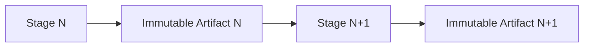
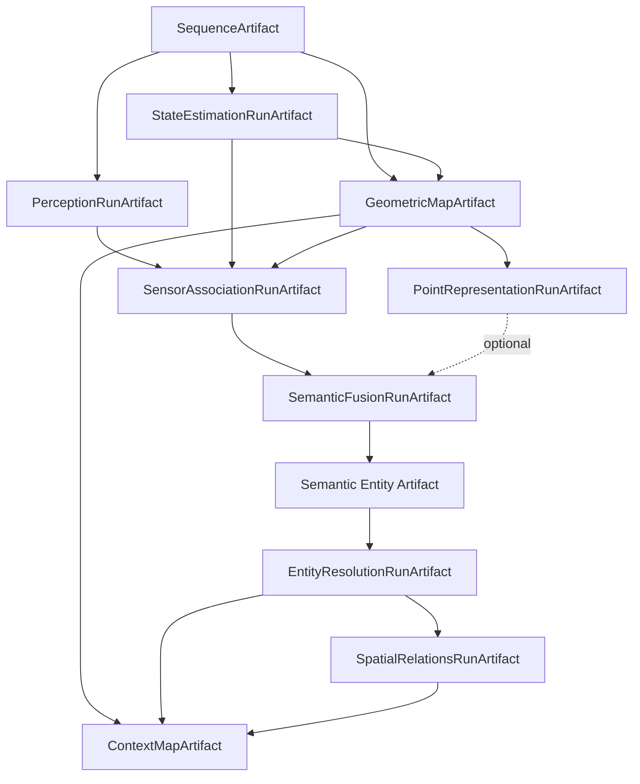
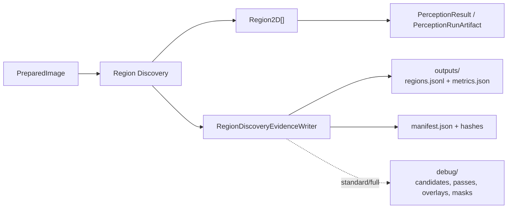
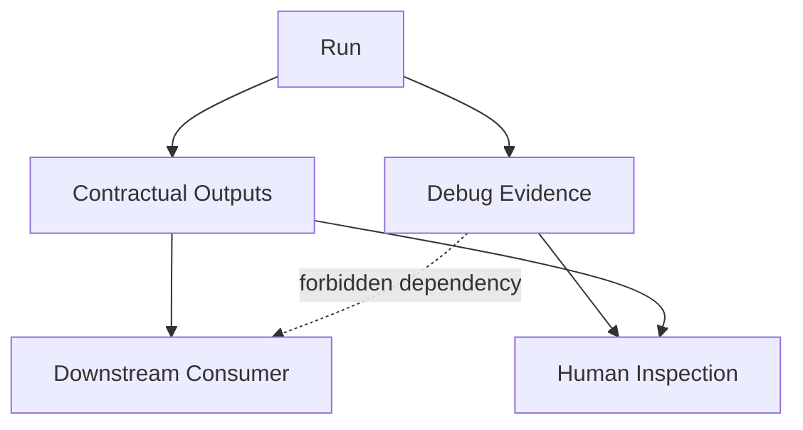
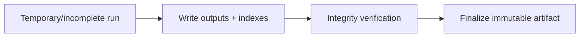
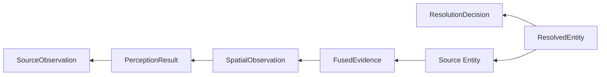
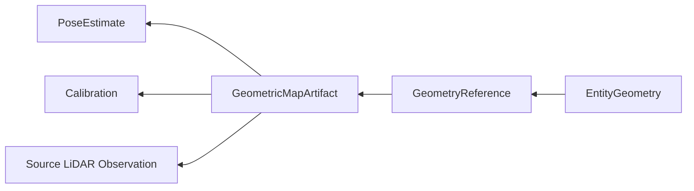
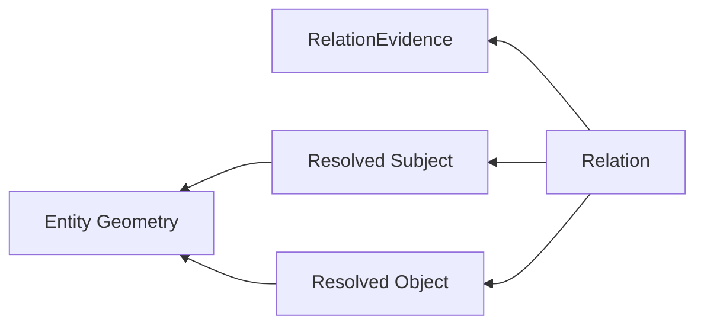

# Artefatos, lineage e reprodutibilidade

Este documento descreve como o ContextMap2 persiste resultados intermediários e o mapa final.

A regra base é simples:

> Cada estágio produz um artefato imutável, versionado e auditável. Reexecutar um estágio gera um novo resultado, não sobrescreve o anterior.

Para o fluxo que produz esses artefatos, consulte [PIPELINE.md](PIPELINE.md). Para os contratos armazenados neles, consulte [CONTRACTS.md](CONTRACTS.md).

## Por que artifacts são parte da arquitetura

O projeto é uma pipeline de pesquisa. É necessário conseguir:

- executar percepção várias vezes sobre os mesmos frames;
- trocar um backend sem destruir o baseline;
- reutilizar state estimation e geometria quando apenas a semântica mudou;
- comparar outputs antigos e novos;
- localizar a origem de um erro downstream;
- abrir resultados sem reinstalar todos os modelos que os produziram.

Artifacts são, portanto, fronteiras de execução e de auditoria.



## Workspace local

O canonical pipeline usa filesystem local como storage primário.

```text
workspace/
├── sequences/
├── runs/
├── maps/
├── experiments/
└── tmp/
```

### `sequences/`

Contém canonical sensor sequences produzidas por Ingestion.

### `runs/`

Contém artifacts das capabilities executáveis, separados por capability e sequence.

### `maps/`

Pode conter os produtos finais `ContextMapArtifact` ou bundles finais, conforme o schema consolidado.

### `experiments/`

Pode conter manifests/reports que referenciam runs imutáveis usados em comparações e ablations.

### `tmp/`

Conteúdo efêmero. Nada em `tmp/` pode ser dependência contratual de um artifact válido.

Remote storage, S3, MinIO, database ou distributed registry não são requisitos do canonical pipeline.

## Artefatos principais



## Artefatos materializados hoje

Na `dev`, sete formatos já existem e são integrados:

```mermaid
flowchart LR
    RAW["Fonte registrada"] --> SW["SequenceArtifactWriter"]
    SW --> SEQ["SequenceArtifact"]
    SEQ --> SEL["Selection / replay"]
    SEL --> VP["Visual Perception"]
    VP --> PW["PerceptionRunWriter"]
    PW --> PRA["PerceptionRunArtifact"]
    PRA --> PRR["PerceptionRunReader"]
    PRR --> ES["PerceptionEvidenceSet"]
    SEL --> ST["State Estimation"]
    ST --> SW2["StateEstimationRunWriter"]
    SW2 --> TRA["StateEstimationRunArtifact"]
    TRA --> TRR["StateEstimationRunReader"]
    SEL --> GM["Geometric Mapping"]
    TRA --> GM
    GM --> MW["GeometricMapArtifactWriter"]
    MW --> MAP["GeometricMapArtifact"]
    MAP --> MR["GeometricMapArtifactReader"]
    PRA --> SA["Sensor Association"]
    MAP --> SA
    TRA --> SA
    SA --> AW["SensorAssociationRunWriter"]
    AW --> ASA["SensorAssociationRunArtifact"]
    ASA --> AR["SensorAssociationRunReader"]
    MAP --> PTE["Point Representation"]
    PTE --> PTW["PointRepresentationRunWriter"]
    PTW --> PTA["PointRepresentationRunArtifact"]
    PTA --> PTR["PointRepresentationRunReader"]
    ASA --> SFU["Semantic Fusion"]
    PTA -.-> SFU
    SFU --> SFW["SemanticFusionRunWriter"]
    SFW --> SFA["SemanticFusionRunArtifact"]
    SFA --> SFR["SemanticFusionRunReader"]
```



`SequenceArtifact` é a sequência canônica concreta produzida por Ingestion. `PerceptionRunArtifact` é o artifact imutável de uma execução de Visual Perception. `StateEstimationRunArtifact` é o artifact imutável de uma execução de State Estimation. `GeometricMapArtifact` é o artifact imutável do mapa que um run construiu. `SensorAssociationRunArtifact` é o artifact imutável das observações espaciais de um run de associação. `PointRepresentationRunArtifact` é o artifact imutável das representações 3D que um encoder produziu sobre um mapa. `SemanticFusionRunArtifact` é o artifact imutável dos suportes de fusão e da evidência fundida. Os artifacts downstream do diagrama anterior permanecem planejados.

O mecanismo comum de run (escrita atômica em diretório temporário, inventário com tamanho e SHA-256, índice de run monotônico calculado a partir dos runs válidos e registry reconstruível) é implementado uma vez em `contextmap.shared.run_directory` e usado por `StateEstimationRunArtifact`, `GeometricMapArtifact`, `SensorAssociationRunArtifact`, `PointRepresentationRunArtifact`, `SemanticFusionRunArtifact` e pelos artifacts das próximas capabilities. Um payload grande é gravado em fluxo (`open_binary`) e hasheado durante a escrita, então um artifact maior que a memória pode ser produzido. Os writers de Ingestion e Visual Perception mantêm suas implementações próprias.

### `SequenceArtifact` atual

```text
workspace/sequences/<sequence-name>/<artifact-id>/
├── manifest.json
├── index.jsonl
├── rgb/
├── pointcloud/
├── calibration/       # opcional
├── provenance/        # opcional
└── diagnostics/       # opcional
```

O índice contém uma observação canônica por linha; payloads grandes de imagem/LiDAR ficam fora do JSONL e são referenciados por path. O manifest inventaria arquivos com tamanho e SHA-256.

### `PerceptionRunArtifact` atual

```text
workspace/runs/visual-perception/<sequence-name>/
├── runs.json
└── run-000N__<selection>__<profile>/
    ├── README.md
    ├── manifest.json
    ├── outputs/
    │   ├── results.jsonl
    │   ├── semantic-interpretations.jsonl
    │   ├── semantic-views/            # bytes exatos fornecidos ao VLM
    │   └── features/                  # opcional em geral; obrigatório se consumido semanticamente
    │       ├── feature-index.jsonl
    │       └── <observation-scope>/*.npy
    ├── metrics/
    │   ├── stage-timings.jsonl
    │   └── feature-extraction.jsonl   # quando há diagnostics de feature
    └── debug/
        ├── 30-feature-extraction/     # somente standard/full
        └── 40-semantic-interpretation/<request-id>/raw-response.txt
```

No schema atual, `manifest.json` também persiste `pipeline_preset` e `configuration_digest`. `runs.json` é somente um registry reconstruível; `PerceptionRunReader` abre um run usando apenas seu próprio diretório.

### `StateEstimationRunArtifact` atual

```text
workspace/runs/state-estimation/<sequence-name>/
├── runs.json
└── run-000N__<selection>__<backend>/
    ├── README.md
    ├── manifest.json
    ├── outputs/
    │   ├── trajectory.json        # metadados da trajetória
    │   ├── poses.jsonl            # uma pose por linha
    │   ├── pose-index.jsonl       # leitura de uma pose por identidade ou tempo
    │   ├── frame-summary.json
    │   └── quality.json
    ├── metrics/
    │   ├── preflight.json
    │   ├── motion.json
    │   ├── runtime.json           # somente quando medido
    │   └── diagnostics.jsonl      # somente quando há eventos
    └── debug/                     # somente standard/full; nunca inventariado
```

`manifest.json` traz a linhagem (sequência, seleção, backend e fingerprint de configuração, identidade da calibração, versão do código, frames, clock, contagens) e o inventário dos arquivos contratuais. `debug/` fica fora do inventário, então removê-lo não invalida o run. Um run com preflight de geometria `BLOCKED` nunca é persistido. Detalhes: [State Estimation artifact](../src/contextmap/state_estimation/docs/artifact.md).

### `GeometricMapArtifact` atual

```text
workspace/runs/geometric-mapping/<sequence-name>/
├── runs.json
└── run-000N__<selection>__<profile>/
    ├── README.md
    ├── manifest.json
    ├── lineage.json
    ├── config.json
    ├── environment.json
    ├── outputs/
    │   ├── geometry.bin           # payload empacotado, lido por mapeamento em memória
    │   ├── source-index.jsonl     # um registro por scan: origem → geometria, cadeia e limites
    │   └── map-metadata.json      # GeometricMap: identidade, frame, limites, tempo, proveniência
    ├── metrics/
    │   ├── input-plan.json        # scans selecionados, aceitos e recusados, com o motivo
    │   ├── mapping.json
    │   └── runtime.json           # somente quando medido
    └── debug/                     # somente standard/full; nunca inventariado
```

A identidade do mapa é `<sequência>--<run_id>` e toda `GeometryReference` a carrega; as referências são locais ao artifact. O `manifest.json` inventaria os arquivos contratuais com tamanho e SHA-256, e `debug/` fica fora do inventário. O leitor abre sem ROS, sem FAST-LIO, sem biblioteca de modelo e sem NumPy, e `geometry()` devolve um `GeometrySource` sobre o payload mapeado, sem lê-lo. A configuração é JSON (`config.json`), não YAML. Detalhes: [Geometric Mapping artifact](../src/contextmap/geometric_mapping/docs/artifact.md).

### `SensorAssociationRunArtifact` atual

```text
workspace/runs/sensor-association/<sequence-name>/
├── runs.json
└── run-000N__<selection>__<canal>/
    ├── README.md
    ├── manifest.json
    ├── outputs/
    │   ├── spatial-observations.jsonl     # um SpatialObservation por linha
    │   ├── observation-index.jsonl        # id, frame, região e offsets
    │   ├── geometry-support.u32           # região → geometria, tabela colunar de uint32
    │   ├── observation-quality.jsonl      # ObservationQuality por observação
    │   ├── projection-records.jsonl       # por frame: câmera, pose, extrínseco, cadeia de imagem
    │   ├── visibility-records.jsonl       # por frame: política, contagens, pertencimento
    │   ├── dense-feature-associations.jsonl
    │   └── dense-feature-cells.bin        # índices e pesos, sem vetores de feature
    ├── metrics/
    │   ├── frame-diagnostics.jsonl
    │   ├── summary.json
    │   └── runtime.json                   # somente quando medido
    └── debug/                             # somente standard/full; nunca inventariado
```

O run não repete XYZ nem vetores de embedding: a geometria é referenciada por posição (a identidade do mapa é posicional) e a amostragem densa guarda índices e pesos. `manifest.json` carrega a linhagem exata (sequência, seleção, mapa geométrico, trajetória, calibração, runs de percepção, políticas, fingerprint, código, canais de features com as fontes exatas) e o inventário; `debug/` fica fora dele. Uma execução nativa e uma melhorada de features compartilham os mesmos artifacts a montante e continuam identificáveis de forma independente. O leitor abre sem ROS, sem modelos e sem NumPy. Detalhes: [Sensor Association artifact](../src/contextmap/sensor_association/docs/artifact.md).

### `PointRepresentationRunArtifact` atual

```text
workspace/runs/point-representation/<sequence-name>/
├── runs.json
└── run-000N__<selection>__<backend>/
    ├── README.md
    ├── manifest.json                       # identidade, linhagem e inventário
    ├── outputs/
    │   ├── representations.jsonl           # PointRepresentation canônica, uma por linha
    │   ├── representation-index.jsonl      # representation_id → deslocamento e tamanho
    │   ├── representation-spaces.json      # RepresentationSpace do run + fingerprint
    │   ├── geometry-representation-index.jsonl
    │   ├── failed-supports.jsonl           # suportes que não produziram representação
    │   └── payloads/vectors.f32|f64        # vetores, uma linha de tamanho fixo cada
    ├── metrics/
    │   └── counts.json  support-size.json  norms.json  runtime.json
    └── debug/                              # somente standard/full; nunca inventariado
```

O `manifest.json` traz a linhagem (mapa geométrico consumido, seleção dos centros independente da ordem, política de suporte, espaço, encoder e hash do checkpoint, código, contexto de associação **opcional e explícito**) e o inventário. Um suporte que falhou vai para `failed-supports.jsonl` com o motivo; um run só de falhas é um run válido e explícito, e um vetor nunca é inventado. O run abre sem NumPy, sem biblioteca de modelo e sem o mapa geométrico, e os vetores são lidos sob demanda. O escritor ainda acumula em memória; a escrita em fluxo de `shared.run_directory` ainda não foi adotada por ele. Detalhes: [Point Representation artifact](../src/contextmap/point_representation/docs/artifact.md).

### `SemanticFusionRunArtifact` atual

```text
workspace/runs/semantic-fusion/<sequence-name>/
├── runs.json
└── run-000N__<selection>__<policy>/
    ├── README.md
    ├── manifest.json                          # identidade, linhagem explícita, políticas e inventário
    ├── outputs/
    │   ├── fusion-supports.jsonl              # um FusionSupport por linha
    │   ├── fused-evidence.jsonl               # um FusedEvidence por linha (autocontido)
    │   ├── support-observation-index.jsonl    # suporte → observações, offsets nos dois arquivos
    │   ├── hypothesis-evidence-index.jsonl    # hipótese → evidência exata
    │   ├── physical-observation-groups.jsonl  # grupos por frame físico de cada suporte
    │   ├── contribution-index.jsonl           # contribuição → suporte, observação, resultado, run
    │   └── excluded-observations.jsonl        # evidência pulada, com o motivo
    ├── metrics/
    │   ├── counts.json  distributions.json  payload.json
    │   └── runtime.json                       # somente quando medido
    └── debug/                                 # somente standard/full; nunca inventariado
```

O artifact guarda **todas** as hipóteses, com alternativas, conflitos, abstenções e evidência não pontuada (`None`, nunca zero), e mantém frames físicos e resultados de inferência distintos. Nada a montante é duplicado: claims, scores, features, qualidade e estrutura 3D são referenciados, e a geometria é guardada como deltas posicionais. `manifest.json` traz a linhagem **explícita** (sequência, mapa, runs de associação, percepção e Point Representation), as políticas com fingerprint e as identidades que alimentaram cada canal. Um run é escrito em fluxo e publicado de forma atômica, e o leitor abre sem NumPy, sem runtime de percepção e sem biblioteca de modelo, lendo um suporte sem carregar os outros. Semantic Mapping não pode depender de `debug/`. A `schema_version` atual é `0.2.0`: a `0.1.0` somava `inference_results` por suporte (o mesmo campo com outro denominador) e é recusada ao abrir. Detalhes: [Semantic Fusion artifact](../src/contextmap/semantic_fusion/docs/artifact.md).

### Evidência auditável de Region Discovery

Region Discovery possui um writer de evidência de estágio próprio para experimentação, inspeção e avaliação. Ele não cria uma nova identidade de percepção paralela ao `PerceptionRunArtifact`; registra os intermediários e métricas necessários para explicar como `Region2D[]` foi produzido.



O diretório de estágio é finalizado atomicamente. `outputs/` e `manifest.json` são contratuais para esse evidence artifact; `debug/` continua não contratual e pode ser descartado sem alterar a semântica de `Region2D`. O layout e os níveis `none|standard|full` estão documentados em [Region Discovery](../src/contextmap/visual_perception/docs/region-discovery.md).

### Feature Extraction dentro do `PerceptionRunArtifact`

Feature Extraction não cria um segundo run artifact. Metadata de `VisualFeature` permanece em `outputs/results.jsonl`; payloads numéricos opcionais ficam em `outputs/features/`, indexados por `feature-index.jsonl` e carregados sob demanda.

`PerceptionRunWriter.finalize()` cruza cada payload com a feature da mesma observação, valida scope, embedding space, shape, dtype, normalização e referência, inclui todos os arquivos no `file_inventory` e publica o run somente após a checagem de integridade.

Diagnostics mínimos ficam em `metrics/feature-extraction.jsonl`. Previews e metadata auxiliares de inspeção ficam em `debug/30-feature-extraction/` somente quando o nível selecionado é `standard` ou `full`. Remover debug não pode afetar a leitura dos outputs contratuais.

Detalhes: [Feature Extraction](../src/contextmap/visual_perception/docs/feature-extraction.md), [feature store](../src/contextmap/visual_perception/docs/feature_store.md) e [diagnostics](../src/contextmap/visual_perception/docs/feature_diagnostics.md).

### Semantic Interpretation dentro do `PerceptionRunArtifact`

Semantic Interpretation também não cria um artifact paralelo. O
`PerceptionResult` continua sendo a evidência canônica consumida downstream,
enquanto `outputs/semantic-interpretations.jsonl` preserva o limite exato de
cada chamada: request, prompt renderizado, resposta bruta distinguível do
parsing, diagnostics e configuração efetiva.

Cada view selecionada é materializada abaixo de `outputs/semantic-views/` com
SHA-256 obrigatório e entra no `file_inventory`. Se o request consumir uma
`VisualFeature`, o payload numérico correspondente precisa estar no feature
store. `region_id`, `scene_context_reference` e outputs parseados precisam
resolver para evidência do run antes de `finalize()`.

A resposta bruta também é materializada no path de debug declarado pela
provenance. Ela é importante para auditoria, mas o parsing canônico não depende
do arquivo de debug para existir. O schema atual do run artifact é `0.4.0`;
artifacts `0.3.0` são rejeitados na abertura.

Detalhes: [Semantic Interpretation](../src/contextmap/visual_perception/docs/semantic-interpretation.md) e [run artifact](../src/contextmap/visual_perception/docs/run_artifact.md).

Detalhes específicos permanecem nos owners:

- [Ingestion artifact](../src/contextmap/ingestion/docs/artifact.md);
- [Visual Perception run artifact](../src/contextmap/visual_perception/docs/run_artifact.md).

## Immutability

Depois da finalização bem-sucedida de um artifact:

- arquivos contratuais não são alterados;
- IDs não são reciclados;
- evidence não é apagada porque uma interpretação posterior mudou;
- reexecução cria outro artifact/run;
- cache/reuse referencia um artifact anterior, nunca o modifica.

Exemplo:

```text
run-0003  # immutable
run-0004  # nova execução com configuração diferente
```

## Identidade de run

Artifacts de execução devem usar índices monotônicos por capability + sequence quando aplicável.

Exemplo:

```text
workspace/runs/visual-perception/corridor-02/
├── run-0001__frames-0120-0260__sam3-dinov2-gemini/
├── run-0002__frames-0120-0260__sam3-dinov2-qwen/
└── run-0003__frames-0120-0260__sam3-dinov2-gemini-prompt-v2/
```

O run index é conveniente e legível, mas não substitui artifact identity, hashes e manifest.

Timestamp de criação pertence ao manifest. Ele não precisa ser o identificador principal do diretório.

## Estrutura comum de run

Cada capability pode ter payloads diferentes, mas a organização conceitual deve permanecer previsível:

```text
run-000N__<selection>__<profile>/
├── README.md
├── manifest.json
├── config.yaml
├── lineage.json
├── environment.json
├── events.jsonl
├── outputs/
├── metrics/
└── debug/
```

Nem todo artifact precisa de todos os arquivos físicos acima, mas os conceitos devem estar representados quando relevantes.

Essa árvore é uma **estrutura conceitual**, não uma obrigação física. Os artifacts implementados hoje são deliberadamente menores: Ingestion concentra metadata em `manifest.json` e arquivos opcionais próprios; Visual Perception v0 não escreve `config.yaml`, `lineage.json`, `environment.json` ou `events.jsonl` separados porque ainda não existem produtores reais para esses arquivos. Criá-los vazios violaria YAGNI.

## `manifest.json`

É o ponto autoritativo de metadata do artifact.

Deve permitir responder:

```text
quem sou eu?
qual schema/version uso?
quais inputs consumi?
qual selection processei?
qual código/configuração/backend produziu o resultado?
quais outputs existem?
quais hashes garantem integridade?
quais warnings/errors ocorreram?
```

Metadata mínima conceitual:

```text
artifact_id
artifact_type
schema_version
run_index, when applicable
created_at
repository / commit SHA
effective configuration reference/hash
selected upstream artifacts
source sequence/selection
backend/model/policy identities
output inventory
content hashes
warnings/errors summary
```

## `config.yaml`

Registra a configuração efetivamente resolvida para o estágio.

Não deve conter secrets.

Exemplos que precisam ser persistidos como valores efetivos quando relevantes:

```text
backend selection
model/checkpoint
thresholds
prompt/template version
sampling policy
fusion policy
relation thresholds
debug level
```

API keys, bearer tokens e credentials nunca devem ser persistidos.

## `lineage.json`

Explicita de quais artifacts e observações o artifact atual depende.

Lineage não é uma descrição textual vaga. Ele deve apontar para identities/hashes suficientes para validar as dependências.

Exemplo conceitual:

```text
SensorAssociationRunArtifact
├── SequenceArtifact
├── PerceptionRunArtifact
├── StateEstimationRunArtifact
├── GeometricMapArtifact
└── Calibration identity
```

## `environment.json`

Quando necessário para reprodução, pode registrar metadata como:

```text
Python/runtime version
platform
relevant package versions
GPU/device identity
precision mode
backend runtime version
```

Evitar despejar informações sem utilidade para a reprodução.

## `events.jsonl`

Registro estruturado de eventos de execução quando necessário:

```text
stage started
stage completed
warning
recoverable failure
retry
artifact finalized
```

Logs de console não substituem outputs contratuais.

## `outputs/`

Contém o resultado contratual consumido downstream.

Exemplos:

```text
PerceptionRunArtifact (schema 0.4.0)
outputs/
├── results.jsonl
├── semantic-interpretations.jsonl   # quando houve execução semântica
├── semantic-views/                  # views content-addressed consumidas
└── features/                        # opcional em geral
    ├── feature-index.jsonl
    └── <observation-scope>/*.npy
```

Cada linha contém um `PerceptionResult` completo com `regions`, `features`, `claims` e `scene_context`. Índices separados podem ser adicionados apenas quando houver um caso de uso medido que justifique a duplicação.

```text
SensorAssociationRunArtifact
outputs/
├── spatial-observations.*
├── projection-records.*
├── visibility-records.*
└── geometry-region-index.*
```

```text
SemanticFusionRunArtifact
outputs/
├── fusion-supports.*
├── fused-evidence.*
├── physical-observation-groups.*
└── contribution-index.*
```

Um módulo downstream pode depender de `outputs/`, nunca de `debug/`.

## `metrics/`

Métricas de execução e qualidade ficam separadas dos outputs de domínio.

Exemplos:

```text
latency
memory
counts
reprojection error
ambiguity rate
artifact size
```

Quality e performance devem permanecer semanticamente separadas. Um backend mais rápido não se torna automaticamente melhor semanticamente.

## `debug/`

Contém evidência auxiliar para investigação humana.

Exemplos:

- RGB overlays;
- masks;
- crops;
- projection visualizations;
- trajectory plots;
- selected transform traces;
- prompt snapshots;
- raw model responses;
- contribution traces;
- relation measurement summaries.

### Regra

Excluir `debug/` não pode tornar `outputs/` ilegíveis ou inutilizáveis.

## Debug levels

A política global usa níveis conceituais:

```text
none
    outputs contratuais + lineage + metadata + métricas requeridas

standard
    principais visualizações e diagnósticos

full
    evidência intermediária detalhada
```

O conteúdo exato de cada nível pertence à capability.

## Artifact vs debug

A distinção precisa ser explícita:



## Payloads grandes

Features densas, point representations e outras matrizes grandes não precisam ficar inline em JSON/Parquet principal.

Preferir metadata leve + `payload_reference`.

Exemplo:

```text
VisualFeature metadata
├── feature_id
├── shape
├── dtype
├── embedding_space_id
├── normalization
├── payload path/reference
└── content hash no índice do payload
```

O payload pode ser lazy-loaded sem carregar todo o artifact.

## Integridade

Um artifact válido precisa detectar, conforme seu schema:

- arquivos obrigatórios ausentes;
- payload referenciado ausente;
- content hash incorreto;
- schema incompatível/desconhecido;
- cross-reference inválida;
- identity de upstream incompatível;
- artifact parcialmente criado.

Uma escrita interrompida não pode parecer um artifact finalizado válido.

## Finalização atômica

A implementação deve preferir um processo conceitual como:



Somente depois da verificação o run entra no conjunto de artifacts válidos.

## Reprodutibilidade

Um artifact deve registrar metadata suficiente para reproduzir suas decisões principais.

A reprodução exata pode depender de fatores não determinísticos de modelos, mas o sistema precisa preservar ao menos:

```text
source content identity
selection
backend/model/checkpoint identity
policy versions
prompt/template version
configuration digest
code commit
schema versions
upstream artifact identities
```

## Seleção explícita de runs

A existência de vários runs não significa que todos devem ser combinados.

Exemplo:

```text
run-0001  perception baseline
run-0002  different VLM
run-0003  known bad experiment
```

Um Semantic Fusion run deve receber uma lista/seleção explícita de artifacts.

Não existe comportamento implícito:

```text
use every run found in the directory
```

A menos que uma policy futura defina isso explicitamente, versione a decisão e registre a resolução.

## Overlapping selections

Runs podem processar selections diferentes e parcialmente sobrepostas.

```text
run-0001 -> frames 0000..1000
run-0005 -> frames 0430..0480
run-0007 -> frames 0430..0480
```

A leitura multi-run deve preservar que os results em `frame-0450` pertencem à mesma observação física, mesmo vindo de três inferências.

Nenhum payload precisa ser copiado para construir essa view.

## Registry local

Um `runs.json` ou índice equivalente pode ajudar discovery, mas deve ser reconstruível.

O artifact individual é self-describing através do próprio manifest.

Consequências:

- um run pode ser aberto sem registry global;
- registry ausente não invalida artifacts corretos;
- registry stale pode ser reconstruído a partir dos manifests;
- diretórios incompletos não entram como runs válidos.

## Reuso e cache identity

Reuso de um artifact exige compatibilidade real, não apenas filename semelhante.

A identity de cache/reuse pode considerar, conforme a capability:

```text
upstream artifact IDs/hashes
selection
schema versions
backend/model/checkpoint
policy versions
relevant effective configuration
code/policy identity
```

### Exemplo

Se somente o prompt da percepção muda:

```text
SequenceArtifact      reusable
StateEstimationRunArtifact    reusable
GeometricMapArtifact          reusable
PerceptionRunArtifact         recompute
SensorAssociationRunArtifact  recompute
SemanticFusion+               recompute
```

Se a trajetória muda:

```text
PerceptionRunArtifact         potentially reusable
StateEstimationRunArtifact    recompute
GeometricMapArtifact          recompute
SensorAssociationRunArtifact  recompute
all geometry-dependent stages recompute
```

O DAG determina downstream invalidation.

## Provenance closure

O mapa final deve indicar quais dependencies são necessárias para entender sua estrutura e quais são opcionais para inspeção profunda.

Distinguir:

```text
required structural dependency
    necessária para resolver o mapa/entidade/relação

optional evidence dependency
    necessária apenas para inspeção detalhada da evidência

debug dependency
    nunca contratual
```

## Lineage de entidade

Esta seção e as seções de lineage de relação e `ContextMapArtifact` abaixo
descrevem artifacts **planejados**. As capabilities `semantic_mapping`,
`entity_resolution`, `spatial_relations` e `artifact` ainda não existem.



## Lineage geométrico



## Lineage de relação



## ContextMapArtifact

O artifact final deve compor ou referenciar:

```text
ContextMap
├── metadata
├── GeometricMap identity/reference
├── resolved entities
├── spatial relations
├── indexes
└── lineage/provenance closure
```

Ele deve permanecer legível sem model runtimes.

Um consumidor que só precisa de entidades/relações não deve precisar baixar raw bags, checkpoints ou debug artifacts.

## Política de não duplicação

Evitar copiar grandes payloads entre artifacts apenas por conveniência.

Preferir references estáveis:

```text
Entity
→ GeometryReference
```

em vez de:

```text
Entity
→ duplicated XYZ array
```

Preferir:

```text
SpatialObservation
→ SemanticClaim reference
```

em vez de copiar a claim para cada geometry point.

## Warnings e failures

Failures não devem desaparecer do lineage.

Artifacts devem preservar quando aplicável:

```text
warnings
recoverable failures
skipped observations
unsupported evidence
retries
timeouts
invalid inputs
partial stage state
```

O consumidor precisa distinguir output completo, parcial e bloqueado.

## Regras de segurança

Artifacts nunca devem persistir:

- API keys;
- bearer tokens;
- credentials;
- secrets de providers.

Provider/model identity, request metadata não sensível, latency, retry count e usage podem ser preservados quando necessários para auditoria.

## Invariantes

1. Artifacts finalizados são imutáveis.
2. Reexecução gera nova identity.
3. `outputs/` é contratual, `debug/` não é.
4. Um run pode ser aberto sem registry global.
5. Runs upstream são selecionados explicitamente.
6. Identity depende de conteúdo/configuração relevante, não apenas path.
7. Reuso nunca altera o artifact reutilizado.
8. Lineage deve chegar até observações físicas e artifacts upstream.
9. Payloads grandes podem ser lazy, mas precisam de metadata/hash.
10. Secrets nunca fazem parte de artifact provenance.
