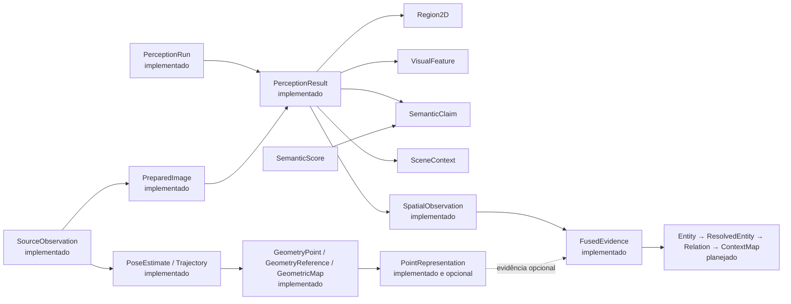
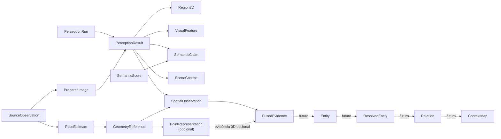
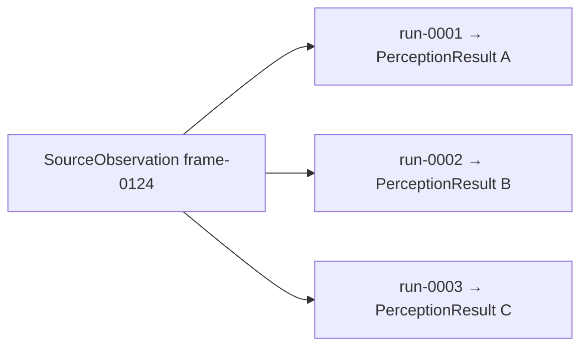
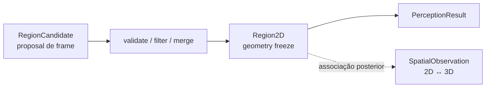

# Contratos e identidades

Este documento descreve os principais contratos públicos que atravessam boundaries do ContextMap2 e as regras de identidade necessárias para evitar confusão entre dados físicos, inferências, geometria, evidência fundida e objetos persistentes.

Para o fluxo completo, consulte [PIPELINE.md](PIPELINE.md). Para ownership, consulte [architecture.md](architecture.md).

## Princípio central

Um contrato público deve dizer **o que o dado significa**, não qual biblioteca o produziu.

Consequências:

- nenhum tipo público exige objetos ROS;
- nenhum tipo público exige `torch.Tensor`;
- SAM, DINO, Gemini, Qwen, FAST-LIO, PTv3 e similares ficam atrás de adapters;
- downstream consome tipos canônicos, não outputs nativos de backend.

## Estado dos contratos

Os contratos até Visual Perception já existem no código e devem ser lidos conforme suas APIs públicas atuais. Os contratos `PoseEstimate` e `Trajectory` de State Estimation também já existem ([contratos de State Estimation](../src/contextmap/state_estimation/docs/contracts.md)); os contratos de Geometric Mapping (`GeometryPoint`, `GeometryReference`, `GeometricMap`, [contratos](../src/contextmap/geometric_mapping/docs/contracts.md)) também já existem; os contratos de Sensor Association (`SpatialObservation`, `ObservationQuality`, [contratos](../src/contextmap/sensor_association/docs/contracts.md)), de Point Representation (`PointRepresentation`, `RepresentationSpace`, [contratos](../src/contextmap/point_representation/docs/contracts.md)) de Semantic Fusion (`FusionSupport`, `FusedEvidence`, [contratos](../src/contextmap/semantic_fusion/docs/contracts.md)) e de Semantic Mapping (`Entity`, `EntityReference`, `EntityGeometry`, `EntitySemanticState`, `EntityTemporalState`, [contratos](../src/contextmap/semantic_mapping/docs/contracts.md)) também já existem; os demais, de Entity Resolution em diante, permanecem alvo arquitetural neste documento até suas capabilities serem materializadas.



## Cadeia principal de contratos



## 1. `SourceObservation`

Representa uma observação física/canônica originada de uma sequência ingerida.

Exemplos de conteúdo associado:

```text
RGB frame
LiDAR scan
IMU measurement
external pose measurement
```

### Identidade

A identidade pertence à observação física, não ao modelo que a processou.

```text
frame-0124
```

continua a mesma observação mesmo quando processada por diferentes perception runs.

### Invariante

Reprocessar `SourceObservation` não modifica o objeto original.

## 2. `PreparedImage`

Contrato canônico de imagem pronta para os backends de percepção consumirem.

Campos implementados:

```text
source_observation_id
payload_reference
width
height
transformations[]
```

`transformations` registra, em ordem legível, os passos aplicados. O contrato não define ainda uma implementação concreta de resize/rectification/crop.

## 3. `PerceptionRun`

Representa uma execução configurada de Visual Perception sobre uma seleção.

Campos implementados:

```text
run_id
run_index
sequence_artifact_id
selection_id
enabled_capabilities
backend_provenance
code_version?
```

O `pipeline_preset` efetivamente resolvido e seu `configuration_digest` são persistidos no `RunArtifactManifest`; eles não são campos duplicados dentro de `PerceptionRun`.

## 4. `PerceptionResult`

Representa o resultado de um `PerceptionRun` para uma `SourceObservation` específica.



Campos implementados:

```text
result_id
source_observation_id
run_id
sequence_artifact_id
created_at
regions[]
features[]
claims[]
scene_context?
```

O construtor valida unicidade de `region_id`, `feature_id` e `claim_id`, além de exigir que features/claims region-scoped referenciem uma região presente no próprio resultado.

## 5. `Region2D`

Região 2D congelada e local a um `PerceptionResult`. O contrato canônico atual preserva `bounding_box`, máscara inline opcional e/ou `mask_reference`, dimensões da imagem, área, contributor candidate IDs, `discovery_provenance`, convenção de coordenadas, estado de aceitação/rejeição e o `BackendProvenance` exato do adapter.



`RegionCandidate` representa evidência pré-normalização e não é identidade persistente. `RegionId` não é identidade persistente de objeto, não implica same-object identity entre runs e não possui suporte 3D por si só. O significado completo de passes, proposal lineage, normalização e Geometry Freeze está em [Region Discovery](../src/contextmap/visual_perception/docs/region-discovery.md).

## 6. `VisualFeature`

Representa evidência visual numérica. O contrato atual possui:

```text
feature_id
scope = DENSE | GLOBAL | REGION
embedding_space_id
shape
dtype
payload_reference
provenance
region_id?
normalization?
```

`embedding_space_id` continua opaco dentro do `VisualFeature`, mas o contrato que ele identifica já existe como `EmbeddingSpace`. O fingerprint inclui família, modelo, versão, checkpoint, layer, dimensão e normalização. Duas features só são comparáveis quando seus fingerprints são exatamente iguais; dimensão igual nunca é suficiente.

Para features densas, `DenseFeatureMap` associa o `VisualFeature` a uma `DenseFeatureSampling` explícita e ao artifact de origem. Isso impede consumers de inferir patch size, stride ou transformação a partir do backend. Payloads numéricos podem ser persistidos separadamente pelo feature store e resolvidos pela chave `(source_observation_id, feature_id)`.

## 7. `SemanticClaim`

Hipótese semântica imutável produzida por inferência.

```text
claim_id
source_observation_id
perception_result_id
hypothesis
role = PRIMARY | ALTERNATIVE
provenance
category?
region_kind? = THING | STUFF
attributes[]
confidence?
region_id?
evidence_references[]
```

`confidence=None` significa explicitamente não pontuado. `PRIMARY` não significa probabilidade calibrada nem truth persistente. `region_id` referencia a geometria 2D congelada sem modificá-la. A provenance semântica registra backend/modelo, tarefa, template de prompt, schema de saída e referência opcional à resposta bruta.

## 8. `SceneContext`

Evidência semântica de nível de cena. O contrato implementado contém identidades da observação e do resultado, `claims[]` com `region_id=None`, referências de evidência, provenance semântica e campos opcionais `scene_type`, `environment`, `layout`, `lighting`, `visibility` e `navigability`. Claims internas devem pertencer à mesma observação e ao mesmo resultado.

## 8.1. `SemanticInterpretationRequest`

Boundary canônico de uma chamada semântica de cena ou região. Ele não é uma
claim nem estado persistente; representa a seleção exata de evidência fornecida
a um backend.

```text
request_id
source_observation_id
perception_result_id
mode = SCENE | REGION
region_id?
visual_views[]
visual_features[]
scene_context_reference?
supporting_metadata[]
prompt_template_id
requested_output_schema
configuration_fingerprint
```

Cada `SemanticVisualView` possui `view_id`, kind, referência segura abaixo de
`outputs/semantic-views/`, SHA-256 obrigatório, observação de origem e região
quando aplicável. O SHA-256 identifica os bytes exatos entregues ao modelo: os
runtimes o verificam antes de abrir a imagem ou enviar bytes a um provider, e um
payload divergente é falha explícita, não inferência sobre outra evidência.
Features opcionais preservam `feature_id`,
`embedding_space_id`, scope e região. Evidência não suportada por um backend é
rejeitada pela declaração `SemanticInterpreterCapabilities`, em vez de ser
descartada silenciosamente.

## 8.2. `SemanticInterpretationExecution`

Registro de uma inferência semântica individual, mantendo camadas que não devem
ser colapsadas:

```text
request
rendered_prompt
raw_response
parsed claims / scene_context / abstention
diagnostics
effective_configuration
```

O run artifact persiste o request e a execution, materializa as views exatas,
exige payload de qualquer feature efetivamente consumida, resolve contexto de
cena/região e reconcilia o parsing com o `PerceptionResult`. Qwen/Gemini usam
`SemanticConfidencePolicy.UNSCORED_ONLY`; um backend com score realmente
medido pode usar a policy `MEASURED`.

## 9. `SemanticScore`

Julgamento separado produzido por `SemanticScorer` sobre uma `SemanticClaim`:

```text
score_id
claim_id
feature_id
score_type = cosine_similarity
value ∈ [-1, 1]
calibrated_probability?
embedding_space_id
source_observation_id
perception_result_id
provenance
```

`SemanticScore` não muta a claim, não substitui `SemanticClaim.confidence` e
não é suporte acumulado de Semantic Fusion. Cosine similarity preserva sua
escala original e não é apresentada como probabilidade. Uma claim sem feature
compatível continua válida e permanece sem records de score; ausência não vira
zero. O DAG conhece `semantic_scorer`, mas `CANONICAL_PRESET_V1` não seleciona
silenciosamente um scorer/modelo.

## 10. `PoseEstimate`

Representa pose dinâmica canônica em um timestamp.

Deve declarar source/target frame explicitamente.

Campos implementados:

```text
PoseEstimate
├── estimate_id
├── timestamp / clock_id
├── parent_frame
├── child_frame
├── translation_m
├── orientation              # quaternion unitário (x, y, z, w)
├── validity                 # VALID | DEGRADED
├── provenance               # source_observation_ids + conversions_applied
└── covariance?              # 6x6; None quando o backend não reporta incerteza
```

### Regra de transform

Uma transformação nunca deve ser uma matriz sem semântica de frames.

Quando a notação `T_A_B` for usada, sua direção deve estar documentada no contrato e validada em testes. O importante é que source e target nunca sejam inferidos pelo nome do arquivo ou por convenção implícita.

## 11. `Trajectory`

Representa uma sequência canônica de poses.

Campos implementados:

```text
trajectory_id
reference_frame
body_frame
poses[]                  # timestamps estritamente crescentes, um único clock_id
gaps[]                   # intervalos onde a interpolação não é confiável
provenance               # backend/configuração, sequência, seleção, calibração, código
```

`time_bounds` e `quality_summary()` são derivados das poses.

Lookup derivado preserva quais poses deram origem ao resultado: `TrajectoryLookup` resolve `T_map_body(t)` por política explícita (`EXACT`, `NEAREST`, `INTERPOLATED`), devolve `ResolvedPose` com poses de origem, delta temporal e tolerância, ou `RejectedLookup` com o motivo. Uma pose interpolada carrega `provenance.derived_from` e nunca é confundida com uma pose estimada. Ver [lookup](../src/contextmap/state_estimation/docs/lookup.md).

## 12. `GeometryPoint`

Representa geometria persistente no frame global do mapa.

Conceitualmente:

```text
GeometryPoint
├── geometry_id
├── map_id
├── map_frame
├── coordinates_m
├── source_frame
├── source_coordinates_m
├── source_observation_id
├── source_point_index?
├── acquisition_timestamp
├── transform_lineage
└── provenance
```

`coordinates_m` no map frame é a coordenada persistente autoritativa.

## 13. `GeometryReference`

Referência compacta para geometria persistente.

```text
GeometryReference
├── map_id
└── geometry_id
```

Downstream deve preferir references a duplicar XYZ e provenance em cada estrutura.

### Escopo

A referência é, por padrão, local ao immutable `GeometricMapArtifact` identificado por `map_id`.

## 14. `GeometricMap`

Representa a base espacial persistente.

Inclui conceitualmente:

```text
map_id
frame_id
geometry storage/references
bounds
source observation set
selection/time bounds
spatial index metadata
provenance
```

Não possui semantic labels, entities ou relations.

## 15. `SpatialObservation`

É a ponte entre percepção e geometria.

```text
SpatialObservation
├── spatial_observation_id
├── source_observation_id
├── perception_result_id
├── region_id
├── geometry_support[]
├── projection_summary
├── visual_feature_refs[]
├── semantic_claim_refs[]
├── calibration_ref
├── pose_ref
├── visibility diagnostics
└── provenance
```

### Significado

Representa:

> Evidência de uma observação/perception result ancorada em geometria persistente.

Não representa:

- fused belief;
- final point label;
- entity identity.

A qualidade mensurável da observação (alcance, visibilidade, densidade de suporte, posição na imagem, alinhamento temporal e, quando há referência confiável, reprojeção) é um contrato separado, `ObservationQuality`, ligado à observação por identidade. Ela **não** é confiança semântica, similaridade de scorer nem peso de fusão, e não há um escalar combinado ([qualidade da observação](../src/contextmap/sensor_association/docs/quality.md)).

## 16. `PointRepresentation`

Representa estrutura geométrica local em um `RepresentationSpace` explícito.

```text
PointRepresentation
├── representation_id
├── geometry_reference
├── support
├── representation_space
├── shape
├── dtype
├── normalization
├── payload_reference
└── provenance
```

O suporte deve permitir reconstruir quais geometry refs participaram.

`PointRepresentation` é um canal 3D, não `VisualFeature` e não `SemanticClaim`.

Duas representações só são comparáveis quando o `representation_space_id` (o fingerprint do `RepresentationSpace`, que inclui checkpoint, normalização e a política de suporte) é igual; comparar espaços diferentes é um erro explícito.

## 17. `FusionSupport`

Representa suporte espacial sobre o qual evidências podem ser acumuladas.

```text
FusionSupport
├── fusion_support_id
├── geometric_map_id
├── geometry_support[]
├── spatial_observation_ids[]
├── bounds / centroid_m
├── time_bounds
└── provenance
```

### Regra crítica

`FusionSupport` não implica same-object identity.

Ele apenas afirma que as observações possuem suporte espacial compatível para uma policy de fusion. Não há campo de label, classe, confiança nem identidade de objeto.

Ver [`semantic_fusion/docs/contracts.md`](../src/contextmap/semantic_fusion/docs/contracts.md).

## 18. Evidence grouping

Semantic Fusion deve distinguir:

```text
physical observation
    dado capturado do ambiente

inference result
    processamento de uma observação física
```

Exemplo:

```text
physical frame A
├── Qwen run 1
├── Gemini run 2
└── Gemini prompt-v2 run 3
```

Isso continua sendo **uma** observação física.

Consequentemente:

```text
physical_observation_count = 1
inference_result_count = 3
```

No contrato, essa distinção é `EvidenceContribution.physical_observation_id` (chave de correlação) e `PhysicalObservationGroup`, que lista os resultados e execuções correlacionados de um frame. `FusedEvidence` expõe `physical_observation_count` e `inference_result_count` separadamente.

## 19. `FusedEvidence`

Acumula evidências preservando hipóteses e conflitos.

```text
FusedEvidence
├── fused_evidence_id
├── fusion_support_id
├── physical_observation_groups[]
├── contributions[]          (EvidenceContribution)
├── hypotheses[]             (FusedHypothesis)
├── point_representation_refs[]
├── uncertainty[]            (UncertaintyRecord)
├── temporal_summary
├── provenance
├── channels[]               (ChannelProvenance)
└── weighting                (QualityWeighting, só na política ciente de qualidade)
```

Uma `EvidenceContribution` é uma vista: uma região de um frame físico interpretada por uma execução, com referências para claims, scores de scorer, features visuais, geometria e qualidade de observação. Não carrega `PointRepresentation`: estrutura estática pertence ao suporte e é listada uma vez em `point_representation_refs`, nunca por vista.

Uma hypothesis fundida mantém references para claims e observações que a sustentam, contradizem ou deixam ambíguas (`HypothesisEvidence`, com `stance`, `role` e `SupportSignal` tipados). Um `SupportSignal` com `value=None` é evidência não pontuada, nunca zero.

Qualidade de observação é uma dimensão de evidência separada, referenciada por `ObservationQualityRef`; ela não é confiança semântica, similaridade CLIP nem peso de fusão. `FusedEvidence` não tem vencedor, hipótese primária nem confiança combinada: ambiguidade, contradição, empate e evidência insuficiente são `UncertaintyRecord` com a evidência exata que os produziu, e uma abstenção (`unknown`) é um stance `ABSTAINING`, nunca evidência negativa.

`channels` lista os canais de evidência que a política declarou, com as identidades que os alimentaram; dados de um canal só existem se o canal foi declarado. `weighting`, quando existe, traz os fatores por componente e por contribuição e, por hipótese, o suporte antes e depois da ponderação: é um peso de fusão, não uma confiança semântica nem uma probabilidade.

## 20. `Entity`

Representa uma entidade semântica persistente dentro de um semantic map artifact.

```text
Entity
├── entity_id
├── semantic_map_id
├── geometry
├── semantic_state
├── evidence_refs[]
├── visual_feature_refs[]
├── point_representation_refs[]
├── temporal_state
├── properties[]
└── provenance
```

### Escopo de identidade

`entity_id` é estável dentro do immutable semantic-map artifact correspondente.

Não assume identidade automática entre mapas reconstruídos independentemente.

### Implementação

Implementado em `contextmap.semantic_mapping` ([contratos](../src/contextmap/semantic_mapping/docs/contracts.md)). A referência estável é `EntityReference(semantic_map_id, entity_id)`, e `EntitySet.resolve` recusa uma referência de **outro** semantic map mesmo quando o `entity_id` existe. O contrato implementado agrupa `evidence_refs[]`, `visual_feature_refs[]` e `point_representation_refs[]` em `Entity.evidence` (`EntityEvidenceLinks`, que também carrega a identidade, a versão, o digest e a sequência canônica do artifact de fusão e as observações espaciais e físicas), e `properties[]` são `semantic_state.attributes`, com evidência e regra de derivação. A identidade é alocada pela política de materialização (`entity--<fusion_support_id>`), não pela geometria.

## 21. `EntityGeometry`

Mantém suporte espacial real da entidade.

```text
EntityGeometry
├── geometry_refs[]
├── map_frame
├── centroid
├── bounds
├── extent
├── optional orientation
├── support statistics
└── provenance
```

Centroid e bounds são resumos derivados. Geometry references continuam autoritativas.

Implementado: além desses campos, o contrato traz `SupportStatistics` (pontos, volume, densidade, componentes conexos), diagnósticos explícitos (esparso, desconectado, extensão degenerada, orientação não justificada e conectividade não calculada quando o suporte excede o limite de custo da política) e a proveniência dos resumos (algoritmo versionado, conjunto de entrada por digest, frame, convenções numéricas e política). Suporte vazio não vira uma geometria válida, e a orientação só é derivada quando a política pede e os eixos são bem definidos ([detalhes](../src/contextmap/semantic_mapping/docs/geometry.md)).

## 22. `EntitySemanticState`

Preserva estado semântico sem destruição de incerteza.

```text
EntitySemanticState
├── primary_hypothesis?
├── alternative_hypotheses[]
├── attributes[]
├── ambiguity_state
├── conflicts[]
├── evidence_refs[]
├── fused_evidence_refs[]
└── provenance
```

Unknown, abstention, unscored e conflicting evidence devem permanecer distinguíveis.

Implementado: `alternative_hypotheses[]` é a propriedade derivada das hipóteses que não são a primária, `conflicts[]` são os registros de contradição dentro de `uncertainty` (que também guarda ambiguidade, quase empate e evidência insuficiente), e `evidence_refs[]`/`fused_evidence_refs[]` vivem nas hipóteses e em `Entity.evidence`, uma única fonte de verdade. O `ambiguity_state` é sempre o que os registros implicam, e uma primária só existe quando o estado é não ambíguo ([detalhes](../src/contextmap/semantic_mapping/docs/semantic-state.md)).

## 23. `EntityTemporalState`

Resume quando e quantas vezes a entidade foi observada.

```text
EntityTemporalState
├── first_seen
├── last_seen
├── physical_observation_count
├── inference_result_count
├── observation refs/history
├── time_bounds
└── provenance
```

Não implica tracking dinâmico.

Implementado: o histórico é um índice pequeno (`ObservationRef` por frame físico) e `first_seen`, `last_seen` e as duas contagens precisam concordar com ele; o ciclo de vida é conservador (`observed`, `stale`, `uncertain`) e a baseline atribui só `observed` ([detalhes](../src/contextmap/semantic_mapping/docs/temporal-state.md)).

## 24. Entity Resolution contracts

Entity Resolution recebe source entities e produz decisões explícitas.

Conceitos esperados:

```text
CandidateSet
MatchEvidence
ResolutionDecision
ResolvedEntity
```

Estados de decisão podem representar:

```text
MATCH
DISTINCT
UNRESOLVED
```

### `ResolvedEntity`

Preserva:

```text
resolved_entity_id
member_entity_refs[]
aggregated geometry support
semantic state
temporal summary
evidence refs[]
resolution_decision_refs[]
provenance
```

Source entities não são mutadas ou apagadas.

## 25. `RelationEvidence`

Representa medições/evidências para uma relação candidata.

Pode incluir:

```text
candidate subject/object
geometric measurements
optional semantic evidence refs
rule/policy identity
support/conflict state
provenance
```

A presença de uma candidate relation não significa relação confirmada.

## 26. `Relation`

Representa relação entre `ResolvedEntity` references.

```text
Relation
├── relation_id
├── subject_entity_ref
├── predicate
├── object_entity_ref
├── relation_evidence_refs[]
├── state / uncertainty
└── provenance
```

Predicate precisa definir:

- direção;
- simetria quando aplicável;
- inverse predicate quando aplicável;
- frame assumptions;
- policy/taxonomy version.

## 27. `ContextMap`

Contrato público de alto nível do produto final.

```text
ContextMap
├── context_map_id
├── schema_version
├── metadata
├── geometry_ref
├── entities / refs
├── relations / refs
├── provenance / lineage refs
└── indexes / capabilities metadata
```

O schema deve ser independente do filesystem layout.

## Escopos de identidade

A tabela resume onde uma identidade é válida por padrão.

| Identidade | Escopo |
| --- | --- |
| `SourceObservation` | canonical sequence |
| `PerceptionRun` | capability + sequence/run registry |
| `PerceptionResult` | par `PerceptionRun` + `SourceObservation` |
| `Region2D` | perception result |
| `VisualFeature` | perception result |
| `SemanticClaim` | perception result |
| `SemanticScore` | julgamento do scorer referenciando uma claim |
| `PoseEstimate` | state-estimation artifact |
| `GeometryReference` | geometric-map artifact |
| `SpatialObservation` | association artifact |
| `PointRepresentation` | point-representation artifact |
| `FusionSupport` | semantic-fusion artifact |
| `FusedEvidence` | semantic-fusion artifact |
| `EntityReference` | semantic-map artifact |
| `ResolvedEntity` | entity-resolution artifact |
| `Relation` | spatial-relations artifact |
| `ContextMap` | final map artifact |

Cross-artifact equivalence nunca deve ser inferida apenas porque IDs locais possuem o mesmo texto/número.

## Missing, unknown e negative evidence

Esses estados precisam permanecer separados:

```text
missing
    dado não disponível

unscored
    evidência existe, mas não possui score

unknown / abstain
    modelo não afirma uma hipótese

low support
    scorer/policy produziu suporte baixo

negative/conflicting evidence
    há evidência explicitamente incompatível
```

Converter todos para zero destrói semântica e prejudica fusion.

## Public contract vs backend metadata

Contracts podem manter provenance de backend:

```text
backend id
model/checkpoint
version
config fingerprint
prompt/template version
```

Mas não podem exigir o tipo nativo do backend para serem lidos.

## Regra de serialização

Todo contrato que atravessa uma boundary persistida deve possuir representação serializável/inspectável ou metadata suficiente para resolver seu payload.

Payloads grandes, como dense features, podem ser externos ao registro principal através de `payload_reference`, com shape, dtype, hash e space identity registrados separadamente. No `PerceptionRunArtifact` atual, `FeatureStoreReader` valida hash, shape e dtype antes do carregamento lazy. Evidência usada por Semantic Interpretation recebe regras mais fortes: views são sempre materializadas e content-addressed; features referenciadas semanticamente precisam possuir payload persistido; request, prompt, raw response, parsing e diagnostics da execução ficam auditáveis no mesmo artifact.
