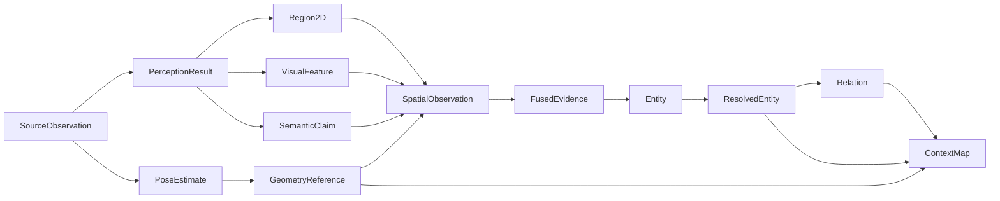

# Contratos e identidades

Este documento descreve os principais contratos públicos que atravessam boundaries do ContextMap2 e as regras de identidade necessárias para evitar confusão entre dados físicos, inferências, geometria, evidência fundida e objetos persistentes.

Para o fluxo completo, consulte [PIPELINE.md](PIPELINE.md). Para ownership, consulte [architecture.md](architecture.md).

## Princípio central

Um contrato público deve dizer **o que o dado significa**, não qual biblioteca o produziu.

Consequências:

- nenhum tipo público exige objetos ROS;
- nenhum tipo público exige `torch.Tensor`;
- SAM, DINO, Gemini, Qwen, FAST-LIO, PTv3 e similares ficam atrás de adapters;
- downstream consome tipos canônicos, não outputs nativos de backend.

## Cadeia principal de contratos



## 1. `SourceObservation`

Representa uma observação física/canônica originada de uma sequência ingerida.

Exemplos de conteúdo associado:

```text
RGB frame
LiDAR scan
IMU measurement
external pose measurement
```

### Identidade

A identidade pertence à observação física, não ao modelo que a processou.

```text
frame-0124
```

continua a mesma observação mesmo quando processada por diferentes perception runs.

### Invariante

Reprocessar `SourceObservation` não modifica o objeto original.

## 2. `PerceptionRun`

Representa uma execução configurada de Visual Perception sobre uma selection.

Precisa identificar pelo menos:

```text
run identity
sequence artifact
selection
pipeline preset/version
resolved stage graph
backend identities
model/checkpoint identities
prompt/config fingerprints
code/environment provenance
```

Um run é contexto de execução, não observação física.

## 3. `PerceptionResult`

Representa o resultado de um `PerceptionRun` para uma `SourceObservation` específica.

```text
frame-0124
├── run-0001 -> result-A
├── run-0002 -> result-B
└── run-0003 -> result-C
```

Os três resultados são inferências distintas sobre **uma única evidência física**.

### Deve preservar

- source observation reference;
- run reference;
- timestamp;
- `Region2D[]`;
- `VisualFeature[]`;
- `SemanticClaim[]`;
- optional `SceneContext`;
- provenance.

## 4. `Region2D`

Representa geometria 2D congelada dentro de um `PerceptionResult`.

Pode preservar:

```text
region_id
mask reference
bounding geometry
image coordinate space
area/statistics
proposal contributors
backend provenance
```

### Escopo de identidade

`region-0007` é local ao resultado/run.

```text
run-0001 / frame-0124 / region-0007
```

e

```text
run-0002 / frame-0124 / region-0007
```

não são automaticamente a mesma região.

### Não representa

- persistent entity;
- same-object identity;
- 3D support por si só.

## 5. `VisualFeature`

Representa evidência visual numérica sem exigir label.

Escopos planejados:

```text
dense
    feature map espacial

global
    representação da imagem completa

region
    representação suportada por Region2D
```

Metadata deve descrever:

```text
feature_id
scope/support
EmbeddingSpace
shape
dtype
normalization
payload_reference
provenance
```

## 6. `EmbeddingSpace`

Identifica o espaço vetorial de uma feature.

Mesma dimensão não implica compatibilidade.

```text
DINOv2 != DINOv3
DINO != CLIP
CLIP checkpoint A != automaticamente checkpoint B
CLIP != automaticamente AlphaCLIP
```

Qualquer operação de similarity, averaging ou indexing deve validar compatibilidade explicitamente.

## 7. `SemanticClaim`

Representa uma hipótese semântica produzida por uma inferência.

Conceitualmente:

```text
SemanticClaim
├── claim_id
├── source_observation_id
├── perception_result_id
├── region_id?
├── hypothesis
├── role
├── category?
├── region_kind?
├── attributes[]
├── confidence?
├── evidence_refs[]
└── provenance
```

### Regras

- claim é evidência, não truth persistente;
- `PRIMARY` não significa probabilidade calibrada;
- `ALTERNATIVE` não deve ser descartada apenas por existir uma primary;
- `confidence=None` é válido;
- ausência de confidence nunca deve virar `0.0` ou `1.0` por conveniência.

## 8. `SceneContext`

Representa contexto semântico de cena de uma inferência.

Campos podem incluir:

```text
scene_type
environment
layout
lighting
visibility
navigability
```

Scene context pode auxiliar interpretação de regiões, mas não deve sobrescrever silenciosamente evidência local.

## 9. `SemanticScore`

Representa suporte produzido por um scorer, por exemplo CLIP ou AlphaCLIP.

```text
SemanticScore
├── semantic_claim_ref
├── visual_evidence_ref
├── scorer identity
├── score_type
├── value
├── calibrated_probability?
├── embedding_space
└── provenance
```

### Distinção obrigatória

```text
SemanticClaim.confidence
    valor fornecido pelo semantic interpreter, quando significativo

SemanticScore.value
    similarity/support do scorer

fusion support/value
    resultado de uma policy de Semantic Fusion
```

Esses campos não devem ser colapsados em um `confidence` genérico.

## 10. `PoseEstimate`

Representa pose dinâmica canônica em um timestamp.

Deve declarar source/target frame explicitamente.

```text
PoseEstimate
├── estimate_id
├── timestamp / clock_id
├── parent_frame
├── child_frame
├── translation_m
├── orientation
├── uncertainty?
├── validity
└── provenance
```

### Regra de transform

Uma transformação nunca deve ser uma matriz sem semântica de frames.

Quando a notação `T_A_B` for usada, sua direção deve estar documentada no contrato e validada em testes. O importante é que source e target nunca sejam inferidos pelo nome do arquivo ou por convenção implícita.

## 11. `Trajectory`

Representa uma sequência canônica de poses.

Inclui:

```text
trajectory_id
reference/map frame
body/child frame
PoseEstimate[]
time bounds
lookup/interpolation policy
quality/provenance
```

Lookup derivado deve preservar quais poses deram origem ao resultado.

## 12. `GeometryPoint`

Representa geometria persistente no frame global do mapa.

Conceitualmente:

```text
GeometryPoint
├── geometry_id
├── map_id
├── map_frame
├── coordinates_m
├── source_frame
├── source_coordinates_m
├── source_observation_id
├── source_point_index?
├── acquisition_timestamp
├── transform_lineage
└── provenance
```

`coordinates_m` no map frame é a coordenada persistente autoritativa.

## 13. `GeometryReference`

Referência compacta para geometria persistente.

```text
GeometryReference
├── map_id
└── geometry_id
```

Downstream deve preferir references a duplicar XYZ e provenance em cada estrutura.

### Escopo

A referência é, por padrão, local ao immutable `GeometricMapArtifact` identificado por `map_id`.

## 14. `GeometricMap`

Representa a base espacial persistente.

Inclui conceitualmente:

```text
map_id
frame_id
geometry storage/references
bounds
source observation set
selection/time bounds
spatial index metadata
provenance
```

Não possui semantic labels, entities ou relations.

## 15. `SpatialObservation`

É a ponte entre percepção e geometria.

```text
SpatialObservation
├── spatial_observation_id
├── source_observation_id
├── perception_result_id
├── region_id
├── geometry_support[]
├── projection_summary
├── visual_feature_refs[]
├── semantic_claim_refs[]
├── calibration_ref
├── pose_ref
├── visibility diagnostics
└── provenance
```

### Significado

Representa:

> Evidência de uma observação/perception result ancorada em geometria persistente.

Não representa:

- fused belief;
- final point label;
- entity identity.

## 16. `PointRepresentation`

Representa estrutura geométrica local em um `RepresentationSpace` explícito.

```text
PointRepresentation
├── representation_id
├── geometry_reference
├── support
├── representation_space
├── shape
├── dtype
├── normalization
├── payload_reference
└── provenance
```

O suporte deve permitir reconstruir quais geometry refs participaram.

`PointRepresentation` é um canal 3D, não `VisualFeature` e não `SemanticClaim`.

## 17. `FusionSupport`

Representa suporte espacial sobre o qual evidências podem ser acumuladas.

```text
FusionSupport
├── support_id
├── geometry_support[]
├── bounds / centroid
├── spatial_observation_refs[]
├── time bounds
└── provenance
```

### Regra crítica

`FusionSupport` não implica same-object identity.

Ele apenas afirma que as observações possuem suporte espacial compatível para uma policy de fusion.

## 18. Evidence grouping

Semantic Fusion deve distinguir:

```text
physical observation
    dado capturado do ambiente

inference result
    processamento de uma observação física
```

Exemplo:

```text
physical frame A
├── Qwen run 1
├── Gemini run 2
└── Gemini prompt-v2 run 3
```

Isso continua sendo **uma** observação física.

Consequentemente:

```text
physical_observation_count = 1
inference_result_count = 3
```

## 19. `FusedEvidence`

Acumula evidências preservando hipóteses e conflitos.

```text
FusedEvidence
├── fused_evidence_id
├── fusion_support_ref
├── contributing_observations[]
├── hypotheses[]
├── visual_feature_refs[]
├── point_representation_refs[]
├── ambiguity / uncertainty state
├── temporal summary
└── provenance
```

Uma hypothesis fundida deve manter references para claims, scores e observações que a sustentam ou contradizem.

## 20. `Entity`

Representa uma entidade semântica persistente dentro de um semantic map artifact.

```text
Entity
├── entity_id
├── semantic_map_id
├── geometry
├── semantic_state
├── evidence_refs[]
├── visual_feature_refs[]
├── point_representation_refs[]
├── temporal_state
├── properties[]
└── provenance
```

### Escopo de identidade

`entity_id` é estável dentro do immutable semantic-map artifact correspondente.

Não assume identidade automática entre mapas reconstruídos independentemente.

## 21. `EntityGeometry`

Mantém suporte espacial real da entidade.

```text
EntityGeometry
├── geometry_refs[]
├── map_frame
├── centroid
├── bounds
├── extent
├── optional orientation
├── support statistics
└── provenance
```

Centroid e bounds são resumos derivados. Geometry references continuam autoritativas.

## 22. `EntitySemanticState`

Preserva estado semântico sem destruição de incerteza.

```text
EntitySemanticState
├── primary_hypothesis?
├── alternative_hypotheses[]
├── attributes[]
├── ambiguity_state
├── conflicts[]
├── evidence_refs[]
├── fused_evidence_refs[]
└── provenance
```

Unknown, abstention, unscored e conflicting evidence devem permanecer distinguíveis.

## 23. `EntityTemporalState`

Resume quando e quantas vezes a entidade foi observada.

```text
EntityTemporalState
├── first_seen
├── last_seen
├── physical_observation_count
├── inference_result_count
├── observation refs/history
├── time_bounds
└── provenance
```

Não implica tracking dinâmico.

## 24. Entity Resolution contracts

Entity Resolution recebe source entities e produz decisões explícitas.

Conceitos esperados:

```text
CandidateSet
MatchEvidence
ResolutionDecision
ResolvedEntity
```

Estados de decisão podem representar:

```text
MATCH
DISTINCT
UNRESOLVED
```

### `ResolvedEntity`

Preserva:

```text
resolved_entity_id
member_entity_refs[]
aggregated geometry support
semantic state
temporal summary
evidence refs[]
resolution_decision_refs[]
provenance
```

Source entities não são mutadas ou apagadas.

## 25. `RelationEvidence`

Representa medições/evidências para uma relação candidata.

Pode incluir:

```text
candidate subject/object
geometric measurements
optional semantic evidence refs
rule/policy identity
support/conflict state
provenance
```

A presença de uma candidate relation não significa relação confirmada.

## 26. `Relation`

Representa relação entre `ResolvedEntity` references.

```text
Relation
├── relation_id
├── subject_entity_ref
├── predicate
├── object_entity_ref
├── relation_evidence_refs[]
├── state / uncertainty
└── provenance
```

Predicate precisa definir:

- direção;
- simetria quando aplicável;
- inverse predicate quando aplicável;
- frame assumptions;
- policy/taxonomy version.

## 27. `ContextMap`

Contrato público de alto nível do produto final.

```text
ContextMap
├── context_map_id
├── schema_version
├── metadata
├── geometry_ref
├── entities / refs
├── relations / refs
├── provenance / lineage refs
└── indexes / capabilities metadata
```

O schema deve ser independente do filesystem layout.

## Escopos de identidade

A tabela resume onde uma identidade é válida por padrão.

| Identidade | Escopo |
| --- | --- |
| `SourceObservation` | canonical sequence |
| `PerceptionRun` | capability + sequence/run registry |
| `PerceptionResult` | perception run |
| `Region2D` | perception result/run |
| `VisualFeature` | perception run/artifact |
| `SemanticClaim` | perception run/artifact |
| `PoseEstimate` | state-estimation artifact |
| `GeometryReference` | geometric-map artifact |
| `SpatialObservation` | association artifact |
| `PointRepresentation` | point-representation artifact |
| `FusionSupport` | semantic-fusion artifact |
| `FusedEvidence` | semantic-fusion artifact |
| `EntityReference` | semantic-map artifact |
| `ResolvedEntity` | entity-resolution artifact |
| `Relation` | spatial-relations artifact |
| `ContextMap` | final map artifact |

Cross-artifact equivalence nunca deve ser inferida apenas porque IDs locais possuem o mesmo texto/número.

## Missing, unknown e negative evidence

Esses estados precisam permanecer separados:

```text
missing
    dado não disponível

unscored
    evidência existe, mas não possui score

unknown / abstain
    modelo não afirma uma hipótese

low support
    scorer/policy produziu suporte baixo

negative/conflicting evidence
    há evidência explicitamente incompatível
```

Converter todos para zero destrói semântica e prejudica fusion.

## Public contract vs backend metadata

Contracts podem manter provenance de backend:

```text
backend id
model/checkpoint
version
config fingerprint
prompt/template version
```

Mas não podem exigir o tipo nativo do backend para serem lidos.

## Regra de serialização

Todo contrato que atravessa uma boundary persistida deve possuir representação serializável/inspectável ou metadata suficiente para resolver seu payload.

Payloads grandes, como dense features, podem ser externos ao registro principal através de `payload_reference`, com shape, dtype, hash e space identity registrados separadamente.
