# Pipeline da Solution 1

Este documento descreve o pipeline end-to-end alvo do ContextMap2, desde uma fonte registrada de sensores até o `ContextMapArtifact` final.

Ele documenta **o fluxo canônico planejado para a Solution 1**. As capabilities são implementadas por milestones independentes, portanto uma etapa descrita aqui pode ainda não estar disponível no código.

Para ownership e dependências, consulte [architecture.md](architecture.md). Para a semântica dos objetos que atravessam módulos, consulte [CONTRACTS.md](CONTRACTS.md). Para persistência e lineage, consulte [ARTIFACTS.md](ARTIFACTS.md).

## Visão geral

O pipeline não é uma única sequência linear. Depois da Ingestion, Percepção Visual e State Estimation podem processar a mesma sequência em branches independentes. A geometria persistente depende do estado estimado. A associação 2D↔3D reúne geometria e evidência visual. A partir daí surgem evidência fundida, entidades, identidades resolvidas, relações e o mapa final.


## Regra fundamental

Cada estágio consome **contratos públicos e artefatos imutáveis**. Um estágio posterior não deve reabrir detalhes privados do backend anterior nem corrigir silenciosamente o resultado upstream.

Exemplos:

- Sensor Association consome `Region2D`, `VisualFeature`, `SemanticClaim`, geometria e pose, mas não importa classes internas de SAM, DINO, Gemini ou FAST-LIO.
- Semantic Fusion consome `SpatialObservation` e evidências referenciadas, mas não executa novamente a VLM para corrigir um label.
- Spatial Relations consome entidades resolvidas, mas não corrige Entity Resolution para conseguir uma relação conveniente.

## 0. Runtime e plano de execução

Antes de executar modelos ou transformações pesadas, `runtime` resolve a configuração do experimento.

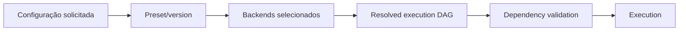

### Responsabilidade

Runtime deve:

- carregar configuração efetiva;
- selecionar implementações concretas;
- construir dependências;
- validar o DAG de execução;
- selecionar explicitamente artifacts/runs upstream;
- ordenar estágios;
- decidir reutilização ou recomputação de artefatos imutáveis;
- registrar o plano resolvido e seus fingerprints.

Runtime não deve conter segmentação, projeção, fusão, entity resolution ou regras de relações.

### Saída

A execução deve registrar um plano reproduzível que identifique:

```text
stage
selected inputs
selected backend
configuration digest
expected output artifact
reuse/recompute decision
dependency edges
```

## 1. Ingestion

Ingestion transforma dados específicos de uma fonte em uma sequência canônica independente de ROS, dataset ou formato de gravação.

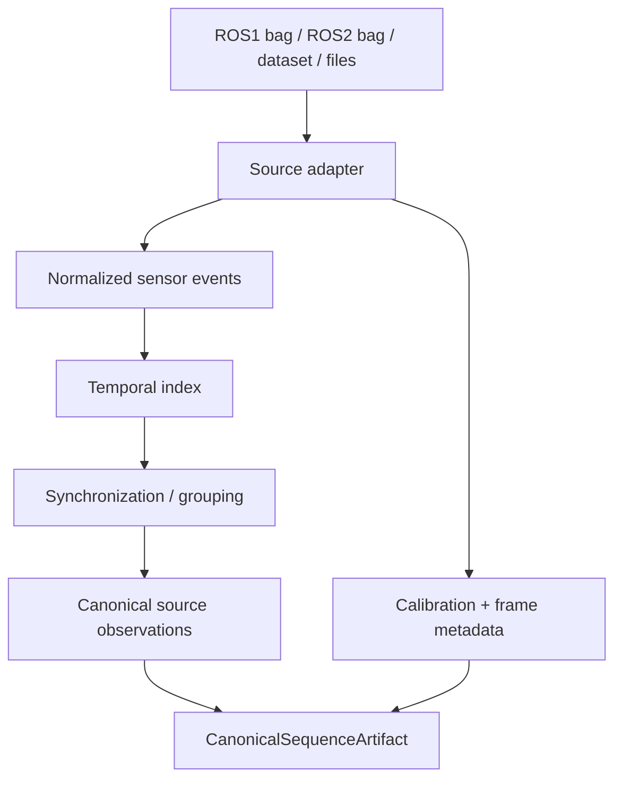

### Entrada

Uma fonte registrada pode fornecer, conforme disponibilidade:

- RGB;
- LiDAR ou point cloud;
- IMU;
- pose/odometria externa;
- timestamps e clock domains;
- camera info;
- transforms estáticos/dinâmicos;
- metadados de origem.

### Processamento

Ingestion:

1. decodifica a fonte através de um adapter;
2. remove dependência de tipos ROS/dataset da fronteira pública;
3. normaliza timestamp, sensor/frame IDs e unidades;
4. preserva identidade do evento físico original;
5. cria um índice temporal determinístico;
6. aplica política explícita de sincronização/grouping;
7. normaliza calibração e coordinate frames;
8. persiste uma sequência canônica reutilizável.

### Contratos principais

Conceitos esperados incluem:

```text
SourceObservation
ImageObservation
LidarObservation
ImuObservation
ExternalPoseMeasurement
Calibration / frame metadata
SequenceSelection
```

Uma `ExternalPoseMeasurement` é uma medição de entrada. Ela não é automaticamente um `PoseEstimate` do mapa.

### Saída

`CanonicalSequenceArtifact`.

O artefato deve poder ser reaberto sem o bag original e sem ROS instalado.

### Não responsabilidade

Ingestion não faz:

- percepção semântica;
- state estimation canônica;
- projeção 2D↔3D;
- fusão;
- criação de entidades.

## 2. Branch de Visual Perception

Visual Perception transforma uma imagem de uma observação física em evidências visuais e semânticas de uma execução específica.

Uma mesma `SourceObservation` pode ser processada por vários runs. Cada run produz um `PerceptionResult` distinto.

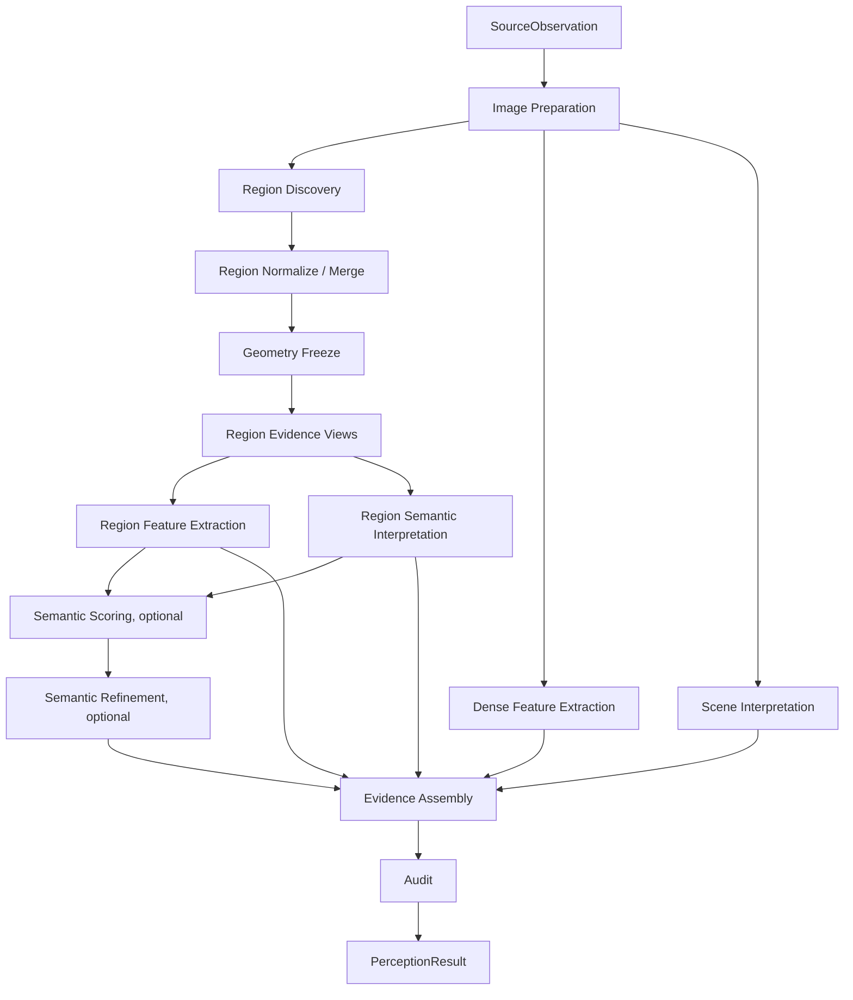

### 2.1 Image Preparation

Prepara a imagem sem alterar a observação física original.

Operações são opcionais e provenance-visible:

- resize;
- crop;
- rectification;
- normalization;
- valid-region constraints;
- exclusion-region constraints.

Nenhuma regra genérica deve assumir fisheye, drone visível ou um dataset específico.

Saída: `PreparedImage`.

### 2.2 Region Discovery

Descobre candidatos geométricos 2D.

Backends planejados podem incluir:

- SAM2;
- SAM3;
- Florence-2 em um adapter específico de Region Discovery.

A saída nativa é normalizada para `RegionCandidate[]`.

Region Discovery responde:

> Quais regiões visuais devem ser preservadas como candidatos geométricos?

Ele não decide identidade de objeto persistente.

### 2.3 Discovery passes e tiling

A execução mais simples é full-frame. Tiling é uma estratégia opcional, não um requisito arquitetural.

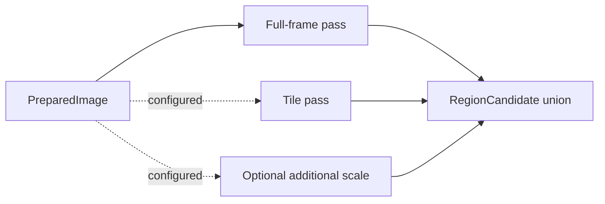

Cada proposta preserva pass, tile, escala, backend e remapeamento de coordenadas.

### 2.4 Region normalize, merge e Geometry Freeze

`RegionCandidate[]` passa por validação geométrica, filtros configurados, análise de overlap/containment e merge de duplicatas.

Saída: `Region2D[]`.

Depois de `Geometry Freeze`:

- mask canônica não muda;
- bbox/geometria não muda;
- region ID não muda dentro do `PerceptionResult`;
- estágios semânticos apenas anexem evidência.

### 2.5 Dense Feature Extraction

Extratores densos podem rodar diretamente sobre `PreparedImage`, sem depender de regiões.

Backends planejados incluem DINOv2 e DINOv3.

Saída conceitual:

```text
VisualFeature
scope = dense
shape = Hf x Wf x C
embedding_space = <explicit identity>
payload_reference = <persisted array>
```

DINO produz representação visual, não label.

### 2.6 Region Feature Extraction

Features de região podem ser produzidas de formas diferentes:

- pooling mask-aware de um dense feature map;
- CLIP sobre crop/context view;
- AlphaCLIP usando a mask explícita da região.

O `EmbeddingSpace` deve ser explícito. Mesma dimensionalidade não significa espaço compatível.

### 2.7 Scene Interpretation

Interpretação de cena pode rodar independentemente de Region Discovery.

O resultado pode incluir `SceneContext` com campos como:

```text
scene_type
environment
layout
lighting
visibility
navigability
```

Scene context é contexto de evidência, não verdade persistente do mapa.

### 2.8 Region Semantic Interpretation

Recebe uma requisição explícita contendo a região e as evidências selecionadas, por exemplo:

- masked subject;
- tight crop;
- contextual crop;
- scene context;
- features selecionadas quando suportadas.

Backends planejados incluem:

- Qwen;
- Gemini;
- Florence-2 através de adapter semântico separado.

Saída: `SemanticClaim[]`.

Uma claim pode conter `PRIMARY`, `ALTERNATIVE`, atributos e confiança opcional. Falta de confidence continua `None`, não vira `1.0` ou `0.0`.

### 2.9 Semantic Scoring opcional

CLIP ou AlphaCLIP podem produzir suporte visual para uma hipótese.

`SemanticScore` deve permanecer diferente de:

- confidence de uma VLM;
- suporte acumulado por Semantic Fusion;
- probabilidade calibrada.

### 2.10 Saída da percepção

Um resultado representa uma inferência sobre **uma observação física em um run específico**:

```text
SourceObservation frame-0124
├── run-0001 -> PerceptionResult A
├── run-0002 -> PerceptionResult B
└── run-0003 -> PerceptionResult C
```

A percepção não funde A, B e C.

Saída persistida: `PerceptionRunArtifact`.

## 3. Branch de State Estimation

State Estimation produz a trajetória canônica usada para colocar observações no frame global do mapa.

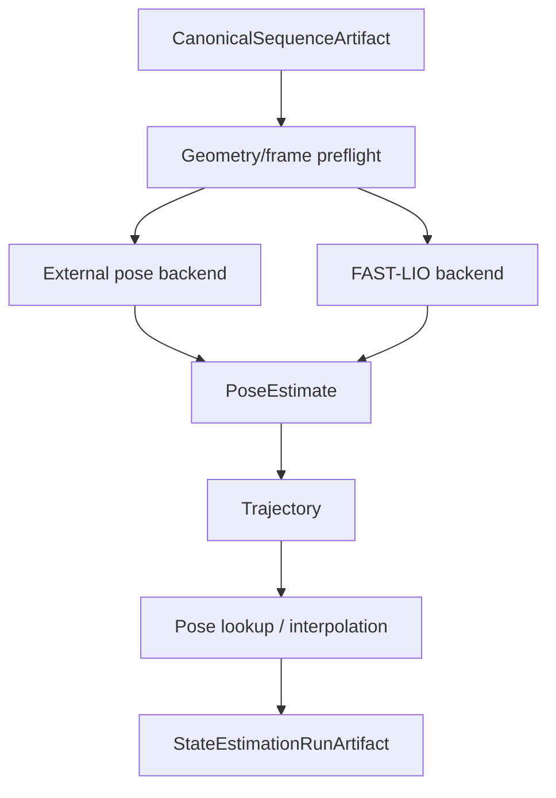

### Entrada

Dependendo do backend:

- external pose measurements;
- LiDAR + IMU;
- calibration/extrinsics requeridos;
- selection temporal.

### Backends

Baseline inicial:

- `ExternalPose`, normaliza uma pose externa canônica;
- `FAST-LIO`, produz pose LiDAR-inertial sem vazar tipos do backend.

### Contratos

`PoseEstimate` deve declarar explicitamente:

```text
timestamp
parent_frame
child_frame
translation
orientation
optional uncertainty
validity
provenance
```

`Trajectory` reúne poses com frame de referência, bounds temporais e política de lookup.

### Time alignment

Downstream solicita pose no timestamp de uma observação através de uma política explícita:

```text
exact
nearest
interpolated
reject_if_gap_exceeds_tolerance
```

Uma pose interpolada preserva os estimates que a originaram.

### Preflight

Antes do estimator, validar:

- frames;
- extrinsics necessárias;
- transform direction;
- rotação válida;
- units;
- clock domains;
- calibration identity.

Saída persistida: `StateEstimationRunArtifact`.

## 4. Geometric Mapping

Geometric Mapping transforma observações geométricas locais em uma geometria persistente no frame global do mapa.

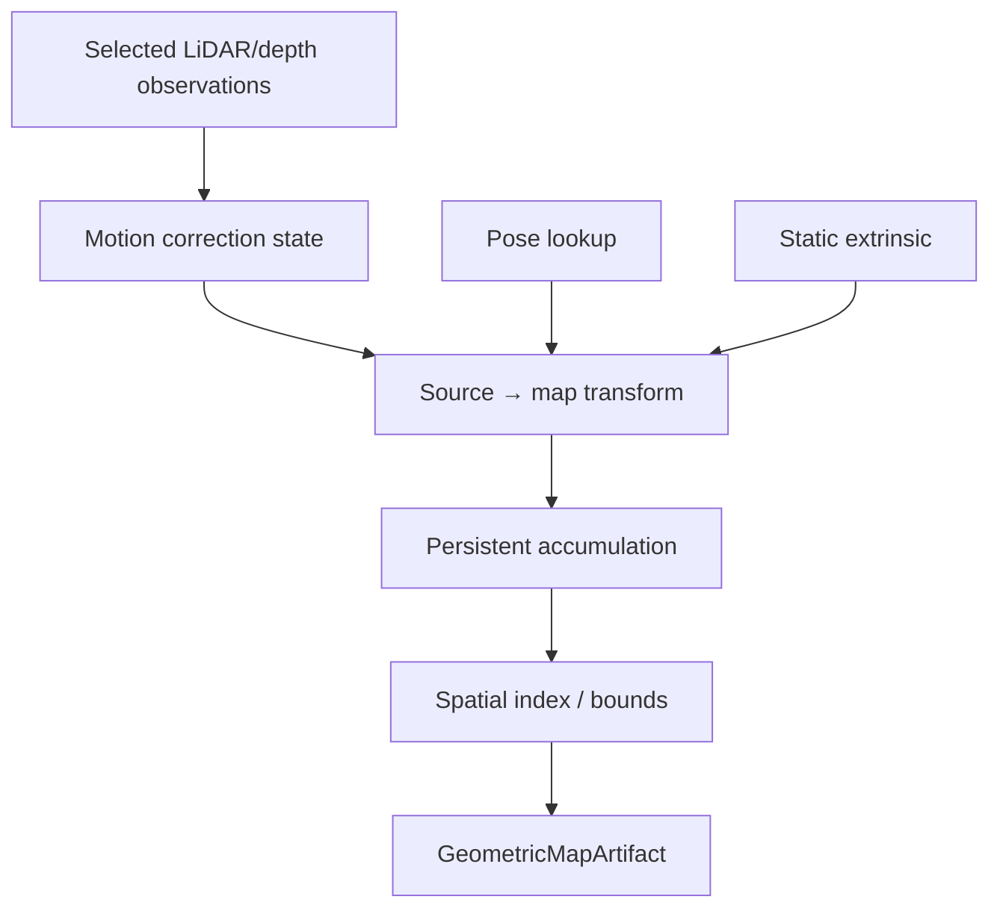

### Entrada

- `CanonicalSequenceArtifact`;
- selection;
- `StateEstimationRunArtifact`;
- static extrinsics/calibration;
- LiDAR/depth payloads.

### Motion correction

Cada scan precisa declarar estado:

```text
raw / uncorrected
motion-corrected / deskewed
unknown
```

Nunca inferir `deskewed=true` apenas porque FAST-LIO foi usado.

### Transformação source→map

Para um exemplo LiDAR:

```text
P_map = T_map_body(t) · T_body_lidar · P_lidar
```

A cadeia real depende do rig, mas frame source/target e cada transform precisam ser explícitos.

O ponto persistente preserva tanto coordenadas locais quanto globais e lineage do transform.

### Persistência da geometria

O mapa geométrico inicial pode ser point-based. Ele deve fornecer referências estáveis dentro do artefato:

```text
GeometryReference(map_id, geometry_id)
```

Downstream referencia geometria em vez de copiar XYZ repetidamente.

### Spatial access

O contrato deve permitir operações como:

```text
get(GeometryReference)
iter_geometry(...)
query_bounds(Bounds3D)
map_bounds()
```

A implementação concreta do índice é privada.

Saída persistida: `GeometricMapArtifact`.

## 5. Sensor Association

Sensor Association conecta a geometria persistente às evidências visuais de uma observação.

É aqui que o sistema faz a ponte 2D↔3D.

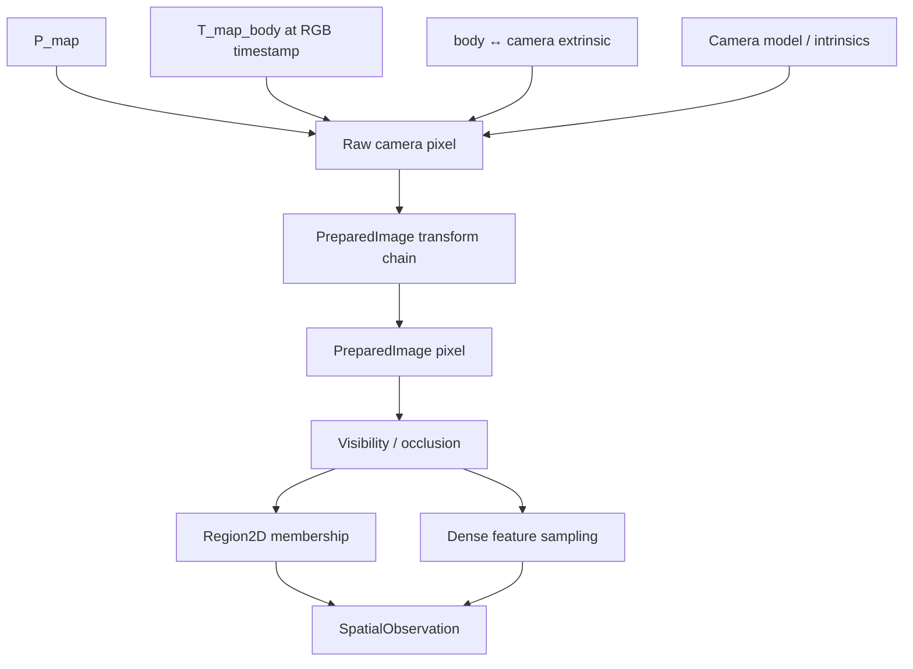

### Projection 3D→2D

A cadeia conceitual é:

```text
P_map
→ P_camera at t_rgb
→ raw camera pixel
→ PreparedImage pixel
```

Ela deve usar:

- trajectory/pose selecionado;
- extrinsic correto;
- camera model correto, incluindo fisheye quando declarado pela calibração;
- transformações de imagem aplicadas por Visual Perception.

Não é permitido assumir que raw image e `PreparedImage` usam as mesmas coordenadas.

### Visibility e occlusion

Pontos projetáveis ainda podem estar atrás de superfícies visíveis. A política de visibility/occlusion decide quais suportes 3D podem contribuir para a evidência daquela imagem.

### Region membership

Para cada ponto visível, verificar membership em `Region2D` congeladas.

Um ponto pode pertencer a zero, uma ou várias regiões. Overlap não é resolvido semanticamente aqui.

### Dense feature sampling

Quando um dense `VisualFeature` está disponível:

```text
GeometryReference
→ prepared-image pixel
→ feature-grid coordinate
→ local visual feature evidence
```

Region-level embeddings continuam associados à região, não são fingidos como medições independentes por ponto.

### Saída

`SpatialObservation` representa evidência visual ancorada em suporte 3D persistente.

Saída persistida: `AssociationRunArtifact`.

## 6. Point Representation, opcional

Point Representation descreve estrutura geométrica local sem misturá-la com evidência visual ou semântica.

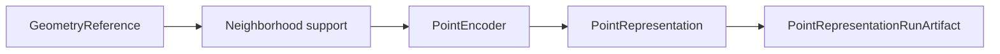

### Support extraction

Políticas iniciais podem incluir:

- radius support;
- k-nearest support;
- voxel/cell support quando justificado.

O suporte precisa preservar quais `GeometryReference` participaram.

### Backends

Baseline:

- descriptor geométrico determinístico.

Opcional/experimental:

- PTv3 learned 3D representation.

PTv3 não é requisito automático da Solution 1. Seu uso deve ser justificado por avaliação/ablation.

### Saída

`PointRepresentation` + `RepresentationSpace`.

Saída persistida: `PointRepresentationRunArtifact`.

## 7. Semantic Fusion

Semantic Fusion acumula evidência de múltiplas observações físicas sobre suporte espacial compatível, sem ainda criar identidade persistente de objeto.

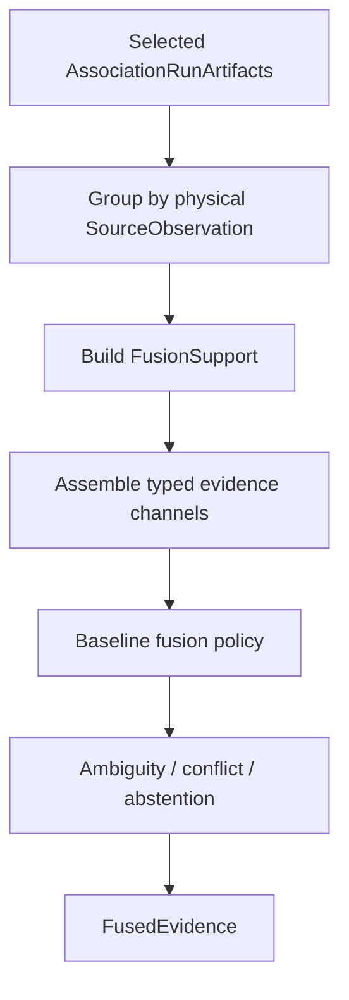

### Regra de correlação

Três inferências sobre a mesma imagem são uma observação física com três resultados correlacionados:

```text
frame-0120
├── run A
├── run B
└── run C
```

Isso não equivale a três frames fisicamente distintos.

Fusion deve manter separados:

```text
physical_observation_count
inference_result_count
```

### FusionSupport

Agrupa `SpatialObservation` com suporte 3D suficientemente compatível para acumular evidência.

`FusionSupport` não significa automaticamente "mesmo objeto".

### Canais de evidência

Podem participar, conforme policy/configuração:

- `SemanticClaim`;
- `SemanticScore`;
- visual feature references;
- visibility/coverage;
- optional `PointRepresentation`;
- temporal metadata.

Os canais mantêm semânticas e escalas separadas.

### Política baseline

A primeira policy deve ser determinística e preservar:

- hypotheses concorrentes;
- primary/alternative roles;
- scored e unscored evidence;
- abstentions;
- conflicts;
- número de observações físicas;
- contribution trace.

Não reduzir destrutivamente tudo a um único label.

### Saída

`FusedEvidence`.

Saída persistida: `SemanticFusionRunArtifact`.

## 8. Semantic Mapping

Semantic Mapping materializa evidência fundida como entidades semânticas persistentes dentro de um semantic-map artifact.

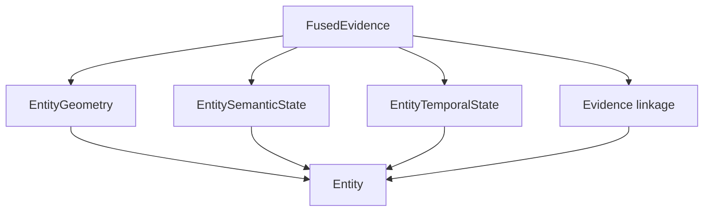

### Entity

Uma entidade conecta:

- geometry support real, por `GeometryReference`;
- centroid/bounds/extent derivados;
- semantic hypotheses e alternatives;
- attributes/properties com provenance;
- conflicts/ambiguity;
- first_seen/last_seen;
- physical observation count;
- inference result count;
- referências para a evidência upstream.

Ela não deve ser reduzida a `{id, label, confidence, xyz}`.

### Saída

Um artifact de entidades semânticas persistidas.

Nesse ponto, entidades podem ainda representar fragmentos/duplicatas do mesmo objeto físico. Essa decisão pertence a Entity Resolution.

## 9. Entity Resolution

Entity Resolution decide quando entidades semânticas de origem devem permanecer distintas, ser agrupadas ou ficar não resolvidas.

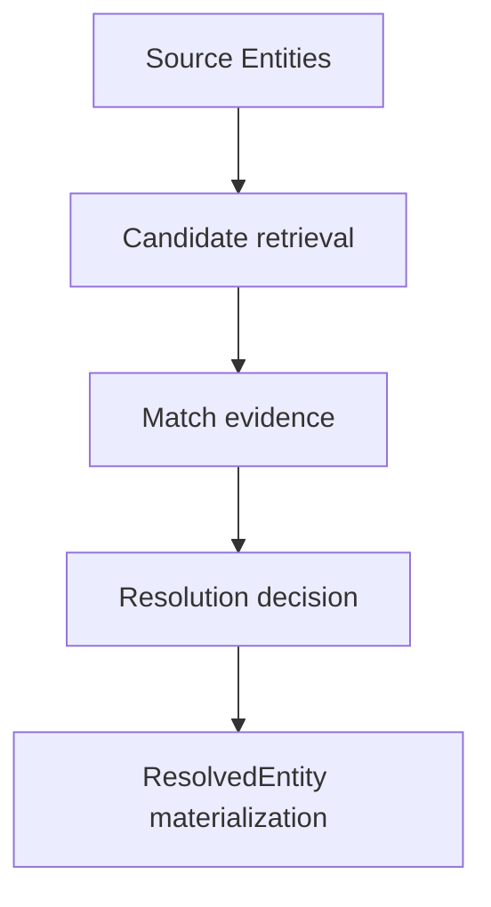

### Evidência de matching

A policy pode comparar canais tipados, quando disponíveis:

- geometry overlap/proximity;
- semantic compatibility;
- visual appearance;
- temporal compatibility;
- optional point representations.

Nenhum canal deve ser escondido em um score opaco sem definição.

### Decisões

Estados esperados incluem conceitos equivalentes a:

```text
MATCH
DISTINCT
UNRESOLVED
```

`UNRESOLVED` é válido quando a evidência é insuficiente ou conflitante.

### Materialização

Um `ResolvedEntity` preserva:

- source entity refs;
- merge lineage;
- resolution decisions;
- geometry union/reference;
- semantic alternatives/conflicts;
- temporal state deduplicado por observação física.

As entidades originais permanecem imutáveis.

Saída persistida: `EntityResolutionRunArtifact`.

## 10. Spatial Relations

Spatial Relations descreve relações entre **entidades resolvidas**.

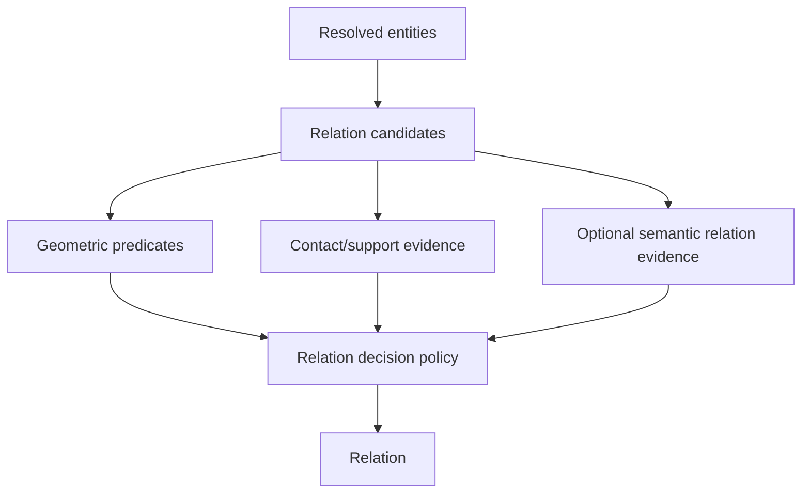

### Candidate generation

Reduz pares irrelevantes através de critérios geométricos explícitos, sem decidir que uma relação é verdadeira.

### Relações geométricas

Famílias planejadas incluem, quando geometricamente definíveis:

```text
NEXT_TO
ABOVE / BELOW
IN_FRONT_OF / BEHIND
INSIDE / CONTAINS
INTERSECTS
```

### Contact/support

Quando a geometria suporta a inferência:

```text
TOUCHING
ON_TOP_OF
LEANING_AGAINST
```

Essas relações exigem medições, não apenas labels semânticos.

### Reconciliation

Evidência geométrica e semântica permanecem separadas. Uma policy conservadora produz algo equivalente a:

```text
SUPPORTED
REJECTED
UNRESOLVED
```

Relações inversas e simétricas precisam permanecer consistentes.

### Saída

`Relation` + `RelationEvidence`.

Saída persistida: `SpatialRelationsRunArtifact`.

## 11. Context Map Assembly

A etapa final monta o produto público do repositório.

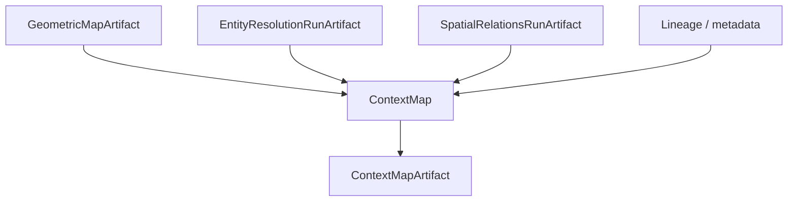

### ContextMap

O contrato de alto nível contém conceitualmente:

```text
ContextMap
├── context_map_id
├── schema_version
├── metadata
├── geometry_ref
├── resolved entities / refs
├── relations / refs
├── indexes / capability metadata
└── provenance / lineage refs
```

### Metadata espacial

O mapa deve declarar explicitamente:

- map frame;
- units;
- coordinate convention;
- origin/anchor semantics;
- bounds;
- temporal/selection extent;
- source sequences;
- capabilities presentes.

Um map frame local de estimator não deve ser confundido com um frame global/geodeticamente alinhado.

### Portabilidade

O `ContextMapArtifact` deve ser legível sem:

- ROS;
- FAST-LIO;
- SAM/DINO/CLIP;
- VLM SDKs;
- CUDA;
- viewer específico.

Consumidores precisam apenas do schema, payloads e dependências contratuais explicitamente referenciadas.

## 12. Artefatos ao longo do pipeline

| Estágio | Artefato principal | Consumo downstream |
| --- | --- | --- |
| Ingestion | `CanonicalSequenceArtifact` | perception, state estimation, geometry |
| Visual Perception | `PerceptionRunArtifact` | sensor association, evaluation |
| State Estimation | `StateEstimationRunArtifact` | geometry, sensor association |
| Geometric Mapping | `GeometricMapArtifact` | association, point representation, final map |
| Sensor Association | `AssociationRunArtifact` | semantic fusion |
| Point Representation | `PointRepresentationRunArtifact` | optional semantic fusion / resolution evidence |
| Semantic Fusion | `SemanticFusionRunArtifact` | semantic mapping |
| Semantic Mapping | semantic entity artifact | entity resolution |
| Entity Resolution | `EntityResolutionRunArtifact` | spatial relations, final map |
| Spatial Relations | `SpatialRelationsRunArtifact` | final map |
| Context Map Assembly | `ContextMapArtifact` | external consumers |

Todos esses artefatos são tratados como imutáveis. Uma nova execução produz um novo artifact/run identity.

## 13. Lineage ponta a ponta

Uma entidade final deve conseguir explicar sua origem sem copiar todos os payloads upstream.

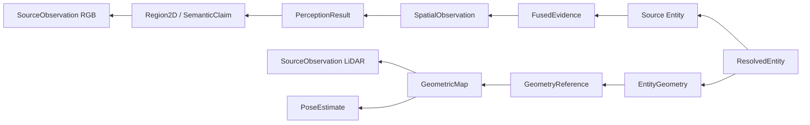

Uma relação final deve ser rastreável a:

```text
Relation
→ RelationEvidence
→ ResolvedEntity subject/object
→ source entities
→ geometry + fused evidence
→ source sensor observations
```

## 14. Reuso e recomputação

Como artifacts intermediários são imutáveis, mudar uma parte da pipeline não deve obrigar recomputação de tudo.

Exemplo:

```text
mudar prompt/VLM
    invalidates: perception-dependent downstream
    preserves: state estimation + geometric map when inputs unchanged
```

```text
mudar FAST-LIO configuration
    invalidates: state estimation + geometry + association + downstream
    may preserve: perception over the same canonical RGB selection
```

Reuso só é válido quando upstream identities, schema versions, selections e configuração relevante são compatíveis.

## 15. Validação por estágio

Cada capability possui métricas próprias. O projeto evita um único score opaco de qualidade.

Exemplos:

| Capability | Exemplos de validação |
| --- | --- |
| Ingestion | integridade, sincronização, calibração, indexação |
| Region Discovery | IoU, coverage, over/under-segmentation, runtime |
| Feature Extraction | spatial alignment, payload round-trip, compatibility |
| Semantic Interpretation | conceito, hallucination, ambiguity, parsing |
| State Estimation | ATE/RPE quando referência válida existe, transform consistency |
| Geometric Mapping | source→map accuracy, scan consistency, reproducibility |
| Sensor Association | reprojection error, occlusion, mask membership |
| Semantic Fusion | multi-view consistency, ambiguity retention, repeated-inference regression |
| Entity Resolution | false merge, missed merge, unresolved rate |
| Spatial Relations | precision/recall por predicate, consistency, unresolved rate |
| Artifact | schema/integrity/lineage closure |

Qualidade e performance são relatadas separadamente.

## 16. Invariantes do pipeline

As seguintes regras atravessam todas as etapas:

1. `SourceObservation` representa evidência física, não uma execução de modelo.
2. Reexecutar um frame cria nova inferência, não nova observação física.
3. `Region2D` é geometria 2D local ao resultado de percepção, não Entity ID.
4. Geometria 3D persistente possui coordenada global autoritativa e provenance de transform.
5. Semantic confidence, scorer support e fusion support não são o mesmo conceito.
6. Missing/unscored evidence nunca é convertido silenciosamente para zero ou um.
7. Debug files nunca são contratos públicos downstream.
8. Artifacts persistidos são imutáveis.
9. Runs upstream são selecionados explicitamente, nunca agregados implicitamente porque existem no workspace.
10. Backend-native objects não atravessam fronteiras de capability.
11. Falha de uma etapa deve permanecer atribuível à etapa responsável.
12. O mapa final preserva referências suficientes para auditoria sem exigir que consumidores carreguem modelos de percepção.
