# Canonical Pipeline do ContextMap2

Este documento é o mapa operacional do pipeline do ContextMap2. O objetivo não é apenas mostrar a ordem dos módulos, mas tornar explícito **onde cada transformação acontece**, **quais dados entram e saem**, **qual capability é dona da decisão** e **onde procurar no código quando um comportamento precisa ser alterado ou um gargalo precisa ser investigado**.

Para ownership e dependências entre capabilities, consulte [architecture.md](architecture.md). Para os contratos públicos, consulte [CONTRACTS.md](CONTRACTS.md). Para persistência, imutabilidade e lineage, consulte [ARTIFACTS.md](ARTIFACTS.md). Para composição dos executores e configuração, consulte [runtime-composition.md](runtime-composition.md).

A regra de leitura é importante: o diagrama abaixo mistura o **fluxo científico completo** com o **estado real da implementação**. Uma capability pode estar implementada e testável isoladamente sem possuir executor automático no runtime global. Essas duas coisas são distinguidas explicitamente ao longo do documento.

## Pipeline detalhada

O fluxo principal é vertical. Branches paralelos existem onde os dados realmente podem ser processados de forma independente, principalmente Visual Perception e State Estimation depois da Ingestion.

```mermaid
flowchart TD

    subgraph RT["0. Runtime & Configuration"]
        RT_CFG["EffectiveConfig<br/>preset + arquivos + overrides"]
        RT_CAT["Runtime catalog<br/>stages + variation points + backends"]
        RT_COMP["compose() / compose_executors()<br/>implementações concretas"]
        RT_PREF["preflight<br/>dependências + disponibilidade + seleção"]
        RT_PLAN["run plan<br/>reuse / recompute / provided artifacts"]
        RT_EXEC["StageRequest / StageExecutor<br/>journal + lifecycle"]
        RT_CFG --> RT_CAT --> RT_COMP --> RT_PREF --> RT_PLAN --> RT_EXEC
    end

    RAW["Fonte registrada<br/>ROS 1 / ROS 2 / dataset / arquivos"]

    subgraph ING["1. Ingestion"]
        ING_REQ["IngestionRequest<br/>source + tópicos + janela + sync"]
        ING_ADAPTER["SourceAdapter<br/>ROS1 / ROS2 / adapter específico"]
        ING_OBS["SourceObservation[]<br/>Image / LiDAR / IMU / ExternalPose"]
        ING_CAL["CalibrationSet<br/>intrínsecos + extrínsecos estáticos"]
        ING_VAL["Validação estrutural<br/>timestamps + payload + frames"]
        ING_SYNC["synchronize()<br/>nearest-within-tolerance + diagnostics"]
        ING_PROV["Provenance + content/config hashes"]
        ING_WRITE["SequenceArtifactWriter<br/>publicação atômica"]
        SEQ["SequenceArtifact"]
        ING_SEL["resolve_selection()<br/>full / frames / timestamps / ids"]

        RAW --> ING_REQ --> ING_ADAPTER
        ING_ADAPTER --> ING_OBS
        ING_ADAPTER --> ING_CAL
        ING_OBS --> ING_VAL
        ING_CAL --> ING_VAL
        ING_VAL --> ING_SYNC
        ING_OBS --> ING_PROV
        ING_CAL --> ING_PROV
        ING_SYNC --> ING_WRITE
        ING_PROV --> ING_WRITE
        ING_OBS --> ING_WRITE
        ING_CAL --> ING_WRITE
        ING_WRITE --> SEQ --> ING_SEL
    end

    RT_EXEC -.-> ING_REQ

    subgraph VP["2. Visual Perception"]
        VP_IMG["ImageObservation"]
        VP_MAT["materialização da imagem<br/>runtime workspace"]
        VP_PREP["image_preparation<br/>PreparedImage + transform chain"]

        VP_PASS["Discovery passes<br/>full frame / tiles / scales"]
        VP_RD["RegionDiscovery backend<br/>SAM2 / SAM3 / Florence-2"]
        VP_CAND["RegionCandidate[]<br/>mask / box / native scores"]
        VP_REMAP["remap para coordenadas<br/>da PreparedImage"]
        VP_NORM["normalize_regions()<br/>validar + área + constraints<br/>IoU/containment + merge + budget"]
        VP_REG["Region2D[]<br/>geometry freeze"]

        VP_DENSE["dense_feature_extraction<br/>DINOv2 / DINOv3"]
        VP_DFEAT["VisualFeature[DENSE]<br/>DenseFeatureMap + payload"]

        VP_RFE["region_feature_extraction<br/>CLIP / AlphaCLIP"]
        VP_RFEAT["VisualFeature[REGION]<br/>payload + EmbeddingSpace"]

        VP_SCENE["scene_interpretation<br/>stage legado do canonical/1"]
        VP_REGIONSEM["region_interpretation<br/>stage legado do canonical/1"]
        VP_CLAIMS["SemanticClaim[] + SceneContext"]

        VP_ASM["assemble_perception_result()<br/>somente stages SUCCEEDED"]
        VP_RESULT["PerceptionResult"]
        VP_STORE["PerceptionRunWriter<br/>MaskStore + FeatureStore + semantic views<br/>stage outcomes + diagnostics"]
        PERC["PerceptionRunArtifact"]

        ING_SEL --> VP_IMG --> VP_MAT --> VP_PREP

        VP_PREP --> VP_PASS --> VP_RD --> VP_CAND --> VP_REMAP --> VP_NORM --> VP_REG

        VP_PREP --> VP_DENSE --> VP_DFEAT
        VP_PREP --> VP_RFE
        VP_REG --> VP_RFE
        VP_RFE --> VP_RFEAT

        VP_PREP --> VP_SCENE
        VP_PREP --> VP_REGIONSEM
        VP_REG --> VP_REGIONSEM
        VP_SCENE --> VP_CLAIMS
        VP_REGIONSEM --> VP_CLAIMS

        VP_REG --> VP_ASM
        VP_DFEAT --> VP_ASM
        VP_RFEAT --> VP_ASM
        VP_CLAIMS --> VP_ASM
        VP_ASM --> VP_RESULT --> VP_STORE --> PERC
    end

    RT_EXEC -.-> VP_MAT

    subgraph SE["3. State Estimation"]
        SE_INPUT["StateEstimationRequest<br/>seleção + observações + calibração"]
        SE_REQ["geometry_requirements()<br/>modalidades + frames necessários"]
        SE_GRAPH["StaticFrameGraph<br/>extrínsecos canônicos"]
        SE_PREF["run_geometry_preflight()<br/>READY / BLOCKED"]
        SE_BACKEND{"StateEstimator"}
        SE_EXT["ExternalPoseEstimator<br/>validar / normalizar medições"]
        SE_FL_JOB["FastLioEstimator<br/>construir FastLioJob"]
        SE_FL_RUN["FastLioRunner<br/>processo/container isolado"]
        SE_POSES["PoseEstimate[]"]
        SE_TRAJ["Trajectory<br/>gaps + provenance"]
        SE_WRITE["StateEstimationRunWriter"]
        TRAJ["StateEstimationRunArtifact"]

        ING_SEL --> SE_INPUT
        SEQ --> SE_INPUT
        SE_INPUT --> SE_REQ --> SE_PREF
        ING_CAL --> SE_GRAPH --> SE_PREF
        SE_PREF --> SE_BACKEND
        SE_BACKEND --> SE_EXT --> SE_POSES
        SE_BACKEND --> SE_FL_JOB --> SE_FL_RUN --> SE_POSES
        SE_POSES --> SE_TRAJ --> SE_WRITE --> TRAJ
    end

    RT_EXEC -.-> SE_INPUT

    subgraph GM["4. Geometric Mapping"]
        GM_SEL["seleção de scans LiDAR"]
        GM_INPUT["assemble_geometry_inputs()<br/>layout + payload hash + motion state"]
        GM_POSE["TrajectoryLookup<br/>T_map_body(t)"]
        GM_STATIC["StaticFrameGraph<br/>T_body_source"]
        GM_PLAN["GeometryInputPlan<br/>accepted + rejected scans"]
        GM_TRANS["transform_scan()<br/>P_map = T_map_body · T_body_source · P_source"]
        GM_FILTER["drop apenas NaN/Inf<br/>sem filtro semântico"]
        GM_ACC["MapAccumulator<br/>raw points ou ScanVoxelPolicy"]
        GM_STORAGE["PackedGeometry / GeometrySource<br/>refs posicionais + scan index"]
        GM_WRITE["GeometricMapArtifactWriter"]
        GEO["GeometricMapArtifact"]

        SEQ --> GM_SEL --> GM_INPUT
        TRAJ --> GM_POSE --> GM_INPUT
        ING_CAL --> GM_STATIC --> GM_INPUT
        GM_INPUT --> GM_PLAN --> GM_TRANS --> GM_FILTER --> GM_ACC --> GM_STORAGE --> GM_WRITE --> GEO
    end

    RT_EXEC -.-> GM_INPUT

    subgraph SA["5. Sensor Association"]
        SA_FRAME["AssociationFrameInput<br/>ImageObservation + PreparedImage + PerceptionResult"]
        SA_CLOUD["GeometryCloud.from_source()<br/>carrega coordenadas autoritativas"]
        SA_POSE["TrajectoryLookup no timestamp RGB"]
        SA_EXT["StaticFrameGraph<br/>T_body_camera"]
        SA_CAM["CameraProjection<br/>pinhole / fisheye / MEI"]
        SA_RAWPX["pixel na imagem crua"]
        SA_XFORM["raw_to_prepared_transform()<br/>crop / resize / normalize"]
        SA_SUPPORT["classificar suporte<br/>behind / outside / invalid / in-support"]
        SA_VIS["resolve_visibility()<br/>depth support + occlusion"]
        SA_MASK["associate_regions()<br/>MaskStoreReader / máscara inline"]
        SA_MEM["FrameMembership<br/>região ↔ GeometryReference"]
        SA_DENSE["sample_dense_features()<br/>nearest / bilinear<br/>quando canal denso é fornecido"]
        SA_OBS["build_spatial_observations()<br/>SpatialObservation por região"]
        SA_QUAL["derive_observation_quality()<br/>medidas separadas"]
        SA_DIAG["diagnostics<br/>calibração + tempo + reprojeção"]
        SA_SERVICE["SensorAssociationService"]
        SA_WRITE["SensorAssociationRunWriter"]
        ASSOC["SensorAssociationRunArtifact"]

        SEQ --> SA_FRAME
        PERC --> SA_FRAME
        GEO --> SA_CLOUD
        TRAJ --> SA_POSE
        ING_CAL --> SA_EXT
        ING_CAL --> SA_CAM

        SA_CLOUD --> SA_POSE --> SA_EXT --> SA_CAM --> SA_RAWPX --> SA_XFORM --> SA_SUPPORT --> SA_VIS --> SA_MASK --> SA_MEM
        SA_FRAME --> SA_XFORM
        SA_FRAME --> SA_MASK
        SA_MEM --> SA_OBS
        SA_VIS --> SA_DENSE
        PERC --> SA_DENSE
        SA_OBS --> SA_QUAL
        SA_MEM --> SA_QUAL
        SA_OBS --> SA_DIAG
        SA_POSE --> SA_DIAG
        SA_OBS --> SA_SERVICE
        SA_QUAL --> SA_SERVICE
        SA_DIAG --> SA_SERVICE
        SA_DENSE --> SA_SERVICE
        SA_SERVICE --> SA_WRITE --> ASSOC
    end

    RT_EXEC -.-> SA_SERVICE

    subgraph PR["6. Point Representation - opcional"]
        PR_CENTER["seleção de centros<br/>GeometryReference"]
        PR_SUPPORT["SupportExtractor<br/>POINT / radius / k-nearest"]
        PR_PREP["CoordinatePreparation<br/>center / centroid / scale"]
        PR_ENCODER{"PointEncoder"}
        PR_BASE["GeometricDescriptorEncoder<br/>baseline determinístico"]
        PR_PTV3["PTv3 / Pointcept runtime<br/>backend aprendido opcional"]
        PR_SERVICE["RepresentationService<br/>falhas explícitas + métricas"]
        PR_WRITE["PointRepresentationRunWriter"]
        PREP3D["PointRepresentationRunArtifact"]

        GEO --> PR_CENTER --> PR_SUPPORT --> PR_PREP --> PR_ENCODER
        PR_ENCODER --> PR_BASE --> PR_SERVICE
        PR_ENCODER --> PR_PTV3 --> PR_SERVICE
        PR_SERVICE --> PR_WRITE --> PREP3D
        ASSOC -.-> PR_CENTER
    end

    subgraph SF["7. Semantic Fusion"]
        SF_GROUP["group_by_physical_observation()<br/>frames físicos ≠ inferências"]
        SF_SUPPORT["build_fusion_supports()<br/>Jaccard de GeometryReference<br/>componentes conexas"]
        SF_CONTRIB["EvidenceContribution<br/>claims + scores + feature refs + quality refs"]
        SF_ACC{"Accumulation policy"}
        SF_BASE["baseline-evidence-accumulation-v1<br/>label key + stances + uncertainty"]
        SF_Q["quality-aware-evidence-accumulation-v1<br/>opcional, peso por qualidade"]
        SF_FUSED["FusedEvidence<br/>hipóteses + conflitos + provenance"]
        SF_WRITE["SemanticFusionRunWriter"]
        FUS["SemanticFusionRunArtifact"]

        ASSOC --> SF_GROUP
        PERC --> SF_GROUP
        SEQ --> SF_GROUP
        ASSOC --> SF_SUPPORT
        GEO --> SF_SUPPORT
        SF_GROUP --> SF_CONTRIB
        PERC --> SF_CONTRIB
        ASSOC --> SF_CONTRIB
        PREP3D -.-> SF_CONTRIB
        SF_SUPPORT --> SF_ACC
        SF_CONTRIB --> SF_ACC
        SF_ACC --> SF_BASE --> SF_FUSED
        SF_ACC --> SF_Q --> SF_FUSED
        SF_FUSED --> SF_WRITE --> FUS
    end

    RT_EXEC -.-> SF_GROUP

    subgraph SM["8. Semantic Mapping"]
        SM_SELECT["seleção explícita de FusionOutcome"]
        SM_MAT["materialize_entities()<br/>one-support-one-entity-v1"]
        SM_GEO["summarize_geometry()<br/>refs + bounds + centroid + diagnostics"]
        SM_SEM["semantic_state_from_fused_evidence()<br/>hipóteses + ambiguidade + atributos"]
        SM_EVID["evidence_links_from_fused_evidence()<br/>refs + digest + lineage"]
        SM_TIME["summarize_temporal_state()<br/>frames físicos + inferências + lifecycle"]
        SM_ENTITY["Entity"]
        SM_WRITE["SemanticMappingRunWriter"]
        SMAP["SemanticMappingRunArtifact<br/>runtime contract: SemanticEntityArtifact"]

        FUS --> SM_SELECT --> SM_MAT
        GEO --> SM_GEO --> SM_MAT
        SM_MAT --> SM_SEM
        SM_MAT --> SM_EVID
        SM_MAT --> SM_TIME
        SM_SEM --> SM_ENTITY
        SM_EVID --> SM_ENTITY
        SM_TIME --> SM_ENTITY
        SM_GEO --> SM_ENTITY
        SM_ENTITY --> SM_WRITE --> SMAP
    end

    subgraph ER["9. Entity Resolution"]
        ER_ENT["EntitySet"]
        ER_INDEX["EntitySpatialIndex"]
        ER_RETR["retrieve_candidate_sets()<br/>centroid / bounds / tempo"]
        ER_PAIR["candidate_pairs"]
        ER_GATE["evaluate_comparison_gates()<br/>mapa + frame compatíveis"]
        ER_GEOM["compare_geometry()"]
        ER_SEM["compare_semantics()<br/>opcional"]
        ER_TIME["compare_temporal()<br/>opcional"]
        ER_APP["AppearanceComparator<br/>opcional"]
        ER_REP["RepresentationComparator<br/>opcional"]
        ER_EVID["EntityMatchEvidence<br/>canais tipados separados"]
        ER_DEC["conservative-staged-resolution-v1<br/>MATCH / DISTINCT / UNRESOLVED"]
        ER_SPLIT["detect_split_candidates()<br/>diagnóstico opcional"]
        ER_RES["materialize_resolved_entities()<br/>connected components + transitivity checks"]
        ER_WRITE["EntityResolutionRunWriter"]
        RES["EntityResolutionRunArtifact"]

        SMAP --> ER_ENT --> ER_INDEX --> ER_RETR --> ER_PAIR --> ER_GATE
        ER_GATE --> ER_GEOM --> ER_EVID
        ER_GATE --> ER_SEM --> ER_EVID
        ER_GATE --> ER_TIME --> ER_EVID
        ER_GATE --> ER_APP --> ER_EVID
        ER_GATE --> ER_REP --> ER_EVID
        GEO --> ER_GEOM
        PERC -.-> ER_APP
        PREP3D -.-> ER_REP
        ER_EVID --> ER_DEC --> ER_RES
        ER_ENT --> ER_SPLIT
        GEO --> ER_SPLIT
        ER_SPLIT -.-> ER_WRITE
        ER_RES --> ER_WRITE --> RES
    end

    RT_EXEC -.-> ER_RETR

    subgraph SR["10. Spatial Relations"]
        SR_READ["resolved_entity_geometries()<br/>Entity Resolution reader"]
        SR_FRAME["FrameConventions<br/>up / forward axes"]
        SR_CAND["generate_relation_candidates()<br/>sweep-and-prune + bounds"]
        SR_GEOM["evaluate_geometric_candidates()<br/>NEXT_TO / ABOVE / IN_FRONT_OF<br/>INSIDE / INTERSECTS"]
        SR_CONTACT["evaluate_contact_candidates()<br/>TOUCHING / ON_TOP_OF / LEANING_AGAINST"]
        SR_OBS["observation evidence<br/>opcional, corroborante"]
        SR_DEC["decide_relations()<br/>SUPPORTED / REJECTED / UNRESOLVED"]
        SR_CHECK["consistência estrutural<br/>direção + simetria"]
        SR_DERIVE["gerar inversos / gêmeas<br/>BELOW / BEHIND / CONTAINS / symmetric"]
        SR_WRITE["SpatialRelationsRunWriter"]
        REL["SpatialRelationsRunArtifact"]

        RES --> SR_READ
        GEO --> SR_READ
        SR_READ --> SR_FRAME --> SR_CAND
        SR_CAND --> SR_GEOM --> SR_DEC
        SR_CAND --> SR_CONTACT --> SR_DEC
        SR_CAND --> SR_OBS --> SR_DEC
        GEO --> SR_CONTACT
        SR_DEC --> SR_CHECK --> SR_DERIVE --> SR_WRITE --> REL
    end

    RT_EXEC -.-> SR_CAND

    subgraph ART["11. Context Map Artifact"]
        ART_META["ContextMapMetadata<br/>frame + unidades + janela + capabilities"]
        ART_ASM["assemble_context_map()<br/>traduz e fecha lineage"]
        ART_SCHEMA["ContextMap<br/>schema validado"]
        ART_WRITE["ContextMapArtifactWriter<br/>layout + tabelas + manifest"]
        ART_VALID["validate_context_map_artifact()<br/>integridade + dependências"]
        ART_BUNDLE["export_bundle()<br/>opcional"]
        CTX["ContextMapArtifact"]
        CONSUMERS["Consumidores externos<br/>viewer / query / navigation / agents"]

        GEO --> ART_ASM
        RES --> ART_ASM
        REL --> ART_ASM
        ART_META --> ART_ASM --> ART_SCHEMA --> ART_WRITE --> CTX
        CTX --> ART_VALID
        CTX --> ART_BUNDLE
        CTX --> CONSUMERS
    end

    subgraph EV["12. Evaluation - transversal"]
        EV_REF["ReferenceSet + annotations + trust"]
        EV_RUN["stage evaluators / experiment runner"]
        EV_REPORT["EvaluationReport<br/>qualidade e custo separados"]
        EV_REF --> EV_RUN --> EV_REPORT
    end

    PERC -.-> EV_RUN
    TRAJ -.-> EV_RUN
    GEO -.-> EV_RUN
    ASSOC -.-> EV_RUN
    PREP3D -.-> EV_RUN
    FUS -.-> EV_RUN
    SMAP -.-> EV_RUN
    RES -.-> EV_RUN
    REL -.-> EV_RUN
    CTX -.-> EV_RUN
```



O grafo acima mostra o **fluxo científico completo**, não apenas o que o runtime consegue montar automaticamente hoje. A seção seguinte deixa essa diferença explícita.

## Estado de execução atual

A capability de domínio existe para todos os blocos de Ingestion até Spatial Relations, e o pacote `contextmap.artifact` já implementa schema, montagem, escrita, leitura, validação e bundle do mapa final. O que ainda não está uniforme é a **orquestração automática**.

| Estágio | Capability implementada | Executor automático no runtime | Observação |
| --- | --- | --- | --- |
| Ingestion | sim | não por `compose_executors()` | `IngestionStageExecutor` existe, mas requer um `IngestionRequest` da execução e é injetado explicitamente. |
| Visual Perception | sim | sim | Exige os quatro variation points e providers quando o backend não tem loader embutido. |
| State Estimation | sim | sim | ExternalPose e FAST-LIO são selecionáveis. |
| Geometric Mapping | sim | sim | Executor usa lookup, motion-correction policy e agregação configurada. |
| Sensor Association | sim | sim | O executor global atual monta a associação geométrica e não injeta mapas densos de feature. |
| Point Representation | sim | não | Descritor determinístico e PTv3 existem, mas o estágio precisa de artifact fornecido/injetado no runtime global. |
| Semantic Fusion | sim | sim, baseline | O executor global atual suporta a acumulação baseline e recusa o canal de Point Representation. A política quality-aware existe na capability, mas não é executada por esse executor. |
| Semantic Mapping | sim | sim, condicional | Compõe quando o chamador também fornece `semantic_map_id` e `code_digest`, que não são valor de configuração. |
| Entity Resolution | sim | sim | Aparência e representação exigem vector sources fornecidos pelo runtime/provider quando ativadas. |
| Spatial Relations | sim | sim | Avaliadores geométrico e de contato são opcionais por configuração. |
| ContextMapArtifact | sim | sim | `ContextMapExecutor` monta o artifact por referência aos runs de Entity Resolution e Spatial Relations; `assemble_context_map_with_metrics()` e `ContextMapArtifactWriter` continuam existindo como capability standalone, sem lógica nova no executor. |

O preset global é:

- `canonical/1`: Ingestion → Visual Perception + State Estimation → Geometric Mapping → Sensor Association → Point Representation opcional → Semantic Fusion → Semantic Mapping → Entity Resolution → Spatial Relations → `context_map`. Antes do v0.1.0 sair esta é a única topologia do repositório e continua livre para evoluir até o release; a partir daí, uma mudança de topologia abre uma identidade nova (`canonical/2`, ...) em vez de mudar esta.

## 0. Runtime & Configuration

**Função.** Transformar configuração declarativa em uma execução reproduzível. Runtime não possui ciência de percepção, geometria, fusão ou relações; ele seleciona implementações, valida dependências, conecta artifacts e registra lifecycle.

**Recebe.** `EffectiveConfig`, preset, seleção de backends/policies, recursos, providers, secrets via ambiente e artifacts já existentes ou fornecidos.

**Faz.** `catalog.py` define stages e variation points; `composition.py` constrói backends e policies concretos; `pipeline.py` resolve DAG, preflight, inputs e ordem; `reuse.py` decide reuso por identidade; `runs.py` e `lifecycle.py` registram execução, falhas, cancelamento e retomada; `executors.py` adapta um stage do runtime ao serviço público da capability.

**Entrega.** `StageRequest`, `ArtifactRef`, plano de execução, journal e artifacts produzidos ou reutilizados.

**Onde procurar.**

| Problema | Arquivo principal |
| --- | --- |
| Stage não aparece ou depende do artifact errado | `src/contextmap/runtime/catalog.py` |
| Backend/policy não compõe | `src/contextmap/runtime/composition.py` |
| Preflight, dependências, ordem do DAG | `src/contextmap/runtime/pipeline.py` |
| Executor chama a capability de forma errada | `src/contextmap/runtime/executors.py` |
| Reuso/recompute inesperado | `src/contextmap/runtime/reuse.py` |
| Run, journal, resume, lifecycle | `src/contextmap/runtime/runs.py`, `lifecycle.py` |

Detalhes: [runtime docs](../src/contextmap/runtime/docs/README.md), [composition](../src/contextmap/runtime/docs/composition.md) e [executors](../src/contextmap/runtime/docs/executors.md).

## 1. Ingestion

**Função.** Converter formatos de borda em uma sequência canônica independente de ROS ou dataset. Ingestion é dona de observações de sensor, calibração canônica, sincronização, provenance da fonte e persistência do `SequenceArtifact`.

**Recebe de.** Fonte registrada e configuração da execução. Adapters ROS 1/ROS 2 ou específicos convertem os dados de origem.

**Entradas principais.** RGB, LiDAR, IMU, poses externas, timestamps, intrínsecos, extrínsecos estáticos, tópicos/canais e janela temporal.

**Fluxo interno.**

1. `SourceAdapter` lê a fonte e produz `SourceObservation` e `CalibrationSet`.
2. As observações são validadas sem corrigir silenciosamente payloads, frames ou timestamps inválidos.
3. `synchronize()` agrupa por uma modalidade de referência usando nearest-within-tolerance e registra decisões e eventos descartados. Clocks diferentes nunca são comparados implicitamente.
4. Provenance e identidades de conteúdo/configuração são calculadas.
5. `SequenceArtifactWriter` publica observações, calibração, diagnostics e provenance de forma atômica.
6. `resolve_selection()` fornece subsets determinísticos para os stages downstream.

**Entrega para.** Visual Perception, State Estimation, Geometric Mapping, Sensor Association e Semantic Fusion.

**Onde procurar.**

| Problema | Arquivo / documento |
| --- | --- |
| Parsing de ROS/dataset | `ingestion/adapters/`, [adapters.md](../src/contextmap/ingestion/docs/adapters.md) |
| Frames/timestamps inválidos | `ingestion/validation.py` |
| RGB e LiDAR não alinham no tempo | `ingestion/synchronization.py`, [synchronization.md](../src/contextmap/ingestion/docs/synchronization.md) |
| Intrínsecos/extrínsecos incorretos | `ingestion/calibration.py`, [calibration.md](../src/contextmap/ingestion/docs/calibration.md) |
| Artifact ou replay | `ingestion/sequence_artifact.py`, `sequence_selection.py` |

## 2. Visual Perception

**Função.** Produzir evidência visual de frame/run: regiões 2D, máscaras, embeddings/features, claims semânticas e contexto de cena. Nada aqui é entidade persistente do mapa.

**Recebe de.** Ingestion, principalmente `ImageObservation` selecionadas do `SequenceArtifact`.

**Pipeline interna canônica atual.** `CANONICAL_PRESET_V1` em `visual_perception/pipeline.py` contém `image_preparation`, `region_discovery`, `dense_feature_extraction`, `region_feature_extraction`, `scene_interpretation` e `region_interpretation`. O executor de DAG é genérico: uma falha numa branch pula apenas seus dependentes e preserva evidência de branches independentes.

### 2.1 Image preparation

`prepare_image()` transforma a observação em `PreparedImage` e registra uma cadeia explícita de operações. Crop, resize, rectification e normalization só existem quando configurados. A imagem bruta não é alterada silenciosamente.

Arquivos: `visual_perception/image_preparation.py` e [Region Discovery](../src/contextmap/visual_perception/docs/region-discovery.md#preparação-de-imagem-e-constraints).

### 2.2 Region Discovery e geração de máscaras

Este é o caminho a investigar quando houver gargalo ou erro na geração de máscaras.

```text
PreparedImage
→ discovery passes
→ backend SAM2 / SAM3 / Florence-2
→ RegionCandidate
→ remap tile/scale → PreparedImage
→ normalize_regions
→ Region2D
→ MaskStore no PerceptionRunArtifact
```

O custo pode vir de lugares diferentes:

| Sintoma | Onde olhar |
| --- | --- |
| Inferência de máscara lenta | `visual_perception/backends/sam2.py`, `sam3.py`, `florence2.py` e runtime/modelo correspondente |
| Muitas inferências por frame | `visual_perception/discovery.py`, `DiscoveryPassConfig`, tiling, overlap, scale e budget |
| Máscara deslocada depois de tile/resize | `visual_perception/discovery.py` e o remapeamento para coordenadas globais |
| Muitas regiões duplicadas | `visual_perception/normalization.py`, IoU, containment e merge |
| Regiões filtradas inesperadamente | `NormalizationConfig`, valid/exclusion regions e filtros de área |
| Artifact grande ou escrita lenta das máscaras | `visual_perception/mask_store.py` e `run_artifact.py`, não o backend de discovery |

Backends produzem `RegionCandidate`; a normalização comum valida geometria, aplica constraints, deduplica, limita budget e congela `Region2D`. Scores nativos permanecem com semântica própria e nunca viram confidence universal.

Detalhes: [region-discovery.md](../src/contextmap/visual_perception/docs/region-discovery.md) e [mask_store.md](../src/contextmap/visual_perception/docs/mask_store.md).

### 2.3 Feature Extraction

A branch densa recebe apenas a imagem preparada. A branch de região recebe imagem + `Region2D`.

- DINOv2/DINOv3 produzem features densas no preset global atual.
- CLIP/AlphaCLIP produzem features de região.
- Payloads ficam em `FeatureStore`; `VisualFeature` carrega identidade do espaço, shape, dtype, normalização e referência ao payload.
- Features de espaços diferentes não são comparadas apenas porque têm a mesma dimensão.

Arquivos: `visual_perception/feature_store.py`, `dense_region_association.py`, `backends/dinov2.py`, `dinov3.py`, `clip.py`, `alphaclip.py`.

Detalhes: [feature-extraction.md](../src/contextmap/visual_perception/docs/feature-extraction.md).

### 2.4 Semantic Interpretation

O boundary novo baseado em `SemanticInterpretationRequest` e `SemanticInterpreter.interpret(request)` está implementado, com adapters Qwen, Gemini e Florence-2. Porém, o `CANONICAL_PRESET_V1` interno ainda usa os stages legados `scene_interpretation` e `region_interpretation`.

Isso é uma distinção importante para diagnóstico: um backend que implementa somente o boundary novo pode falhar nesses stages do preset atual, enquanto Region Discovery e Feature Extraction continuam concluindo normalmente por serem branches independentes.

Arquivos: `visual_perception/semantic_requests.py`, `semantic_backend.py`, `semantic_prompt.py`, adapters em `backends/`.

Detalhes: [semantic-interpretation.md](../src/contextmap/visual_perception/docs/semantic-interpretation.md).

### 2.5 Assembly e artifact

`assemble_perception_result()` agrega apenas outputs de stages `SUCCEEDED`. `PerceptionRunWriter` persiste resultados, stage outcomes, máscaras compactas, payloads de feature e execuções semânticas verificáveis.

**Entrega para.** Sensor Association, Semantic Fusion, Entity Resolution por aparência e Evaluation.

## 3. State Estimation

**Função.** Produzir a trajetória dinâmica `T_map_body(t)` usada para colocar medições no mapa e projetar geometria no timestamp das imagens.

**Recebe de.** Ingestion: `ExternalPoseMeasurement` ou LiDAR + IMU, além de calibração estática quando o backend exige.

**Fluxo interno.**

1. O backend declara `geometry_requirements()`.
2. `StaticFrameGraph` resolve relações estáticas necessárias.
3. `run_geometry_preflight()` bloqueia combinações inviáveis antes do estimador.
4. `ExternalPoseEstimator` valida/publica medições externas, ou `FastLioEstimator` constrói um job LiDAR-inercial para `FastLioRunner`.
5. O resultado é normalizado em `PoseEstimate[]` e `Trajectory`.
6. Gaps, frames, clock e provenance permanecem explícitos.
7. `StateEstimationRunWriter` persiste o run.

**Entrega para.** Geometric Mapping, Sensor Association e Evaluation.

**Onde procurar.**

| Problema | Arquivo |
| --- | --- |
| Pose importada inválida | `state_estimation/backends/external_pose.py` |
| FAST-LIO não inicia/diverge | `backends/fast_lio.py`, `fast_lio_process.py`, `fast_lio_wrapper.py` |
| Extrínseco ou frame ausente | `state_estimation/frame_graph.py`, `preflight.py` |
| Pose no timestamp errada | `state_estimation/lookup.py` |
| Drift / ATE / RPE | capability de Evaluation, não o contrato de State Estimation |

Detalhes: [State Estimation](../src/contextmap/state_estimation/docs/README.md), [backends](../src/contextmap/state_estimation/docs/backends.md) e [lookup](../src/contextmap/state_estimation/docs/lookup.md).

## 4. Geometric Mapping

**Função.** Transformar LiDAR do frame local do sensor para um frame global persistente, mantendo referências estáveis e lineage até cada medição.

**Recebe de.** Ingestion fornece os scans e a calibração; State Estimation fornece a trajetória.

**Fluxo interno.**

1. `assemble_geometry_inputs()` resolve layout XYZ, payload hash, estado de motion correction, `T_map_body(t)` e `T_body_source`.
2. Scans incompatíveis são rejeitados com motivo explícito antes de transformar pontos.
3. `transform_scan()` aplica `P_map = T_map_body(t) · T_body_source · P_source`.
4. Apenas coordenadas NaN/Inf são descartadas nessa etapa. Não há filtro de distância, denoising ou semântica escondida.
5. `MapAccumulator` grava em fluxo. O baseline mantém cada medição; `ScanVoxelPolicy` pode agregar apenas dentro do mesmo scan.
6. `PackedGeometry` oferece acesso aleatório, lookup por `GeometryReference`, scan index e trace da transformação.
7. `GeometricMapArtifactWriter` publica o mapa.

**Limite importante.** O módulo registra o estado de motion correction, mas **não aplica deskew**; todos os pontos de um scan usam a pose resolvida para um instante.

**Entrega para.** Sensor Association, Point Representation, Semantic Fusion, Semantic Mapping, Entity Resolution, Spatial Relations e Artifact.

**Onde procurar.**

| Problema | Arquivo |
| --- | --- |
| Scan rejeitado | `geometric_mapping/inputs.py` |
| Point cloud deslocada/rotacionada | `transformation.py`, depois conferir trajetória e extrínsecos upstream |
| Mapa muito grande | `accumulation.py`, política de agregação |
| Consulta espacial lenta | `geometry_storage.py` / acesso espacial |
| Erro de lineage de ponto | transform trace e serialization do módulo |

Detalhes: [Geometric Mapping](../src/contextmap/geometric_mapping/docs/README.md), [inputs](../src/contextmap/geometric_mapping/docs/inputs.md), [transformation](../src/contextmap/geometric_mapping/docs/transformation.md) e [accumulation](../src/contextmap/geometric_mapping/docs/accumulation.md).

## 5. Sensor Association

**Função.** Ancorar evidência visual 2D em geometria 3D persistente. É aqui que uma região/máscara deixa de ser apenas geometria de imagem e passa a ter suporte espacial no mapa.

**Recebe de.**

- Geometric Mapping: `GeometrySource` / `GeometricMapArtifact`.
- State Estimation: trajetória e política de lookup.
- Ingestion: calibração, modelo de câmera e imagem original.
- Visual Perception: `PreparedImage`, `Region2D`, claims e features.

**Fluxo interno.**

1. `GeometryCloud.from_source()` carrega a geometria autoritativa.
2. `FrameProjector` resolve `T_map_body(t_rgb)` e `T_body_camera`.
3. O modelo de câmera projeta 3D para pixel na imagem crua.
4. `raw_to_prepared_transform()` reproduz crop/resize da percepção para levar o pixel ao mesmo espaço em que as máscaras vivem.
5. Pontos são classificados como behind-camera, outside-image, outside-valid-support ou in-support.
6. `resolve_visibility()` aplica a política conservadora de oclusão por suporte de profundidade local.
7. `associate_regions()` testa pertencimento às máscaras. Máscaras persistidas são carregadas sob demanda via `MaskStoreReader`.
8. `build_spatial_observations()` cria uma `SpatialObservation` por região, com `GeometryReference`, referências de claims/features e provenance.
9. Quando mapas densos são fornecidos, `sample_dense_features()` calcula índices/pesos nearest ou bilinear sem duplicar vetores por ponto.
10. `derive_observation_quality()` mede profundidade, ângulo, borda, visibilidade, densidade, offset temporal e reprojeção quando existe referência confiável.
11. Diagnostics de calibração, tempo e reprojeção permanecem separados da evidência semântica.
12. O run é persistido em `SensorAssociationRunArtifact`.

**Estado do executor global.** `SensorAssociationExecutor` atualmente cria `dense_maps={}`, portanto o stage automático usa o caminho de associação geométrica/máscara, apesar de a capability já possuir dense sampling completo.

**Onde procurar.**

| Sintoma | Código |
| --- | --- |
| Projeção 3D→2D deslocada | `frame_projection.py`, `camera_models.py`, `image_transform.py` |
| Problema só depois de crop/resize | `image_transform.py` |
| Pontos do fundo recebem label da frente | `visibility.py` e `OcclusionPolicy` |
| Máscara não recebe pontos | `membership.py`; confirmar `MaskStoreReader` e dimensões |
| Feature densa amostrada no patch errado | `dense_sampling.py` |
| Quality estranha | `quality.py`, `quality_derivation.py` |
| Reprojeção/tempo suspeitos | `diagnostics.py` |

Detalhes: [Sensor Association](../src/contextmap/sensor_association/docs/README.md), [projection chain](../src/contextmap/sensor_association/docs/projection_chain.md), [visibility](../src/contextmap/sensor_association/docs/visibility.md) e [membership](../src/contextmap/sensor_association/docs/membership.md).

## 6. Point Representation

**Função.** Produzir uma representação numérica opcional da estrutura 3D local. Ela complementa geometria, não a substitui e não contém label.

**Recebe de.** Geometric Mapping. Um contexto de associação pode ser registrado explicitamente no run, mas a capability não depende de Sensor Association.

**Fluxo interno.**

1. Selecionar centros `GeometryReference`.
2. `SupportExtractor` recupera ponto, vizinhança por raio ou k-nearest.
3. `CoordinatePreparation` centraliza e/ou normaliza escala conforme a política.
4. `PointEncoder` recebe `PreparedSupport`.
5. O backend pode ser o descritor geométrico determinístico ou PTv3/Pointcept.
6. `RepresentationService` mantém falhas de suporte explícitas.
7. O run persiste `PointRepresentation`, `RepresentationSpace` e payloads lazy.

**Estado do runtime.** A capability e os backends existem, inclusive PTv3 real, mas não há `StageExecutor` automático no runtime global.

**Onde procurar.** `point_representation/support.py` para custo de neighborhood query; `backends/geometric_descriptor.py` para baseline; `backends/ptv3.py` e `ptv3_pointcept.py` para o backend aprendido; `service.py` para execução.

Detalhes: [Point Representation](../src/contextmap/point_representation/docs/README.md) e [support extraction](../src/contextmap/point_representation/docs/support-extraction.md).

## 7. Semantic Fusion

**Função.** Acumular múltiplas observações sobre suporte espacial compatível sem criar identidade persistente de objeto.

**Recebe de.** Sensor Association fornece `SpatialObservation`; Visual Perception fornece a evidência referenciada; Geometric Mapping fornece as referências espaciais; Ingestion fornece timestamps; Point Representation é um canal opcional.

**Fluxo interno.**

1. `group_by_physical_observation()` separa frame físico de execução de inferência. Repetir um modelo três vezes no mesmo frame continua sendo uma observação física.
2. `build_fusion_supports()` conecta observações cuja geometria possui Jaccard acima do limiar e usa componentes conexas como `FusionSupport`.
3. Cada observação vira `EvidenceContribution`.
4. A política baseline agrupa claims por uma chave tipográfica de label, mantém stances `SUPPORTING`, `CONFLICTING`, `AMBIGUOUS` e `ABSTAINING` e registra incerteza.
5. Canais permanecem tipados: claims, scores, visual features, observation quality, geometry support e point representation não são concatenados num score único.
6. A política quality-aware opcional adiciona peso de contribuição derivado somente da qualidade mensurável da vista e não apaga evidência.
7. `FusedEvidence` é persistida em `SemanticFusionRunArtifact`.

**Estado do executor global.** O executor atual usa a política baseline e rejeita o input de Point Representation. A quality-aware policy existe na capability para execução/avaliação controlada, mas não é substituída silenciosamente no executor.

**Onde procurar.**

| Problema | Código |
| --- | --- |
| Mesmo frame contado várias vezes | `semantic_fusion/grouping.py` |
| Observações do mesmo objeto não entram no mesmo suporte | `support.py`, limiar Jaccard |
| Regiões diferentes são fundidas demais | `support.py`; revisar geometria e política |
| Contradições/empates inesperados | `accumulation.py` |
| Quality weight inesperado | `quality_aware.py` |
| Canal opcional desaparece | conferir `BaselineAccumulationPolicy.channels` e inputs |

Detalhes: [Semantic Fusion](../src/contextmap/semantic_fusion/docs/README.md), [support](../src/contextmap/semantic_fusion/docs/support.md) e [accumulation](../src/contextmap/semantic_fusion/docs/accumulation.md).

## 8. Semantic Mapping

**Função.** Materializar `FusedEvidence` como entidades persistentes e consultáveis, mantendo geometria, semântica, evidência e tempo separados.

**Recebe de.** Semantic Fusion e Geometric Mapping.

**Fluxo interno.**

1. A seleção de `FusionOutcome` é explícita.
2. `materialize_entities()` aplica a baseline `one-support-one-entity-v1`.
3. `summarize_geometry()` mantém o conjunto exato de `GeometryReference` como autoridade e deriva bounds, centroid, extent, estatísticas, orientação opcional e diagnostics.
4. `semantic_state_from_fused_evidence()` preserva todas as hipóteses, alternativas, sinais e incertezas.
5. Evidence links mantêm identidade/digest dos artifacts upstream.
6. `summarize_temporal_state()` deriva first/last seen, frames físicos, inferências e lifecycle.
7. Candidatos inválidos viram `CandidateRejection`; não desaparecem.
8. O run persiste `Entity` em `SemanticMappingRunArtifact`.

**Fronteira central.** Dois `FusionSupport` diferentes continuam duas `Entity`, mesmo que tenham o mesmo label e estejam adjacentes. Decidir se são o mesmo objeto pertence exclusivamente a Entity Resolution.

**Estado do runtime.** `SemanticMappingExecutor` compõe automaticamente quando o chamador também fornece `semantic_map_id` e `code_digest`, que não são valor de configuração; sem os dois, o artifact continua precisando ser fornecido para o stage seguinte.

**Onde procurar.** `semantic_mapping/materialization.py`, `geometry.py`, `semantic_state.py`, `evidence.py`, `temporal.py`.

Detalhes: [Semantic Mapping](../src/contextmap/semantic_mapping/docs/README.md) e [materialization](../src/contextmap/semantic_mapping/docs/materialization.md).

## 9. Entity Resolution

**Função.** Decidir se entidades de origem representam o mesmo objeto físico, objetos distintos ou um caso não resolvido, sem mutar as entidades originais.

**Recebe de.** Semantic Mapping. Os canais opcionais podem ler geometria, features visuais e representações 3D pelos owners correspondentes.

**Fluxo interno.**

1. `EntitySpatialIndex` e `retrieve_candidate_sets()` reduzem o all-pairs com regras espaciais/temporais interpretáveis.
2. `candidate_pairs` enumera cada par plausível uma vez.
3. Gates impedem comparação entre mapas/frames incompatíveis.
4. Cada canal produz evidência separada:
   - geometria: bounds, suporte compartilhado, distância e orientação;
   - semântica: compatibilidade de hipóteses/atributos;
   - temporal: histórico de observação;
   - aparência: protótipos de features visuais dentro do mesmo `EmbeddingSpace`;
   - representação 3D: protótipos dentro do mesmo `RepresentationSpace`.
5. `EntityMatchEvidence` preserva todos os canais sem score agregado.
6. `ConservativeResolutionPolicy` decide `MATCH`, `DISTINCT` ou `UNRESOLVED`, lendo status dos canais.
7. `materialize_resolved_entities()` forma componentes conexas apenas de `MATCH`.
8. Contradições de transitividade impedem merge do componente e ficam explícitas.
9. `detect_split_candidates()` pode diagnosticar over-merge, mas nunca divide automaticamente.
10. O run persiste decisões, evidência e `ResolvedEntity`.

**Entrega para.** Spatial Relations e montagem do ContextMap.

**Onde procurar.**

| Sintoma | Código |
| --- | --- |
| Número de pares explode | `entity_resolution/retrieval.py` / `candidate-retrieval.md` |
| Objetos iguais nunca viram candidatos | política de retrieval antes dos comparadores |
| False merge por geometria | `geometry_comparison.py` e `resolution_policy.py` |
| Labels incompatíveis tratadas errado | `semantic_comparison.py` |
| Aparência parece ignorada | `appearance_comparison.py`, espaço e vector source |
| Representação 3D parece ignorada | `representation_comparison.py` |
| Match transitivo perigoso | `resolved_entity.py` |
| Entidade deveria ser dividida | `split_detection.py`, lembrando que é diagnóstico only |

Detalhes: [Entity Resolution](../src/contextmap/entity_resolution/docs/README.md), [candidate retrieval](../src/contextmap/entity_resolution/docs/candidate-retrieval.md) e [resolution policy](../src/contextmap/entity_resolution/docs/resolution-policy.md).

## 10. Spatial Relations

**Função.** Derivar relações espaciais entre entidades resolvidas usando medições explícitas e uma taxonomia versionada.

**Recebe de.** Entity Resolution fornece entidades resolvidas; Semantic Mapping fornece os resumos espaciais associados aos membros; Geometric Mapping resolve pontos quando predicados de contato precisam deles.

**Fluxo interno.**

1. O leitor de Entity Resolution produz geometrias resolvidas coerentes.
2. `FrameConventions` declara `up_axis` e `forward_axis`; nada é inferido silenciosamente.
3. `generate_relation_candidates()` reduz os pares via bounds, proximidade e precondições direcionais.
4. Predicados geométricos medem `NEXT_TO`, `ABOVE`, `IN_FRONT_OF`, `INSIDE` e `INTERSECTS`.
5. Predicados de contato medem `TOUCHING`, `ON_TOP_OF` e `LEANING_AGAINST`.
6. Afirmações relacionais upstream podem entrar como evidência de observação, mas nunca decidem sozinhas.
7. `decide_relations()` produz `SUPPORTED`, `REJECTED` ou `UNRESOLVED`.
8. Consistência estrutural impede relações direcionais contraditórias.
9. Inversos e simétricos são derivados depois da decisão, para não medir duas vezes o mesmo fato.
10. O run persiste `Relation`, `RelationEvidence` e decisões.

**Onde procurar.** `candidates.py` para recuperação; `geometric_predicates.py`; `contact_predicates.py`; `observation_evidence.py`; `decision.py`; `taxonomy.py`.

Detalhes: [Spatial Relations](../src/contextmap/spatial_relations/docs/README.md), [taxonomy](../src/contextmap/spatial_relations/docs/taxonomy.md) e [decision](../src/contextmap/spatial_relations/docs/decision.md).

## 11. Context Map Artifact

**Função.** Compor o produto público final sem repetir a ciência dos módulos upstream. O mapa final referencia a geometria autoritativa, incorpora as entidades resolvidas e relações e fecha provenance/lineage.

**Recebe de.** Geometric Mapping, Entity Resolution, Spatial Relations e metadata de criação.

**Fluxo interno.**

1. `assemble_context_map()` abre os runs reais e verifica que a lineage fecha.
2. Entidades resolvidas e relações são traduzidas para os contratos do `ContextMap` sem refazer decisões.
3. O estado semântico é traduzido preservando ambiguidade; hipóteses de label apontam para a evidência fundida que realmente as originou.
4. Relações apontam para a evidência e geometria que as sustentam.
5. `ContextMap.__post_init__` valida referências, capabilities declaradas e fechamento de provenance.
6. `ContextMapArtifactWriter` grava manifest e tabelas deterministicamente e publica atomicamente.
7. `ContextMapArtifactReader` permite leitura sem runtime de modelo.
8. `validate_context_map_artifact()` verifica integridade e dependências.
9. `export_bundle()` pode fechar dependências num bundle portátil.

**Estado do runtime.** `context_map` é um estágio real de `canonical/1`, com `ContextMapExecutor` composto automaticamente pelo `compose_executors()`; nenhuma orquestração manual fora do DAG é necessária.

**Onde procurar.** `artifact/serialization/assembly.py`, `writer.py`, `reader.py`, `validation.py`, `bundle.py`.

Detalhes: [Artifact](../src/contextmap/artifact/docs/README.md), [assembly](../src/contextmap/artifact/docs/assembly.md) e [storage layout](../src/contextmap/artifact/docs/storage-layout.md).

## 12. Evaluation

Evaluation é transversal e **não altera o pipeline**. Ela lê artifacts imutáveis, reference sets e anotações para medir qualidade, regressão, custo e reprodutibilidade.

Ela possui protocolos específicos para Region Discovery, Feature Extraction, Semantic Interpretation, State Estimation, Geometric Mapping, Sensor Association, Point Representation, Semantic Fusion, Semantic Mapping, Entity Resolution e Spatial Relations. Resultados de qualidade e performance permanecem separados; ausência de anotação ou métrica não aplicável nunca vira zero.

Use Evaluation quando a pergunta for “esta alteração melhorou?”, não para executar a transformação científica em si.

Detalhes: [Evaluation](../src/contextmap/evaluation/docs/README.md).

## Mapa rápido: sintoma → etapa → código

Esta tabela existe para que o documento funcione como índice de manutenção e investigação.

| Sintoma ou mudança desejada | Etapa mais provável | Comece por |
| --- | --- | --- |
| Máscaras demorando para aparecer | Visual Perception / Region Discovery | `discovery.py`, config de passes/tiling e backend SAM/Florence |
| Máscaras boas, mas artifact demora a finalizar | Visual Perception / persistência | `mask_store.py`, `run_artifact.py` |
| Máscara está deslocada após resize/tile | Visual Perception / coordinate remap | `image_preparation.py`, `discovery.py`, `normalization.py` |
| Embeddings densos muito lentos | Visual Perception / Feature Extraction | backend DINO + `feature_store.py` |
| Pose tem gaps ou offset temporal | State Estimation | `lookup.py`, backend e preflight |
| Mapa LiDAR fica duplicado/deslocado | Geometric Mapping | `inputs.py`, `transformation.py`; depois pose/calibração upstream |
| 3D projeta no pixel errado | Sensor Association | `frame_projection.py`, `camera_models.py`, `image_transform.py` |
| Objetos do fundo recebem evidência da frente | Sensor Association / visibility | `visibility.py` |
| Região tem máscara, mas zero suporte 3D | Sensor Association / membership | `membership.py`, máscara persistida, visibilidade e calibração |
| Feature densa chega na célula errada | Sensor Association / dense sampling | `dense_sampling.py` |
| Support extraction 3D domina o tempo | Point Representation | `support.py` e implementação de `GeometrySource` |
| Mesma imagem está contando como várias evidências | Semantic Fusion | `grouping.py` |
| Observações do mesmo lugar não fundem | Semantic Fusion | `support.py`, Jaccard e geometria de associação |
| Labels entram em conflito ou empate estranho | Semantic Fusion | `accumulation.py` |
| Muitas entidades duplicadas | Semantic Mapping / Entity Resolution | primeiro `materialization.py`, depois `retrieval.py` e comparadores |
| False merge de entidades | Entity Resolution | comparadores + `resolution_policy.py` |
| Entity Resolution está O(N²) | Entity Resolution / candidate retrieval | `retrieval.py`, `EntitySpatialIndex` |
| Relações demais ou faltando | Spatial Relations | `candidates.py`, depois evaluator do predicado |
| ABOVE/IN_FRONT_OF invertidos | Spatial Relations / frame conventions | `frame_conventions.py`, `taxonomy.py` |
| ContextMap não fecha lineage | Artifact | `serialization/assembly.py`, `structural_dependencies.py`, `validation.py` |
| Mudança funciona visualmente, mas não sabemos se melhorou | Evaluation | evaluator do estágio + reference set/experiment manifest |

## Regras de ownership que evitam procurar no lugar errado

- Ingestion normaliza fonte e calibração; não projeta em câmera.
- Visual Perception produz evidência de frame; não cria identidade persistente.
- State Estimation produz pose; não possui geometria persistente.
- Geometric Mapping possui a geometria e suas referências; não possui semântica.
- Sensor Association liga 2D a 3D; não funde observações nem decide labels.
- Point Representation descreve estrutura 3D; não substitui XYZ nem classifica.
- Semantic Fusion acumula evidência; não decide identidade de objeto.
- Semantic Mapping materializa entidades; não resolve duplicatas entre suportes.
- Entity Resolution decide identidade; não cria relações espaciais.
- Spatial Relations deriva relações; não corrige entidades.
- Artifact compõe e persiste o produto final; não reexecuta ciência upstream.
- Evaluation mede; não muda outputs do pipeline.

Quando uma alteração exige quebrar uma dessas fronteiras, trate-a como mudança arquitetural e atualize [architecture.md](architecture.md), [module-api.md](module-api.md), [CONTRACTS.md](CONTRACTS.md) e os documentos internos afetados no mesmo PR.
