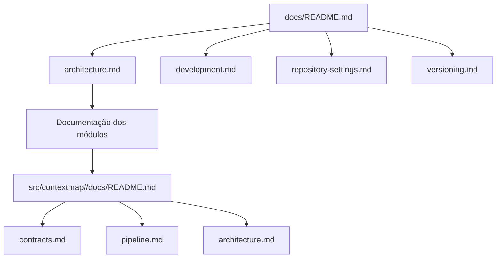

# Documentação do ContextMap2

Este diretório é o ponto de entrada da documentação global do ContextMap2. A documentação é distribuída entre decisões transversais e documentação específica de cada capability, mas deve permanecer navegável como um único conjunto.

## Mapa global



## Documentos globais

- [Arquitetura](architecture.md), limites do sistema, fluxo principal e regras arquiteturais transversais.
- [Desenvolvimento](development.md), branches, commits, PRs, Python, docstrings, princípios de código e organização documental.
- [Configuração do repositório](repository-settings.md), políticas esperadas do GitHub, merges, checks e branches.
- [Versionamento](versioning.md), Semantic Versioning, releases e critérios de publicação.
- [Contribuindo](../CONTRIBUTING.md), entrada rápida para quem vai abrir uma alteração.

## Documentação por módulo

Cada capability implementada pode manter documentação em:

```text
src/contextmap/<module>/docs/
```

O ponto de entrada obrigatório, quando o módulo possuir documentação própria, é:

```text
src/contextmap/<module>/docs/README.md
```

Arquivos complementares devem existir somente quando houver conteúdo real, por exemplo:

```text
architecture.md
contracts.md
pipeline.md
evaluation.md
backends.md
```

## Integração

A divisão entre documentação global e local segue responsabilidade de domínio.

- decisões que afetam múltiplos módulos pertencem a `docs/`;
- contratos, pipeline e comportamento internos de uma capability pertencem ao `docs/` do módulo;
- um módulo referencia a documentação global aplicável em vez de copiar suas regras;
- quando módulos dependem conceitualmente entre si, a documentação deve usar links entre os documentos públicos relevantes;
- alterações arquiteturais ou de contrato devem atualizar código e documentação no mesmo PR.

## Registro de módulos

À medida que os módulos forem materializados no código, seus pontos de entrada devem ser adicionados nesta seção. O índice só deve apontar para documentação existente, evitando links para estruturas ainda não implementadas.

A arquitetura inicial prevê capabilities como `ingestion`, `visual_perception`, `state_estimation`, `geometric_mapping`, `sensor_association`, `point_representation`, `semantic_fusion`, `semantic_mapping`, `spatial_relations`, `artifact` e `runtime`. A responsabilidade final de cada uma deve seguir as decisões registradas em [architecture.md](architecture.md).

## Regras de idioma e formato

- documentação Markdown em PT-BR;
- docstrings Python em inglês;
- comentários explicativos de código em PT-BR;
- Mermaid preferido para fluxos, dependências, pipelines e estados quando melhorar a compreensão;
- nomes de tipos, APIs e contratos preservam os identificadores reais do código, normalmente em inglês.
