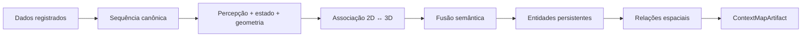
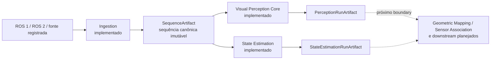
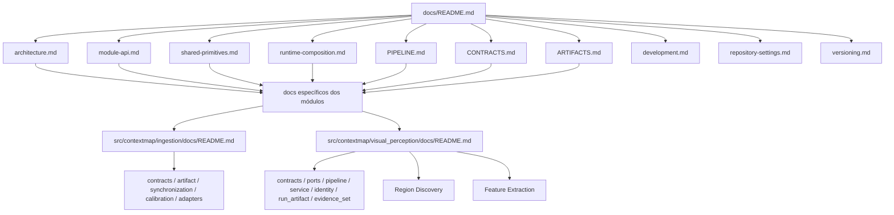

# Documentação do ContextMap2

Este diretório é o ponto de entrada da documentação global do ContextMap2.

O objetivo da documentação principal é permitir que uma pessoa entenda **o que o projeto produz, como o pipeline funciona, quais contratos conectam os módulos e como os resultados permanecem reproduzíveis** sem precisar reconstruir essas decisões a partir das issues.

> A documentação descreve a arquitetura alvo do **canonical pipeline**. Uma capability documentada pode ainda estar planejada ou em implementação. O fato de uma etapa aparecer no pipeline não significa, por si só, que ela já esteja concluída no código.

## O que é o ContextMap2

O ContextMap2 transforma observações robóticas registradas, como RGB, LiDAR, IMU, pose e calibração, em um mapa contextual 3D portátil e versionado.

O produto final do repositório é um `ContextMapArtifact` que conecta:

- geometria 3D persistente;
- entidades semânticas resolvidas;
- relações espaciais entre entidades;
- evidências e provenance suficientes para explicar de onde cada resultado veio.



Visualização, busca em linguagem natural, navegação, planejamento, agentes e dashboards são **consumidores externos**. Eles não pertencem ao núcleo deste repositório.

## Estado materializado na `dev`

A documentação global descreve o canonical pipeline completo, mas o código atualmente materializado deve ser lido de forma separada do alvo futuro. Hoje, os três primeiros boundaries de domínio estão implementados e integrados por contratos públicos:



Ingestion possui adapters ROS 1/ROS 2, observações canônicas, calibração, sincronização, seleção/replay, provenance, validação e `SequenceArtifact`. Visual Perception possui o core de execução, Region Discovery concreto e Feature Extraction com adapters DINOv2, DINOv3, CLIP e AlphaCLIP, além de compatibilidade de embeddings, payload store, sampling denso, pooling por região, diagnostics e avaliação. `PerceptionRunArtifact` e leitura multi-run continuam preservando evidência sem fusão implícita. Os adapters de features têm testes determinísticos sem pesos; a validação numérica com checkpoints reais permanece uma etapa explícita da máquina de inferência.

State Estimation possui os contratos `PoseEstimate`/`Trajectory`, lookup temporal com interpolação auditável, frame graph estático e preflight de geometria, o port `StateEstimator` com os backends `ExternalPose` e FAST-LIO, o `StateEstimationRunArtifact` e o harness de avaliação em `evaluation`. A execução de referência com o FAST-LIO instalado ainda está pendente: o backend foi testado com um processo substituto, não com o binário real.

Os detalhes implementados pertencem aos documentos dos módulos. Os documentos globais integram esses boundaries e descrevem como eles se conectam ao restante do canonical pipeline, sem duplicar a especificação interna.

## Ordem recomendada de leitura

1. [PIPELINE.md](PIPELINE.md), fluxo completo da entrada ao `ContextMapArtifact`.
2. [architecture.md](architecture.md), boundaries, ownership, dependências e regras arquiteturais.
3. [module-api.md](module-api.md), superfície pública, encapsulamento e imports permitidos entre capabilities.
4. [shared-primitives.md](shared-primitives.md), critérios para tipos transversais e limites do namespace `shared`.
5. [runtime-composition.md](runtime-composition.md), composition root, configuração, optional stages e limite da orquestração.
6. [CONTRACTS.md](CONTRACTS.md), contratos públicos, identidades e semântica dos dados que cruzam módulos.
7. [ARTIFACTS.md](ARTIFACTS.md), persistência, immutability, lineage, debug e reprodutibilidade.
8. [development.md](development.md), fluxo de desenvolvimento, branches, commits, Python e qualidade.
9. [repository-settings.md](repository-settings.md), políticas esperadas do GitHub e checks.
10. [versioning.md](versioning.md), Semantic Versioning e releases.

## Mapa da documentação



## Responsabilidade de cada documento

| Documento | Pergunta principal |
| --- | --- |
| `PIPELINE.md` | Como os dados percorrem o sistema do sensor ao mapa contextual? |
| `architecture.md` | Quem é responsável por cada capability e quem pode depender de quem? |
| `module-api.md` | O que uma capability expõe publicamente e como outras capabilities podem importá-la? |
| `shared-primitives.md` | Quais conceitos podem ser compartilhados sem perder ownership de domínio? |
| `runtime-composition.md` | Onde implementations são construídas e como runtime orquestra sem absorver lógica científica? |
| `CONTRACTS.md` | Qual é o significado dos objetos que atravessam as fronteiras entre módulos? |
| `ARTIFACTS.md` | Como runs e resultados são persistidos, auditados e reutilizados? |
| `development.md` | Como uma mudança deve ser implementada e integrada? |
| `repository-settings.md` | Como o GitHub deve reforçar o fluxo de desenvolvimento? |
| `versioning.md` | Como versões e releases são identificadas? |

## Pipeline em uma linha

```text
raw source
→ ingestion
→ visual perception + state estimation
→ geometric mapping
→ sensor association
→ optional point representation
→ semantic fusion
→ semantic mapping
→ entity resolution
→ spatial relations
→ ContextMapArtifact
```

O detalhamento completo, incluindo branches paralelos e contratos intermediários, está em [PIPELINE.md](PIPELINE.md).

## Documentação por módulo

Decisões globais pertencem a `docs/`. Detalhes internos de uma capability pertencem ao próprio módulo:

```text
src/contextmap/<module>/docs/
├── README.md
├── pipeline.md       # quando o fluxo interno exigir detalhamento
├── contracts.md      # quando houver contratos públicos ou invariantes próprios
├── architecture.md   # quando houver decisões estruturais próprias
├── evaluation.md     # quando houver métricas/protocolo de avaliação
└── backends.md       # quando houver múltiplos backends reais
```

Arquivos complementares só devem existir quando houver conteúdo real. O objetivo é fragmentar por responsabilidade, não multiplicar arquivos vazios.

Módulos com documentação própria:

- [`ingestion`](../src/contextmap/ingestion/docs/README.md) — observações de sensor canônicas, sequência, sincronização, calibração, seleção/replay, provenance e adapters de fonte.
- [`visual_perception`](../src/contextmap/visual_perception/docs/README.md) — evidência visual por run, ports, preset canônico, execução do DAG, artifacts e leitura multi-run; [Region Discovery](../src/contextmap/visual_perception/docs/region-discovery.md) documenta SAM2/SAM3/Florence-2, passes, normalização e avaliação geométrica; [Feature Extraction](../src/contextmap/visual_perception/docs/feature-extraction.md) documenta embeddings, payloads, sampling, pooling, diagnostics, enhancement opcional e o estado dos backends concretos.
- [`state_estimation`](../src/contextmap/state_estimation/docs/README.md) — pose dinâmica do rig: `PoseEstimate`, `Trajectory`, convenção de transform e provenance.
- [`evaluation`](../src/contextmap/evaluation/docs/README.md) — relatórios de qualidade, regressão e custo sem alterar outputs do pipeline.

## Integração da documentação

A documentação é fragmentada fisicamente, mas forma um único grafo de conhecimento.

- `docs/` contém decisões transversais ao sistema;
- cada módulo documenta apenas seu domínio e suas fronteiras;
- conteúdo global é referenciado por link, não copiado para cada módulo;
- documentação de upstream/downstream deve apontar para o contrato público relevante;
- quando um módulo já estiver implementado, seu `src/contextmap/<module>/docs/` é a fonte de verdade para detalhes de comportamento; os documentos globais resumem e conectam esse comportamento ao sistema;
- uma alteração arquitetural ou de contrato deve atualizar código e documentação no mesmo PR;
- `docs/README.md` é o índice canônico dos pontos de entrada globais.

## Estado da arquitetura

O canonical pipeline é **pre-alpha** e evolui por milestones. Os documentos principais descrevem o desenho canônico que as milestones devem materializar.

Ao ler uma etapa do pipeline, diferencie:

- **contrato**, semântica que deve permanecer estável na fronteira do módulo;
- **backend**, implementação substituível de uma capability;
- **canonical pipeline**, composição integrada de referência que as milestones materializam e validam;
- **experimento**, alternativa que não substitui silenciosamente o baseline;
- **artefato**, resultado persistido e imutável de uma execução.

## Regras de escrita

- Markdown em PT-BR;
- nomes de APIs, classes e contratos permanecem em inglês;
- Mermaid é preferido para fluxos, dependências, estados e lineage quando reduzir ambiguidade;
- exemplos devem ser pequenos e ligados a uma decisão real;
- documentos globais não devem repetir detalhes que pertencem ao `docs/` de um módulo;
- arquitetura planejada nunca deve ser apresentada como funcionalidade já implementada.
