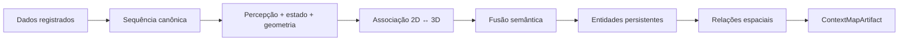
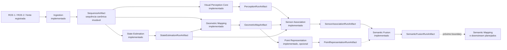

# Documentação do ContextMap2

Este diretório é o ponto de entrada da documentação global do ContextMap2.

O objetivo da documentação principal é permitir que uma pessoa entenda **o que o projeto produz, como o pipeline funciona, quais contratos conectam os módulos e como os resultados permanecem reproduzíveis** sem precisar reconstruir essas decisões a partir das issues.

> A documentação descreve a arquitetura alvo do **canonical pipeline**. Uma capability documentada pode ainda estar planejada ou em implementação. O fato de uma etapa aparecer no pipeline não significa, por si só, que ela já esteja concluída no código.

## O que é o ContextMap2

O ContextMap2 transforma observações robóticas registradas, como RGB, LiDAR, IMU, pose e calibração, em um mapa contextual 3D portátil e versionado.

O produto final do repositório é um `ContextMapArtifact` que conecta:

- geometria 3D persistente;
- entidades semânticas resolvidas;
- relações espaciais entre entidades;
- evidências e provenance suficientes para explicar de onde cada resultado veio.



Visualização, busca em linguagem natural, navegação, planejamento, agentes e dashboards são **consumidores externos**. Eles não pertencem ao núcleo deste repositório.

## Estado materializado na `dev`

A documentação global descreve o canonical pipeline completo, mas o código atualmente materializado deve ser lido de forma separada do alvo futuro. Hoje, os sete primeiros boundaries de domínio estão implementados e integrados por contratos públicos; `evaluation` também existe como capability transversal:



Ingestion possui adapters ROS 1/ROS 2, observações canônicas, calibração, sincronização, seleção/replay, provenance, validação e `SequenceArtifact`. Visual Perception possui o core de execução, Region Discovery concreto, Feature Extraction com adapters DINOv2, DINOv3, CLIP e AlphaCLIP, além de compatibilidade de embeddings, payload store, sampling denso, pooling por região, diagnostics e avaliação, e o boundary canônico de Semantic Interpretation. Esse boundary inclui `SemanticClaim`/`SceneContext`, requests auditáveis, prompts/parsing versionados, `SemanticInterpretationExecution`, persistência das views exatas e adapters Qwen/Gemini/Florence-2 isolados por seams testáveis. `SemanticScorer` também possui adapters CLIP/AlphaCLIP separados das claims. `PerceptionRunArtifact` e leitura multi-run continuam preservando evidência sem fusão implícita. A CI usa runtimes/clients injetados; SAM2/SAM3, DINOv2/CLIP e Qwen possuem execuções reais registradas com escopos distintos. DINOv3, AlphaCLIP, Gemini e Florence-2 semântico continuam sem execução real registrada, e não há avaliação científica comparativa comum desses adapters.

State Estimation possui os contratos `PoseEstimate`/`Trajectory`, lookup temporal com interpolação auditável, frame graph estático e preflight de geometria, o port `StateEstimator` com os backends `ExternalPose` e FAST-LIO, o `StateEstimationRunArtifact` e o harness de avaliação em `evaluation`. A execução de referência com o FAST-LIO instalado ainda está pendente: o backend foi testado com um processo substituto, não com o binário real.

Geometric Mapping possui os contratos `GeometryPoint`/`GeometryReference`/`GeometricMap`, o estado explícito de correção de movimento, a montagem dos inputs, a transformação fonte→mapa com traces auditáveis, a acumulação com referências estáveis, o acesso espacial por `GeometrySource` com índice derivado e verificável, o `GeometricMapArtifact` e o harness de validação em `evaluation`. A validação real usou a trajetória do dataset como entrada, não uma execução FAST-LIO, e não há geometria de referência confiável para o `corridor-02`.

Sensor Association possui os contratos `SpatialObservation` e `ObservationQuality`, os modelos de câmera calibrados (pinhole, fisheye e MEI, com o MEI adicionado à calibração canônica de Ingestion), a cadeia mapa → câmera → imagem preparada, a resolução de visibilidade e oclusão, o pertencimento à máscara de `Region2D`, a amostragem de features densas (nativas ou melhoradas, como canais distintos), os diagnósticos de calibração, reprojeção e alinhamento temporal, o `SensorAssociationRunArtifact` e o harness de avaliação estratificada em `evaluation`. Toda a verificação usa fixtures sintéticos determinísticos: não há mapa geométrico no frame da trajetória (depende da execução real do FAST-LIO) nem correspondências de referência reais.

Point Representation é uma capability **opcional**: possui os contratos `PointRepresentation`/`RepresentationSpace`, a extração de suporte local sobre `GeometrySource`, o port `PointEncoder` e o serviço de execução independente de backend, o descritor geométrico determinístico (baseline), a fronteira do backend PTv3, o `PointRepresentationRunArtifact` e o harness de ablação em `evaluation`. Ela deve justificar seu custo por avaliação controlada, e essa justificativa **não existe ainda**: o PTv3 nunca foi executado (sem torch nem pesos), a ablação downstream sobre Semantic Fusion ainda não foi realizada, Entity Resolution permanece planejada e toda a verificação usa geometria sintética.

Semantic Fusion acumula a evidência multi-vista **sem criar identidade de objeto**: possui `FusionSupport`, `EvidenceContribution`, o agrupamento por observação física, a política baseline de acumulação (hipóteses por chave de label, stances e sinais tipados, abstenção configurável e registros de incerteza), os canais de evidência tipados, a política opcional ciente de qualidade, o `SemanticFusionRunArtifact` e o harness de validação em `evaluation`. Toda a verificação usa fixtures sintéticos: não há run de fusão sobre dados reais nem anotações de referência reais, então **nenhuma decisão foi tomada** sobre manter a política ciente de qualidade opcional ou adotá-la.

Runtime & Configuration compõe essas capabilities: possui a configuração efetiva versionada (perfil, arquivos e overrides, digest determinístico, segredos só do ambiente), o catálogo de stages, pontos de variação e backends, a composition root, o DAG de estágios com preflight, o reuso por identidade de conteúdo, a seleção explícita de runs com linhagem, o ciclo de vida do run (journal, eventos, cancelamento, retomada), o serviço público de ingestion, a CLI `contextmap` e a API pública de aplicação `Runtime` para qualquer frontend. Só a Ingestion possui um executor de estágio real: os demais são fornecidos por quem chama e os testes usam estágios falsos, então o pipeline canônico ainda **não foi executado de ponta a ponta com dados reais**. Semantic Mapping, Entity Resolution, Spatial Relations e o `ContextMapArtifact` continuam declarados como estágios indisponíveis.

Os detalhes implementados pertencem aos documentos dos módulos. Os documentos globais integram esses boundaries e descrevem como eles se conectam ao restante do canonical pipeline, sem duplicar a especificação interna.

## Ordem recomendada de leitura

1. [PIPELINE.md](PIPELINE.md), fluxo completo da entrada ao `ContextMapArtifact`.
2. [architecture.md](architecture.md), boundaries, ownership, dependências e regras arquiteturais.
3. [module-api.md](module-api.md), superfície pública, encapsulamento e imports permitidos entre capabilities.
4. [shared-primitives.md](shared-primitives.md), critérios para tipos transversais e limites do namespace `shared`.
5. [runtime-composition.md](runtime-composition.md), composition root, configuração, optional stages e limite da orquestração.
6. [CONTRACTS.md](CONTRACTS.md), contratos públicos, identidades e semântica dos dados que cruzam módulos.
7. [ARTIFACTS.md](ARTIFACTS.md), persistência, immutability, lineage, debug e reprodutibilidade.
8. [development.md](development.md), fluxo de desenvolvimento, branches, commits, Python e qualidade.
9. [repository-settings.md](repository-settings.md), políticas esperadas do GitHub e checks.
10. [versioning.md](versioning.md), Semantic Versioning e releases.

## Mapa da documentação

```mermaid
flowchart TD
    R[docs/README.md]

    R --> P[PIPELINE.md]
    R --> A[architecture.md]
    R --> API[module-api.md]
    R --> SH[shared-primitives.md]
    R --> RC[runtime-composition.md]
    R --> C[CONTRACTS.md]
    R --> AR[ARTIFACTS.md]
    R --> D[development.md]
    R --> RS[repository-settings.md]
    R --> V[versioning.md]

    A --> M[docs específicos dos módulos]
    API --> M
    SH --> M
    RC --> M
    P --> M
    C --> M
    AR --> M

    M --> ING[src/contextmap/ingestion/docs/README.md]
    M --> VP[src/contextmap/visual_perception/docs/README.md]
    M --> ST[src/contextmap/state_estimation/docs/README.md]
    M --> GM[src/contextmap/geometric_mapping/docs/README.md]
    M --> SA[src/contextmap/sensor_association/docs/README.md]
    M --> PR[src/contextmap/point_representation/docs/README.md]
    M --> SF[src/contextmap/semantic_fusion/docs/README.md]
    M --> EV[src/contextmap/evaluation/docs/README.md]
    M --> RTM[src/contextmap/runtime/docs/README.md]
    RTM --> RTD[configuration / composition / pipeline / reuse / selection / lifecycle / cli / api]
    ING --> ID[contracts / artifact / synchronization / calibration / adapters]
    VP --> VD[contracts / ports / pipeline / service / identity / run_artifact / evidence_set]
    VP --> RD[Region Discovery]
    VP --> FE[Feature Extraction]
    VP --> SI[Semantic Interpretation]
```



## Responsabilidade de cada documento

| Documento | Pergunta principal |
| --- | --- |
| `PIPELINE.md` | Como os dados percorrem o sistema do sensor ao mapa contextual? |
| `architecture.md` | Quem é responsável por cada capability e quem pode depender de quem? |
| `module-api.md` | O que uma capability expõe publicamente e como outras capabilities podem importá-la? |
| `shared-primitives.md` | Quais conceitos podem ser compartilhados sem perder ownership de domínio? |
| `runtime-composition.md` | Onde implementations são construídas e como runtime orquestra sem absorver lógica científica? |
| `CONTRACTS.md` | Qual é o significado dos objetos que atravessam as fronteiras entre módulos? |
| `ARTIFACTS.md` | Como runs e resultados são persistidos, auditados e reutilizados? |
| `development.md` | Como uma mudança deve ser implementada e integrada? |
| `repository-settings.md` | Como o GitHub deve reforçar o fluxo de desenvolvimento? |
| `versioning.md` | Como versões e releases são identificadas? |

## Pipeline em uma linha

```text
raw source
→ ingestion
→ visual perception + state estimation
→ geometric mapping
→ sensor association
→ optional point representation
→ semantic fusion
→ semantic mapping
→ entity resolution
→ spatial relations
→ ContextMapArtifact
```

O detalhamento completo, incluindo branches paralelos e contratos intermediários, está em [PIPELINE.md](PIPELINE.md).

## Documentação por módulo

Decisões globais pertencem a `docs/`. Detalhes internos de uma capability pertencem ao próprio módulo:

```text
src/contextmap/<module>/docs/
├── README.md
├── pipeline.md       # quando o fluxo interno exigir detalhamento
├── contracts.md      # quando houver contratos públicos ou invariantes próprios
├── architecture.md   # quando houver decisões estruturais próprias
├── evaluation.md     # quando houver métricas/protocolo de avaliação
└── backends.md       # quando houver múltiplos backends reais
```

Arquivos complementares só devem existir quando houver conteúdo real. O objetivo é fragmentar por responsabilidade, não multiplicar arquivos vazios.

Módulos com documentação própria:

- [`ingestion`](../src/contextmap/ingestion/docs/README.md) — observações de sensor canônicas, sequência, sincronização, calibração, seleção/replay, provenance e adapters de fonte.
- [`visual_perception`](../src/contextmap/visual_perception/docs/README.md) — evidência visual por run, ports, preset canônico, execução do DAG, artifacts e leitura multi-run; [Region Discovery](../src/contextmap/visual_perception/docs/region-discovery.md) documenta SAM2/SAM3/Florence-2, passes, normalização e avaliação geométrica; [Feature Extraction](../src/contextmap/visual_perception/docs/feature-extraction.md) documenta embeddings, payloads, sampling, pooling, diagnostics, enhancement opcional e os adapters concretos; [Semantic Interpretation](../src/contextmap/visual_perception/docs/semantic-interpretation.md) documenta claims/contexto, seleção auditável de evidência, prompts/parsing, Qwen/Gemini/Florence-2 e persistência da execução.
- [`state_estimation`](../src/contextmap/state_estimation/docs/README.md) — pose dinâmica do rig: `PoseEstimate`, `Trajectory`, convenção de transform e provenance.
- [`geometric_mapping`](../src/contextmap/geometric_mapping/docs/README.md) — geometria 3D persistente no frame global do mapa: `GeometryPoint`, `GeometryReference`, `GeometricMap`, `Bounds3D` e a fronteira de leitura `GeometrySource`.
- [`sensor_association`](../src/contextmap/sensor_association/docs/README.md) — evidência visual 2D ancorada em geometria 3D persistente: `SpatialObservation`, modelos de câmera, visibilidade e oclusão, pertencimento à máscara, features densas e `ObservationQuality`.
- [`semantic_fusion`](../src/contextmap/semantic_fusion/docs/README.md) — acumulação de evidência multi-vista sobre suporte espacial, sem identidade de objeto: `FusionSupport`, `FusedEvidence`, agrupamento por observação física, política baseline e ciente de qualidade, canais tipados e o artifact de run.
- [`point_representation`](../src/contextmap/point_representation/docs/README.md) — representação opcional da estrutura 3D local: `PointRepresentation`, `RepresentationSpace`, o port `PointEncoder`, o descritor determinístico e a fronteira do PTv3.
- [`runtime`](../src/contextmap/runtime/docs/README.md) — configuração efetiva, composition root, DAG com preflight, reuso, seleção de runs, lifecycle, CLI, serviço de ingestion e a API pública `Runtime` para frontends; compõe e executa, sem decidir ciência.
- [`evaluation`](../src/contextmap/evaluation/docs/README.md) — relatórios de qualidade, regressão e custo sem alterar outputs do pipeline.

## Integração da documentação

A documentação é fragmentada fisicamente, mas forma um único grafo de conhecimento.

- `docs/` contém decisões transversais ao sistema;
- cada módulo documenta apenas seu domínio e suas fronteiras;
- conteúdo global é referenciado por link, não copiado para cada módulo;
- documentação de upstream/downstream deve apontar para o contrato público relevante;
- quando um módulo já estiver implementado, seu `src/contextmap/<module>/docs/` é a fonte de verdade para detalhes de comportamento; os documentos globais resumem e conectam esse comportamento ao sistema;
- uma alteração arquitetural ou de contrato deve atualizar código e documentação no mesmo PR;
- `docs/README.md` é o índice canônico dos pontos de entrada globais.

## Estado da arquitetura

O canonical pipeline é **pre-alpha** e evolui por milestones. Os documentos principais descrevem o desenho canônico que as milestones devem materializar.

Ao ler uma etapa do pipeline, diferencie:

- **contrato**, semântica que deve permanecer estável na fronteira do módulo;
- **backend**, implementação substituível de uma capability;
- **canonical pipeline**, composição integrada de referência que as milestones materializam e validam;
- **experimento**, alternativa que não substitui silenciosamente o baseline;
- **artefato**, resultado persistido e imutável de uma execução.

## Regras de escrita

- Markdown em PT-BR;
- nomes de APIs, classes e contratos permanecem em inglês;
- Mermaid é preferido para fluxos, dependências, estados e lineage quando reduzir ambiguidade;
- exemplos devem ser pequenos e ligados a uma decisão real;
- documentos globais não devem repetir detalhes que pertencem ao `docs/` de um módulo;
- arquitetura planejada nunca deve ser apresentada como funcionalidade já implementada.
