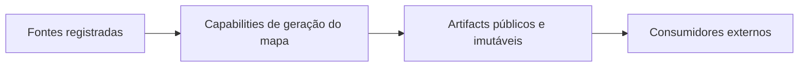
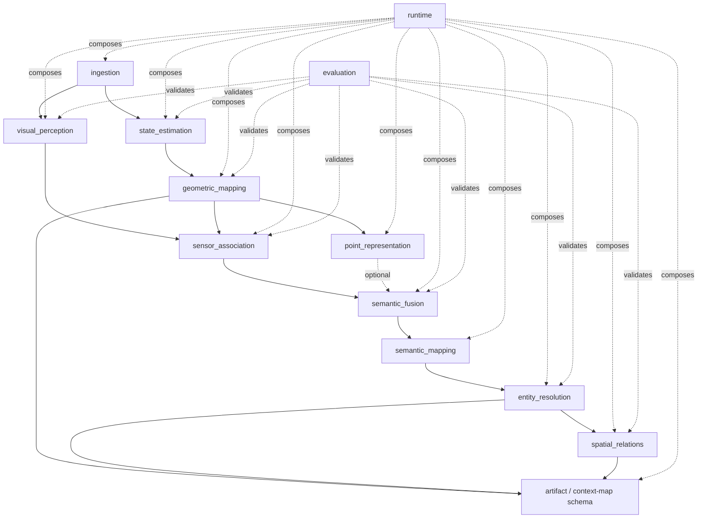
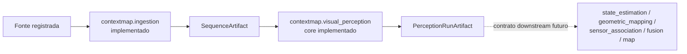
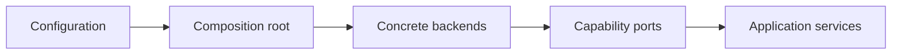
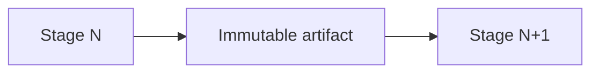
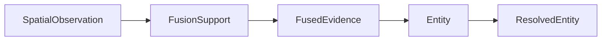

# Arquitetura da Solution 1

Este documento descreve a arquitetura estática alvo do ContextMap2: boundaries, ownership, dependências entre capabilities e regras que devem permanecer verdadeiras independentemente do backend escolhido.

O fluxo operacional detalhado está em [PIPELINE.md](PIPELINE.md). A semântica dos contratos está em [CONTRACTS.md](CONTRACTS.md). Persistência e lineage estão em [ARTIFACTS.md](ARTIFACTS.md).

> Esta é a arquitetura alvo da Solution 1. Uma capability documentada aqui pode ainda estar planejada ou em implementação.

## Objetivo arquitetural

O ContextMap2 deve produzir um mapa contextual 3D reproduzível sem acoplar o domínio a ROS, bibliotecas de modelos, um dataset específico ou aplicações consumidoras.

A arquitetura é organizada por **capability**, não por tecnologia.



## Limite do repositório

O repositório possui responsabilidade por:

- ingestão e normalização de observações robóticas;
- percepção visual;
- state estimation;
- geometria persistente;
- associação 2D↔3D;
- representações 3D opcionais;
- fusão de evidências;
- entidades semânticas e resolução de identidade;
- relações espaciais;
- montagem, validação e serialização do mapa contextual.

Estão fora do limite:

- viewer web/desktop;
- natural-language search/query;
- navigation stacks;
- planning;
- agents;
- dashboards;
- interfaces de operação.

Esses sistemas consomem `ContextMapArtifact`. Eles não devem importar internals do pipeline.

## Capabilities principais



As setas principais representam fluxo/dependência conceitual de dados. Dependências adicionais de artifacts, como calibração normalizada ou pose usada em Sensor Association, devem continuar explícitas no runtime e lineage mesmo quando não aparecem como uma aresta simplificada no diagrama.

## Estado implementado e fronteira atual

Na `dev`, `ingestion` e o núcleo de `visual_perception` já materializam os dois primeiros boundaries da arquitetura. O restante do grafo acima continua sendo arquitetura alvo até que suas milestones correspondentes sejam implementadas.



A integração entre os dois módulos é feita exclusivamente pelas APIs públicas. `visual_perception` referencia identidades de observação e sequência possuídas por Ingestion, sem importar adapters ROS ou detalhes de `sequence_artifact.py`.

Documentação implementacional:

- [Ingestion](../src/contextmap/ingestion/docs/README.md);
- [Visual Perception](../src/contextmap/visual_perception/docs/README.md).


## Ownership

Uma capability possui o conceito que ela introduz semanticamente. O consumidor depende da API pública desse módulo, não de uma estrutura global de contratos.

| Capability | Responsabilidade primária | Conceitos que possui | Não possui |
| --- | --- | --- | --- |
| `ingestion` | Normalizar fontes registradas | source observations, sequence, calibration metadata | pose canônica, semântica, mapa |
| `visual_perception` | Extrair evidência visual/semântica por inferência | prepared image, regions, visual features, semantic claims | projeção 3D, fusão multi-view, entity ID |
| `state_estimation` | Produzir pose dinâmica e trajetória | `PoseEstimate`, `Trajectory`, lookup temporal | camera projection, semantic state |
| `geometric_mapping` | Produzir geometria 3D global persistente | `GeometryPoint`, `GeometryReference`, `GeometricMap` | labels, entities, relations |
| `sensor_association` | Ancorar evidência visual em geometria | `SpatialObservation`, projection/visibility association | semantic fusion, entity identity |
| `point_representation` | Representar estrutura 3D local | `PointRepresentation`, `RepresentationSpace` | visual embedding, semantic label |
| `semantic_fusion` | Acumular evidência em suporte espacial | `FusionSupport`, `FusedEvidence` | persistent entity identity |
| `semantic_mapping` | Materializar entidades semânticas persistentes | `Entity`, semantic/geometry/temporal state | same-object merge logic, relations |
| `entity_resolution` | Resolver duplicação/identidade entre entidades | resolution decisions, `ResolvedEntity` | relation extraction |
| `spatial_relations` | Inferir relações entre entidades resolvidas | `Relation`, `RelationEvidence` | entity correction, planning |
| `artifact` | Compor o produto público final | `ContextMap`, metadata, final artifact schema | domain inference |
| `runtime` | Compor e executar implementations | execution plan, selection, composition lifecycle | lógica científica das capabilities |
| `evaluation` | Medir qualidade e regressões | reference/evaluation schemas, reports | alterar resultados do pipeline |

## Regra de ownership de contratos

O módulo que introduz e possui semanticamente um conceito possui seu tipo público.

Exemplos:

```text
visual_perception.SemanticClaim
state_estimation.PoseEstimate
geometric_mapping.GeometryReference
sensor_association.SpatialObservation
semantic_fusion.FusedEvidence
semantic_mapping.Entity
spatial_relations.Relation
artifact.ContextMap
```

Evitar um package global como:

```text
contracts/everything.py
shared/models.py
common/domain.py
```

usado apenas para contornar boundaries. `shared` deve conter apenas primitives realmente transversais sem owner de domínio claro.

## Dependência pública e internals

Cross-module imports só podem depender da superfície pública do módulo produtor.

Permitido:

```python
from contextmap.visual_perception import SemanticClaim
```

Não permitido:

```python
from contextmap.visual_perception.backends.sam3._internal import SamNativeMask
```

Backends, SDK objects, tensors nativos e helpers privados permanecem internos à capability.

## Direção das dependências

A arquitetura deve permanecer acíclica no nível das capabilities de domínio.

Um modelo conceitual é:

```text
ingestion
├── visual_perception
└── state_estimation

state_estimation
└── geometric_mapping

visual_perception ─┐
geometric_mapping ─┴── sensor_association

sensor_association ─── semantic_fusion
geometric_mapping ─── point_representation ─── semantic_fusion

semantic_fusion
└── semantic_mapping
    └── entity_resolution
        └── spatial_relations

geometric_mapping ─────────────┐
entity_resolution ─────────────┼── artifact / ContextMap
spatial_relations ─────────────┘
```

`runtime` depende das capabilities para compô-las. Capabilities nunca dependem de `runtime`.

## Data dependency não é import de backend

Uma etapa pode precisar de dados produzidos por outra capability sem conhecer seu backend.

Exemplo, Sensor Association precisa de:

```text
PerceptionRunArtifact
GeometricMapArtifact
StateEstimationRunArtifact
canonical calibration
```

Isso não significa que ela conheça SAM, DINO, FAST-LIO ou ROS. Ela conhece apenas contratos públicos e artifacts.

## Ports e adapters

Uma interface/Protocol deve existir quando há um ponto real de substituição.

Exemplos de variation points planejados:

```text
RegionDiscovery
├── SAM2
├── SAM3
└── Florence-2

FeatureExtractor
├── DINOv2
├── DINOv3
├── CLIP
└── AlphaCLIP

SemanticInterpreter
├── Qwen
├── Gemini
└── Florence-2

SemanticScorer
├── CLIP
└── AlphaCLIP

StateEstimator
├── ExternalPose
└── FAST-LIO

PointEncoder
├── deterministic descriptor
└── PTv3, optional
```

Um backend pode atender mais de uma capability através de adapters distintos. Florence-2 usado para Region Discovery não é o mesmo contrato que Florence-2 usado para Semantic Interpretation.

No estado atual, os ports `RegionDiscovery`, `FeatureExtractor`, `SemanticInterpreter` e `SemanticScorer` já existem em `visual_perception`. O preset canônico implementado usa os três primeiros; `SemanticScorer` ainda não está ligado ao DAG canônico. Os backends reais de visão listados acima continuam candidatos planejados, não implementação já disponível. Ingestion, por outro lado, já possui adapters concretos ROS 1 e ROS 2 atrás de `SourceAdapter`.

## Composition root

Construção de implementações concretas pertence ao runtime.



Runtime pode:

- escolher backend;
- construir dependencies;
- carregar config;
- selecionar run/artifact upstream;
- validar DAG;
- decidir reuse/recompute;
- coordenar lifecycle.

Runtime não pode:

- decidir masks;
- calcular projection math que pertence a Sensor Association;
- definir fusion semantics;
- criar heurística de entity resolution;
- definir spatial predicates.

## Serviços de aplicação

Cada capability pode possuir um service responsável por coordenar seu comportamento interno sem conhecer infraestrutura concreta.

Exemplo conceitual:

```text
VisualPerceptionService
SensorAssociationService
SemanticFusionService
```

Esses services trabalham com ports e contratos públicos. Instanciação de backends fica fora deles.

## Artefatos como fronteiras

A Solution 1 usa artifacts imutáveis como fronteiras explícitas entre execuções.



Benefícios arquiteturais:

- estágio downstream pode ser reexecutado sem repetir upstream caro;
- experimentos preservam baseline;
- cada resultado possui lineage;
- modelo/SDK não precisa permanecer carregado para ler o resultado;
- regressões podem ser isoladas por etapa.

Detalhes estão em [ARTIFACTS.md](ARTIFACTS.md).

## Separação entre geometria e semântica

Geometric Mapping é autoridade da geometria persistente.

```text
GeometryReference
    = onde algo está
```

Visual/semantic evidence permanece separada:

```text
VisualFeature
    = como a evidência visual é representada

SemanticClaim
    = o que uma inferência propõe semanticamente

PointRepresentation
    = como a estrutura 3D local é representada
```

Sensor Association conecta evidência à geometria sem transformar o ponto 3D em um registro mutável cheio de labels.

## Separação entre fusion support e entity identity

`FusionSupport` agrupa observações sobre suporte espacial compatível para acumular evidência.

Ele não significa que o suporte seja uma identidade persistente de objeto.



Essas fronteiras existem para evitar que uma heurística de fusão se torne implicitamente a definição de object identity.

## Immutability

Objetos e artifacts persistidos não são corrigidos in-place por estágios downstream.

Exemplos:

- `SourceObservation` não muda quando percepção roda novamente;
- `Region2D` não muda depois de Geometry Freeze;
- `GeometricMapArtifact` não recebe embeddings adicionados por outro estágio;
- source entities não são apagadas quando Entity Resolution faz merge;
- um novo experimento gera novo artifact/run.

## Auditabilidade como requisito arquitetural

Qualquer resultado relevante deve responder:

1. qual input entrou;
2. qual configuração/policy foi aplicada;
3. qual backend/model/code produziu;
4. qual output foi gerado;
5. quais artifacts e observações upstream sustentam esse output.

Auditabilidade não é apenas uma opção de debug.

## Debug não é contrato

Artifacts separam:

```text
outputs/
    dados contratuais consumidos downstream

debug/
    visualizações, overlays, crops, traces e diagnósticos humanos
```

Nenhum módulo downstream pode depender de `debug/`.

## Configuração, policy e schema são diferentes

Manter separadas as seguintes dimensões:

```text
schema
    formato/semântica do contrato público

policy
    regra científica/algorítmica versionada

backend
    implementação substituível de uma capability

configuration
    parâmetros efetivos de uma execução
```

Mudar backend não deve necessariamente mudar schema. Mudar semântica de um contrato requer versionamento explícito.

## Required vs optional

O caminho end-to-end da Solution 1 requer as capabilities necessárias para produzir geometria, entidades resolvidas, relações e `ContextMapArtifact`.

Alguns canais permanecem opcionais quando o downstream selecionado não depende deles, por exemplo:

- PTv3/learned Point Representation;
- semantic scoring;
- visual feature channels específicos;
- semantic relation evidence;
- debug levels detalhados.

Optional não significa implícito. Estado habilitado/desabilitado precisa constar da configuração e dos manifests.

## Princípios de design

As decisões de código seguem [development.md](development.md):

- Clean Code;
- SOLID;
- KISS;
- DRY;
- YAGNI.

Aplicação prática:

- não criar abstração sem variation point real;
- não adicionar plugin framework quando factories pequenas resolvem;
- não centralizar domínio em `shared`;
- não generalizar um workaround de dataset como arquitetura universal;
- preservar ownership mesmo quando outro módulo possui os dados necessários para executar a lógica.

## Documentação por capability

Documentação global explica como as capabilities se conectam. Detalhes internos devem ficar em:

```text
src/contextmap/<module>/docs/
```

O módulo pode documentar pipeline interno, contracts, backends e evaluation sem repetir regras globais. O índice central permanece em [README.md](README.md).
