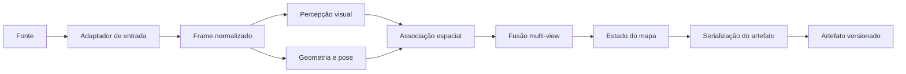
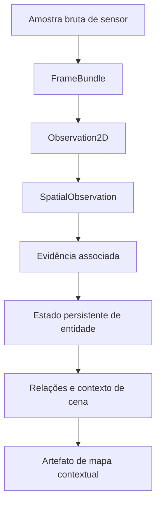

# Arquitetura da Solution 1

A Solution 1 é deliberadamente restrita. Seu objetivo é validar um caminho reproduzível desde observações sincronizadas de sensores até um artefato contextual portátil.



## Limites

Este repositório é responsável por gerar, validar e serializar o mapa contextual.

Estão intencionalmente fora de seu limite:

- viewers web ou desktop;
- interfaces de consulta em linguagem natural;
- aplicações de busca;
- stacks de navegação;
- planners e agentes;
- dashboards e interfaces de operação.

Esses sistemas devem consumir o artefato exportado por meio de seu schema documentado, sem importar detalhes internos do pipeline de mapeamento.

## Fluxo principal de dados

A primeira implementação deve convergir para contratos explícitos entre as etapas:



As classes e schemas exatos ainda não estão congelados. Eles devem emergir do menor vertical slice que possa ser avaliado ponta a ponta.

## Regras de design

1. Código específico de fonte termina na fronteira de observações normalizadas.
2. Código específico de modelo não define o schema persistido do mapa.
3. Toda claim semântica persistida preserva confiança e provenance quando disponíveis.
4. Fusão multi-view deve preservar evidência, não apenas o label final.
5. O artefato deve ser legível sem carregar modelos de percepção.
6. Comportamento específico de consumidores não deve vazar para a geração do mapa.
7. Caminhos experimentais permanecem isolados até demonstrarem valor mensurável.
8. Módulos expõem contratos públicos próprios e não dependem de internals ou backends de outros módulos.
9. Runtime compõe implementações concretas, mas não concentra comportamento científico ou de domínio.
10. Clean Code, SOLID, KISS, DRY e YAGNI são aplicados de forma pragmática conforme [development.md](development.md).

## Organização por capabilities

A arquitetura inicial prevê capabilities como:

```text
ingestion
visual_perception
state_estimation
geometric_mapping
sensor_association
point_representation
semantic_fusion
semantic_mapping
spatial_relations
artifact
runtime
```

A responsabilidade final e os contratos de cada capability são definidos pelas issues arquiteturais e documentados junto ao módulo quando implementados.

Documentação específica fica em:

```text
src/contextmap/<module>/docs/
```

A integração global dessa documentação é mantida por [docs/README.md](README.md).

## Alvo de validação

A avaliação deve responder questões no nível do mapa, por exemplo:

- observações repetidas são associadas à entidade persistente correta;
- fusão semântica melhora ou degrada confiança entre diferentes views;
- posições 3D permanecem geometricamente consistentes;
- relações necessárias são representadas corretamente;
- um consumidor independente consegue reconstruir o contexto necessário usando apenas o artefato;
- a serialização preserva todas as informações necessárias para reprodutibilidade.

Métricas de componentes continuam úteis, mas são métricas de suporte e não a definição final de sucesso.
