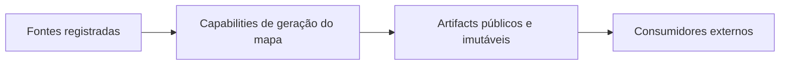
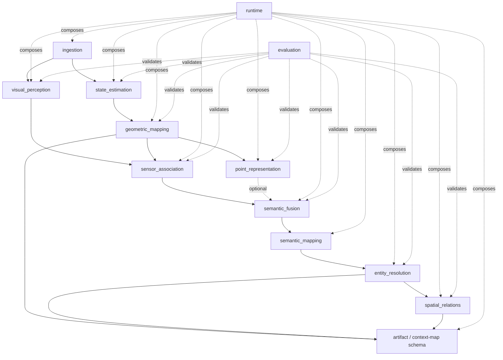
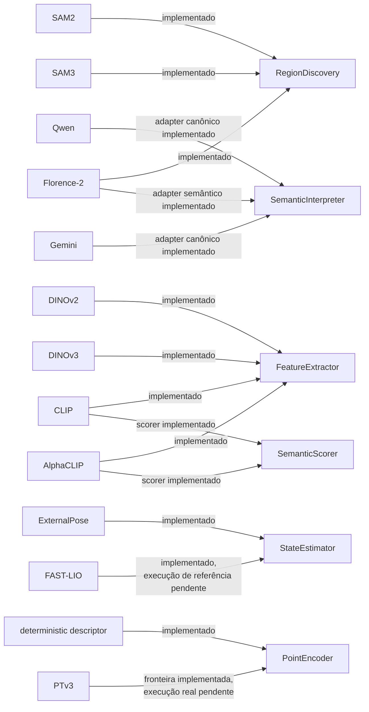
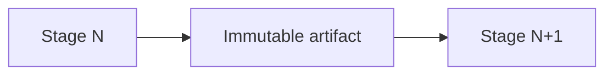
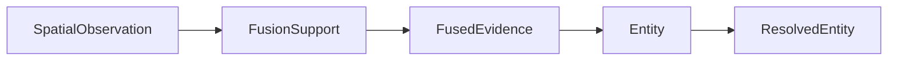

# Arquitetura do Canonical Pipeline

Este documento descreve a arquitetura estática alvo do ContextMap2: boundaries, ownership, dependências entre capabilities e regras que devem permanecer verdadeiras independentemente do backend escolhido.

O fluxo operacional detalhado está em [PIPELINE.md](PIPELINE.md). A semântica dos contratos está em [CONTRACTS.md](CONTRACTS.md). Persistência e lineage estão em [ARTIFACTS.md](ARTIFACTS.md).

> Esta é a arquitetura alvo do canonical pipeline. Uma capability documentada aqui pode ainda estar planejada ou em implementação.

## Objetivo arquitetural

O ContextMap2 deve produzir um mapa contextual 3D reproduzível sem acoplar o domínio a ROS, bibliotecas de modelos, um dataset específico ou aplicações consumidoras.

A arquitetura é organizada por **capability**, não por tecnologia.



## Limite do repositório

O repositório possui responsabilidade por:

- ingestão e normalização de observações robóticas;
- percepção visual;
- state estimation;
- geometria persistente;
- associação 2D↔3D;
- representações 3D opcionais;
- fusão de evidências;
- entidades semânticas e resolução de identidade;
- relações espaciais;
- montagem, validação e serialização do mapa contextual.

Estão fora do limite:

- viewer web/desktop;
- natural-language search/query;
- navigation stacks;
- planning;
- agents;
- dashboards;
- interfaces de operação.

Esses sistemas consomem `ContextMapArtifact`. Eles não devem importar internals do pipeline.

## Capabilities principais



As setas principais representam fluxo/dependência conceitual de dados. Dependências adicionais de artifacts, como calibração normalizada ou pose usada em Sensor Association, devem continuar explícitas no runtime e lineage mesmo quando não aparecem como uma aresta simplificada no diagrama.

## Estado implementado e fronteira atual

Na `dev`, `ingestion`, `visual_perception`, `state_estimation`, `geometric_mapping`, `sensor_association`, `point_representation`, `semantic_fusion`, `semantic_mapping`, `entity_resolution` e `spatial_relations` já materializam os dez primeiros boundaries de domínio da arquitetura; `evaluation` materializa os harnesses de qualidade, regressão e custo dessas capabilities, o reference set versionado com suas anotações, integridade e QA, o registro de métricas, os manifestos de experimento e a avaliação das técnicas opcionais. Dentro de Visual Perception, Region Discovery possui backends concretos, Feature Extraction possui o core de contratos, persistência, associação espacial, diagnostics e avaliação, além dos adapters DINOv2, DINOv3, CLIP e AlphaCLIP, e Semantic Interpretation possui contratos de evidência e request, prompt/parser versionados, execução auditável e adapters canônicos Qwen/Gemini/Florence-2. `SemanticScorer` possui adapters CLIP/AlphaCLIP separados. Existem execuções reais registradas de parte desses adapters, com escopos documentados individualmente, mas não uma avaliação científica comparativa comum. Semantic Mapping possui as entidades persistentes, a materialização sem resolução entre suportes, o `SemanticMappingRunArtifact` e o harness de validação. Entity Resolution possui a recuperação de candidatos, a evidência tipada por canal, a política de resolução baseline, as entidades resolvidas com linhagem de fusão, a detecção opcional de candidatos a divisão, o `EntityResolutionRunArtifact` e, em `evaluation`, o harness de fusão falsa, duplicata e falha de recuperação; todo o seu teste usa dados sintéticos. Spatial Relations possui as relações e a evidência entre entidades resolvidas, a taxonomia de predicados, os avaliadores geométricos e de contato, a política de decisão e o `SpatialRelationsRunArtifact`, lendo o run de Entity Resolution pela API pública dela. Runtime global e o artifact final continuam sendo arquitetura alvo.

```mermaid
flowchart LR
    SRC["Fonte registrada"] --> ING["contextmap.ingestion<br/>implementado"]
    ING --> SA["SequenceArtifact"]
    SA --> VP["contextmap.visual_perception<br/>core + Region Discovery + Feature Extraction core +<br/>Semantic Interpretation boundary"]
    VP --> PRA["PerceptionRunArtifact"]
    SA --> ST["contextmap.state_estimation<br/>contratos + lookup + preflight +<br/>ExternalPose / FAST-LIO"]
    ST --> TRA["StateEstimationRunArtifact"]
    SA --> GM["contextmap.geometric_mapping<br/>contratos + transformação + acumulação +<br/>acesso espacial"]
    TRA --> GM
    GM --> MAPA["GeometricMapArtifact"]
    PRA --> SEN["contextmap.sensor_association<br/>SpatialObservation + câmera + visibilidade +<br/>máscara + features densas + qualidade"]
    MAPA --> SEN
    TRA --> SEN
    SEN --> ASA["SensorAssociationRunArtifact"]
    MAPA --> PTR["contextmap.point_representation<br/>contratos + suporte + PointEncoder +<br/>descritor determinístico + fronteira PTv3"]
    PTR --> PTRA["PointRepresentationRunArtifact"]
    ASA --> FUS["contextmap.semantic_fusion<br/>suporte + agrupamento + acumulação +<br/>incerteza + canais + qualidade"]
    PTRA -.-> FUS
    FUS --> FUSA["SemanticFusionRunArtifact"]
    FUSA --> SMP["contextmap.semantic_mapping<br/>Entity + materialização +<br/>evidência + estado temporal"]
    SMP --> SMPA["SemanticMappingRunArtifact"]
    SMPA --> ER["contextmap.entity_resolution<br/>candidatos + evidência por canal +<br/>decisão + entidades resolvidas"]
    ER --> ERA["EntityResolutionRunArtifact"]
    ERA -. contrato downstream futuro .-> NEXT["spatial_relations / map"]
```



A integração entre os módulos é feita exclusivamente pelas APIs públicas. `visual_perception` e `state_estimation` referenciam identidades de observação, calibração e sequência possuídas por Ingestion, sem importar adapters ROS ou detalhes de `sequence_artifact.py`. `geometric_mapping` consome `SequenceArtifact`, calibração e a trajetória de `state_estimation` pelas APIs públicas e devolve geometria por referência: nada a jusante copia XYZ. `sensor_association` consome a percepção, a trajetória e a geometria pelas APIs públicas e devolve `SpatialObservation`, que referencia geometria, features e claims por identidade em vez de copiá-los. `semantic_fusion` consome `SpatialObservation`, as claims e a estrutura 3D opcional pelas APIs públicas e devolve `FusedEvidence`, que mantém todas as hipóteses e a incerteza sem criar identidade de objeto; suas dependências diretas de `ingestion`, `geometric_mapping` e `state_estimation` são só identidades e o intervalo temporal, e estão declaradas em `tests/architecture/test_boundaries.py`. `semantic_mapping` consome `FusedEvidence`, o run de fusão e a geometria pelas APIs públicas e devolve `Entity`, que referencia a evidência por identidade, versão e digest do artifact em vez de copiá-la; suas dependências diretas de `ingestion`, `visual_perception`, `sensor_association`, `point_representation` e `state_estimation` são só identidades e tipos que a evidência fundida já carrega, e também estão declaradas em `tests/architecture/test_boundaries.py`. Ele não decide se duas entidades são o mesmo objeto. `entity_resolution` consome as `Entity` e o run de Semantic Mapping pela API pública e devolve `ResolvedEntity`, `ResolutionDecision` e a evidência de cada comparação, sem mutar nenhuma entidade de origem e sem substituir a evidência por uma decisão; usa, também pela API pública, referências e limites de `geometric_mapping`, features e compatibilidade de embedding de `visual_perception` e a leitura de runs de `point_representation` para o canal opcional de representação 3D. Sua dependência direta de `ingestion` é só a identidade `SourceObservationId` como tipo (as entidades listam os frames físicos que as observaram), declarada em `tests/architecture/test_boundaries.py` com o teste de fixture correspondente.

Documentação implementacional:

- [Ingestion](../src/contextmap/ingestion/docs/README.md);
- [Visual Perception](../src/contextmap/visual_perception/docs/README.md);
- [Region Discovery](../src/contextmap/visual_perception/docs/region-discovery.md);
- [Feature Extraction](../src/contextmap/visual_perception/docs/feature-extraction.md);
- [Semantic Interpretation](../src/contextmap/visual_perception/docs/semantic-interpretation.md);
- [State Estimation](../src/contextmap/state_estimation/docs/README.md);
- [Geometric Mapping](../src/contextmap/geometric_mapping/docs/README.md);
- [Sensor Association](../src/contextmap/sensor_association/docs/README.md);
- [Point Representation](../src/contextmap/point_representation/docs/README.md);
- [Semantic Fusion](../src/contextmap/semantic_fusion/docs/README.md);
- [Evaluation](../src/contextmap/evaluation/docs/README.md).


## Ownership

Uma capability possui o conceito que ela introduz semanticamente. O consumidor depende da API pública desse módulo, não de uma estrutura global de contratos.

| Capability | Responsabilidade primária | Conceitos que possui | Não possui |
| --- | --- | --- | --- |
| `ingestion` | Normalizar fontes registradas | source observations, sequence, calibration metadata | pose canônica, semântica, mapa |
| `visual_perception` | Extrair evidência visual/semântica por inferência | prepared image, regions, visual features, semantic claims | projeção 3D, fusão multi-view, entity ID |
| `state_estimation` | Produzir pose dinâmica e trajetória | `PoseEstimate`, `Trajectory`, lookup temporal | camera projection, semantic state |
| `geometric_mapping` | Produzir geometria 3D global persistente | `GeometryPoint`, `GeometryReference`, `GeometricMap` | labels, entities, relations |
| `sensor_association` | Ancorar evidência visual em geometria | `SpatialObservation`, projection/visibility association | semantic fusion, entity identity |
| `point_representation` | Representar estrutura 3D local | `PointRepresentation`, `RepresentationSpace` | visual embedding, semantic label |
| `semantic_fusion` | Acumular evidência em suporte espacial | `FusionSupport`, `FusedEvidence` | persistent entity identity |
| `semantic_mapping` | Materializar entidades semânticas persistentes | `Entity`, `EntityReference`, semantic/geometry/temporal state, evidence links | same-object merge logic, relations |
| `entity_resolution` | Resolver duplicação/identidade entre entidades | `EntityCandidateSet`, `EntityMatchEvidence`, `ResolutionDecision`, `ResolvedEntity`, `ResolvedEntityReference` | relation extraction, mutação de entidade de origem |
| `spatial_relations` | Inferir relações entre entidades resolvidas | `Relation`, `RelationEvidence`, `RelationPredicate` (taxonomia), `FrameConventions` | entity correction, natural-language query, planning |
| `artifact` | Compor o produto público final | `ContextMap`, metadata, final artifact schema | domain inference |
| `runtime` | Compor e executar implementations | configuração efetiva, execution plan, selection, composition, lifecycle, API pública de aplicação (`Runtime`) | lógica científica das capabilities |
| `evaluation` | Medir qualidade e regressões | reference set, anotações, registro de métricas, relatórios, manifestos de experimento e evidência, cenário end-to-end, matriz de aceitação e invariantes entre estágios | alterar resultados do pipeline |

## Regra de ownership de contratos

O módulo que introduz e possui semanticamente um conceito possui seu tipo público.

Exemplos:

```text
visual_perception.SemanticClaim
state_estimation.PoseEstimate
geometric_mapping.GeometryReference
sensor_association.SpatialObservation
semantic_fusion.FusedEvidence
semantic_mapping.Entity
spatial_relations.Relation
artifact.ContextMap
```

Evitar um package global como:

```text
contracts/everything.py
shared/models.py
common/domain.py
```

usado apenas para contornar boundaries. `shared` deve conter apenas primitives realmente transversais sem owner de domínio claro.

## Dependência pública e internals

Cross-module imports só podem depender da superfície pública do módulo produtor.

Permitido:

```python
from contextmap.visual_perception import SemanticClaim
```

Não permitido:

```python
from contextmap.visual_perception.backends.sam3._internal import SamNativeMask
```

Backends, SDK objects, tensors nativos e helpers privados permanecem internos à capability.

## Direção das dependências

A arquitetura deve permanecer acíclica no nível das capabilities de domínio.

Um modelo conceitual é:

```text
ingestion
├── visual_perception
└── state_estimation

state_estimation
└── geometric_mapping

visual_perception ─┐
geometric_mapping ─┴── sensor_association

sensor_association ─── semantic_fusion
geometric_mapping ─── point_representation ─── semantic_fusion

semantic_fusion
└── semantic_mapping
    └── entity_resolution
        └── spatial_relations

geometric_mapping ─────────────┐
entity_resolution ─────────────┼── artifact / ContextMap
spatial_relations ─────────────┘
```

O grafo acima é conceitual e transitivo. O que o teste `tests/architecture/test_boundaries.py` autoriza são imports diretos da API pública do produtor. `semantic_fusion` importa, além de `sensor_association`, `point_representation` e `visual_perception`, identidades de `geometric_mapping` (`GeometryReference`, `Bounds3D`) e `ingestion` (`SourceObservationId`) e o intervalo temporal `TimeBounds` de `state_estimation`, apenas como tipos: não usa a lógica dessas capabilities. `spatial_relations` importa `entity_resolution` (`ResolvedEntityReference`, o manifest, o leitor do run e `ResolvedEntitySet`), `semantic_mapping` (`EntityGeometry`) e `geometric_mapping` (`GeometrySource` e referências de geometria), apenas pelas APIs públicas; a evidência de observação usa identidades upstream opacas em vez de importar `visual_perception` ou `ingestion`.

`runtime` depende das capabilities para compô-las. Capabilities nunca dependem de `runtime`.

## Data dependency não é import de backend

Uma etapa pode precisar de dados produzidos por outra capability sem conhecer seu backend.

Exemplo, Sensor Association precisa de:

```text
PerceptionRunArtifact
GeometricMapArtifact
StateEstimationRunArtifact
canonical calibration
```

Isso não significa que ela conheça SAM, DINO, FAST-LIO ou ROS. Ela conhece apenas contratos públicos e artifacts.

## Ports e adapters

Uma interface/Protocol deve existir quando há um ponto real de substituição.

Variation points atuais e planejados:



Um backend pode atender mais de uma capability através de adapters distintos. Florence-2 usado para Region Discovery não é o mesmo contrato que Florence-2 usado para Semantic Interpretation.

No estado atual, os ports `RegionDiscovery`, `FeatureExtractor`, `FeatureResolutionEnhancement`, `SemanticInterpreter` e `SemanticScorer` já existem em `visual_perception`. Region Discovery possui adapters concretos SAM2, SAM3 e Florence-2. Feature Extraction possui adapters DINOv2, DINOv3, CLIP e AlphaCLIP atrás do mesmo port; eles não são selecionados implicitamente pelo preset e o enhancement não possui backend aprendido nem faz parte do preset canônico. Semantic Interpretation possui `QwenSemanticInterpreter`, `GeminiSemanticInterpreter` e `Florence2SemanticInterpreter` implementando o mesmo boundary canônico, com runtime/client injetáveis, parsing/provenance compartilhados e testes determinísticos; houve um diagnóstico real limitado com Qwen, mas não uma comparação controlada dos três backends. `visual_perception.pipeline` conhece a capability `semantic_interpreter`, mas `CANONICAL_PRESET_V1` ainda usa temporariamente as operações legadas `scene_interpretation`/`region_interpretation` até existir uma política explícita de construção de request. `SemanticScorer` possui adapters CLIP/AlphaCLIP e está disponível como capability explícita do DAG, mas não integra `CANONICAL_PRESET_V1` automaticamente. Ingestion possui adapters concretos ROS 1 e ROS 2 atrás de `SourceAdapter`. `state_estimation` possui o port `StateEstimator` com os adapters `ExternalPose` e FAST-LIO, este com o processo isolado atrás de um `FastLioRunner`; a construção concreta é feita pela composition root do runtime (`compose()`), que recusa explicitamente um backend indisponível ou sem runtime. `point_representation` possui o port `PointEncoder` com o descritor geométrico determinístico e a fronteira do PTv3, este atrás de um `PTv3Runtime` injetável que isola torch, CUDA e checkpoint; um backend aprendido nunca substitui o baseline por queda silenciosa, e a construção concreta também é feita pela composition root do runtime. Detalhes: [Region Discovery](../src/contextmap/visual_perception/docs/region-discovery.md), [Feature Extraction](../src/contextmap/visual_perception/docs/feature-extraction.md) e [Semantic Interpretation](../src/contextmap/visual_perception/docs/semantic-interpretation.md).

## Composition root

A construção de implementações concretas pertence ao runtime: `contextmap.runtime.compose()` é a composition root, que constrói a partir da configuração efetiva as implementações de Ingestion, Visual Perception, State Estimation, Point Representation e Semantic Fusion atrás dos ports das capabilities. Só ela importa backends concretos, e apenas dentro da factory que os usa; o serviço público de ingestion importa somente a raiz pública de `contextmap.ingestion`, e nenhum outro módulo do runtime importa uma capability (`tests/architecture/test_runtime_boundaries.py`). Importar o runtime não carrega backend nem SDK pesado. Frontends (CLI, TUI) consomem a API pública `contextmap.runtime.Runtime`, nunca os módulos internos do runtime, um backend ou uma capability. Capabilities continuam testáveis sem construir o runtime, e nenhuma o importa. Detalhes em [runtime-composition.md](runtime-composition.md).


Runtime pode:

- escolher backend;
- construir dependencies;
- carregar config;
- selecionar run/artifact upstream;
- validar DAG;
- decidir reuse/recompute;
- coordenar lifecycle.

Runtime não pode:

- decidir masks;
- calcular projection math que pertence a Sensor Association;
- definir fusion semantics;
- criar heurística de entity resolution;
- definir spatial predicates.

## Serviços de aplicação

Cada capability pode possuir um service responsável por coordenar seu comportamento interno sem conhecer infraestrutura concreta.

Exemplo conceitual:

```text
VisualPerceptionService
SensorAssociationService
SemanticFusionService
```

Esses services trabalham com ports e contratos públicos. Instanciação de backends fica fora deles.

## Artefatos como fronteiras

O canonical pipeline usa artifacts imutáveis como fronteiras explícitas entre execuções.



Benefícios arquiteturais:

- estágio downstream pode ser reexecutado sem repetir upstream caro;
- experimentos preservam baseline;
- cada resultado possui lineage;
- modelo/SDK não precisa permanecer carregado para ler o resultado;
- regressões podem ser isoladas por etapa.

Detalhes estão em [ARTIFACTS.md](ARTIFACTS.md).

## Separação entre geometria e semântica

Geometric Mapping é autoridade da geometria persistente.

```text
GeometryReference
    = onde algo está
```

Visual/semantic evidence permanece separada:

```text
VisualFeature
    = como a evidência visual é representada

SemanticClaim
    = o que uma inferência propõe semanticamente

PointRepresentation
    = como a estrutura 3D local é representada
```

Sensor Association conecta evidência à geometria sem transformar o ponto 3D em um registro mutável cheio de labels.

## Separação entre fusion support e entity identity

`FusionSupport` agrupa observações sobre suporte espacial compatível para acumular evidência.

Ele não significa que o suporte seja uma identidade persistente de objeto.



Essas fronteiras existem para evitar que uma heurística de fusão se torne implicitamente a definição de object identity.

## Immutability

Objetos e artifacts persistidos não são corrigidos in-place por estágios downstream.

Exemplos:

- `SourceObservation` não muda quando percepção roda novamente;
- `Region2D` não muda depois de Geometry Freeze;
- `GeometricMapArtifact` não recebe embeddings adicionados por outro estágio;
- source entities não são apagadas quando Entity Resolution faz merge;
- um novo experimento gera novo artifact/run.

## Auditabilidade como requisito arquitetural

Qualquer resultado relevante deve responder:

1. qual input entrou;
2. qual configuração/policy foi aplicada;
3. qual backend/model/code produziu;
4. qual output foi gerado;
5. quais artifacts e observações upstream sustentam esse output.

Auditabilidade não é apenas uma opção de debug.

## Debug não é contrato

Artifacts separam:

```text
outputs/
    dados contratuais consumidos downstream

debug/
    visualizações, overlays, crops, traces e diagnósticos humanos
```

Nenhum módulo downstream pode depender de `debug/`.

## Configuração, policy e schema são diferentes

Manter separadas as seguintes dimensões:

```text
schema
    formato/semântica do contrato público

policy
    regra científica/algorítmica versionada

backend
    implementação substituível de uma capability

configuration
    parâmetros efetivos de uma execução
```

Mudar backend não deve necessariamente mudar schema. Mudar semântica de um contrato requer versionamento explícito.

## Required vs optional

O caminho end-to-end do canonical pipeline requer as capabilities necessárias para produzir geometria, entidades resolvidas, relações e `ContextMapArtifact`.

Alguns canais permanecem opcionais quando o downstream selecionado não depende deles, por exemplo:

- PTv3/learned Point Representation;
- semantic scoring;
- visual feature channels específicos;
- semantic relation evidence;
- debug levels detalhados.

Optional não significa implícito. Estado habilitado/desabilitado precisa constar da configuração e dos manifests.

## Princípios de design

As decisões de código seguem [development.md](development.md):

- Clean Code;
- SOLID;
- KISS;
- DRY;
- YAGNI.

Aplicação prática:

- não criar abstração sem variation point real;
- não adicionar plugin framework quando factories pequenas resolvem;
- não centralizar domínio em `shared`;
- não generalizar um workaround de dataset como arquitetura universal;
- preservar ownership mesmo quando outro módulo possui os dados necessários para executar a lógica.

## Documentação por capability

Documentação global explica como as capabilities se conectam. Detalhes internos devem ficar em:

```text
src/contextmap/<module>/docs/
```

O módulo pode documentar pipeline interno, contracts, backends e evaluation sem repetir regras globais. O índice central permanece em [README.md](README.md).
