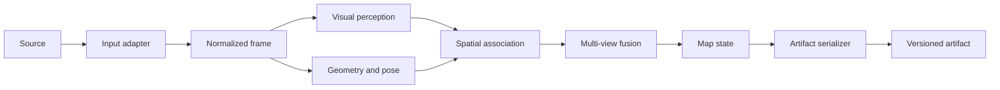
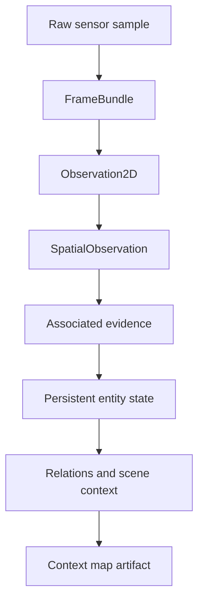

# Solution 1 architecture

Solution 1 is deliberately narrow. Its purpose is to validate one reproducible path from synchronized sensor observations to a portable contextual map artifact.

## Boundaries

This repository owns the generation, validation, and serialization of the contextual map.

The following are intentionally outside the repository boundary:

- web or desktop viewers;
- natural-language query interfaces;
- search applications;
- navigation stacks;
- planners and agents;
- dashboards and operator interfaces.

Those systems should consume the exported artifact through its documented schema rather than importing implementation details from the mapping pipeline.

## Core data flow

The first implementation should converge on explicit contracts between these stages:

The exact classes and schemas are intentionally not frozen yet. They should be defined from the smallest vertical slice that can be evaluated end to end.

## Design rules

1. Input-specific code terminates at the normalized observation boundary.
2. Model-specific code must not define the persisted map schema.
3. Every persisted semantic claim keeps confidence and provenance when available.
4. Multi-view fusion should preserve evidence rather than only the final label.
5. The artifact must be readable without loading perception models.
6. Consumer-specific behavior must not leak into map generation.
7. Experimental paths stay isolated until they demonstrate measurable value.

## Validation target

Evaluation should eventually answer questions at the map level, for example:

- are repeated observations associated with the correct persistent entity;
- does semantic fusion improve or degrade confidence across views;
- are 3D positions geometrically consistent;
- are required relations represented correctly;
- can an independent consumer reconstruct the required contextual information from the artifact alone;
- does serialization preserve all information required for reproducibility.

Component metrics remain useful, but they are supporting metrics rather than the final definition of success.