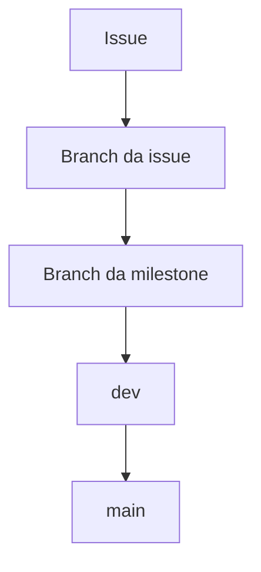

# Desenvolvimento

Este documento define o fluxo de desenvolvimento, as convenções de Git, os padrões de código Python e as regras de documentação do ContextMap2.

## 1. Fluxo Git

O desenvolvimento é organizado por issue e milestone.



### 1.1 Branch da milestone

Cada milestone possui uma branch própria criada a partir de `dev`:

```text
milestone/<milestone-slug>
```

Exemplo:

```text
milestone/ingestion
milestone/visual-perception-core
milestone/semantic-fusion
```

A branch da milestone é a integração temporária das issues pertencentes àquele marco. Ela não deve receber implementação direta.

Quando todas as issues necessárias estiverem concluídas e a integração da milestone estiver validada, a branch abre PR para `dev`.

### 1.2 Branch da issue

Toda mudança nasce de uma issue e recebe uma branch criada a partir da branch da milestone correspondente.

Formato:

```text
<type>/<issue-number>-<slug>
```

Exemplos:

```text
feat/38-canonical-sensor-contract
fix/112-preserve-frame-provenance
research/145-temporal-fusion-ablation
docs/187-development-workflow
```

Tipos aceitos:

- `feat`, nova capacidade ou comportamento;
- `fix`, correção;
- `research`, hipótese ou implementação de pesquisa;
- `experiment`, experimento temporário ou comparativo;
- `refactor`, mudança estrutural sem alteração intencional de comportamento;
- `test`, testes, fixtures ou benchmarks;
- `docs`, documentação;
- `ci`, integração contínua ou automação;
- `chore`, manutenção do repositório.

### 1.3 Destino dos pull requests

O caminho permitido é:

```text
<type>/<issue>-<slug>
    ↓
milestone/<slug>
    ↓
dev
    ↓
main
```

Consequentemente:

- branch de issue não abre PR diretamente para `dev`;
- branch de issue não abre PR para `main`;
- `milestone/*` é a única origem normal de PRs para `dev`;
- `dev` é a única origem normal de PRs para `main`;
- `qa` não participa do fluxo padrão.

A branch policy do repositório deve validar essas regras automaticamente.

## 2. Conventional Commits

Todos os commits seguem Conventional Commits.

```text
<type>(<scope>): <summary>

<body>

<footer>
```

O corpo é obrigatório e deve registrar contexto suficiente para explicar a decisão sem depender apenas do diff.

O corpo deve responder, quando aplicável:

- qual problema está sendo resolvido;
- por que esta abordagem foi escolhida;
- qual contrato ou comportamento mudou;
- qual impacto ou trade-off precisa ser preservado;
- como a mudança foi validada.

Exemplo:

```text
feat(ingestion): add canonical observation contract

Define backend-agnostic sensor observation models so downstream modules
can consume ROS 1, ROS 2, and dataset inputs through the same boundary.

Refs: #38
```

Para mudança incompatível:

```text
feat(artifact)!: change entity provenance schema

Replace the previous provenance fields with explicit source evidence refs
so map entities remain traceable to physical observations and inference runs.

BREAKING CHANGE: artifact readers must consume provenance schema v2.
Refs: #121
```

### 2.1 Tipos

Os tipos devem acompanhar a natureza da mudança:

```text
feat
fix
research
experiment
refactor
test
docs
ci
chore
build
perf
```

### 2.2 Scopes

Scopes representam domínio, capability ou responsabilidade, não o nome de uma biblioteca externa.

Preferir:

```text
ingestion
visual-perception
region-discovery
feature-extraction
semantic-interpretation
state-estimation
sensor-association
semantic-fusion
semantic-mapping
artifact
runtime
docs
```

Evitar scopes como `torch`, `sam3` ou `gemini` quando a mudança pertence a uma capability mais ampla. O backend pode aparecer no resumo quando for relevante.

## 3. Pull requests

Todo PR de issue deve indicar claramente:

- issue relacionada;
- milestone e branch de destino;
- problema, hipótese ou motivação;
- decisão de implementação;
- validação realizada;
- impacto em contratos, artefatos, arquitetura e documentação;
- métricas ou artefatos de avaliação quando houver impacto científico;
- limitações e trabalho posterior, quando aplicável.

O título do PR segue Conventional Commits.

Mudanças de arquitetura, contratos públicos ou pipeline devem incluir a atualização documental no mesmo PR.

## 4. Padrões de código Python

### 4.1 Idioma

O projeto utiliza:

- identificadores e APIs em inglês;
- docstrings em inglês;
- comentários explicativos no código em PT-BR;
- documentação Markdown em PT-BR.

Essa separação mantém a API técnica alinhada ao ecossistema Python e mantém a documentação do projeto acessível ao contexto principal da pesquisa.

### 4.2 Docstrings

Python docstrings são a forma padrão de documentação estruturada de código, equivalente ao papel que JSDoc exerce em projetos JavaScript/TypeScript.

O projeto usa Google style.

Docstrings são obrigatórias para:

- módulos públicos;
- classes públicas;
- funções públicas;
- métodos públicos.

Funções e métodos privados também devem possuir docstring quando houver contrato, invariante, efeito colateral, exceção, algoritmo ou decisão que não seja evidente apenas pelo código.

Exemplo:

```python
def associate_observation(frame: FrameBundle, tolerance_ms: float) -> SpatialObservation:
    """Associate visual evidence with spatial support.

    Args:
        frame: Canonical synchronized sensor observation.
        tolerance_ms: Maximum temporal offset accepted during association.

    Returns:
        Spatial observation preserving source provenance.

    Raises:
        AssociationError: If no spatial support satisfies the configured tolerance.
    """
```

Uma docstring deve explicar o contrato público. Ela não deve narrar a implementação linha por linha.

### 4.3 Comentários

Comentários em PT-BR devem ser usados apenas quando adicionarem contexto que o código não consegue comunicar sozinho.

Casos apropriados:

- justificar uma decisão;
- registrar uma invariante;
- explicar um trade-off;
- registrar limitação de sensor, modelo ou dataset;
- explicar uma transformação matemática não óbvia;
- indicar por que uma alternativa aparentemente mais simples não é válida.

Exemplo:

```python
# Mantemos a identidade física do frame separada da execução de inferência
# para impedir que reprocessamentos aumentem artificialmente a confiança.
result = build_perception_result(source_observation, run)
```

Evitar:

```python
# Incrementa o contador.
count += 1
```

## 5. Clean Code, SOLID, KISS, DRY e YAGNI

Esses princípios são regras de decisão, não objetivos isolados.

### Clean Code

- nomes comunicam intenção;
- funções têm responsabilidade clara;
- efeitos colaterais são explícitos;
- erros possuem semântica útil;
- código científico preserva unidades, frames de coordenadas e provenance de forma explícita.

### SOLID

Aplicar principalmente para preservar:

- responsabilidade única entre capabilities;
- APIs pequenas e focadas;
- substituição de backends através de contratos estáveis;
- dependências apontando para contratos do domínio, não para SDKs concretos.

Não criar interfaces ou camadas apenas para satisfazer uma interpretação formal do princípio.

### KISS

Preferir a menor solução que resolve o requisito atual e pode ser validada.

Uma abstração simples e explícita é preferível a um framework genérico quando existe apenas um caso real de uso.

### DRY

Remover duplicação quando ela representa a mesma regra ou conceito.

Não generalizar código apenas porque dois trechos possuem aparência semelhante. Duas operações semelhantes podem ter semânticas diferentes e devem permanecer separadas quando seus contratos diferirem.

### YAGNI

Não implementar:

- backends ainda sem caso de uso;
- abstrações para extensões hipotéticas;
- campos de contrato sem consumidor ou requisito conhecido;
- diretórios ou camadas vazias apenas para antecipar arquitetura futura.

## 6. Organização da documentação

A documentação é fragmentada por responsabilidade, mas deve formar uma navegação única.

### 6.1 Documentação global

```text
docs/
├── README.md
├── architecture.md
├── development.md
├── repository-settings.md
└── versioning.md
```

Responsabilidades:

- `docs/README.md`, índice e mapa de navegação;
- `docs/architecture.md`, arquitetura e decisões transversais;
- `docs/development.md`, fluxo Git, padrões de código e documentação;
- `docs/repository-settings.md`, configuração e políticas do GitHub;
- `docs/versioning.md`, versionamento e releases.

### 6.2 Documentação de módulo

Cada capability implementada mantém sua documentação junto ao código:

```text
src/contextmap/<module>/
├── ...
└── docs/
    ├── README.md
    ├── architecture.md
    ├── contracts.md
    └── pipeline.md
```

Não é obrigatório criar todos os arquivos. A documentação deve crescer apenas quando existe conteúdo real.

O `README.md` do módulo deve funcionar como ponto de entrada e responder:

- qual responsabilidade o módulo possui;
- o que ele explicitamente não possui;
- quais contratos públicos oferece;
- quais módulos consome;
- quais módulos o consomem;
- como o fluxo interno funciona em alto nível;
- onde estão os documentos detalhados.

### 6.3 Integração entre documentos

`docs/README.md` é o índice global e deve conter links para todos os módulos que possuam documentação.

Um módulo deve referenciar documentos globais quando depende de uma convenção transversal. Não copiar a regra para dentro do módulo.

Exemplo:

```text
docs/architecture.md
    ↓
src/contextmap/visual_perception/docs/README.md
    ├── contracts.md
    └── pipeline.md
```

Quando um módulo depende conceitualmente de outro, sua documentação pode apontar para o documento público do módulo upstream ou downstream.

A integração é feita por links e responsabilidade clara, não por repetição de conteúdo.

### 6.4 Diagramas

Mermaid é preferido para:

- pipelines;
- dependências;
- máquinas de estado;
- fluxos de dados;
- arquitetura de módulos.

Diagramas devem usar nomes compatíveis com os contratos reais do código.

## 7. Quality gates

Antes de um PR ser considerado pronto:

```bash
make check
```

A validação local e CI deve cobrir, no mínimo:

- formatação;
- lint;
- docstrings públicas;
- tipagem estática;
- testes;
- regras de branch e PR.

Mudanças científicas devem adicionar validação específica quando o comportamento não pode ser coberto apenas por testes unitários.

## 8. Pesquisa e experimentos

Mudanças de pesquisa precisam preservar baseline e rastreabilidade.

Uma issue de pesquisa ou experimento deve declarar:

- hipótese;
- baseline;
- variável alterada;
- métrica;
- dataset ou seleção;
- configuração;
- critério de sucesso ou rejeição.

Resultados experimentais não devem substituir o caminho validado sem evidência mensurável.

## 9. Dependências

Dependências específicas de backends devem permanecer isoladas da API pública de seus módulos.

SDKs de modelos, ROS, provedores remotos e frameworks de ML não devem aparecer em contratos consumidos por outros módulos quando um tipo de domínio é suficiente.

Dependências pesadas só devem ser adicionadas quando uma issue validada realmente precisa delas.
