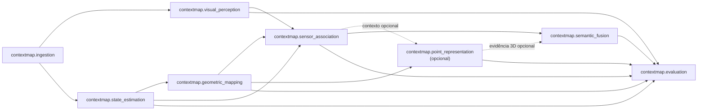

# APIs públicas e encapsulamento de capabilities

Este documento define como uma capability do ContextMap2 expõe sua superfície pública e como outras capabilities podem consumi-la sem depender de detalhes internos.

A regra base é:

> Uma capability consumidora importa conceitos de domínio e ports somente pela API pública do módulo produtor. Backends, infrastructure, helpers privados e tipos nativos de SDK não fazem parte desse contrato.

As regras de ownership e direção de dependências continuam definidas em [architecture.md](architecture.md).

## Superfície pública autoritativa

O `__init__.py` na raiz de cada capability é a superfície pública autoritativa para imports entre capabilities.

Exemplo:

```python
from contextmap.visual_perception import SemanticClaim
```

A raiz deve reexportar **somente** os símbolos que constituem contrato público real e declarar `__all__` explicitamente.

```python
from .models import SemanticClaim
from .ports import SemanticInterpreter

__all__ = ["SemanticClaim", "SemanticInterpreter"]
```

`__all__` não é usado para reexportar tudo que existe no módulo. Ele torna a superfície intencional e revisável.

## Integração pública implementada

As dependências cross-module reais já percorrem as sete capabilities materializadas na `dev`. A regra continua sendo a mesma em todas elas: o consumer importa o producer pela raiz pública `contextmap.<capability>`; backends, adapters e submódulos internos não atravessam o boundary.



Exemplos concretos dessa integração:

- `geometric_mapping` consome `Trajectory` e contratos de pose pela raiz `contextmap.state_estimation`;
- `sensor_association` consome evidência visual, trajetória e geometria pelas raízes públicas dos respectivos owners;
- `point_representation` consome `GeometrySource` e pode registrar contexto explícito de associação sem importar internals;
- `semantic_fusion` consome `SpatialObservation`, evidência visual referenciada e `PointRepresentation` opcional pelas APIs públicas;
- `evaluation` mede as capabilities implementadas sem acessar seus backends ou mutar seus artifacts.

A matriz mecanicamente verificável de dependências permitidas está em `tests/architecture/test_boundaries.py`. Ela é a referência executável para imports cross-capability; [architecture.md](architecture.md) continua sendo a referência conceitual de ownership e direção de dados.

## Estrutura interna

A organização interna cresce apenas quando existe conteúdo real. Uma capability pode evoluir, por exemplo, para:

```text
visual_perception/
├── __init__.py          # superfície pública
├── models.py            # contratos de evidência
├── ports.py             # variation points
├── pipeline.py          # presets e resolução do DAG interno
├── service.py           # execução e assembly
├── identity.py          # identidades determinísticas
├── serialization.py
├── run_artifact.py      # persistência de runs
├── evidence_set.py      # view multi-run
├── embedding_space.py    # identidade e compatibilidade de features
├── feature_store.py      # payloads lazy e índice
├── dense_region_association.py
├── feature_diagnostics.py
├── feature_resolution_enhancement.py
├── backends/             # adapters concretos selecionados pela composition root
└── docs/
```

`visual_perception/backends/` contém adapters concretos de Region Discovery (SAM2, SAM3 e Florence-2) e de Feature Extraction (DINOv2, DINOv3, CLIP e AlphaCLIP). Eles permanecem internos: a existência do diretório não torna qualquer modelo parte da API pública nem seleciona um backend automaticamente no preset canônico. Testes de backend usam runtimes determinísticos injetados; checkpoints reais continuam sujeitos a validação controlada na máquina de inferência.

Não é obrigatório criar `models.py`, `ports.py`, `service.py`, `backends/` ou `_internal/` antecipadamente. KISS e YAGNI continuam válidos.

## O que pode ser público

Podem ser exportados pela raiz quando um consumidor realmente precisa deles:

- modelos/contratos de domínio possuídos pela capability;
- Protocols/ports que representam variation points reais;
- exceções que callers precisam capturar semanticamente;
- configurações públicas que callers precisam fornecer sem conhecer backend concreto;
- serviços de aplicação que constituem uma operação pública da capability.

## O que permanece interno

Não deve ser exportado como API cross-module:

- classes concretas de SAM, DINO, Qwen, Gemini, FAST-LIO, PTv3 ou outros backends;
- `torch.Tensor`, objetos ROS, mensagens de SDK ou estruturas nativas de providers;
- helpers e funções de transformação internas;
- loaders de checkpoint/modelo;
- detalhes de serialização privados ao módulo;
- configurações que só fazem sentido para um backend concreto;
- tipos temporários usados somente durante uma etapa interna.

Exemplo proibido para uma capability consumidora:

```python
from contextmap.visual_perception.backends.sam3 import SamNativeMask
```

## Privacidade em Python

Python não oferece encapsulamento rígido no nível do package. O projeto usa uma combinação simples:

1. a raiz da capability + `__all__` define o contrato público;
2. símbolos não exportados não são contrato cross-module;
3. prefixo `_` é usado quando ajuda a sinalizar intenção privada;
4. `_internal/` só deve existir quando o módulo realmente possui um conjunto relevante de internals; não é um diretório obrigatório.

A possibilidade técnica de importar um arquivo interno não transforma esse import em arquitetura permitida.

## Ports e Protocols

Um port público deve existir somente para um ponto real de substituição.

Quando o port é usado por runtime ou por outro componente autorizado, ele é exportado pela raiz da capability:

```python
from contextmap.visual_perception import RegionDiscovery
```

Implementações concretas continuam internas:

```python
# composição concreta no runtime
from contextmap.visual_perception.backends.sam3 import Sam3RegionDiscovery
```

Essa importação concreta é permitida **somente na composition root/runtime**, porque ali é responsabilidade do sistema selecionar e construir implementations. Capabilities de domínio não recebem essa exceção.

## Exceções e configuração

Uma exceção pertence à API pública quando o caller precisa reagir ao significado dela, e não a um detalhe de backend.

Preferir:

```python
from contextmap.sensor_association import AssociationError
```

Evitar expor:

```python
SamCudaOutOfMemoryError
GeminiSdkTimeout
```

Erros concretos devem ser tratados/traduzidos na infraestrutura quando o contrato público exigir uma semântica própria.

Configuração segue a mesma regra: configuração da capability pode ser pública; configuração específica de um backend permanece junto do backend ou da composition root.

## Implementações opcionais e de pesquisa

Uma implementação existir no repositório não a torna parte da API pública nem da pipeline default.

Backends e stages opcionais podem evoluir internamente enquanto obedecerem aos contratos públicos já definidos. Não existe um registry de maturidade separado para isso; seleção e presença no DAG são decisões da `PipelineConfig`/preset.

Se um experimento precisar introduzir um novo contrato cross-module, esse contrato deve ser tratado como mudança arquitetural explícita em vez de ser exposto por conveniência.

## Compatibilidade durante `v0.x`

A série `v0.x` ainda pode alterar APIs públicas, mas mudanças devem permanecer deliberadas e rastreáveis.

Quando uma API pública muda:

- atualizar todos os consumidores internos no mesmo PR quando possível;
- atualizar documentação e testes de arquitetura;
- registrar mudança de schema quando a semântica persistida for afetada;
- não manter wrappers de compatibilidade sem necessidade real;
- não tratar um refactor interno como breaking change se a raiz pública permanecer equivalente.

A política de releases está em [versioning.md](versioning.md).

## Exemplo completo

Considere a capability implementada `visual_perception`:

```text
visual_perception/
├── __init__.py
├── models.py
├── ports.py
└── backends/
    └── qwen.py
```

API pública:

```python
# visual_perception/__init__.py
from .models import SemanticClaim
from .ports import SemanticInterpreter

__all__ = ["SemanticClaim", "SemanticInterpreter"]
```

Consumer:

```python
from contextmap.visual_perception import SemanticClaim
```

Composition root:

```python
from contextmap.visual_perception.backends.qwen import QwenSemanticInterpreter
```

Consumer incorreto:

```python
from contextmap.visual_perception.models import SemanticClaim
```

Mesmo que esse import funcione tecnicamente, ele acopla o consumidor ao layout interno. O contrato cross-module é a raiz da capability.

## Revisão e enforcement

Em code review, todo novo import `contextmap.<outra_capability>.<submodule>` deve ser tratado como suspeito. As regras mecanicamente verificáveis serão cobertas por architecture tests na issue de enforcement da milestone.

A intenção é preservar refactors internos baratos sem criar facades artificiais ou um package global de contratos.
