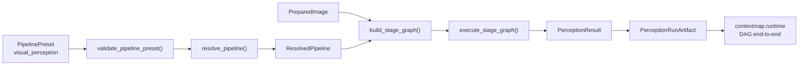
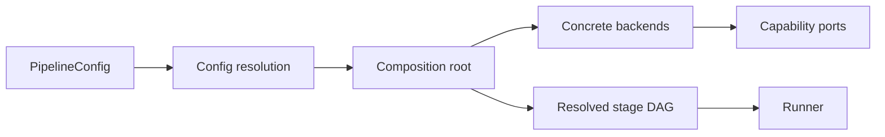

# Runtime, composition root e orquestração

Este documento define o limite arquitetural de `contextmap.runtime`: onde configurações efetivas são resolvidas, implementações concretas são construídas e stages são coordenados sem mover lógica científica para o runtime.

A arquitetura geral está em [architecture.md](architecture.md). A implementação e o contrato de cada parte do runtime estão em [`src/contextmap/runtime/docs/README.md`](../src/contextmap/runtime/docs/README.md); este documento mantém a regra arquitetural e o que o runtime **não** pode possuir.

## Regra principal

> Runtime compõe e executa capabilities; capabilities possuem a lógica científica e os contratos de domínio.

A direção de dependência é sempre:

```text
runtime
  ↓
capability public APIs / ports
```

Nunca:

```text
capability
  ↓
runtime
```

## Responsabilidades do runtime

`runtime` pode possuir:

- carregamento e resolução da configuração efetiva;
- seleção de stages e backends;
- construção das implementações concretas;
- composition root;
- validação das dependências do DAG;
- ordenação/executação dos stages;
- seleção explícita de artifacts/runs upstream;
- lifecycle de execução;
- decisão de reuse/recompute baseada em identidade/configuração;
- captura da configuração efetiva e topology para provenance;
- integração com CLI.

`runtime` não pode possuir:

- lógica de segmentação;
- interpretação semântica;
- projection math;
- state-estimation algorithms;
- geometric-map accumulation;
- semantic-fusion semantics;
- entity-resolution heuristics;
- spatial-relation predicates;
- regras de schema do mapa final.

## Estado atual

`contextmap.runtime` existe e implementa este boundary. Cada parte tem documentação e testes próprios em [`src/contextmap/runtime/docs/`](../src/contextmap/runtime/docs/README.md):

- **configuração efetiva versionada** (schema `0.1.0`): precedência perfil < arquivos < overrides, digest determinístico, parâmetros escopados por backend e segredos lidos só do ambiente, nunca persistidos ([configuration.md](../src/contextmap/runtime/docs/configuration.md));
- **catálogo estático** de stages, pontos de variação e backends, com dois perfis/presets versionados: `canonical/1` (que termina em `semantic_fusion`, a topologia histórica) e `canonical/2` (a mesma topologia de `canonical/1`, inalterada, estendida com `semantic_mapping`, `entity_resolution` e `spatial_relations` — Semantic Mapping participa dela como fonte de `entities`, mas ainda sem componente nem executor automático). Um identificador de preset nunca muda de topologia: por isso a extensão ganhou uma identidade própria em vez de redefinir `canonical/1`. Só o `ContextMapArtifact` ainda não é estágio de nenhum preset, nem indisponível nem disponível — entra como um preset versionado posterior, quando a capability de montagem existir;
- **composition root** (`compose()`): constrói Ingestion, Visual Perception, State Estimation, Geometric Mapping, Sensor Association, Point Representation, Semantic Fusion, Entity Resolution e Spatial Relations atrás dos ports das capabilities, com import lazy dos backends, falha explícita e nenhum fallback; `compose_executors()` monta, a partir da mesma configuração, os `StageExecutor` reais que o DAG executa para `visual_perception`, `state_estimation`, `geometric_mapping`, `sensor_association`, `semantic_fusion`, `entity_resolution` e `spatial_relations` ([composition.md](../src/contextmap/runtime/docs/composition.md)). Um backend sem loader empacotado (SAM2, SAM3, Qwen, Gemini, Florence-2) recebe seu runtime de um `RuntimeProvider` explícito (`providers=...`) ou de um alvo `"module:attribute"` declarado em `resources.providers`, resolvido lazily pelo próprio binário instalado, sem wrapper Python;
- **DAG de estágios**: topologia determinística, escopo (pipeline completo ou subgrafo), preflight sem carregar modelo e execução em ordem de dependência ([pipeline.md](../src/contextmap/runtime/docs/pipeline.md));
- **reuso por identidade de conteúdo**, com decisão registrada por estágio ([reuse.md](../src/contextmap/runtime/docs/reuse.md));
- **seleção explícita de runs** e vínculo de linhagem ([selection.md](../src/contextmap/runtime/docs/selection.md));
- **ciclo de vida do run**: estados, eventos append-only, falha categorizada, cancelamento cooperativo, retomada ([lifecycle.md](../src/contextmap/runtime/docs/lifecycle.md));
- **CLI** fina (`contextmap`) ([cli.md](../src/contextmap/runtime/docs/cli.md));
- **serviço público de ingestion** ([ingestion-service.md](../src/contextmap/runtime/docs/ingestion-service.md));
- **API pública de aplicação** `Runtime`, para qualquer frontend ([api.md](../src/contextmap/runtime/docs/api.md)).

Visual Perception já possui um **DAG interno da própria capability**. Ele materializa apenas a topologia de percepção e não deve ser promovido implicitamente a runtime global. Feature Extraction fornece os contracts e ports usados por esse DAG, o estágio opcional de resolution enhancement e adapters concretos DINOv2, DINOv3, CLIP e AlphaCLIP. Semantic Interpretation também possui o port executável `semantic_interpreter`, request/output auditáveis e adapters Qwen/Gemini/Florence-2 atrás de runtime/client injetáveis. Os runtimes reais (`HuggingFaceQwenRuntime`, `HuggingFaceFlorence2SemanticRuntime` e `GoogleGenAIGeminiClient`) são construídos pela composition root, que fornece o `view_root`, a revisão imutável do checkpoint e, no caso do Gemini, a credencial; nenhuma credencial entra na configuração efetiva. O preset `canonical/1` ainda conserva temporariamente os estágios semânticos legados porque a política de construção dos requests canônicos ainda não foi promovida para a topologia default. A composition root do runtime seleciona e constrói esses adapters e conecta explicitamente os artifacts das demais capabilities.

O que **ainda não existe**, e não deve ser presumido:

- **Executor real de Point Representation.** `contextmap.runtime.executors` tem executores reais de `visual_perception` (#507), `state_estimation`, `geometric_mapping`, `sensor_association`, `semantic_fusion`, `entity_resolution` e `spatial_relations`, e a composition root os monta automaticamente da configuração (`compose_executors`, usado tanto pela CLI quanto por `Runtime`). Point Representation depende de backend com modelo/GPU (`ptv3`) e ainda não tem um; um run que o inclua precisa de um executor injetado (testes) ou fica bloqueado no preflight, explicitamente. A Ingestion tem seu próprio executor real (`IngestionStageExecutor`), mas ele não é composto automaticamente: precisa de um `IngestionRequest` que é entrada de uma execução (os flags de `contextmap ingest`), não parte de uma configuração. Semantic Mapping não tem componente de catálogo nem executor automático: participa da topologia, mas seu artifact precisa ser suprido para Entity Resolution rodar.
- **Estágio de capability inexistente.** Só o `ContextMapArtifact` (o estágio `context_map`, a montagem final) não faz parte de nenhum preset hoje: nem `canonical/1` (que termina em `semantic_fusion`) nem `canonical/2` (a mesma topologia, estendida até `spatial_relations`) o declaram. Um preset versionado posterior o declara quando a capability de montagem existir em `dev`.
- **Catálogo de runs sobre os índices reais das capabilities.** A seleção usa um catálogo explícito (`StaticCatalog` ou um arquivo JSON).
- **A CLI ainda não usa `Runtime`.** As duas chamam os mesmos serviços (inclusive `compose_executors`); não há uma segunda especificação do pipeline.

Visual Perception já possui um **DAG interno da própria capability**. Ele materializa apenas a topologia de percepção e não deve ser promovido implicitamente a runtime global. Feature Extraction fornece os contracts e ports usados por esse DAG, o estágio opcional de resolution enhancement e adapters concretos DINOv2, DINOv3, CLIP e AlphaCLIP. Semantic Interpretation também possui o port executável `semantic_interpreter`, request/output auditáveis e adapters Qwen/Gemini/Florence-2 atrás de runtime/client injetáveis. O preset `canonical/1` de Visual Perception ainda conserva temporariamente os estágios semânticos legados porque a política de construção dos requests canônicos ainda não foi promovida para a topologia default. A composition root do runtime seleciona e constrói esses adapters por configuração explícita e conecta os artifacts das demais capabilities.



Essa separação é importante: `visual_perception.pipeline` possui apenas a topologia interna da capability e seus backends. O runtime seleciona artifacts upstream, compõe capabilities diferentes, decide reuse/recompute e coordena o lifecycle end-to-end sem absorver a lógica interna do preset de percepção.

## Composition root

Existe um único boundary arquitetural responsável por transformar configuração em objetos concretos.

Conceitualmente:



A composition root é o local onde imports concretos de backend são permitidos.

Exemplo conceitual:

```python
from contextmap.visual_perception import RegionDiscovery
from contextmap.visual_perception.backends.sam3 import Sam3RegionDiscovery


def build_region_discovery(config: RegionDiscoveryConfig) -> RegionDiscovery:
    if config.backend == "sam3":
        return Sam3RegionDiscovery(config.sam3)
    raise ConfigurationError(f"Unsupported region discovery backend: {config.backend}")
```

Esse padrão não autoriza outras capabilities a importar `visual_perception.backends`.

## Factories pequenas, não service locator

O canonical pipeline não precisa de container de dependency injection, registry global mutável ou descoberta dinâmica de plugins.

Quando existe um variation point real, a composition root pode usar factories pequenas e explícitas:

```text
build_region_discovery(config)
build_feature_extractor(config)
build_semantic_interpreter(config)
build_state_estimator(config)
```

Essas factories:

- recebem configuração resolvida;
- retornam um port/API pública;
- conhecem somente as implementações concretas de sua responsabilidade;
- falham explicitamente em configurações inválidas;
- não ficam disponíveis como estado global para lookup arbitrário.

Se a quantidade de backends crescer no futuro, a estrutura pode ser refatorada com evidência real. Não criar um plugin registry antecipadamente.

## Configuração por ownership

A configuração deve ser particionada conforme a capability/stage responsável.

Exemplo conceitual:

```yaml
visual_perception:
  region_discovery:
    backend: sam3
    sam3:
      checkpoint: facebook/sam3

  dense_features:
    backend: dinov3
    dinov3:
      checkpoint: ...

semantic_fusion:
  policy: baseline
```

Regras:

- um backend recebe somente sua configuração específica;
- configuração SAM não deve vazar para Sensor Association;
- configuração Gemini não deve aparecer no domínio de Semantic Fusion;
- downstream persiste identidade/configuração efetiva via provenance, mas não depende da classe concreta que a produziu;
- secrets são injetados no boundary adequado e não são persistidos em manifests.

## Stage, backend e PipelineConfig

O runtime mantém apenas os conceitos necessários para a variação real do pipeline:

```text
Stage
    transformação cientificamente significativa com inputs/outputs declarados

Backend
    implementação substituível de um stage/port

PipelineConfig
    composição declarativa dos stages, dependências, backends e parâmetros
```

A configuração default validada é a pipeline canônica. Ela não é um engine diferente.

Dentro de Visual Perception, esse conceito já aparece concretamente como `PipelinePreset`/`StageSpec` e `CANONICAL_PRESET_V1`. Esses tipos são locais ao domínio da perception pipeline; não devem ser promovidos automaticamente a um schema global de runtime.

Uma configuração alternativa pode inserir/remover um stage compatível sem modificar consumers downstream.

Exemplo:

```text
DenseFeatureExtraction
  -> DenseFeatureMap
  -> SensorAssociation
```

ou:

```text
DenseFeatureExtraction
  -> DenseFeatureMap
  -> FeatureResolutionEnhancement
  -> DenseFeatureMap
  -> SensorAssociation
```

`SensorAssociation` continua consumindo `DenseFeatureMap`; ele não conhece LoftUp ou outro enhancer concreto.

## Critério para stage

Não transformar cada função em um nó do DAG.

Um stage independente faz sentido quando a transformação possui uma combinação relevante de:

- input/output contratual claro;
- custo próprio mensurável;
- possibilidade real de ativação/remoção;
- artifact/output reutilizável;
- valor para ablation/experimento;
- lifecycle/falha próprios.

Operações como `tensor.permute()`, conversão local de dtype ou helpers internos permanecem implementação do stage.

## Optional stages

Optional significa explícito na configuração.

Comportamento esperado:

```text
stage não selecionado
    -> não é construído nem carregado

stage selecionado + dependência disponível
    -> participa do DAG

stage selecionado + dependência/checkpoint/config ausente
    -> preflight falha explicitamente
```

Não existe fallback silencioso para outro backend ou remoção automática de um stage selecionado.

Um stage implementado não entra automaticamente na configuração default.

## Preflight antes de execução pesada

A composição deve separar resolução/validação de configuração de model loading pesado sempre que possível.

Antes da execução, validar ao menos:

- DAG acíclico;
- inputs requeridos disponíveis;
- contratos de input/output compatíveis;
- backend selecionado reconhecido;
- configuração obrigatória presente;
- seleção de artifact upstream explícita;
- versões/schema relevantes compatíveis;
- requirements de optional stage satisfeitos.

Depois do preflight, o runtime pode instanciar/carregar recursos pesados necessários.

Isso evita descobrir um erro de topology somente depois de carregar SAM, DINO ou um VLM.

## Lifecycle e erros

Runtime coordena lifecycle, mas erros mantêm semântica do owner quando possível.

Exemplos:

```text
ConfigurationError
    runtime/configuration

ConfigProblem (seleção incompatível, reportada por preflight)
    runtime selection/composition

AssociationInputError
    sensor_association

SemanticInterpretationError
    visual_perception
```

O runner pode capturar erros para registrar falha/cleanup, mas não deve reinterpretar resultado científico para “fazer a pipeline continuar”.

Falha de backend selecionado não autoriza fallback implícito.

## Reuse e recompute

Runtime decide se um artifact existente satisfaz a identidade necessária para uma execução. A semântica de integridade do artifact pertence aos contratos de artifact.

Exemplo:

```text
DenseFeatureMap artifact X
├── SensorAssociation A
└── FeatureResolutionEnhancement Y
    └── SensorAssociation B
```

Os dois braços podem reutilizar X. Alterar o downstream não deve recomputar stages upstream compatíveis.

A implementação está em `runtime/reuse.py` ([reuse.md](../src/contextmap/runtime/docs/reuse.md)): a chave combina a configuração própria do estágio, o hash de conteúdo das entradas e a identidade do código, o índice guarda só artifacts concluídos e re-validados, e cada estágio registra se foi reutilizado (com o artifact exato) ou recomputado (com o motivo). Um artifact sem hash de conteúdo pode ser consumido, mas nunca é reutilizado.

## Provenance de execução

O runtime deve capturar no mínimo o contexto que só existe após composição:

```text
resolved PipelineConfig
resolved DAG/topology
selected backend identities
selected upstream artifact identities
execution order
reuse/recompute decisions
code/config identity
```

Cada capability continua responsável por provenance específica de suas operações e outputs.

Runtime não deve construir um objeto global gigantesco contendo detalhes internos de todos os modelos; ele referencia e agrega identities produzidas pelos módulos.

## CLI

A CLI é uma camada fina sobre runtime.

Conceitualmente:

```text
CLI args / config path
      ↓
configuration loader
      ↓
composition root
      ↓
runner
```

CLI não contém:

- branches por backend;
- lógica científica;
- parsing de datasets específicos;
- matemática de projeção;
- regras de fusion/entity/relation.

Isso permite que testes e outros entrypoints chamem runtime sem simular CLI.

## API pública para frontends

Uma CLI, uma TUI ou outro cliente não importam os módulos internos do runtime. Eles usam uma única superfície, `contextmap.runtime.Runtime`:

```text
CLI / TUI
   -> contextmap.runtime.Runtime            (API pública de aplicação)
      -> config / composição / pipeline / reuso / seleção / lifecycle
```

`Runtime` expõe descoberta de capabilities e backends (sem carregar modelo), resolução de configuração e topologia, preflight, execução com eventos e cancelamento, e inspeção de runs a partir do registro persistido. É uma **fachada**: cada operação delega ao serviço que a possui, os contratos retornados são serializáveis e não contêm classe de backend, objeto ROS nem tipo de biblioteca de UI, e não há registro global nem service locator. A linhagem persistida continua sendo a autoridade: o que o registro não tem, a API não deduz. Detalhes em [api.md](../src/contextmap/runtime/docs/api.md).

## Estrutura implementada

```text
src/contextmap/runtime/
├── __init__.py            # contrato público
├── api.py                 # API pública de aplicação (`Runtime`)
├── artifacts.py           # `ArtifactRef`, handle de um artifact de estágio
├── catalog.py             # stages, pontos de variação, backends e os presets `canonical/1`/`canonical/2`
├── coercion.py            # parâmetros JSON -> configuração da própria capability
├── composition.py         # composition root: construção lazy das implementações
├── config.py              # configuração efetiva, digest, segredos e disponibilidade
├── errors.py              # falhas de composição e do DAG
├── ingestion_service.py   # serviço público de ingestion
├── lifecycle.py           # estados, eventos, falhas, cancelamento e ambiente
├── pipeline.py            # plano, escopo, preflight e execução do DAG
├── reuse.py               # reuso por identidade e índice de artifacts
├── runs.py                # journal persistente, leitura e retomada
├── selection.py           # seleção explícita de runs e linhagem
├── cli.py                 # CLI fina
└── docs/                  # documentação do módulo
```

A estrutura surgiu conforme as issues precisaram dela; nenhum arquivo foi criado vazio para antecipar arquitetura.

## Testabilidade

Capabilities devem poder ser testadas sem runtime real:

```text
fake port / test backend
        ↓
capability service
```

Runtime também deve poder ser testado com stages/fakes leves para validar topology, seleção e lifecycle sem GPU/modelos.

A composition root concreta pode ter smoke/integration tests separados.

## Exemplo de composição

Exemplo conceitual, não uma API obrigatória:

```python
perception = VisualPerceptionService(
    region_discovery=build_region_discovery(config.visual_perception.region_discovery),
    feature_extractor=build_feature_extractor(config.visual_perception.dense_features),
    semantic_interpreter=build_semantic_interpreter(
        config.visual_perception.semantic_interpretation
    ),
)

pipeline = build_pipeline(
    config=config,
    perception=perception,
    state_estimator=build_state_estimator(config.state_estimation),
    association=SensorAssociationService(...),
    fusion=SemanticFusionService(...),
)
```

O importante não é esse construtor específico; são os invariantes:

- construção concreta no runtime;
- serviços científicos recebem contracts/ports;
- downstream não conhece backends concretos;
- configuration decide composição;
- orchestration não duplica lógica de capability.

## Relação com as milestones de implementação

A divisão arquitetural materializada na `dev` é:

- **Ingestion**, produz e reabre `SequenceArtifact`;
- **Visual Perception**, possui Region Discovery, Feature Extraction, Semantic Interpretation e Semantic Scoring, contratos, ports, preset/DAG interno, executor, `PerceptionRunArtifact` e `PerceptionEvidenceSet`; os adapters Qwen/Gemini/Florence-2, seus runtimes/clientes reais (transformers e `google-genai`) e os scorers CLIP/AlphaCLIP existem. DINOv2/DINOv3/CLIP possuem execuções reais de Feature Extraction registradas, e Qwen e Florence-2 semântico possuem execuções reais dos runtimes transformers sobre os 20 frames de corridor-02, sem anotações humanas; AlphaCLIP continua sem execução real, e a execução real do Gemini, a avaliação com anotações humanas e a promoção de `semantic_interpreter` ao preset canônico continuam explicitamente pendentes;
- **State Estimation**, publica `PoseEstimate`/`Trajectory`, lookup temporal, preflight, backends `ExternalPose` e FAST-LIO e `StateEstimationRunArtifact`;
- **Geometric Mapping**, transforma e acumula geometria persistente, publica `GeometrySource` e persiste `GeometricMapArtifact`;
- **Sensor Association**, ancora evidência 2D na geometria 3D, publica `SpatialObservation`/`ObservationQuality` e persiste `SensorAssociationRunArtifact`;
- **Point Representation**, opcional, publica representações 3D locais, possui o descritor determinístico e o runtime real `PointceptPTv3Runtime` atrás do port `PointEncoder`, e persiste `PointRepresentationRunArtifact`; o PTv3 foi medido em geometria real e continua não canônico enquanto a ablação downstream permanece pendente;
- **Semantic Fusion**, acumula evidência multi-view sem criar identidade de objeto e persiste `SemanticFusionRunArtifact`;
- **Semantic Mapping**, materializa a evidência fundida como entidades persistentes, sem resolução entre suportes, persiste `SemanticMappingRunArtifact` e já valida deterministicamente contratos, lineage e round-trip; essa validação ainda é sintética;
- **Entity Resolution**, decide identidade sobre as entidades de origem sem mutá-las e persiste `EntityResolutionRunArtifact` num `output_dir` explícito: quem chama, aqui o runtime, fornece o diretório final e o `run_id` (o escopo de todo id resolvido), pois o escritor não aloca índice de execução nem mantém registry. O runtime já conecta as políticas de recuperação, de resolução e o canal de geometria automaticamente da configuração (`compose_executors`); os canais opcionais de compatibilidade semântica e temporal também, quando selecionados. As fontes opcionais de aparência (`FeatureStoreVectorSource`) e de representação 3D (`RunReaderRepresentationSource`), quando o respectivo canal é selecionado, continuam vindo de um `RuntimeProvider` fornecido por quem chama, nunca decididas pelo runtime;
- **Spatial Relations**, deriva relações sobre as entidades resolvidas e persiste `SpatialRelationsRunArtifact`; o runtime já conecta as convenções de eixo, a política de candidatos, o resumo de geometria e os avaliadores geométrico/de contato opcionais automaticamente da configuração (`compose_executors`);
- **Runtime & Configuration**, compõe esse conjunto: configuração efetiva, composition root, DAG com preflight, reuse/recompute, seleção explícita de runs, lifecycle, CLI e a API pública `Runtime`. `visual_perception` (#507), `state_estimation`, `geometric_mapping`, `sensor_association`, `semantic_fusion`, `entity_resolution` e `spatial_relations` têm executor real, composto automaticamente da configuração (visual_perception e os canais opcionais de Entity Resolution via um `RuntimeProvider`, explícito ou declarado em `resources.providers`); Point Representation ainda não tem (backend com modelo/GPU, `ptv3`), a Ingestion tem um executor real que continua exigindo injeção explícita (precisa do `IngestionRequest` da execução, não da configuração), e Semantic Mapping ainda não tem componente nem executor automático (seu artifact precisa ser suprido). A orquestração end-to-end com dados reais de Point Representation ainda não foi validada.

A montagem final (`context_map`/`ContextMapArtifact`) continua planejada e deve ser adicionada junto de seu owner, sem antecipar diretórios ou schemas vazios.

O runtime reutiliza as APIs públicas e artifacts dessas capabilities e não reimplementa seus pipelines internos.
