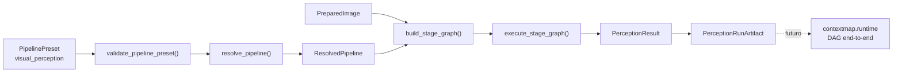
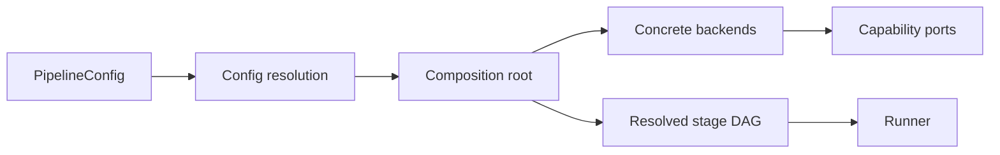

# Runtime, composition root e orquestração

Este documento define o limite arquitetural de `contextmap.runtime`: onde configurações efetivas são resolvidas, implementações concretas são construídas e stages são coordenados sem mover lógica científica para o runtime.

A arquitetura geral está em [architecture.md](architecture.md). O DAG configurável será materializado pelas issues de Runtime & Configuration, especialmente a orquestração end-to-end planejada para a milestone #17.

## Regra principal

> Runtime compõe e executa capabilities; capabilities possuem a lógica científica e os contratos de domínio.

A direção de dependência é sempre:

```text
runtime
  ↓
capability public APIs / ports
```

Nunca:

```text
capability
  ↓
runtime
```

## Responsabilidades do runtime

`runtime` pode possuir:

- carregamento e resolução da configuração efetiva;
- seleção de stages e backends;
- construção das implementações concretas;
- composition root;
- validação das dependências do DAG;
- ordenação/executação dos stages;
- seleção explícita de artifacts/runs upstream;
- lifecycle de execução;
- decisão de reuse/recompute baseada em identidade/configuração;
- captura da configuração efetiva e topology para provenance;
- integração com CLI.

`runtime` não pode possuir:

- lógica de segmentação;
- interpretação semântica;
- projection math;
- state-estimation algorithms;
- geometric-map accumulation;
- semantic-fusion semantics;
- entity-resolution heuristics;
- spatial-relation predicates;
- regras de schema do mapa final.

## Estado atual

`contextmap.runtime` ainda não existe na `dev`; este documento define seu boundary futuro. Isso não significa que o pipeline esteja limitado a Visual Perception: Ingestion, Visual Perception, State Estimation, Geometric Mapping, Sensor Association, Point Representation, Semantic Fusion e Semantic Mapping já possuem APIs públicas, serviços/policies próprios quando necessários e artifacts persistidos. O que permanece ausente é a **composition root global** que selecione e conecte essas capabilities em um DAG end-to-end, resolva configuração, reuse/recompute e lifecycle.

Visual Perception já possui um **DAG interno da própria capability**. Ele materializa apenas a topologia de percepção e não deve ser promovido implicitamente a runtime global. Feature Extraction fornece os contracts e ports usados por esse DAG, o estágio opcional de resolution enhancement e adapters concretos DINOv2, DINOv3, CLIP e AlphaCLIP. Semantic Interpretation também possui o port executável `semantic_interpreter`, request/output auditáveis e adapters Qwen/Gemini/Florence-2 atrás de runtime/client injetáveis. O preset `canonical/1` ainda conserva temporariamente os estágios semânticos legados porque a política de construção dos requests canônicos ainda não foi promovida para a topologia default. A futura composition root continua responsável por selecionar e construir esses adapters e por conectar os artifacts das demais capabilities explicitamente.



Essa separação é importante: `visual_perception.pipeline` possui apenas a topologia interna da capability e seus backends. O runtime futuro deverá selecionar artifacts upstream, compor capabilities diferentes, decidir reuse/recompute e coordenar lifecycle end-to-end sem absorver a lógica interna do preset de percepção.

## Composition root

Existe um único boundary arquitetural responsável por transformar configuração em objetos concretos.

Conceitualmente:



A composition root é o local onde imports concretos de backend são permitidos.

Exemplo conceitual:

```python
from contextmap.visual_perception import RegionDiscovery
from contextmap.visual_perception.backends.sam3 import Sam3RegionDiscovery


def build_region_discovery(config: RegionDiscoveryConfig) -> RegionDiscovery:
    if config.backend == "sam3":
        return Sam3RegionDiscovery(config.sam3)
    raise ConfigurationError(f"Unsupported region discovery backend: {config.backend}")
```

Esse padrão não autoriza outras capabilities a importar `visual_perception.backends`.

## Factories pequenas, não service locator

O canonical pipeline não precisa de container de dependency injection, registry global mutável ou descoberta dinâmica de plugins.

Quando existe um variation point real, a composition root pode usar factories pequenas e explícitas:

```text
build_region_discovery(config)
build_feature_extractor(config)
build_semantic_interpreter(config)
build_state_estimator(config)
```

Essas factories:

- recebem configuração resolvida;
- retornam um port/API pública;
- conhecem somente as implementações concretas de sua responsabilidade;
- falham explicitamente em configurações inválidas;
- não ficam disponíveis como estado global para lookup arbitrário.

Se a quantidade de backends crescer no futuro, a estrutura pode ser refatorada com evidência real. Não criar um plugin registry antecipadamente.

## Configuração por ownership

A configuração deve ser particionada conforme a capability/stage responsável.

Exemplo conceitual:

```yaml
visual_perception:
  region_discovery:
    backend: sam3
    sam3:
      checkpoint: facebook/sam3

  dense_features:
    backend: dinov3
    dinov3:
      checkpoint: ...

semantic_fusion:
  policy: baseline
```

Regras:

- um backend recebe somente sua configuração específica;
- configuração SAM não deve vazar para Sensor Association;
- configuração Gemini não deve aparecer no domínio de Semantic Fusion;
- downstream persiste identidade/configuração efetiva via provenance, mas não depende da classe concreta que a produziu;
- secrets são injetados no boundary adequado e não são persistidos em manifests.

## Stage, backend e PipelineConfig

O runtime mantém apenas os conceitos necessários para a variação real do pipeline:

```text
Stage
    transformação cientificamente significativa com inputs/outputs declarados

Backend
    implementação substituível de um stage/port

PipelineConfig
    composição declarativa dos stages, dependências, backends e parâmetros
```

A configuração default validada é a pipeline canônica. Ela não é um engine diferente.

Dentro de Visual Perception, esse conceito já aparece concretamente como `PipelinePreset`/`StageSpec` e `CANONICAL_PRESET_V1`. Esses tipos são locais ao domínio da perception pipeline; não devem ser promovidos automaticamente a um schema global de runtime.

Uma configuração alternativa pode inserir/remover um stage compatível sem modificar consumers downstream.

Exemplo:

```text
DenseFeatureExtraction
  -> DenseFeatureMap
  -> SensorAssociation
```

ou:

```text
DenseFeatureExtraction
  -> DenseFeatureMap
  -> FeatureResolutionEnhancement
  -> DenseFeatureMap
  -> SensorAssociation
```

`SensorAssociation` continua consumindo `DenseFeatureMap`; ele não conhece LoftUp ou outro enhancer concreto.

## Critério para stage

Não transformar cada função em um nó do DAG.

Um stage independente faz sentido quando a transformação possui uma combinação relevante de:

- input/output contratual claro;
- custo próprio mensurável;
- possibilidade real de ativação/remoção;
- artifact/output reutilizável;
- valor para ablation/experimento;
- lifecycle/falha próprios.

Operações como `tensor.permute()`, conversão local de dtype ou helpers internos permanecem implementação do stage.

## Optional stages

Optional significa explícito na configuração.

Comportamento esperado:

```text
stage não selecionado
    -> não é construído nem carregado

stage selecionado + dependência disponível
    -> participa do DAG

stage selecionado + dependência/checkpoint/config ausente
    -> preflight falha explicitamente
```

Não existe fallback silencioso para outro backend ou remoção automática de um stage selecionado.

Um stage implementado não entra automaticamente na configuração default.

## Preflight antes de execução pesada

A composição deve separar resolução/validação de configuração de model loading pesado sempre que possível.

Antes da execução, validar ao menos:

- DAG acíclico;
- inputs requeridos disponíveis;
- contratos de input/output compatíveis;
- backend selecionado reconhecido;
- configuração obrigatória presente;
- seleção de artifact upstream explícita;
- versões/schema relevantes compatíveis;
- requirements de optional stage satisfeitos.

Depois do preflight, o runtime pode instanciar/carregar recursos pesados necessários.

Isso evita descobrir um erro de topology somente depois de carregar SAM, DINO ou um VLM.

## Lifecycle e erros

Runtime coordena lifecycle, mas erros mantêm semântica do owner quando possível.

Exemplos:

```text
ConfigurationError
    runtime/configuration

ArtifactSelectionError
    runtime selection/composition

AssociationInputError
    sensor_association

SemanticInterpretationError
    visual_perception
```

O runner pode capturar erros para registrar falha/cleanup, mas não deve reinterpretar resultado científico para “fazer a pipeline continuar”.

Falha de backend selecionado não autoriza fallback implícito.

## Reuse e recompute

Runtime decide se um artifact existente satisfaz a identidade necessária para uma execução. A semântica de integridade do artifact pertence aos contratos de artifact.

Exemplo:

```text
DenseFeatureMap artifact X
├── SensorAssociation A
└── FeatureResolutionEnhancement Y
    └── SensorAssociation B
```

Os dois braços podem reutilizar X. Alterar o downstream não deve recomputar stages upstream compatíveis.

A implementação concreta de reuse/cache pertence à milestone #17, mas o boundary arquitetural é runtime.

## Provenance de execução

O runtime deve capturar no mínimo o contexto que só existe após composição:

```text
resolved PipelineConfig
resolved DAG/topology
selected backend identities
selected upstream artifact identities
execution order
reuse/recompute decisions
code/config identity
```

Cada capability continua responsável por provenance específica de suas operações e outputs.

Runtime não deve construir um objeto global gigantesco contendo detalhes internos de todos os modelos; ele referencia e agrega identities produzidas pelos módulos.

## CLI

A CLI é uma camada fina sobre runtime.

Conceitualmente:

```text
CLI args / config path
      ↓
configuration loader
      ↓
composition root
      ↓
runner
```

CLI não contém:

- branches por backend;
- lógica científica;
- parsing de datasets específicos;
- matemática de projeção;
- regras de fusion/entity/relation.

Isso permite que testes e futuros entrypoints chamem runtime sem simular CLI.

## Estrutura mínima planejada

A estrutura só deve surgir conforme issues de implementação precisarem dela. Um alvo mínimo é:

```text
src/contextmap/runtime/
├── __init__.py
├── config.py          # configuração efetiva e validação transversal
├── composition.py     # construction/factories concretas
├── pipeline.py        # DAG/runner quando implementado
└── cli.py             # entry point fino quando necessário
```

Não criar esses arquivos vazios antecipadamente. A milestone #17 deve materializar somente as partes necessárias para o caminho implementado naquele momento.

## Testabilidade

Capabilities devem poder ser testadas sem runtime real:

```text
fake port / test backend
        ↓
capability service
```

Runtime também deve poder ser testado com stages/fakes leves para validar topology, seleção e lifecycle sem GPU/modelos.

A composition root concreta pode ter smoke/integration tests separados.

## Exemplo de composição

Exemplo conceitual, não uma API obrigatória:

```python
perception = VisualPerceptionService(
    region_discovery=build_region_discovery(config.visual_perception.region_discovery),
    feature_extractor=build_feature_extractor(config.visual_perception.dense_features),
    semantic_interpreter=build_semantic_interpreter(
        config.visual_perception.semantic_interpretation
    ),
)

pipeline = build_pipeline(
    config=config,
    perception=perception,
    state_estimator=build_state_estimator(config.state_estimation),
    association=SensorAssociationService(...),
    fusion=SemanticFusionService(...),
)
```

O importante não é esse construtor específico; são os invariantes:

- construção concreta no runtime;
- serviços científicos recebem contracts/ports;
- downstream não conhece backends concretos;
- configuration decide composição;
- orchestration não duplica lógica de capability.

## Relação com as milestones de implementação

A divisão arquitetural materializada na `dev` é:

- **Ingestion**, produz e reabre `SequenceArtifact`;
- **Visual Perception**, possui Region Discovery, Feature Extraction, Semantic Interpretation e Semantic Scoring, contratos, ports, preset/DAG interno, executor, `PerceptionRunArtifact` e `PerceptionEvidenceSet`; os adapters Qwen/Gemini/Florence-2 e os scorers CLIP/AlphaCLIP existem, enquanto execuções controladas com checkpoints/serviços reais e a promoção de `semantic_interpreter` ao preset canônico continuam explicitamente pendentes;
- **State Estimation**, publica `PoseEstimate`/`Trajectory`, lookup temporal, preflight, backends `ExternalPose` e FAST-LIO e `StateEstimationRunArtifact`;
- **Geometric Mapping**, transforma e acumula geometria persistente, publica `GeometrySource` e persiste `GeometricMapArtifact`;
- **Sensor Association**, ancora evidência 2D na geometria 3D, publica `SpatialObservation`/`ObservationQuality` e persiste `SensorAssociationRunArtifact`;
- **Point Representation**, opcional, publica representações 3D locais e persiste `PointRepresentationRunArtifact`;
- **Semantic Fusion**, acumula evidência multi-view sem criar identidade de objeto e persiste `SemanticFusionRunArtifact`;
- **Semantic Mapping**, materializa a evidência fundida como entidades persistentes, sem resolução entre suportes, e persiste `SemanticMappingRunArtifact`;
- **Runtime & Configuration**, ainda planejado, deverá compor esse conjunto em um DAG end-to-end, resolver configuração, reuse/recompute, CLI e lifecycle entre capabilities.

Entity Resolution e os stages posteriores continuam planejados e devem ser adicionados junto de seus owners, sem antecipar diretórios ou schemas vazios.

O runtime global deve reutilizar as APIs públicas e artifacts dessas capabilities, não reimplementar seus pipelines internos.
