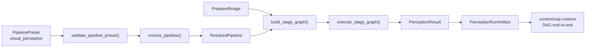
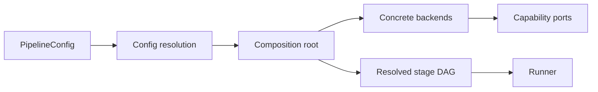

# Runtime, composition root e orquestração

Este documento define o limite arquitetural de `contextmap.runtime`: onde configurações efetivas são resolvidas, implementações concretas são construídas e stages são coordenados sem mover lógica científica para o runtime.

A arquitetura geral está em [architecture.md](architecture.md). A implementação e o contrato de cada parte do runtime estão em [`src/contextmap/runtime/docs/README.md`](../src/contextmap/runtime/docs/README.md); este documento mantém a regra arquitetural e o que o runtime **não** pode possuir.

## Regra principal

> Runtime compõe e executa capabilities; capabilities possuem a lógica científica e os contratos de domínio.

A direção de dependência é sempre:

```text
runtime
  ↓
capability public APIs / ports
```

Nunca:

```text
capability
  ↓
runtime
```

## Responsabilidades do runtime

`runtime` pode possuir:

- carregamento e resolução da configuração efetiva;
- seleção de stages e backends;
- construção das implementações concretas;
- composition root;
- validação das dependências do DAG;
- ordenação/executação dos stages;
- seleção explícita de artifacts/runs upstream;
- lifecycle de execução;
- decisão de reuse/recompute baseada em identidade/configuração;
- captura da configuração efetiva e topology para provenance;
- integração com CLI.

`runtime` não pode possuir:

- lógica de segmentação;
- interpretação semântica;
- projection math;
- state-estimation algorithms;
- geometric-map accumulation;
- semantic-fusion semantics;
- entity-resolution heuristics;
- spatial-relation predicates;
- regras de schema do mapa final.

## Estado atual

`contextmap.runtime` existe e implementa este boundary. Cada parte tem documentação e testes próprios em [`src/contextmap/runtime/docs/`](../src/contextmap/runtime/docs/README.md):

- **configuração efetiva versionada** (schema `0.1.0`): precedência perfil < arquivos < overrides, digest determinístico, parâmetros escopados por backend e segredos lidos só do ambiente, nunca persistidos ([configuration.md](../src/contextmap/runtime/docs/configuration.md));
- **catálogo estático** de stages, pontos de variação e backends, com um perfil/preset versionado: `canonical/1`, do recorded source ao `ContextMapArtifact`. Antes do v0.1.0 sair não existe consumidor publicado a proteger de uma mudança de topologia, então esta identidade continua livre para evoluir junto com o pipeline; a disciplina de nunca mudar a topologia de um preset já publicado (e abrir uma identidade versionada nova em vez disso) começa a valer a partir do release;
- **composition root** (`compose()`): constrói Ingestion, Visual Perception, State Estimation, Geometric Mapping, Sensor Association, Point Representation, Semantic Fusion, Semantic Mapping, Entity Resolution, Spatial Relations e o assembly do `ContextMapArtifact` atrás dos ports das capabilities, com import lazy dos backends, falha explícita e nenhum fallback; `compose_executors()` monta, a partir da mesma configuração, os `StageExecutor` reais que o DAG executa para `visual_perception`, `state_estimation`, `geometric_mapping`, `sensor_association`, `semantic_fusion`, `semantic_mapping` (com `semantic_map_id`/`code_digest` explícitos), `entity_resolution`, `spatial_relations` e `context_map` ([composition.md](../src/contextmap/runtime/docs/composition.md)). Um backend sem loader empacotado (SAM2, SAM3, Qwen, Gemini, Florence-2) recebe seu runtime de um `RuntimeProvider` explícito (`providers=...`) ou de um alvo `"module:attribute"` declarado em `resources.providers`, resolvido lazily pelo próprio binário instalado, sem wrapper Python;
- **DAG de estágios**: topologia determinística, escopo (pipeline completo ou subgrafo), preflight sem carregar modelo e execução em ordem de dependência ([pipeline.md](../src/contextmap/runtime/docs/pipeline.md));
- **reuso por identidade de conteúdo**, com decisão registrada por estágio ([reuse.md](../src/contextmap/runtime/docs/reuse.md));
- **seleção explícita de runs** e vínculo de linhagem ([selection.md](../src/contextmap/runtime/docs/selection.md));
- **ciclo de vida do run**: estados, eventos append-only, falha categorizada, cancelamento cooperativo, retomada ([lifecycle.md](../src/contextmap/runtime/docs/lifecycle.md));
- **CLI** fina (`contextmap`) ([cli.md](../src/contextmap/runtime/docs/cli.md));
- **serviço público de ingestion** ([ingestion-service.md](../src/contextmap/runtime/docs/ingestion-service.md));
- **API pública de aplicação** `Runtime`, para qualquer frontend ([api.md](../src/contextmap/runtime/docs/api.md)).

Visual Perception já possui um **DAG interno da própria capability**. Ele materializa apenas a topologia de percepção e não deve ser promovido implicitamente a runtime global. Feature Extraction fornece os contracts e ports usados por esse DAG, o estágio opcional de resolution enhancement e adapters concretos DINOv2, DINOv3, CLIP e AlphaCLIP. Semantic Interpretation também possui o port executável `semantic_interpreter`, request/output auditáveis e adapters Qwen/Gemini/Florence-2 atrás de runtime/client injetáveis. Os runtimes reais (`HuggingFaceQwenRuntime`, `HuggingFaceFlorence2SemanticRuntime` e `GoogleGenAIGeminiClient`) são construídos pela composition root, que fornece o `view_root`, a revisão imutável do checkpoint e, no caso do Gemini, a credencial; nenhuma credencial entra na configuração efetiva. O preset `canonical/1` ainda conserva temporariamente os estágios semânticos legados porque a política de construção dos requests canônicos ainda não foi promovida para a topologia default. A composition root do runtime seleciona e constrói esses adapters e conecta explicitamente os artifacts das demais capabilities.

O que **ainda não existe**, e não deve ser presumido:

- **Executor real de Point Representation.** `contextmap.runtime.executors` tem executores reais de `visual_perception` (#507), `state_estimation`, `geometric_mapping`, `sensor_association`, `semantic_fusion`, `semantic_mapping`, `entity_resolution`, `spatial_relations` e `context_map`, e a composition root os monta automaticamente da configuração (`compose_executors`, usado tanto pela CLI quanto por `Runtime`). Point Representation depende de backend com modelo/GPU (`ptv3`) e ainda não tem um; um run que o inclua precisa de um executor injetado (testes) ou fica bloqueado no preflight, explicitamente. A Ingestion tem seu próprio executor real (`IngestionStageExecutor`), mas ele não é composto automaticamente: precisa de um `IngestionRequest` que é entrada de uma execução (os flags de `contextmap ingest`), não parte de uma configuração. Semantic Mapping só compõe quando o chamador também fornece `semantic_map_id`/`code_digest`, exatamente como o `providers` de um backend sem loader.
- **Catálogo de runs sobre os índices reais das capabilities.** A seleção usa um catálogo explícito (`StaticCatalog` ou um arquivo JSON).
- **A CLI ainda não usa `Runtime`.** As duas chamam os mesmos serviços (inclusive `compose_executors`); não há uma segunda especificação do pipeline.

Visual Perception já possui um **DAG interno da própria capability**. Ele materializa apenas a topologia de percepção e não deve ser promovido implicitamente a runtime global. Feature Extraction fornece os contracts e ports usados por esse DAG, o estágio opcional de resolution enhancement e adapters concretos DINOv2, DINOv3, CLIP e AlphaCLIP. Semantic Interpretation também possui o port executável `semantic_interpreter`, request/output auditáveis e adapters Qwen/Gemini/Florence-2 atrás de runtime/client injetáveis. O preset `canonical/1` de Visual Perception ainda conserva temporariamente os estágios semânticos legados porque a política de construção dos requests canônicos ainda não foi promovida para a topologia default. A composition root do runtime seleciona e constrói esses adapters por configuração explícita e conecta os artifacts das demais capabilities.



Essa separação é importante: `visual_perception.pipeline` possui apenas a topologia interna da capability e seus backends. O runtime seleciona artifacts upstream, compõe capabilities diferentes, decide reuse/recompute e coordena o lifecycle end-to-end sem absorver a lógica interna do preset de percepção.

## Composition root

Existe um único boundary arquitetural responsável por transformar configuração em objetos concretos.

Conceitualmente:



A composition root é o local onde imports concretos de backend são permitidos.

Exemplo conceitual:

```python
from contextmap.visual_perception import RegionDiscovery
from contextmap.visual_perception.backends.sam3 import Sam3RegionDiscovery


def build_region_discovery(config: RegionDiscoveryConfig) -> RegionDiscovery:
    if config.backend == "sam3":
        return Sam3RegionDiscovery(config.sam3)
    raise ConfigurationError(f"Unsupported region discovery backend: {config.backend}")
```

Esse padrão não autoriza outras capabilities a importar `visual_perception.backends`.

## Factories pequenas, não service locator

O canonical pipeline não precisa de container de dependency injection, registry global mutável ou descoberta dinâmica de plugins.

Quando existe um variation point real, a composition root pode usar factories pequenas e explícitas:

```text
build_region_discovery(config)
build_feature_extractor(config)
build_semantic_interpreter(config)
build_state_estimator(config)
```

Essas factories:

- recebem configuração resolvida;
- retornam um port/API pública;
- conhecem somente as implementações concretas de sua responsabilidade;
- falham explicitamente em configurações inválidas;
- não ficam disponíveis como estado global para lookup arbitrário.

Se a quantidade de backends crescer no futuro, a estrutura pode ser refatorada com evidência real. Não criar um plugin registry antecipadamente.

## Configuração por ownership

A configuração deve ser particionada conforme a capability/stage responsável.

Exemplo conceitual:

```yaml
visual_perception:
  region_discovery:
    backend: sam3
    sam3:
      checkpoint: facebook/sam3

  dense_features:
    backend: dinov3
    dinov3:
      checkpoint: ...

semantic_fusion:
  policy: baseline
```

Regras:

- um backend recebe somente sua configuração específica;
- configuração SAM não deve vazar para Sensor Association;
- configuração Gemini não deve aparecer no domínio de Semantic Fusion;
- downstream persiste identidade/configuração efetiva via provenance, mas não depende da classe concreta que a produziu;
- secrets são injetados no boundary adequado e não são persistidos em manifests.

## Stage, backend e PipelineConfig

O runtime mantém apenas os conceitos necessários para a variação real do pipeline:

```text
Stage
    transformação cientificamente significativa com inputs/outputs declarados

Backend
    implementação substituível de um stage/port

PipelineConfig
    composição declarativa dos stages, dependências, backends e parâmetros
```

A configuração default validada é a pipeline canônica. Ela não é um engine diferente.

Dentro de Visual Perception, esse conceito já aparece concretamente como `PipelinePreset`/`StageSpec` e `CANONICAL_PRESET_V1`. Esses tipos são locais ao domínio da perception pipeline; não devem ser promovidos automaticamente a um schema global de runtime.

Uma configuração alternativa pode inserir/remover um stage compatível sem modificar consumers downstream.

Exemplo:

```text
DenseFeatureExtraction
  -> DenseFeatureMap
  -> SensorAssociation
```

ou:

```text
DenseFeatureExtraction
  -> DenseFeatureMap
  -> FeatureResolutionEnhancement
  -> DenseFeatureMap
  -> SensorAssociation
```

`SensorAssociation` continua consumindo `DenseFeatureMap`; ele não conhece LoftUp ou outro enhancer concreto.

## Critério para stage

Não transformar cada função em um nó do DAG.

Um stage independente faz sentido quando a transformação possui uma combinação relevante de:

- input/output contratual claro;
- custo próprio mensurável;
- possibilidade real de ativação/remoção;
- artifact/output reutilizável;
- valor para ablation/experimento;
- lifecycle/falha próprios.

Operações como `tensor.permute()`, conversão local de dtype ou helpers internos permanecem implementação do stage.

## Optional stages

Optional significa explícito na configuração.

Comportamento esperado:

```text
stage não selecionado
    -> não é construído nem carregado

stage selecionado + dependência disponível
    -> participa do DAG

stage selecionado + dependência/checkpoint/config ausente
    -> preflight falha explicitamente
```

Não existe fallback silencioso para outro backend ou remoção automática de um stage selecionado.

Um stage implementado não entra automaticamente na configuração default.

## Preflight antes de execução pesada

A composição deve separar resolução/validação de configuração de model loading pesado sempre que possível.

Antes da execução, validar ao menos:

- DAG acíclico;
- inputs requeridos disponíveis;
- contratos de input/output compatíveis;
- backend selecionado reconhecido;
- configuração obrigatória presente;
- seleção de artifact upstream explícita;
- versões/schema relevantes compatíveis;
- requirements de optional stage satisfeitos.

Depois do preflight, o runtime pode instanciar/carregar recursos pesados necessários.

Isso evita descobrir um erro de topology somente depois de carregar SAM, DINO ou um VLM.

## Lifecycle e erros

Runtime coordena lifecycle, mas erros mantêm semântica do owner quando possível.

Exemplos:

```text
ConfigurationError
    runtime/configuration

ConfigProblem (seleção incompatível, reportada por preflight)
    runtime selection/composition

AssociationInputError
    sensor_association

SemanticInterpretationError
    visual_perception
```

O runner pode capturar erros para registrar falha/cleanup, mas não deve reinterpretar resultado científico para “fazer a pipeline continuar”.

Falha de backend selecionado não autoriza fallback implícito.

## Reuse e recompute

Runtime decide se um artifact existente satisfaz a identidade necessária para uma execução. A semântica de integridade do artifact pertence aos contratos de artifact.

Exemplo:

```text
DenseFeatureMap artifact X
├── SensorAssociation A
└── FeatureResolutionEnhancement Y
    └── SensorAssociation B
```

Os dois braços podem reutilizar X. Alterar o downstream não deve recomputar stages upstream compatíveis.

A implementação está em `runtime/reuse.py` ([reuse.md](../src/contextmap/runtime/docs/reuse.md)): a chave combina a configuração própria do estágio, o hash de conteúdo das entradas e a identidade do código, o índice guarda só artifacts concluídos e re-validados, e cada estágio registra se foi reutilizado (com o artifact exato) ou recomputado (com o motivo). Um artifact sem hash de conteúdo pode ser consumido, mas nunca é reutilizado.

## Provenance de execução

O runtime deve capturar no mínimo o contexto que só existe após composição:

```text
resolved PipelineConfig
resolved DAG/topology
selected backend identities
selected upstream artifact identities
execution order
reuse/recompute decisions
code/config identity
```

Cada capability continua responsável por provenance específica de suas operações e outputs.

Runtime não deve construir um objeto global gigantesco contendo detalhes internos de todos os modelos; ele referencia e agrega identities produzidas pelos módulos.

## CLI

A CLI é uma camada fina sobre runtime.

Conceitualmente:

```text
CLI args / config path
      ↓
configuration loader
      ↓
composition root
      ↓
runner
```

CLI não contém:

- branches por backend;
- lógica científica;
- parsing de datasets específicos;
- matemática de projeção;
- regras de fusion/entity/relation.

Isso permite que testes e outros entrypoints chamem runtime sem simular CLI.

## API pública para frontends

Uma CLI, uma TUI ou outro cliente não importam os módulos internos do runtime. Eles usam uma única superfície, `contextmap.runtime.Runtime`:

```text
CLI / TUI
   -> contextmap.runtime.Runtime            (API pública de aplicação)
      -> config / composição / pipeline / reuso / seleção / lifecycle
```

`Runtime` expõe descoberta de capabilities e backends (sem carregar modelo), resolução de configuração e topologia, preflight, execução com eventos e cancelamento, e inspeção de runs a partir do registro persistido. É uma **fachada**: cada operação delega ao serviço que a possui, os contratos retornados são serializáveis e não contêm classe de backend, objeto ROS nem tipo de biblioteca de UI, e não há registro global nem service locator. A linhagem persistida continua sendo a autoridade: o que o registro não tem, a API não deduz. Detalhes em [api.md](../src/contextmap/runtime/docs/api.md).

## Estrutura implementada

```text
src/contextmap/runtime/
├── __init__.py            # contrato público
├── api.py                 # API pública de aplicação (`Runtime`)
├── artifacts.py           # `ArtifactRef` e `inventory_digest`, o hash de conteúdo de um artifact
├── catalog.py             # stages, pontos de variação, backends e o preset `canonical/1`
├── coercion.py            # parâmetros JSON -> configuração da própria capability
├── composition.py         # composition root: construção lazy das implementações
├── config.py              # configuração efetiva, digest, segredos e disponibilidade
├── errors.py              # falhas de composição e do DAG
├── foundation.py          # fundação espacial: sequência, trajetória e mapa validados juntos
├── ingestion_service.py   # serviço público de ingestion
├── lifecycle.py           # estados, eventos, falhas, cancelamento e ambiente
├── pipeline.py            # plano, escopo, preflight e execução do DAG
├── reuse.py               # reuso por identidade e índice de artifacts
├── runs.py                # journal persistente, leitura e retomada
├── selection.py           # seleção explícita de runs e linhagem
├── cli.py                 # CLI fina
└── docs/                  # documentação do módulo
```

A estrutura surgiu conforme as issues precisaram dela; nenhum arquivo foi criado vazio para antecipar arquitetura.

## Testabilidade

Capabilities devem poder ser testadas sem runtime real:

```text
fake port / test backend
        ↓
capability service
```

Runtime também deve poder ser testado com stages/fakes leves para validar topology, seleção e lifecycle sem GPU/modelos.

A composition root concreta pode ter smoke/integration tests separados.

## Exemplo de composição

Exemplo conceitual, não uma API obrigatória:

```python
perception = VisualPerceptionService(
    region_discovery=build_region_discovery(config.visual_perception.region_discovery),
    feature_extractor=build_feature_extractor(config.visual_perception.dense_features),
    semantic_interpreter=build_semantic_interpreter(
        config.visual_perception.semantic_interpretation
    ),
)

pipeline = build_pipeline(
    config=config,
    perception=perception,
    state_estimator=build_state_estimator(config.state_estimation),
    association=SensorAssociationService(...),
    fusion=SemanticFusionService(...),
)
```

O importante não é esse construtor específico; são os invariantes:

- construção concreta no runtime;
- serviços científicos recebem contracts/ports;
- downstream não conhece backends concretos;
- configuration decide composição;
- orchestration não duplica lógica de capability.

## Relação com as milestones de implementação

A divisão arquitetural materializada na `dev` é:

- **Ingestion**, produz e reabre `SequenceArtifact`;
- **Visual Perception**, possui Region Discovery, Feature Extraction, Semantic Interpretation e Semantic Scoring, contratos, ports, preset/DAG interno, executor, `PerceptionRunArtifact` e `PerceptionEvidenceSet`; os adapters Qwen/Gemini/Florence-2, seus runtimes/clientes reais (transformers e `google-genai`) e os scorers CLIP/AlphaCLIP existem. DINOv2/DINOv3/CLIP possuem execuções reais de Feature Extraction registradas, e Qwen e Florence-2 semântico possuem execuções reais dos runtimes transformers sobre os 20 frames de corridor-02, sem anotações humanas; AlphaCLIP continua sem execução real, e a execução real do Gemini, a avaliação com anotações humanas e a promoção de `semantic_interpreter` ao preset canônico continuam explicitamente pendentes;
- **State Estimation**, publica `PoseEstimate`/`Trajectory`, lookup temporal, preflight, backends `ExternalPose` e FAST-LIO e `StateEstimationRunArtifact`;
- **Geometric Mapping**, transforma e acumula geometria persistente, publica `GeometrySource` e persiste `GeometricMapArtifact`;
- **Sensor Association**, ancora evidência 2D na geometria 3D, publica `SpatialObservation`/`ObservationQuality` e persiste `SensorAssociationRunArtifact`;
- **Point Representation**, opcional, publica representações 3D locais, possui o descritor determinístico e o runtime real `PointceptPTv3Runtime` atrás do port `PointEncoder`, e persiste `PointRepresentationRunArtifact`; o PTv3 foi medido em geometria real e continua não canônico enquanto a ablação downstream permanece pendente;
- **Semantic Fusion**, acumula evidência multi-view sem criar identidade de objeto e persiste `SemanticFusionRunArtifact`;
- **Semantic Mapping**, materializa a evidência fundida como entidades persistentes, sem resolução entre suportes, persiste `SemanticMappingRunArtifact` e já valida deterministicamente contratos, lineage e round-trip; essa validação ainda é sintética;
- **Entity Resolution**, decide identidade sobre as entidades de origem sem mutá-las e persiste `EntityResolutionRunArtifact` num `output_dir` explícito: quem chama, aqui o runtime, fornece o diretório final e o `run_id` (o escopo de todo id resolvido), pois o escritor não aloca índice de execução nem mantém registry. O runtime já conecta as políticas de recuperação, de resolução e o canal de geometria automaticamente da configuração (`compose_executors`); os canais opcionais de compatibilidade semântica e temporal também, quando selecionados. As fontes opcionais de aparência (`FeatureStoreVectorSource`) e de representação 3D (`RunReaderRepresentationSource`), quando o respectivo canal é selecionado, continuam vindo de um `RuntimeProvider` fornecido por quem chama, nunca decididas pelo runtime;
- **Spatial Relations**, deriva relações sobre as entidades resolvidas e persiste `SpatialRelationsRunArtifact`; o runtime já conecta as convenções de eixo, a política de candidatos, o resumo de geometria e os avaliadores geométrico/de contato opcionais automaticamente da configuração (`compose_executors`);
- **Runtime & Configuration**, compõe esse conjunto: configuração efetiva, composition root, DAG com preflight, reuse/recompute, seleção explícita de runs, lifecycle, CLI e a API pública `Runtime`. `visual_perception` (#507), `state_estimation`, `geometric_mapping`, `sensor_association`, `semantic_fusion`, `entity_resolution` e `spatial_relations` têm executor real, composto automaticamente da configuração (visual_perception e os canais opcionais de Entity Resolution via um `RuntimeProvider`, explícito ou declarado em `resources.providers`); Point Representation ainda não tem (backend com modelo/GPU, `ptv3`); a Ingestion e o Semantic Mapping têm executor real, mas continuam exigindo injeção explícita de quem chama (a Ingestion precisa do `IngestionRequest` da execução, não da configuração; o Semantic Mapping porque não há componente de catálogo para ele). A orquestração end-to-end com dados reais de Point Representation ainda não foi validada.

A montagem final (`context_map`/`ContextMapArtifact`) continua planejada e deve ser adicionada junto de seu owner, sem antecipar diretórios ou schemas vazios.

O runtime reutiliza as APIs públicas e artifacts dessas capabilities e não reimplementa seus pipelines internos.

## Contexto incremental (v0.1.1): decisão de arquitetura

Decisão da issue #493, a porta de entrada da milestone v0.1.1. Congela o ciclo de vida incremental **sobre o runtime lançado na v0.1.0**, depois da release (#190) e da evidência do run canônico real (#177). Nada aqui está implementado ainda: esta seção diz o que as issues #494–#505 implementam e o que elas **não** podem criar.

### Evidência revisada

- **Custo por estágio** (run canônico real, `experiments/e2e-real-canonical-run-20260923/resource-profile.md`): `state_estimation` + `geometric_mapping` somam 17,9 s de ~1056 s (~1,7%); `visual_perception` levou ~748 s sobre 20 frames e `sensor_association` 3,88 s/frame na trajetória inteira (`experiments/sensor-association-scaling-20260925/`). Fixar a fundação espacial **não** se justifica por tempo, e sim por **comparabilidade de coordenadas**: toda evidência de um mapa contextual tem de estar no mesmo frame, do mesmo mapa. O custo que cresce com a sequência é o de percepção e associação, e é ele que dividir a sequência em execuções de contexto limita.
- **Reuso** (`runtime/reuse.py`): a chave já usa o hash de **conteúdo** de cada entrada, e uma entrada `multiple` entra como conjunto (`pipeline.py`, `_combined_hash`). Um mapa diferente já invalida quem o consome; o conjunto de runs que entra na fusão já faz parte da chave da fusão.
- **Seleção de observações**: a Ingestion já define `SequenceSelection` (sequência inteira, faixa de frames, faixa de timestamps, ids explícitos) e `selection_identity(sequence_artifact_id, selection)`, mas todos os executores do runtime fixam `FullSequenceSelection()`, e não há configuração para escolher outra.
- **Semantic Fusion**: a capability já funde várias runs de percepção e de associação, agrupando por observação física (`SourceObservationId`, `grouping.py`), e distingue observação física de resultado de inferência. O limite de **uma** run por entrada é do `SemanticFusionExecutor` (`_one()`), não da ciência.
- **Montagem final**: o `ContextMapExecutor` já chama o montador público do artifact (`assemble_context_map_with_metrics`, a variante com métricas de `assemble_context_map`) e grava com `write_context_map_with_metrics`; `ContextMapId` vem da identidade do estágio. O executor exige mapa geométrico sobre a sequência inteira.
- **Reprodutibilidade**: os estágios de `state_estimation` a `context_map` reproduzem `artifact_id` e hash de conteúdo byte a byte; a interpretação semântica (Qwen) concordou em 32,2% dos claims entre reruns idênticos (#556, #580).

### Modelo

```text
SpatialFoundation SF  = SequenceArtifact + StateEstimationRun/Trajectory + GeometricMapArtifact
    │
    ├── ContextRun CR1  (seleção S1: percepção + associação sobre SF)
    ├── ContextRun CR2  (seleção S2)
    │
ContextBranch B  (SF fixo; membros explícitos, só acréscimo)
    │  revisão 2 = {CR1, CR2}
    ▼
ContextBuild CB1 congela {CR1, CR2} + políticas de jusante
    └── semantic_fusion → semantic_mapping → entity_resolution → spatial_relations → context_map
                                                                                   └── ContextMapId M1
acrescenta CR3 → revisão 3 → ContextBuild CB2 → M2   (CB1 e M1 nunca mudam)
```

### Conceitos, owner, persistência e identidade

| Conceito | Owner | O que é | Persistência | Identidade |
|---|---|---|---|---|
| `SpatialFoundation` | runtime | valor que fixa as três refs (`ArtifactRef`) da fundação, validado pelos leitores públicos | **nenhum artifact próprio**: embutido nos registros de branch e de `ContextRun` | `SpatialFoundationId` = SHA-256 do digest de inventário (`inventory_digest`) de cada um dos três artifacts, calculado pela própria fundação ao validá-los |
| `ContextRun` | runtime | um run do runtime (`run-NNNN`) que executa os estágios de contexto (`visual_perception`, `sensor_association` e, quando habilitado, `point_representation`) sobre uma fundação e uma seleção | `context_run.json` imutável na raiz do run, publicado **só** quando o run conclui | `ContextRunId` = SHA-256 de `SpatialFoundationId`, `selection_id` e dos `(stage_id, contrato, content_hash)` das saídas, produzidas ou reutilizadas |
| `ContextBranch` | runtime | fluxo lógico que acumula `ContextRun`s de **uma** fundação | `branches/<nome>/branch.json` (imutável: nome + fundação) e um registro imutável por acréscimo em `branches/<nome>/members/` | nome da branch (slug, único no dataset); a **revisão** é o número de membros |
| `ContextBuild` | runtime | um run do runtime que materializa o mapa a partir de um conjunto congelado de `ContextRun`s | `context_build.json` imutável na raiz do run, escrito **antes** do primeiro estágio de jusante | `ContextBuildId` = SHA-256 de `SpatialFoundationId`, `ContextRunId`s em ordem canônica, digest do plano e `code_identity` |
| `ContextMapId` | artifact | identidade final e imutável do snapshot | `ContextMapArtifact` (inalterado) | a de hoje: identidade do estágio `context_map` |

Regras de identidade:

- nenhuma identidade usa caminho, nome de diretório, `run-NNNN` nem relógio. Caminhos e `location` são **localizadores**: ao abrir, o leitor confere que o registro no local tem a identidade esperada;
- não existe um segundo identificador de snapshot: `ContextMapId` é o snapshot;
- não existe `context_pipeline_fingerprint`: cada estágio continua com a própria `ReuseKey`;
- `ContextRunId` depende do **conteúdo** que o run referencia: duas execuções que produzem o mesmo conteúdo são a mesma evidência (a branch recusa o segundo acréscimo), e conteúdo diferente é evidência distinta;
- `ContextBuildId` depende só do que é conhecido antes da execução, por isso é gravado antes dela: a entrada congelada nunca depende do que o build vier a produzir.

### Fundação espacial

`SpatialFoundation` é validada antes de qualquer trabalho pesado, só com os leitores públicos de Ingestion, State Estimation e Geometric Mapping:

1. o `sequence_artifact_id` do mapa é o da sequência, e o `state_estimation_run_id`/`trajectory_id` do mapa são os da run de State Estimation;
2. o `map_frame` do mapa é o `reference_frame` da trajetória;
3. o mapa foi construído sobre a **sequência inteira** (`selection_id` de `FullSequenceSelection`), a mesma restrição que o `ContextMapExecutor` já impõe;
4. cada ref nomeia o artifact que está no seu local (`artifact_id`), e cada artifact passa na checagem de inventário do próprio leitor; o índice espacial derivado do mapa não é recalculado.

A identidade vem do conteúdo lido, não do `content_hash` que a ref traz: a `SequenceArtifact` tem hoje mais de uma fórmula de hash em uso, e uma sequência idêntica publicada por caminhos diferentes tem de dar a mesma fundação. A fundação não copia geometria, trajetória nem calibração. Geometric Mapping continua podendo gerar mapas parciais para experimentos: eles só não servem de fundação.

Implementada em `runtime/foundation.py` (#494): `resolve_spatial_foundation(workspace, sequence=, state_estimation=, geometry=)` devolve `SpatialFoundation` ou levanta `SpatialFoundationError` com todos os problemas, cada um prefixado pelo papel (`sequence`, `state_estimation`, `geometry`). É o único módulo do runtime, fora da composition root, dos executores e do serviço de ingestion, que lê raízes de capability, e só pelos leitores públicos.

### Seleção de observações de uma `ContextRun`

É a única identidade realmente nova de reuso. A configuração ganha `inputs.observation_selection`, uma `SequenceSelection` codificada com `encode_selection` (padrão: sequência inteira). Ela:

- vale só para os estágios de contexto (`visual_perception`, `sensor_association`); os estágios da fundação continuam na sequência inteira;
- entra no `config_digest` desses dois estágios, portanto em `StageRequest.identity()` (o `run_id` publicado) e na `ReuseKey`, pelo mecanismo existente, sem campo novo na chave;
- é resolvida pela própria Ingestion (`resolve_selection`), e os executores passam o `selection_id` real à capability em vez de fixar `FullSequenceSelection()`.

Evolução aditiva de configuração: todo documento `0.1.0` continua válido com o mesmo significado. A versão do schema de configuração segue [`versioning.md`](versioning.md), sem camada de compatibilidade.

### `ContextBranch`

- aceita só `ContextRun`s da mesma `SpatialFoundationId`, e recusa um `ContextRunId` já presente;
- um acréscimo é um arquivo novo, publicado de forma atômica e **sem sobrescrever**: dois acréscimos concorrentes com a mesma revisão não passam os dois. Nenhum registro existente é alterado;
- a autoridade são os registros de membro. Revisão e ordem vêm do conteúdo deles, nunca da ordem de listagem do sistema de arquivos; não há índice mutável a reconstruir;
- a branch é orquestração, não crença: não guarda fusão, confiança nem vencedores.

### `ContextBuild`

- a entrada é um subconjunto explícito de uma revisão da branch (por padrão, a revisão inteira); `context_build.json` registra branch e revisão como proveniência e os `ContextRunId`s em ordem canônica (ordenados pelo id);
- o build fornece ao plano as refs exatas registradas nas `ContextRun`s (`scope(provided=...)`, que passa a aceitar várias refs para uma entrada `multiple`), sem catálogo, sem `latest` e sem varrer diretórios;
- acrescentar uma run à branch depois nunca altera um build já congelado: o build nomeia seus membros, não uma revisão "atual";
- o `ContextMapId` final e o sucesso ou falha vêm do registro de execução do run (`execution.json`, `status.json`), sem duplicá-los em `context_build.json`;
- depois de gravar o mapa, o build roda `validate_context_map_artifact(..., level=ValidationLevel.FULL)`, a validação que o artifact já possui e que o runtime ainda não chama.

### Fusão sobre várias `ContextRun`s

A ciência continua na Semantic Fusion; a integração (#500) só entrega as entradas certas:

- o `SemanticFusionExecutor` passa a aceitar várias runs de associação e de percepção;
- a **mesma** ref vinda de duas `ContextRun`s (por exemplo, percepção reutilizada) é deduplicada pela identidade do artifact e entra uma vez;
- duas runs de associação **diferentes** sobre a mesma run de percepção são recusadas antes da fusão: `SpatialObservationId` não inclui a run de associação e colidiria. Um build tem no máximo uma associação por resultado de percepção;
- as refs vêm dos registros das `ContextRun`s (`provided`), não de um catálogo, então a regra de concordância de `selection` de `selection.py` (um run inteiro sobre uma única seleção) não se aplica ao build e não muda. O que garante a coerência é a fundação comum: todas as `ContextRun`s do build têm a mesma `SpatialFoundationId`, logo a mesma sequência, calibração e mapa;
- observação física continua sendo `SourceObservationId`: inferências repetidas sobre um frame são evidência correlacionada, nunca observações independentes.

**Limite da inferência repetida:** a identidade de execução de percepção é função da configuração e das entradas. Duas inferências só são evidência distinta quando algo na configuração difere (backend, modelo, prompt, parâmetro). Repetir a mesma configuração devolve, com reuso, o mesmo artifact. Recomputar à força um backend não determinístico com a mesma identidade é um risco já existente (#556, #580), e v0.1.1 não o resolve.

### Reusar ou implementar

| Necessidade | Já existe na v0.1.0 | Novo na v0.1.1 |
|---|---|---|
| reuso por estágio, sensível ao DAG | `ReuseKey`, `ReusePolicy`, `FileArtifactStore`, `ReuseDecision` | nada |
| invalidar evidência de outra fundação/mapa | hash de conteúdo do mapa nas chaves de quem o consome | nada |
| invalidar a fusão quando o conjunto de runs muda | hash combinado das entradas `multiple` | nada |
| mudar só uma política de jusante | invalidação só do estágio e dependentes | nada |
| seleção de observações | `SequenceSelection`, `selection_identity`, `resolve_selection` (Ingestion) | `inputs.observation_selection`, que entra no `config_digest` dos estágios de contexto; executores param de fixar a sequência inteira |
| fusão de várias runs | agrupamento por observação física na Semantic Fusion | executor com N entradas, deduplicação e recusa de associação dupla |
| upstream explícito | `scope(provided=..., selections=...)` | `provided` com várias refs por estágio |
| montagem do mapa | `ContextMapExecutor` → `assemble_context_map_with_metrics` → `write_context_map_with_metrics` | nada; validação `FULL` depois de gravar |
| registro de execução | `RunJournal`, `plan.json`, `execution.json`, `status.json` | `context_run.json`, `context_build.json` (só referências) |
| agrupamento de execuções | — | `SpatialFoundation` (valor), `ContextBranch` (registros de membro) |

Métricas estruturais: quatro conceitos públicos novos, todos do runtime. Nenhuma identidade duplicada: sem id de snapshot, sem fingerprint global, sem motor de reuso, sem montador e sem artifact de fundação. Os contratos de artifact das capabilities, `ReuseKey` e o schema do `ContextMap` ficam inalterados. Uma execução única e N pedaços se expressam do mesmo jeito (uma ou N `ContextRun`s). Mudar só a política de jusante reusa todo o upstream. A entrada de um build é reconstruída pelos registros, sem inferência por arquivo ou horário.

### Disposição no workspace

```text
<workspace>/<dataset>/
├── run-NNNN/                  # runs do runtime, como hoje
│   ├── context_run.json       # novo: só em run de contexto concluído
│   └── context_build.json     # novo: só em run de build, antes dos estágios
└── branches/<nome>/
    ├── branch.json            # nome + fundação, escrito uma vez
    └── members/<revisão>.json # um por acréscimo, nunca sobrescrito
```

Os documentos novos são do runtime e têm `schema_version` próprio, como `plan.json` e as entradas do índice de reuso. Artifacts, runs e configurações da v0.1.0 continuam legíveis sem migração.

### Limitações

- **Uma sessão só:** uma fundação é uma sequência e um mapa. Juntar sessões exige um modelo explícito de registro/alinhamento, fora do escopo.
- Mais `ContextRun`s não significam mapa melhor: qualidade continua exigindo o reference set (#581).
- A variância do backend semântico (#580) confunde a comparação de invariância a partição com dados reais. O braço de CI de #501 usa percepção determinística.

### Reconciliação das issues

- **#494:** fundação como valor validado, sem artifact próprio, e mapa sobre a sequência inteira.
- **#497:** reduzida à seleção de observações entrando na identidade dos estágios de contexto, mais a matriz de invalidação em testes com DAG falso. O resto da lista da issue já é coberto pelo hash de conteúdo das entradas. Vem **antes** de #495, o que desfaz o ciclo #497 ↔ #498.
- **#495:** registro `context_run.json` e identidade por conteúdo.
- **#496:** registros de membro imutáveis, sem índice mutável; duplicata recusada.
- **#498:** congela a entrada antes dos estágios. Funciona com uma `ContextRun` antes de #500.
- **#500:** remove o limite de uma run do executor de fusão, deduplica refs e recusa duas associações sobre a mesma percepção; a seleção por catálogo não muda.
- **#499:** integração e testes; o montador já é chamado pelo `ContextMapExecutor`. Soma a validação `FULL` depois de gravar.
- **#501:** a inferência repetida usa configurações distintas.
- **#502:** comandos `contextmap context branch create`, `context run`, `context build` e `context inspect`, sobre a CLI existente; `map create` da issue vira `context branch create`, que valida a fundação.
- **#503, #504 e #505:** sem mudança de escopo.

Grafo de dependências:

```text
#493 ─► #494 ─► #497 ─► #495 ─► #496 ─► #498 ─► #500 ─► #499 ─► #501 ─► #502 ─► #503 ─► #504 ─► #505
```
