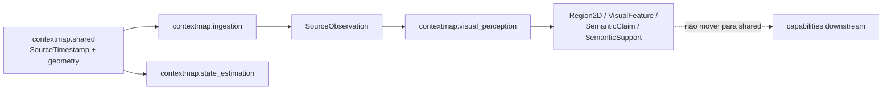

# Primitivas compartilhadas e tipos transversais

Este documento define quando um conceito pode pertencer ao namespace `contextmap.shared` e quando deve permanecer sob ownership de uma capability.

A regra principal é:

> `shared` existe somente para primitivas sem owner semântico claro que atravessam múltiplas capabilities. Ele não é um local de conveniência para evitar dependências ou ciclos.

As regras gerais de ownership e imports permanecem em [architecture.md](architecture.md) e [module-api.md](module-api.md).

## Estado atual de `contextmap.shared`

`shared` continua deliberadamente mínimo. As primitivas transversais materializadas são `SourceTimestamp` (com `to_record()`/`from_record()`, o formato de registro compartilhado do timestamp e do clock) e as primitivas geométricas de `contextmap.shared.geometry` (`Vector3`, `Quaternion`, `RotationMatrix`, validação e normalização de quaternions, `quaternion_multiply`, `quaternion_conjugate`, `rotate_vector`, `quaternion_to_rotation_matrix`, `quaternion_angle_between`, `compose_rigid` e `invert_rigid`); os demais conceitos permanecem com seus owners de domínio enquanto não houver necessidade real de compartilhamento.



`FrameId`, `RigidTransform`, calibração e IDs de observação continuam hoje sob ownership de Ingestion. O fato de futuros módulos também precisarem de frames ou transforms não autoriza mover esses tipos para `shared` antes de existir um contrato transversal real.

### Primitivas geométricas em `shared.geometry`

Os aliases `Vector3` e `Quaternion` e as funções sobre quaternions entraram em `shared` porque atendem aos critérios abaixo:

- **quem usa:** `state_estimation` (validação de `PoseEstimate.orientation`, frame graph e preflight, que compõem e invertem transforms), com `geometric_mapping` e `sensor_association` consumindo a mesma álgebra para compor `T_map_body(t)` com extrínsecos estáticos;
- **mesma semântica:** quaternion `(x, y, z, w)`, unitário, sem reordenação em relação a `RigidTransform` e `ExternalPoseMeasurement` de Ingestion;
- **owner natural:** nenhum; a álgebra de quaternions não pertence a uma capability de domínio;
- **API pública:** apenas tuplas, sem NumPy ou biblioteca de robótica.

`shared.geometry` cresce apenas quando uma issue tem consumidor real da nova função; tipos de domínio (`PoseEstimate`, `GeometryPoint`, `RigidTransform`) permanecem com seus owners.

### Mecânica de run directory em `shared.run_directory`

`docs/ARTIFACTS.md` fixa as mesmas regras para todo run artifact: uma escrita interrompida não pode parecer um run finalizado, um run finalizado é imutável e nunca sobrescrito, o manifest inventaria cada arquivo contratual com tamanho e hash, e o índice de run é monotônico por capability e sequência calculado a partir dos runs válidos no disco. `AtomicRunDirectory`, `FileEntry`, `check_file_inventory`, `next_run_index` e `write_run_registry` implementam essas regras uma vez, sem conhecer o conteúdo de um run. Um payload maior que a memória é gravado em fluxo por `AtomicRunDirectory.open_binary`, que hasheia durante a escrita, e `check_file_inventory` hasheia em blocos; ambos surgiram do primeiro consumidor real (o payload de geometria) e não mudam as regras.

- **quem usa:** `state_estimation`, `geometric_mapping`, `sensor_association` e `point_representation` agora; `semantic_fusion` na milestone seguinte, todos com a mesma regra de `ARTIFACTS.md`;
- **owner natural:** nenhuma capability de domínio; a regra é global;
- **API pública:** apenas `pathlib` e tipos primitivos, sem NumPy nem SDK;
- **o que continua com cada capability:** quais arquivos existem, os campos do manifest e o que torna um run válido.

Os writers de Ingestion e Visual Perception mantêm suas implementações próprias; unificá-los é uma refatoração posterior, separada, sem mudança de comportamento.

## Critérios para entrar em `shared`

Um tipo só pode ser movido para `shared` quando todos os critérios abaixo forem verdadeiros:

1. é usado por mais de uma capability com **a mesma semântica**;
2. nenhuma capability possui responsabilidade de domínio claramente superior sobre o conceito;
3. o tipo é pequeno, estável e independente de backend;
4. colocá-lo em `shared` reduz duplicação conceitual real, não apenas linhas parecidas;
5. ele não existe para quebrar artificialmente um ciclo entre módulos;
6. sua API pública não exige ROS, NumPy, Torch, SDK de modelo ou outro runtime pesado.

Se houver dúvida sobre ownership, o conceito permanece no módulo que o introduz até existir evidência de uso transversal real.

## Superfície inicial permitida

A arquitetura do canonical pipeline reconhece as seguintes famílias como candidatas legítimas a `shared` quando a implementação passar a precisar delas.

### Tempo

Uma representação temporal genérica pode ser compartilhada porque timestamps aparecem em observações, poses, geometria, associação e lineage.

O contrato precisa preservar a semântica temporal necessária para evitar comparação cega entre relógios diferentes. Conceitualmente:

```text
Timestamp
├── value
├── unit
└── clock_id / time_domain, quando necessário
```

Não assumir que dois números de timestamp pertencem ao mesmo clock.

A conversão de timestamps ROS/dataset para o tipo canônico pertence aos adapters de Ingestion.

### Frames e transformações 3D

As seguintes primitivas podem ser compartilhadas porque possuem significado geométrico transversal:

```text
Vector3
Quaternion
Transform3D
CoordinateFrame / FrameId
```

O contrato deve declarar convenções necessárias, principalmente ordem de quaternion e direção de transformações.

Preferência de notação:

```text
T_A_B
```

representa uma transformação que leva coordenadas expressas em `B` para `A`.

Tipos de domínio mais ricos, como `PoseEstimate`, `GeometryPoint` ou `CameraIntrinsics`, continuam sob ownership das capabilities correspondentes.

### Identificadores genéricos

Um identificador só pertence a `shared` quando sua semântica é realmente transversal.

É aceitável compartilhar uma primitive/base leve para representação de IDs ou referências, mas IDs de domínio continuam module-owned:

```text
SourceObservationId   -> ingestion
PerceptionRunId       -> visual_perception
GeometryReference     -> geometric_mapping
EntityId              -> semantic_mapping
RelationId            -> spatial_relations
ArtifactId            -> artifact, se possuir semântica própria de artifact
```

Não criar uma hierarquia complexa de IDs apenas para evitar strings.

### Provenance genérica

A arquitetura precisa de um vocabulário transversal mínimo para referências de lineage, como identidade do produtor, código/configuração e referências upstream.

Esse núcleo pode viver em `shared` se múltiplas capabilities realmente o reutilizarem com a mesma semântica.

Provenance específica continua module-owned. Exemplo:

```text
common producer/config/code identity
    +
Perception provenance específica
```

não significa colocar prompts, checkpoints, calibration details e campos de cada capability dentro de um único objeto global de provenance.

## Conceitos explicitamente fora de `shared`

Os seguintes conceitos possuem owner de domínio e não devem ser movidos para `shared` por conveniência:

```text
SourceObservation
CanonicalSequence
CameraIntrinsics
ExternalPoseMeasurement
PoseEstimate
Trajectory
PreparedImage
Region2D
VisualFeature
EmbeddingSpace
SemanticClaim
SemanticSupport
SceneContext
GeometryPoint
GeometryReference
GeometricMap
SpatialObservation
ObservationQuality
PointRepresentation
RepresentationSpace
FusionSupport
FusedEvidence
Entity
ResolvedEntity
Relation
ContextMap
ContextMapArtifact
```

O fato de vários módulos consumirem esses tipos não remove o ownership do produtor.

## `Confidence` não é uma primitive compartilhada

Não criar um `shared.Confidence` genérico no canonical pipeline.

Os valores que parecem “confidence” possuem semânticas distintas:

```text
VLM confidence
semantic scorer similarity
observation quality
fusion contribution weight
entity uncertainty
relation support
```

Uma abstraction comum facilitaria combinações semanticamente incorretas.

Cada módulo deve nomear e documentar seu sinal conforme a semântica real. Conversão para probabilidade só é válida quando houver uma calibração explicitamente definida.

## Calibration ownership

Calibration não entra em `shared` apenas porque várias etapas a consomem.

Ownership definido:

```text
ingestion
    normaliza e possui dados canônicos de calibration
    ├── camera intrinsics/model/distortion
    ├── static extrinsics
    └── frame metadata

sensor_association
    possui aplicação da calibration na projeção 3D -> imagem
```

`state_estimation` pode consumir static extrinsics/frame metadata necessários ao frame graph, mas não passa a possuir calibration.

Adapters podem converter formatos específicos de dataset/ROS para o contrato público de Ingestion. Downstream nunca deve parsear YAMLs ou mensagens ROS de calibration diretamente.

## NumPy e bibliotecas numéricas

Primitivas públicas compartilhadas devem ser **library-neutral**.

Elas podem oferecer conversão explícita para representações numéricas quando necessário, mas não devem exigir `numpy.ndarray` como identidade do contrato público.

Motivos:

- evita carregar NumPy apenas para interpretar metadata simples;
- impede shape/dtype implícitos como parte não documentada do contrato;
- facilita serialização e testes;
- mantém Torch/JAX/CUDA restritos à infraestrutura/backends que realmente precisam deles.

Cálculos internos podem usar NumPy livremente dentro da capability adequada. A regra vale para a fronteira pública, não para toda implementação.

## Estrutura mínima

Não criar a árvore inteira antes de existir código que a use.

Quando as primeiras primitives concretas forem necessárias, a estrutura pode crescer incrementalmente:

```text
src/contextmap/shared/
├── __init__.py
├── time.py          # somente quando Timestamp for implementado
├── geometry.py      # somente quando Vector3/Quaternion/Transform3D forem necessários
├── identifiers.py   # somente se surgir primitive realmente transversal
└── provenance.py    # somente após contrato transversal real
```

A presença deste documento não exige a criação imediata desses arquivos.

`shared/__init__.py` deve seguir a mesma política de API pública das demais capabilities: exports explícitos e pequenos.

## Regra para ciclos

Um ciclo como:

```text
module_a -> module_b -> module_a
```

não pode ser “resolvido” automaticamente movendo tipos para `shared`.

A análise deve primeiro verificar:

1. ownership incorreto;
2. direção de dependência errada;
3. necessidade de um port no consumer;
4. responsabilidade que deveria estar em runtime/composition;
5. artifact/contract público que já pode quebrar a dependência.

Somente depois disso uma primitive genuinamente transversal pode ser considerada para `shared`.

## Exemplos

### Correto

`Vector3` é usado com a mesma semântica por state estimation e geometric mapping e não carrega regras específicas de nenhuma delas. Pode ser `shared`.

### Incorreto

Mover `GeometryReference` para `shared` porque Sensor Association também o consome. O owner permanece Geometric Mapping; Sensor Association depende da API pública de Geometric Mapping.

### Incorreto

Criar `shared.SemanticEvidence` para unificar `SemanticClaim`, `SemanticSupport`, `FusedEvidence` e relation evidence. Esses conceitos possuem semânticas e owners diferentes.

## Critério de revisão

Todo novo símbolo proposto para `shared` deve responder no PR:

- quais capabilities o utilizam hoje;
- por que a semântica é exatamente a mesma entre elas;
- por que nenhum módulo é owner natural;
- quais dependências ele evita sem mascarar um problema arquitetural;
- quais bibliotecas aparecem em sua API pública.

Sem respostas concretas, o símbolo permanece module-owned.
