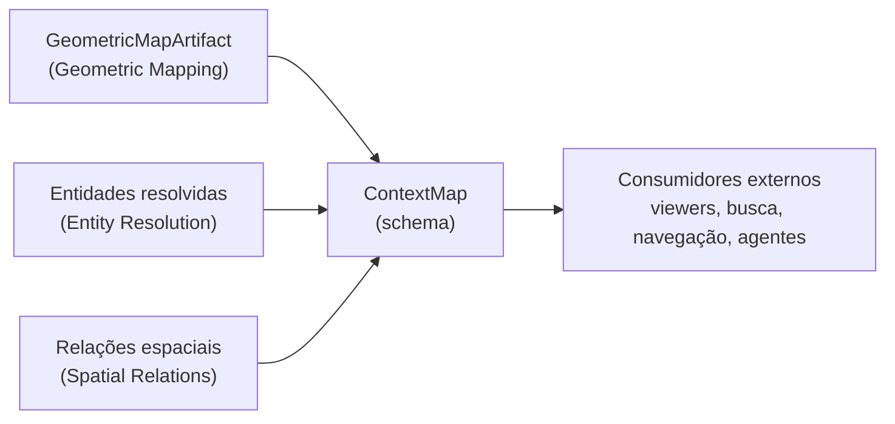

# Artifact

## Responsabilidade

Definir o **produto público** do ContextMap2: o schema `ContextMap`, que conecta geometria 3D persistente com as entidades e relações reconhecidas nela, e as regras que mantêm esse mapa interpretável por um consumidor que nunca abriu um runtime de modelo.

A capability é **somente schema**. Ela não depende do layout em disco, de um serializador, de ROS nem de bibliotecas de modelo: importar `contextmap.artifact` não importa `torch`, `transformers`, `rclpy` nem `rosbags`, e há um teste que garante isso.

## O que este módulo explicitamente não possui

- inferência de domínio: percepção, fusão, resolução de entidades e relações continuam nas capabilities donas;
- geometria e suas coordenadas: o mapa **referencia** o `GeometricMapArtifact`, nunca copia pontos;
- o layout de arquivos, o formato de armazenamento, a escrita atômica e a leitura preguiçosa: pertencem ao serializador (milestone Context Map Serialization);
- busca semântica, linguagem natural, planejamento, navegação, viewers e comportamento de ROS: consumidores externos ao Solution 1.

## Estado implementado

Existem, até agora, os contratos de topo: `ContextMap`, `ContextMapMetadata` (identidade de criação e sequências de origem), a referência à geometria (`GeometricMapLink`), a versão do schema com a regra de leitura, e a **visão canônica em registros** (`context_map_to_record` / `context_map_from_record`), que é a forma serializável do contrato sem escolher um formato de arquivo.

## Contratos públicos

- `ContextMap`, `ContextMapId` — o mapa final e sua identidade, nunca um caminho.
- `ContextMapMetadata`, `MapCreation`, `SourceSequence`, `PolicyRef` — o que o mapa é, de onde veio e como foi criado.
- `GeometricMapLink` — a geometria autoritativa, referenciada por identidade e tamanho.
- `CONTEXT_MAP_SCHEMA_VERSION`, `SchemaVersion`, `require_supported_schema_version()`, `UnsupportedSchemaVersionError` — a versão do schema e a rejeição explícita de uma versão ilegível.
- `context_map_to_record()`, `context_map_from_record()`, `ContextMapRecordError` — a visão canônica em registros, estrita e independente de formato.

Ver [`contracts.md`](contracts.md) para a referência de campos e as invariantes.

## Módulos consumidos

- `contextmap.geometric_mapping`: `MapId`, reutilizado como identidade do mapa geométrico referenciado.

Entity Resolution e Spatial Relations ainda não existem na `dev`; até lá o schema usa registros de referência próprios (artifact de origem + identidade local), sem importar módulos que não existem.

## Módulos que consomem este

Nenhum dentro do Solution 1 hoje. O serializador (Context Map Serialization) e a runtime, na montagem final, consumirão `contextmap.artifact`. Consumidores externos leem o artifact público.

## Onde estão os documentos detalhados

- [`contracts.md`](contracts.md) — campos, identidades e invariantes.
- [`docs/CONTRACTS.md`](../../../../docs/CONTRACTS.md) — `ContextMap` no contexto global de contratos.
- [`docs/ARTIFACTS.md`](../../../../docs/ARTIFACTS.md) — o `ContextMapArtifact` no fluxo de artifacts.
- [`docs/PIPELINE.md`](../../../../docs/PIPELINE.md) — a etapa de Context Map Assembly.
