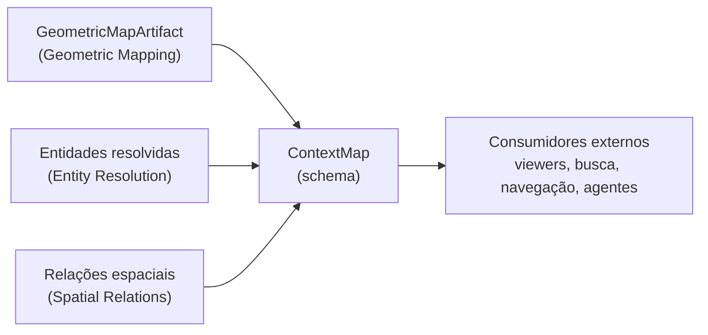

# Artifact

## Responsabilidade

Definir o **produto público** do ContextMap2: o schema `ContextMap`, que conecta geometria 3D persistente com as entidades e relações reconhecidas nela, e as regras que mantêm esse mapa interpretável por um consumidor que nunca abriu um runtime de modelo.

A capability é **somente schema**. Ela não depende do layout em disco, de um serializador, de ROS nem de bibliotecas de modelo: importar `contextmap.artifact` não importa `torch`, `transformers`, `rclpy` nem `rosbags`, e há um teste que garante isso.

## O que este módulo explicitamente não possui

- inferência de domínio: percepção, fusão, resolução de entidades e relações continuam nas capabilities donas;
- geometria e suas coordenadas: o mapa **referencia** o `GeometricMapArtifact`, nunca copia pontos;
- o layout de arquivos, o formato de armazenamento, a escrita atômica e a leitura preguiçosa: pertencem ao serializador (milestone Context Map Serialization);
- busca semântica, linguagem natural, planejamento, navegação, viewers e comportamento de ROS: consumidores externos ao Solution 1.

## Estado implementado

Existem, até agora, os contratos de topo: `ContextMap`, `ContextMapMetadata` (criação, sequências de origem, frame, unidades, âncora, extensão espacial e temporal e capacidades declaradas), a referência à geometria (`GeometricMapLink`), a composição de **entidades e relações** por referência (`ContextEntity`, `ContextRelation`) com integridade de referências validada em construção, a **linhagem** e a proveniência (`EvidenceOrigin`, `UpstreamArtifact`), a versão do schema com a janela de leitura e as regras de evolução, a impressão digital estrutural, e a **visão canônica em registros** (`context_map_to_record` / `context_map_from_record`), que é a forma serializável do contrato sem escolher um formato de arquivo.

## Contratos públicos

- `ContextMap`, `ContextMapId` — o mapa final e sua identidade, nunca um caminho.
- `ContextMapMetadata`, `MapCreation`, `SourceSequence`, `PolicyRef` — o que o mapa é, de onde veio e como foi criado.
- `MapFrame`, `MapAnchor`, `AnchorKind`, `LengthUnit`, `Handedness` — a semântica de coordenadas: frame, unidade, lateralidade, direção "para cima" quando conhecida e origem local de estimador versus ancorada externamente.
- `ObservationWindow` — a janela temporal das observações, em um único domínio de relógio.
- `DeclaredCapabilities`, `MapCapability` — o conteúdo opcional que o mapa declara, sem implicá-lo pelo layout.
- `GeometricMapLink` — a geometria autoritativa, referenciada por identidade e tamanho.
- `ContextEntity`, `ContextEntityId`, `ContextEntityReference` — a entidade resolvida, seu escopo de identidade e sua referência estável.
- `ContextSemanticState`, `LabelHypothesis`, `AmbiguityStatus` — o estado semântico, que nunca colapsa incerteza.
- `ContextRelation`, `ContextRelationId` — a relação direcionada entre entidades, com o predicado, o estado e a incerteza **de Spatial Relations** (`RelationPredicate`, `RelationState`, `RelationUncertaintyKind`).
- `UpstreamRecordRef` — o registro exato, no artifact exato, que uma `EvidenceOrigin` cita como evidência.
- `EvidenceOrigin`, `DerivationKind` — como um resultado foi produzido (sensor, modelo, geometria, fusão, humano, conhecimento prévio) e **toda** a evidência de que deriva; proveniência, nunca confiança.
- `UpstreamArtifact`, `ArtifactKind`, `ProvenanceError` — a linhagem: cada artifact citado, com identidade de conteúdo, configuração, código e modelos.
- `ReferenceIntegrityError`, `ForeignContextEntityReferenceError`, `UnknownContextEntityError` — referências que não resolvem, referência a outro mapa e entidade inexistente.
- `CONTEXT_MAP_SCHEMA_VERSION`, `SchemaVersion`, `require_supported_schema_version()`, `UnsupportedSchemaVersionError` — a versão do schema, a janela de leitura e a rejeição explícita de uma versão ilegível.
- `schema_fingerprint()`, `describe_schema()` — a impressão digital estrutural do schema, que impede uma mudança estrutural sem uma decisão de versão.
- `context_map_to_record()`, `context_map_from_record()`, `ContextMapRecordError` — a visão canônica em registros, estrita e independente de formato.

Ver [`contracts.md`](contracts.md) para a referência de campos e as invariantes, [`metadata.md`](metadata.md) para a semântica de frame, origem, extensão e capacidades, [`composition.md`](composition.md) para geometria, entidades e relações, [`lineage.md`](lineage.md) para linhagem, origens e o fechamento de proveniência , [`versioning.md`](versioning.md) para versão, compatibilidade e evolução e [`validation.md`](validation.md) para invariantes e a fixture representativa.

## Módulos consumidos

- `contextmap.geometric_mapping`: `MapId`, reutilizado como identidade do mapa geométrico referenciado, `Bounds3D`, reutilizado como extensão espacial, e `GeometryReference`.
- `contextmap.entity_resolution`, `contextmap.semantic_mapping` e `contextmap.spatial_relations`: as referências, o estado e o predicado listados abaixo.
- `contextmap.shared`: `SourceTimestamp` (janela temporal) e `Vector3` (direção "para cima").

Entidades e relações usam os **contratos reais** das capabilities donas, sempre pela API pública: `ResolvedEntityReference` e `ResolutionDecisionId` (Entity Resolution), `EntityReference` (Semantic Mapping), `RelationPredicate`, `RelationState`, `RelationUncertaintyKind`, `RelationId` e `SpatialRelationsRunId` (Spatial Relations). Essas três dependências já estavam declaradas em `tests/architecture/test_boundaries.py`; nenhuma fronteira foi ampliada.

## Módulos que consomem este

Nenhum dentro do Solution 1 hoje. O serializador (Context Map Serialization) e a runtime, na montagem final, consumirão `contextmap.artifact`. Consumidores externos leem o artifact público.

## Onde estão os documentos detalhados

- [`contracts.md`](contracts.md) — campos, identidades e invariantes.
- [`metadata.md`](metadata.md) — frame, unidades, âncora, extensão e capacidades declaradas.
- [`composition.md`](composition.md) — geometria, entidades e relações: escopos de identidade, referências e índices.
- [`lineage.md`](lineage.md) — linhagem, referências de evidência, categorias de derivação e fechamento de proveniência.
- [`versioning.md`](versioning.md) — versão do schema, compatibilidade, evolução, descontinuação, migração e impressão digital.
- [`validation.md`](validation.md) — invariantes do schema, integridade de referências e a fixture representativa.
- [`docs/CONTRACTS.md`](../../../../docs/CONTRACTS.md) — `ContextMap` no contexto global de contratos.
- [`docs/ARTIFACTS.md`](../../../../docs/ARTIFACTS.md) — o `ContextMapArtifact` no fluxo de artifacts.
- [`docs/PIPELINE.md`](../../../../docs/PIPELINE.md) — a etapa de Context Map Assembly.
