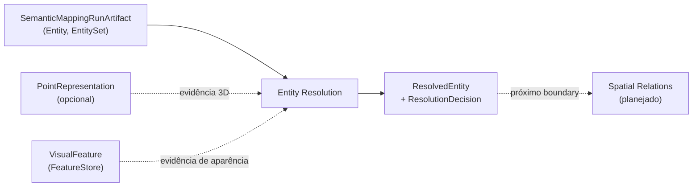

# Entity Resolution

## Responsabilidade

Decidir, a partir de evidência tipada e preservada por canal, se entidades semânticas de um mapa descrevem o **mesmo objeto físico**, **objetos distintos** ou se **não é possível saber** (`UNRESOLVED`), e materializar as entidades resolvidas que decisões explícitas justificam, dentro de um artifact imutável.

## O que este módulo explicitamente não possui

- criação de entidades a partir de evidência fundida: Semantic Mapping;
- relações espaciais entre entidades: Spatial Relations;
- geometria e suas coordenadas: Geometric Mapping (aqui só há `GeometryReference`);
- features visuais e representações 3D: Visual Perception e Point Representation (aqui só há referências e a comparação delas);
- rastreamento de objetos dinâmicos e re-identificação após movimento;
- identidade permanente entre mapas construídos de forma independente.

## Estado implementado

Existem os **contratos** de identidade e de comparação:

- `EntityResolutionRunId`, `ResolvedEntityId` e `ResolvedEntityReference`, com o codec JSON que revalida a referência;
- `EntityMatchEvidence`: a evidência de **uma comparação**, com a evidência tipada de cada canal (geometria, semântica, aparência, temporal e, opcional, representação 3D) mantida separada e sem nenhum score que a resuma, mais os resultados dos gates duros de validade (`evaluate_comparison_gates`);
- `ResolutionDecision`: o veredito de uma política versionada, `MATCH`, `DISTINCT` ou `UNRESOLVED`, com a evidência de origem, as regras que dispararam, os canais usados e ignorados e o motivo quando não resolve;
- a **recuperação de candidatos** (`retrieve_candidate_sets`, `EntitySpatialIndex`): para cada entidade, os alvos plausíveis de comparação, de forma permissiva e determinística, sem all-pairs e sem decidir nada ([`candidate-retrieval.md`](candidate-retrieval.md)).

Um canal é sempre **medido ou indisponível**: a falta de evidência nunca vira zero nem voto por `DISTINCT`. O codec é estrito e reflexivo (`_codec.py`). Os demais contratos (política, entidade resolvida, artifact e avaliação) chegam nas issues seguintes da milestone.

## Escopo de identidade

Um `ResolvedEntityId` é único **dentro de um** artifact de resolução. A mesma string em dois artifacts nomeia dois registros diferentes: uma nova execução cria um novo artifact e novos ids, então nada aqui implica permanência entre mapas reconstruídos de forma independente. Por isso a referência estável é `ResolvedEntityReference(resolution_run_id, resolved_entity_id)`, nunca um id nu, no mesmo desenho de `EntityReference(semantic_map_id, entity_id)`.

Uma entidade resolvida **nunca substitui** os membros: as entidades de origem mantêm a própria `EntityReference` e continuam endereçáveis individualmente.

## Contratos públicos

- `EntityResolutionRunId`, `ResolvedEntityId`, `ResolvedEntityReference` — identidade escopada ao artifact de resolução e o handle estável `(resolution_run_id, resolved_entity_id)`.
- `EntityMatchEvidence`, `ComparisonId`, `comparison_id_for`, `MatchEvidenceProvenance`, `GateResult`, `evaluate_comparison_gates`, `COMPARISON_GATES_POLICY_ID`, `reference_order` — a comparação de um par e seus gates.
- `MatchChannel`, `EvidenceStatus`, `UnavailableReason`, `Unavailability`, `Finding`, `ChannelEvidence` — o vocabulário comum dos canais.
- `GeometryEvidence`, `GeometryMeasurement`, `SupportDistance`; `SemanticEvidence`, `SemanticMeasurement`, `LabelComparison`, `LabelRelation`, `AttributeComparison`; `AppearanceEvidence`, `AppearanceMeasurement`, `FeatureContribution`; `TemporalEvidence`, `TemporalMeasurement`; `PointRepresentationEvidence`, `RepresentationMeasurement`, `RepresentationRef` — a evidência tipada de cada canal.
- `ResolutionDecision`, `ResolutionDecisionId`, `ResolutionOutcome`, `UnresolvedReason`, `PolicyStage`, `TriggeredRule`, `DecisionProvenance`, `decision_id_for` — a decisão.
- `CandidateRetrievalPolicy`, `CANDIDATE_RETRIEVAL_POLICY_ID`, `retrieve_candidate_sets`, `EntitySpatialIndex`, `EntityCandidateSet`, `EntityCandidate`, `RetrievalDiagnostics`, `RetrievalReason`, `ExclusionReason`, `CandidacyAssessment`, `explain_candidacy`, `candidate_pairs` — a recuperação de candidatos.
- `PolicyRef` — política versionada e fingerprint da configuração, comum a canais, recuperação e políticas.
- `encode_*` e `decode_*` de referência resolvida, evidência de comparação, decisão e conjunto de candidatos — o codec JSON, que revalida todas as invariantes.

Ver [`contracts.md`](contracts.md) para a referência de campos e as invariantes.

## Módulos consumidos

- `contextmap.semantic_mapping`: `Entity`, `EntityReference`, `EntityFeatureRef` e `AmbiguityState`, o que é comparado e referenciado.
- `contextmap.geometric_mapping`: `GeometryReference`, `MapId` e `Bounds3D`, o suporte 3D referenciado e as caixas da recuperação.
- `contextmap.point_representation`: `PointRepresentationId` e `PointRepresentationRunId`, as representações referenciadas.

As dependências estão declaradas em `tests/architecture/test_boundaries.py` e são sempre feitas pela API pública.

## Onde estão os documentos detalhados

- [`contracts.md`](contracts.md) — contratos, escopo de identidade e invariantes.
- [`candidate-retrieval.md`](candidate-retrieval.md) — política de recuperação, diagnóstico de exclusão, índice espacial e linha de base de desempenho.
