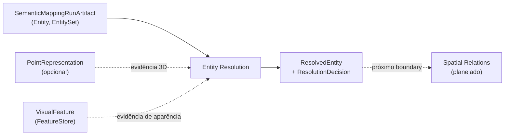

# Entity Resolution

## Responsabilidade

Decidir, a partir de evidência tipada e preservada por canal, se entidades semânticas de um mapa descrevem o **mesmo objeto físico**, **objetos distintos** ou se **não é possível saber** (`UNRESOLVED`), e materializar as entidades resolvidas que decisões explícitas justificam, dentro de um artifact imutável.

## O que este módulo explicitamente não possui

- criação de entidades a partir de evidência fundida: Semantic Mapping;
- relações espaciais entre entidades: Spatial Relations;
- geometria e suas coordenadas: Geometric Mapping (aqui só há `GeometryReference`);
- features visuais e representações 3D: Visual Perception e Point Representation (aqui só há referências e a comparação delas);
- rastreamento de objetos dinâmicos e re-identificação após movimento;
- identidade permanente entre mapas construídos de forma independente.

## Estado implementado

Existe o **contrato de identidade**: `EntityResolutionRunId`, `ResolvedEntityId` e `ResolvedEntityReference`, com o codec JSON que revalida a referência. Os demais contratos (evidência de comparação, decisão, candidatos, política, entidade resolvida, artifact e avaliação) chegam nas issues #130 a #140 da milestone "Entity Resolution".

## Escopo de identidade

Um `ResolvedEntityId` é único **dentro de um** artifact de resolução. A mesma string em dois artifacts nomeia dois registros diferentes: uma nova execução cria um novo artifact e novos ids, então nada aqui implica permanência entre mapas reconstruídos de forma independente. Por isso a referência estável é `ResolvedEntityReference(resolution_run_id, resolved_entity_id)`, nunca um id nu, no mesmo desenho de `EntityReference(semantic_map_id, entity_id)`.

Uma entidade resolvida **nunca substitui** os membros: as entidades de origem mantêm a própria `EntityReference` e continuam endereçáveis individualmente.

## Contratos públicos

- `EntityResolutionRunId` — identidade do artifact de resolução, o escopo dos ids resolvidos.
- `ResolvedEntityId` — identidade de uma entidade resolvida, local ao artifact.
- `ResolvedEntityReference` — o handle estável `(resolution_run_id, resolved_entity_id)`.
- `encode_resolved_entity_reference`, `decode_resolved_entity_reference` — o codec JSON, que revalida a referência na decodificação.

Ver [`contracts.md`](contracts.md) para a referência de campos e as invariantes.

## Módulos consumidos

- `contextmap.semantic_mapping`: `Entity`, `EntityReference`, `EntitySet` e os componentes de uma entidade, como referência do que é comparado.

A dependência é declarada em `tests/architecture/test_boundaries.py` e sempre feita pela API pública.

## Onde estão os documentos detalhados

- [`contracts.md`](contracts.md) — contratos, escopo de identidade e invariantes.
