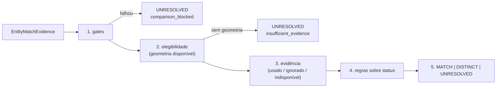

# Política de resolução baseline

`conservative-staged-resolution-v1`: a primeira política versionada, simples, conservadora e reproduzível, antes de qualquer matcher aprendido. Ela combina os canais tipados **sem** soma ponderada: lê só o **status** de cada canal (`supporting`, `conflicting`, `neutral`, `unavailable`), nunca um score, e nenhum número é somado, ponderado ou limiarizado entre canais. Os limiares que decidem se um canal apoia ou conflita pertencem à política de cada canal e ficam registrados na própria evidência.

A política **prefere `UNRESOLVED`** quando a evidência disponível é insuficiente ou materialmente conflitante, e nunca força um par a uma resposta binária. Não há matcher aprendido, conhecimento externo, rastreamento de objetos dinâmicos, efeito colateral (um `MATCH` não funde nada: a materialização é outro passo) nem fallback silencioso para outra política.

## Estágios

| Estágio | O que faz | Regras registradas (`TriggeredRule`) |
| --- | --- | --- |
| 1. `gate` | Um gate duro reprovado (outro mapa ou frame) deixa o par `UNRESOLVED` (`comparison_blocked`): coordenadas que não se comparam nada dizem. | `gate-failed-<gate>` por gate reprovado, ou `gates-passed` |
| 2. `eligibility` | A linha de base é ancorada na geometria: num cenário estático, o mesmo objeto está no mesmo lugar. Sem evidência geométrica disponível ela **não chuta**: `UNRESOLVED`. Todo outro canal é opcional. | `geometry-available` ou `geometry-required` |
| 3. `evidence` | Cada canal é **usado** (habilitado pela política e disponível), **ignorado** (disponível mas não habilitado) ou **indisponível**. Um canal indisponível é registrado e não vota: **falta de evidência nunca é voto negativo**. | `channel-used-<canal>`, `channel-ignored-<canal>`, `channel-unavailable-<canal>` |
| 4. `rule` | Conta os canais usados que apoiam e os que conflitam (`channel-votes`). | `channel-votes` |
| 5. `decision` | A regra que concluiu o resultado, com os canais em que se apoia. | uma das regras abaixo |

## Regras de decisão

Rodam em ordem; a primeira que se aplica decide.

| Regra | Condição | Resultado |
| --- | --- | --- |
| `materially-conflicting` | algum canal usado apoia **e** outro conflita | `UNRESOLVED` (`conflicting_evidence`) |
| `match-supported` | geometria apoia, nenhum canal usado conflita e pelo menos `min_supporting_channels` canais apoiam | `MATCH` |
| `distinct-supported` | geometria conflita e nenhum canal usado apoia | `DISTINCT` |
| `insufficient-evidence` | qualquer outro caso (geometria neutra; geometria apoia mas faltou corroboração) | `UNRESOLVED` (`insufficient_evidence`) |

Consequências deliberadas:

- **O caminho só de geometria é válido.** Com `min_supporting_channels = 1` e só geometria habilitada, apoio geométrico basta para `MATCH`. Sem aparência, sem representação 3D, sem semântica, a política continua funcionando.
- **Um perfil pode exigir corroboração** (`min_supporting_channels = 2`): geometria sozinha então fica `UNRESOLVED`, e com um segundo canal que apoia vira `MATCH`.
- **Conflito em outro canal nunca basta para `DISTINCT`.** A semântica upstream pode estar errada: geometria neutra com conflito semântico fica `UNRESOLVED`, e geometria que apoia com conflito semântico é `materially-conflicting`.
- **Objetos próximos e sem sobreposição ficam `UNRESOLVED`** (geometria neutra), não `DISTINCT`: só a separação clara (`bounds-separation` conflitante) resolve como distintos.
- **Canais neutros não votam** e canais indisponíveis não votam.

## Configuração (`ConservativeResolutionPolicy`)

| Campo | Significado |
| --- | --- |
| `use_channels` | Canais em que a decisão pode se apoiar, em ordem canônica e únicos; **precisa incluir geometria**. Um canal disponível que não está na lista é **ignorado**: ablações de canal (só geometria, geometria + semântica, geometria + aparência, ...) são mudança de configuração. |
| `min_supporting_channels` | Quantos canais usados precisam apoiar para um `MATCH`, entre 1 e `len(use_channels)`. |

Sem valores padrão e sem pesos. O `fingerprint()` cobre a identidade da política e os dois campos, e o `decision_id` deriva da comparação e da política: outra configuração dá outro id.

## Preservado por decisão (`ResolutionDecision`)

`decision`, `evidence_ref` (a comparação de onde saiu), `policy` (identidade e fingerprint), `triggered_rules` (todos os estágios, na ordem), `channels_used` e `channels_ignored`, `unresolved_reason` quando aplicável e a versão do código. Uma decisão `MATCH` ou `DISTINCT` é reconstruível a partir da evidência tipada e das regras explícitas: reaplicar a política à mesma evidência reproduz a decisão.

## Coleta de evidência e execução

`MatchEvidenceBuilder(ComparisonChannels(...)).build(a, b)` roda os gates e depois cada canal **configurado**. Um canal não configurado é "não avaliado" (`None`); um configurado que não pôde comparar o par está presente e indisponível. Quando um gate falha, **nenhum canal é calculado**: todo canal configurado é registrado como `unavailable(blocked_by_gate)` com o detalhe do gate, então nada medido entre coordenadas incompatíveis vaza para a evidência.

`resolve_candidate_pairs(entities, candidate_sets, builder, policy)` é o serviço de execução: compara só os pares que a recuperação de candidatos produziu (cada um uma vez, em ordem canônica), constrói a evidência e decide, devolvendo `PairResolution(evidence, decision)`. Não altera as entidades e não funde nada.

## Substituição

A política é um valor que produz `ResolutionDecision`. Trocá-la (outra configuração ou outra política versionada) não muda os contratos canônicos: os testes rodam duas configurações sobre a mesma evidência e obtêm decisões do mesmo tipo com `policy` diferente. Não há fallback automático entre políticas.

## Limites

Os limiares de cada canal e `min_supporting_channels` não foram calibrados com dados reais: a justificativa por dados de validação é o objetivo da avaliação (#140), e esta milestone só usa fixtures sintéticos. Até lá, os valores de um perfil são hipóteses declaradas e versionadas, não resultados.
