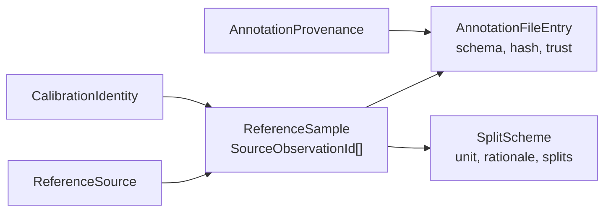

# Reference set

O reference set fixa **contra o que** o pipeline é avaliado: as fontes de dados, as observações físicas selecionadas, as identidades de calibração, os arquivos de anotação com schema e proveniência, os estratos e os splits de tuning/desenvolvimento/teste. Ele é versionado e hasheado **independentemente** de qualquer saída de experimento.

A implementação está em `contextmap.evaluation.reference_set`. Ela descreve e verifica o manifesto; as checagens de política (vazamento entre splits, conteúdo duplicado, auditoria de proveniência) consomem este manifesto e ficam na validação de integridade.

## Manifesto

`ReferenceSetManifest` (schema `contextmap.reference-set/v1`) agrega:

| Campo | Conteúdo |
|---|---|
| `reference_set_id` / `version` | Nome estável e versão. A versão **deve** mudar quando anotações ou seleções mudam. |
| `sources` | `ReferenceSource`: sequência (artifact de ingestion), fixture sintética ou dataset externo, com `content_hash`, licença e se é redistribuível. |
| `calibrations` | `CalibrationIdentity`: identidade de calibração de ingestion e o hash da entrada. |
| `stratum_definitions` | Fatores de estratificação declarados (`visibility`, `range_band`, …) e seus valores permitidos. |
| `samples` | `ReferenceSample`: seleção ordenada de observações físicas, calibrações, intervalo de tempo, hash de conteúdo, estratos e chaves de grupo. |
| `provenance` | `AnnotationProvenance`: origem, anotador, método, ferramenta, artifacts que semearam a anotação e revisão explícita. |
| `annotations` | `AnnotationFileEntry`: arquivo, schema versionado, hash, **trust**, proveniência e amostras cobertas. |
| `split_schemes` | `SplitScheme`: tarefa, unidade de split, justificativa e os splits ordenados. |



## Regras de identidade

- **A amostra é ligada à observação física.** `ReferenceSample.observation_ids` contém `SourceObservationId`; nenhuma identidade de run de percepção, região ou claim participa. Repetir a inferência sobre o mesmo frame não cria amostra nova.
- **Identidades são únicas e referências resolvem dentro do manifesto.** Fonte, calibração, amostra, proveniência, anotação e scheme duplicados, ou referências pendentes, não constroem um manifesto.
- **Ordem é parte da seleção.** A ordem das amostras de um split entra no digest; `selection(scheme_id, split)` devolve exatamente a seleção avaliada.

## Trust e proveniência

`ReferenceTrust` é declarado **por arquivo de anotação**, sem valor padrão:

| Valor | Uso |
|---|---|
| `trusted_ground_truth` | verdade de referência confiável |
| `approximate_annotation` | anotação aproximada, com incerteza conhecida |
| `derived_measurement` | medida derivada, não observação direta da verdade |
| `diagnostic_only` | dado diagnóstico; nunca aceite científico |

- O nome ou a extensão de um arquivo (`gt.txt`, `.pcd`) **nunca** define o trust.
- Uma anotação cuja proveniência é `model_inference` só pode ser `diagnostic_only`. Nenhuma saída de modelo vira verdade de avaliação silenciosamente.
- Uma anotação anotada manualmente mas **semeada** por um artifact de modelo registra o artifact em `seeded_from_artifacts` e a revisão em `review`; a validação de integridade usa esses campos.

## Digest e versão

`ReferenceSetManifest.digest()` é o `sha256` do JSON canônico do manifesto (chaves ordenadas, sem espaços). O documento em disco carrega o digest declarado e `read_reference_set()` recusa um manifesto cujo conteúdo não o reproduz. `identity()` devolve `ReferenceSetIdentity` (`id`, `version`, `digest`), que os relatórios de avaliação citam.

`require_version_bump_on_change(previous, current)` recusa um manifesto com o mesmo `reference_set_id` e a mesma `version` mas outro digest.

## Persistência

```text
<reference-set>/<version>/
├── manifest.json
└── annotations/...        # caminhos relativos declarados em cada AnnotationFileEntry
```

- `write_reference_set(root, manifest)` publica `manifest.json` atomicamente e recusa sobrescrever; um conjunto alterado ganha outro diretório de versão.
- `verify_annotation_files(manifest, root)` confere cada arquivo contra o hash declarado e lista os ausentes, modificados ou que escapam da raiz.
- `AnnotationFileEntry.path` é sempre relativo, POSIX e contido na raiz.

## O que este módulo não faz

- não valida vazamento entre splits, duplicidade de conteúdo nem a política de proveniência (integridade);
- não define o conteúdo dos arquivos de anotação, só o schema declarado e o hash; as famílias e seus schemas estão em [`annotations.md`](annotations.md);
- não substitui `RegionDiscoveryReferenceSet`, que continua sendo o formato da avaliação de Region Discovery.
