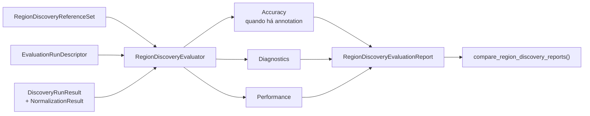
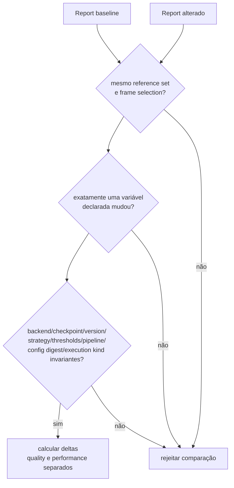

# Avaliação de Region Discovery

O protocolo mede evidência geométrica 2D e custo de execução sem usar qualidade semântica ou
resultados downstream. O mesmo `RegionDiscoveryReferenceSet` e o mesmo schema de report recebem
execuções SAM2, SAM3, Florence-2 ou fakes.

## Fluxo de avaliação



O protocolo mede a capability de descoberta geométrica, não a interpretação semântica posterior. O contrato e o fluxo de produção das regiões estão documentados em [`visual_perception/docs/region-discovery.md`](../../visual_perception/docs/region-discovery.md).

## Reprodutibilidade

Cada report registra:

- versão do reference set e seleção ordenada de frames;
- `perception_run_id` e artifact ID;
- backend, checkpoint, versão e estratégia;
- digest da configuração e do pipeline graph;
- thresholds e variáveis controladas;
- versão do schema de métricas;
- tipo da execução, por exemplo `ci_contract` ou `real_model`.

Constraints pertencem ao `PreparedImage` de cada frame. Assim, um valid region declarado para uma
condição wide-angle não é aplicado implicitamente aos demais frames.

## Definições das métricas

Diagnostics independentes de annotation:

- `raw_candidate_count`: count nativo antes do filtering do adapter, quando reportado; caso
  contrário, count canônico retornado pelo backend;
- `accepted_region_count`: regiões após normalização e geometry freeze;
- `rejected_candidate_count`: rejeições de passes e normalização;
- `duplicate_merge_ratio`: merge decisions dividido pelo count bruto;
- `area_pixels`: área canônica das regiões aceitas;
- `invalid_geometry_count`: rejeições `invalid_geometry`;
- `constraint_violation_count`: rejeições por valid/exclusion constraints.

Em frames anotados, para cada ground-truth mask é selecionada a predição de maior IoU:

```text
IoU  = |P ∩ G| / |P ∪ G|
Dice = 2|P ∩ G| / (|P| + |G|)
```

- `mean_iou` e `mean_dice`: média do melhor valor por região anotada;
- `region_recall`: fração das regiões anotadas cujo melhor IoU atinge o threshold do evaluator;
- `coverage`: união prevista intersectada com união anotada, dividida pela união anotada;
- `over_segmentation_rate`: predições sobrepostas excedentes por ground truth, normalizadas pelo
  count previsto;
- `under_segmentation_rate`: predições que sobrepõem mais de um ground truth, normalizadas pelo
  count previsto;
- `duplicate_region_rate`: atribuições previstas repetidas ao mesmo melhor ground truth,
  normalizadas pelo count previsto.

Frames sem annotation mantêm `accuracy = null`. Candidate count, área ou inspeção visual não são
apresentados como substitutos de accuracy.

Performance permanece em bloco separado: duração por pass, duração total e pico de memória quando
o runtime reporta. `compare_region_discovery_reports` exige o mesmo reference set e valida que
exatamente uma variável declarada mudou antes de calcular deltas separados de qualidade e custo.
Além de `run.variables`, a validação mantém backend, versão, checkpoint, estratégia, thresholds,
pipeline graph, `config_digest` e tipo de execução constantes, exceto quando o próprio campo
estruturado corresponde à variável declarada. IDs de run/artifact podem mudar porque identificam a
nova execução. O `config_digest` identifica a configuração controlada comum aos dois lados e não
pode mudar: a variável de ablação fica explicitamente em `run.variables`. Como um digest é opaco,
aceitar sua alteração impediria provar que somente a variável declarada mudou.

## Ablations controladas



IDs de run e artifact podem mudar entre execuções. O `config_digest` não pode mudar silenciosamente, porque é opaco e impediria provar que a diferença observada veio apenas da variável declarada.

## Baselines

Os fixtures versionados incluem duas condições sintéticas e um baseline `ci_contract` do adapter
SAM3. Ele protege schema, determinismo, métricas e integração do adapter; checkpoint
`test://sam3-deterministic-runtime` deixa explícito que esse report não mede qualidade do modelo
real.

Um baseline científico deve usar `execution_kind = real_model`, frames reais versionados e o
checkpoint SAM3 configurado. Ele é produzido pelo mesmo evaluator quando os pesos, runtime e
reference frames reais estiverem disponíveis. Não se deve renomear o baseline de CI nem extrapolar
seus números como qualidade do SAM3.
