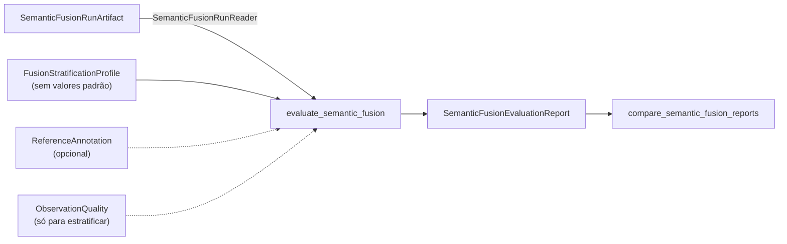

# Avaliação de Semantic Fusion

Este documento descreve `src/contextmap/evaluation/semantic_fusion.py`, versão `EVALUATOR_VERSION = "1"`.

Semantic Fusion é validada como uma etapa de **acumulação de evidência**, e suas falhas precisam continuar visíveis: consistência multi-vista, preservação de incerteza, tratamento de correlação e o valor real dos canais de evidência opcionais. O avaliador lê runs persistidos pelo leitor público, **nunca altera um run e nunca lê `debug/`**, e reporta cada grandeza **separada e com o seu denominador**: não há ranking, vencedor nem escore composto. Custo fica à parte de toda medida de qualidade.

## Seções do relatório

| Seção | Pergunta que responde |
| --- | --- |
| `lineage` | Que run é este? Sequência, mapa, runs de associação, percepção e Point Representation, políticas de agrupamento, suporte e fusão com seus fingerprints, código e esquema. |
| `correlation` | Inferência repetida e geometria multiplicam evidência? Suportes com inferência repetida, máximo de resultados sobre um frame, hipóteses sustentadas por mais resultados que frames, e os invariantes que um run válido mantém em zero: suporte físico acima do total, evidência duplicada, evidência acima do número de claims, referência estrutural repetida. |
| `uncertainty` | A incerteza sobreviveu? Suportes por tipo de registro (contradição, ambiguidade, empate, evidência insuficiente), competição não reportada (deve ser 0), claims em abstenção, pontuadas, não pontuadas e sem hipótese. |
| `channels` | Cada canal (claims, scores, features, qualidade, geometria, estrutura 3D): ativo?, que identidades o alimentaram? quantos itens? Os espaços de embedding e de representação continuam **separados**: nenhuma similaridade entre espaços é calculada. |
| `weighting` | Só para um braço ciente de qualidade: contribuições ponderadas, fatores zero, componentes que caíram no fator neutro, distribuição dos fatores e suportes em que os líderes mudam com a ponderação. |
| `annotations` | Só com anotações (ver abaixo). |
| `strata` | As mesmas medidas por condição (ver abaixo). |
| `cost` | Tempo e memória (só se medidos) e tamanho de cada arquivo contratual, à parte da qualidade. |

## Anotações: recuperação da referência

`ReferenceAnnotation(spatial_observation_id, label)` dá o rótulo de referência de uma observação espacial. O rótulo de um suporte é o das suas observações; se elas **discordam**, o suporte é `ambiguous_reference` e fica **fora** da correção. Comparação por chave de label, a mesma do baseline (`Door` = `door`).

Cada suporte anotado tem exatamente um resultado, para o líder por **frames físicos distintos de suporte** e, num braço ponderado, também para o líder por **suporte ponderado**:

- `leading_matches_reference`: a hipótese de referência é o único líder;
- `tied_with_reference`: é um de vários líderes empatados;
- `retained_not_leading`: está presente, mas não lidera (a alternativa foi preservada);
- `reference_missing`: nenhuma hipótese tem o rótulo.

**Uma anotação ausente é "não aplicável", nunca um negativo**: suportes sem anotação aparecem em `unannotated_supports` e não entram em nenhum denominador de correção. Anotações de observações que não estão em suporte algum aparecem em `unmatched_annotations`.

## Estratificação

`FusionStratificationProfile` traz as bordas de cada estratificação, **sem valores padrão** (uma faixa que serve a um mapa e a uma câmera não serve a outro): `n` bordas estritamente crescentes dão `n + 1` faixas. Cada estratificação **particiona** os suportes: as faixas mais o estrato `unavailable` contêm cada suporte exatamente uma vez, e uma grandeza que não pôde ser medida vai para `unavailable`, nunca vira zero.

| Estratificação | Grandeza |
| --- | --- |
| `range` | mediana, entre as observações do suporte, da profundidade do suporte (m) |
| `visibility` | mediana da parcela visível |
| `support_density` | mediana dos pontos associados por pixel de máscara |
| `image_border` | mediana da menor distância à borda da imagem preparada (px): periferia e borda de fisheye |
| `physical_observations` | número de frames físicos distintos do suporte |
| `uncertainty_level` | `none`, `ambiguity_or_near_tie`, `contradiction` ou `insufficient_evidence` |

A qualidade é só um **fator de estratificação**, lido de `ObservationQuality` fornecida por quem chama (do artifact de Sensor Association); nunca é tratada como confiança semântica. Sem ela, as quatro primeiras estratificações ficam `unavailable`.

Cada estrato reporta suportes, os que têm incerteza, os anotados, os com referência recuperada e os em que a referência lidera (por frames físicos e, num braço ponderado, por suporte ponderado). Assim, um ganho ou uma regressão aparece **por condição**, e não só numa média global.

## Comparação controlada

`compare_semantic_fusion_reports(reports)` compara braços na **mesma evidência**. Exige exatamente um controle (`BASELINE_CONTROL`) e recusa tudo que não seja a configuração de fusão mudando:

- versão do avaliador, perfil de estratificação e anotações iguais;
- **mesma base de evidência**: mesmos suportes, contribuições e observações físicas (hash);
- mesma sequência, mesmo mapa, mesmas runs de associação, percepção e Point Representation, mesmas políticas de agrupamento e suporte.

O resultado não tem vencedor nem escore. Cada braço mostra a sua política, o fingerprint da configuração, os canais ativos e, contra o controle: se as hipóteses e os stances são exatamente os mesmos e em quantos suportes o líder mudou.

### Ablações previstas

Rodadas a partir dos **mesmos artifacts a montante**, sem regenerar nada:

| Braço | Configuração |
| --- | --- |
| A. baseline (uniforme) | `accumulate_baseline_evidence`, só `semantic_claims` |
| B. ciente de qualidade | `accumulate_quality_aware_evidence`, com componentes de qualidade explícitos |
| canais | claims; claims + scores; claims + visual; claims + visual + 3D |

Nenhum limiar é reajustado por braço: as rampas, o fator neutro, a margem de empate e as bordas de estratificação são declarados uma vez.

## Limitações e pendências

- **Só fixtures sintéticos determinísticos.** Não há um run de fusão sobre dados reais do `corridor-02`, porque não existe mapa geométrico real no frame da trajetória (depende da execução do FAST-LIO) nem anotações de referência reais. Portanto o critério "resultados que sustentam a decisão de manter a política ciente de qualidade opcional ou adotá-la" **não está comprovado**: o harness mede, mas nenhuma decisão foi tomada.
- A ablação downstream (com Semantic Mapping e Entity Resolution) ainda não existe; o avaliador de fusão existe justamente para que uma falha aqui não seja escondida por uma métrica de estágio posterior.
- A correção compara hipóteses ao rótulo de referência por chave de label; refinamentos como `pallet` e `wooden pallet` não são equiparados (o baseline não reconhece refinamentos).
- Uma tabela de referência por suporte é ephemeral (suportes não são estáveis entre reconstruções); por isso a anotação é por observação espacial.
