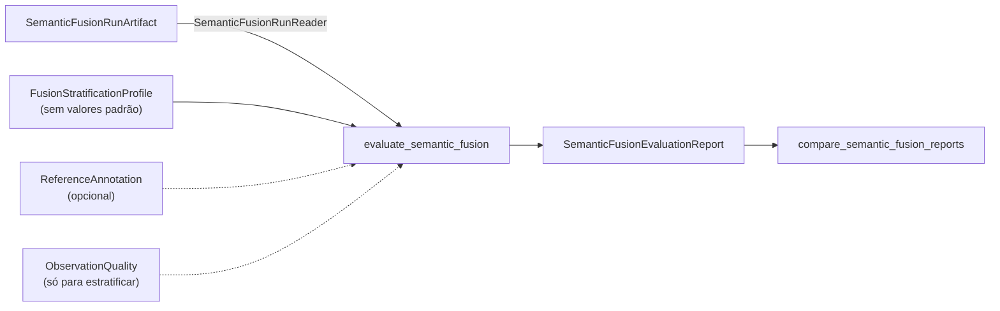

# Avaliação de Semantic Fusion

Este documento descreve `src/contextmap/evaluation/semantic_fusion.py`, versão `EVALUATOR_VERSION = "2"`.

Semantic Fusion é validada como uma etapa de **acumulação de evidência**, e suas falhas precisam continuar visíveis: consistência multi-vista, preservação de incerteza, tratamento de correlação e o valor real dos canais de evidência opcionais. O avaliador lê runs persistidos pelo leitor público, **nunca altera um run e nunca lê `debug/`**, e reporta cada grandeza **separada e com o seu denominador**: não há ranking, vencedor nem escore composto. Custo fica à parte de toda medida de qualidade.

## Seções do relatório

| Seção | Pergunta que responde |
| --- | --- |
| `lineage` | Que run é este? Sequência, mapa, runs de associação, percepção e Point Representation, políticas de agrupamento, suporte e fusão com seus fingerprints, código e esquema. |
| `correlation` | Inferência repetida e geometria multiplicam evidência? Suportes com inferência repetida, máximo de resultados sobre um frame, hipóteses sustentadas por mais resultados que frames, e os invariantes que um run válido mantém em zero: suporte físico acima do total, evidência duplicada, evidência acima do número de claims, referência estrutural repetida. |
| `uncertainty` | A incerteza sobreviveu? Suportes por tipo de registro (contradição, ambiguidade, empate, evidência insuficiente), competição não reportada (deve ser 0), claims em abstenção, pontuadas, não pontuadas e sem hipótese. |
| `channels` | Cada canal (claims, scores, features, qualidade, geometria, estrutura 3D): ativo?, que identidades o alimentaram? quantos itens? Os espaços de embedding e de representação continuam **separados**: nenhuma similaridade entre espaços é calculada. |
| `weighting` | Só para um braço ciente de qualidade: contribuições ponderadas, fatores zero, componentes que caíram no fator neutro, distribuição dos fatores e suportes em que os líderes mudam com a ponderação. |
| `annotations` | Só com anotações (ver abaixo). |
| `strata` | As mesmas medidas por condição (ver abaixo). |
| `cost` | Tempo e memória (só se medidos) e tamanho de cada arquivo contratual, à parte da qualidade. |

### Contagens do run

`physical_observation_count` e `inference_result_count` são **ambas distintas no run inteiro**. Um resultado de percepção tem dezenas de regiões e cada uma cai em um suporte, então somar os resultados por suporte contaria o mesmo resultado várias vezes e deixaria de ser comparável com os frames físicos. O defeito só apareceu na execução real (ver abaixo): com 19 frames físicos e 51 resultados distintos, a versão `"1"` do avaliador (e o `metrics/counts.json` do schema `0.1.0`) informava 604, porque os fixtures sintéticos tinham uma região por resultado. A versão `"2"` do avaliador conta cada resultado uma vez, e o schema do artifact foi para `0.2.0` pelo mesmo motivo: `metrics/` é contratual, então o campo não pode ter dois denominadores sob a mesma `schema_version` (ver [artifact](../../semantic_fusion/docs/artifact.md#versão-do-schema)). A contagem por suporte continua em `metrics/distributions.json` e em `correlation`.

## Anotações: recuperação da referência

`ReferenceAnnotation(spatial_observation_id, label)` dá o rótulo de referência de uma observação espacial. O rótulo de um suporte é o das suas observações; se elas **discordam**, o suporte é `ambiguous_reference` e fica **fora** da correção. Comparação por chave de label, a mesma do baseline (`Door` = `door`).

Cada suporte anotado tem exatamente um resultado, para o líder por **frames físicos distintos de suporte** e, num braço ponderado, também para o líder por **suporte ponderado**:

- `leading_matches_reference`: a hipótese de referência é o único líder;
- `tied_with_reference`: é um de vários líderes empatados;
- `retained_not_leading`: está presente, mas não lidera (a alternativa foi preservada);
- `reference_missing`: nenhuma hipótese tem o rótulo.

**Uma anotação ausente é "não aplicável", nunca um negativo**: suportes sem anotação aparecem em `unannotated_supports` e não entram em nenhum denominador de correção. Anotações de observações que não estão em suporte algum aparecem em `unmatched_annotations`.

## Estratificação

`FusionStratificationProfile` traz as bordas de cada estratificação, **sem valores padrão** (uma faixa que serve a um mapa e a uma câmera não serve a outro): `n` bordas estritamente crescentes dão `n + 1` faixas. Cada estratificação **particiona** os suportes: as faixas mais o estrato `unavailable` contêm cada suporte exatamente uma vez, e uma grandeza que não pôde ser medida vai para `unavailable`, nunca vira zero.

| Estratificação | Grandeza |
| --- | --- |
| `range` | mediana, entre as observações do suporte, da profundidade do suporte (m) |
| `visibility` | mediana da parcela visível |
| `support_density` | mediana dos pontos associados por pixel de máscara |
| `image_border` | mediana da menor distância à borda da imagem preparada (px): periferia e borda de fisheye |
| `physical_observations` | número de frames físicos distintos do suporte |
| `uncertainty_level` | `none`, `ambiguity_or_near_tie`, `contradiction` ou `insufficient_evidence` |

A qualidade é só um **fator de estratificação**, lido de `ObservationQuality` fornecida por quem chama (do artifact de Sensor Association); nunca é tratada como confiança semântica. Sem ela, as quatro primeiras estratificações ficam `unavailable`.

Cada estrato reporta suportes, os que têm incerteza, os anotados, os com referência recuperada e os em que a referência lidera (por frames físicos e, num braço ponderado, por suporte ponderado). Assim, um ganho ou uma regressão aparece **por condição**, e não só numa média global.

## Comparação controlada

`compare_semantic_fusion_reports(reports)` compara braços na **mesma evidência**. Exige exatamente um controle (`BASELINE_CONTROL`) e recusa tudo que não seja a configuração de fusão mudando:

- versão do avaliador, perfil de estratificação e anotações iguais;
- **mesma base de evidência**: mesmos suportes, contribuições e observações físicas (hash);
- mesma sequência, mesmo mapa, mesmas runs de associação, percepção e Point Representation, mesmas políticas de agrupamento e suporte.

O resultado não tem vencedor nem escore. Cada braço mostra a sua política, o fingerprint da configuração, os canais ativos e, contra o controle: se as hipóteses e os stances são exatamente os mesmos e em quantos suportes o líder mudou.

### Ablações previstas

Rodadas a partir dos **mesmos artifacts a montante**, sem regenerar nada:

| Braço | Configuração |
| --- | --- |
| A. baseline (uniforme) | `accumulate_baseline_evidence`, só `semantic_claims` |
| B. ciente de qualidade | `accumulate_quality_aware_evidence`, com componentes de qualidade explícitos |
| canais | claims; claims + scores; claims + visual; claims + visual + 3D |

Nenhum limiar é reajustado por braço: as rampas, o fator neutro, a margem de empate e as bordas de estratificação são declarados uma vez.

**Linhagem dos braços.** A comparação recusa qualquer diferença de linhagem além da configuração de fusão, inclusive `point_representation_run_ids`. Nesta convenção o `FusionRunLineage` registra a **seleção** de runs a montante e não o uso: numa ablação de canais, todo braço lista a mesma run de Point Representation, também o braço que não declara o canal 3D (foi assim que a execução real montou os sete braços). Um braço com a lista vazia ao lado de outro com a run é recusado por `point_representation_run_ids`.

## Execução real (`corridor-02`, 20 frames)

Rótulo: **real** onde a etapa usou dados reais; a exceção está dita em cada linha. Nada aqui é resultado de contrato. A execução usa a amostra pequena de `selection.json` (janela de 90 s, 20 frames) e roda de ponta a ponta pelos leitores e escritores públicos. **Reprodução:** a seleção, o manifest do experimento (identidades e SHA-256 completos das runs de entrada e a configuração dos sete braços), os drivers e os relatórios finais estão versionados no bundle leve [`experiments/semantic-fusion-corridor-02-20260921/`](../../../../experiments/semantic-fusion-corridor-02-20260921/README.md). O dataset e os artifacts grandes (mapa de 924 MB, runs de associação, percepção e Point Representation) **não** estão no Git: o README do bundle diz o que precisa ser regenerado localmente e como conferir as identidades (ver "Reprodução e identidade dos arquivos" no fim desta seção).

| Etapa | O que rodou | Real? |
| --- | --- | --- |
| State Estimation | `ExternalPose` a partir de `corridor-02-gt.txt` (684 poses); **não** é FAST-LIO | real, com a referência do dataset como entrada |
| Geometric Mapping | 860 dos 892 scans LiDAR da janela (32 rejeitados pelo lookup de pose), 14 422 535 pontos, `all-points` | real |
| Sensor Association | modelo **MEI** de `corridor-02-Intrinsics.yaml`; oclusão `cell_size_px=4`, `neighborhood_radius_cells=2`, margem de 0,1 m + 2 %; 19 dos 20 frames associados | real |
| Percepção | `PerceptionRunArtifact` existentes: `vp-sam2-sel` (429 regiões com máscara), `vp-sam2-rerun` (repetição bit a bit idêntica da anterior) e `vp-sam3-building` (78 regiões com máscara); **`claim_count = 0` em todas** | real, sem claims |
| Point Representation (canal 3D) | descritor geométrico determinístico, raio de 0,5 m, 189 âncoras (uma por suporte); **não** é PTv3 | real, encoder determinístico |
| Semantic Fusion | suportes `geometry-jaccard-support-v1` (`min_geometry_count=5`, `min_overlap=0,3`) e sete braços | real |

As três runs de percepção que não entram (`vp-sam3-sel`, `vp-florence-sel`, `vp-florence-bf16`) têm 0 regiões ou regiões só com caixa. Por contrato (`SkipReason.NO_INLINE_MASK`) uma região sem máscara inline não vira `SpatialObservation`; elas não foram associadas nesta execução.

### Contagens e estrutura multi-vista

- 3 runs de associação, **896 observações espaciais** (410 + 410 + 76), **19 frames físicos**, **51 resultados de inferência** distintos, 3 runs de percepção e **2 variantes** de inferência (a repetição do SAM2 não é uma variante).
- **191 suportes**; 290 observações excluídas de forma explícita (149 sem nenhuma geometria visível e 141 com 1 a 4 elementos, abaixo do mínimo declarado). 152 suportes têm um só frame físico e **39 têm dois ou mais** (mediana 1, p90 3, máximo 5): a consistência geométrica multi-vista existe e é o que a execução mede. O maior suporte tem 15 observações (2,5 % do total), então não há componente gigante. A mediana de 2 observações contra 1 frame físico por suporte é a repetição de inferência do SAM2.
- Sensibilidade só estrutural do suporte (nunca usada para escolher a política): `min_overlap` 0,1 / 0,2 / 0,3 / 0,5 dá 164 / 183 / 191 / 208 suportes e 33 / 38 / 39 / 34 deles com vários frames; `min_geometry_count=20` dá 134 suportes, 28 multi-vista.

### Correlação e determinismo

- Os quatro invariantes que um run válido mantém em zero (suporte físico acima do total, evidência duplicada, evidência acima de claims, referência estrutural repetida) ficaram em **zero em todos os braços**. 178 dos 191 suportes têm inferência repetida, com no máximo 3 resultados sobre um frame.
- **Repetição de inferência, teste direto em dado real:** fundir só `vp-sam2-sel` e fundir `vp-sam2-sel` + `vp-sam2-rerun` deu, em 179 de 179 suportes, geometria idêntica, os mesmos frames físicos, a **mesma contagem de observações físicas**, e contribuições e resultados exatamente dobrados: a segunda inferência não infla a evidência independente.
- Os sete arquivos contratuais são **byte a byte iguais** entre duas execuções e com a ordem das observações e das runs embaralhada.

### Braços e canais (mesma base de evidência)

Todos os braços leem as mesmas runs de associação, os mesmos resultados de percepção, o mesmo mapa e a mesma política de suporte; `compare_semantic_fusion_reports` aceita os sete.

| Braço | Canais ativos além de claims e geometria | Itens de dado |
| --- | --- | --- |
| baseline uniforme (controle) | nenhum | 0 claims |
| claims + scores | `semantic_scores` | 0 |
| claims + visual | `visual_features` | 1 148 referências |
| claims + visual + 3D | `visual_features`, `point_representation` | 1 148 e 250 |
| todos os canais | os quatro | 1 148 e 250 |
| ciente de qualidade, profundidade + borda | `observation_quality` | 606 |
| ciente de qualidade, só profundidade | `observation_quality` | 606 |

As rampas foram declaradas **antes** de olhar qualquer saída de fusão, só pela marginal de um trial de 2 frames: profundidade `good=4 m`, `bad=30 m`; distância à borda `good=60 px`, `bad=10 px`; fator neutro 0,5. `visible_share` **não** foi usada como rampa: ela é muito baixa para uma parte grande das regiões (29 % dos suportes têm mediana abaixo de 0,1 %), porque a pegada conta também os pontos ocluídos atrás da superfície num mapa acumulado por 90 s.

**Leitura honesta.** Os sete braços têm hipóteses, stances e líderes iguais (`hypotheses_match_control` e `stances_match_control` verdadeiros, 0 suportes com líder alterado) porque **não existe hipótese**: os 191 suportes são `insufficient_evidence`. Os canais só acrescentam referências, e o canal de scores está vazio (um score referencia uma claim). Logo a execução **não** dá evidência do valor de nenhum canal nem da ponderação para a semântica. O que ela mostra:

- o peso é inspecionável e varia com a condição: no braço profundidade + borda, 87 % das contribuições a 12 m ou mais têm fator 0 (mediana 0 nessa faixa), contra 0 % entre 3 e 6 m (mediana 0,95); a borda zera 16 % das contribuições a menos de 3 m. Só com profundidade há 121 contribuições com fator 0, contra 179 com a borda;
- consistência visual como proxy sem anotação (medida ad hoc no driver, **não** é métrica do harness): no espaço de embedding do CLIP de região, pares de vistas de frames diferentes do **mesmo suporte** têm cosseno mediano 0,986 (185 pares, 38 suportes), contra 0,741 em pares aleatórios de suportes e frames diferentes; a probabilidade de um par do mesmo suporte ser mais parecido que um par aleatório é 0,994. O canal visual é consistente com o suporte geométrico, mas o nulo é fraco (superfícies uniformes como piso e parede dominam) e isso nada diz sobre acerto de rótulo. Pares cuja pior contribuição tem fator 0 têm a cauda inferior mais pesada (p10 0,878, n = 55) que os demais (p10 de 0,95 a 0,97): indício fraco de que o fator identifica vistas piores, não prova.

### Custo

Suportes em 2,9 s; acumulação de 0,5 a 0,6 s por braço; escrita de 0,7 s; 4,4 a 4,9 MB por braço; pico de memória do driver de fusão de 3,5 GB. Os 189 vetores de Point Representation levaram 450 s (2,4 s por âncora, dominado pela consulta espacial sobre 14,4 milhões de pontos). Sensor Association levou de 214 a 260 s por run de percepção e chegou a **20,7 GB** de pico de memória: o gargalo da cadeia é a associação, não a fusão.

### Defeito encontrado e corrigido

A execução real mostrou `inference_results = 604` em `metrics/counts.json` e no relatório, para 51 resultados distintos: ambos somavam `inference_result_count` por suporte, e um resultado de percepção tem dezenas de regiões em suportes diferentes. Os fixtures sintéticos tinham uma região por resultado e não podiam ver isso. Corrigido (avaliador na versão `"2"`) com testes de regressão. A correção sozinha deixava dois artifacts reais com `schema_version = 0.1.0` e `inference_results` de 604 e de 51; o schema do `SemanticFusionRunArtifact` foi para `0.2.0` e o leitor recusa `0.1.0` (teste de regressão em `tests/semantic_fusion/test_fusion_run_artifact.py`).

### O que a execução não prova

- Correção, contradição, ambiguidade, empate, abstenção e o efeito de scores: sem claims e sem anotações, **N/A**.
- A trajetória é a referência do dataset usada como entrada (não FAST-LIO), e a calibração MEI foi derivada por fora: o `SequenceArtifact` persistido guarda `camera_model=None` para a câmera ("MEI intrinsics not representable") e o projetor recusa uma calibração de identidade diferente da do mapa. Estado, mapa e associação foram por isso refeitos sob uma calibração derivada do YAML.
- Um único trecho de 90 s e 20 frames, sem repetição entre trechos; canal 3D com descritor determinístico, não PTv3.
- Um dos 20 frames (`camera_1_image_raw-009106`) foi rejeitado pelo lookup de pose (lacuna de 403 ms na trajetória), embora a regra de seleção o aceitasse por lacuna abaixo de 450 ms.

O próximo passo para decidir a política ciente de qualidade são runs de percepção com claims reais e anotações de referência (`ReferenceAnnotation`); o mesmo driver roda de novo sobre elas sem mudança.

### Reprodução e identidade dos arquivos

O bundle [`experiments/semantic-fusion-corridor-02-20260921/`](../../../../experiments/semantic-fusion-corridor-02-20260921/README.md) (menos de 1 MB) guarda o que se precisa para revisar e repetir a execução sem o dataset: `manifest.json` (versões de código, hash dos arquivos do dataset, `SequenceArtifact`, identidade da seleção e os 20 frames, `run_id` e digest dos outputs de cada run de entrada, parâmetros declarados antes de olhar as saídas e os sete braços), `selection.json`, os drivers `s01` a `s07`, `verify_inputs.py` e os relatórios finais. Precisam ser regenerados localmente: o dataset e o `SequenceArtifact` (não versionados), as três runs de percepção (GPU, de uma validação anterior, que o bundle não regenera) e as etapas `s01` a `s03` e `s04` (sem GPU; a associação leva de 214 a 260 s por run e a fusão cerca de 9 minutos, com Point Representation dentro).

**Estado dos runs registrados.** Os sete braços foram gravados com o código `6826da4` sob `schema_version` `0.1.0`, já com a contagem distinta de resultados. Como o schema do artifact é `0.2.0` (ver [artifact](../../semantic_fusion/docs/artifact.md#versão-do-schema)), o leitor atual **recusa** esses runs locais; reexecutar `s04_fusion.py` os regenera em `0.2.0`.

**Reexecutada nesta correção** (`s03_sensor_association.py` e `s04_fusion.py`, lendo read-only as mesmas runs de State Estimation, Geometric Mapping e Sensor Association já gravadas): dos 4 906 campos folha do relatório, 4 857 são idênticos byte a byte; os 49 diferentes são tempo, memória, `code_sha`/`code_version` e o `schema_version` `0.1.0` → `0.2.0` desta correção, nunca uma grandeza de resultado. As 49 identidades de resultado (`support_count`, `physical_observation_count`, `inference_result_count`, `evidence_base_id`, `hypothesis_labels_id`, `hypothesis_stances_id` e o fingerprint de configuração, nos sete braços) batem, o determinismo se confirma de novo e a repetição de inferência continua dobrando exatamente. Detalhes no README do bundle.

SHA-256 completos, versionado (o arquivo no Git) e executado (o arquivo local que rodou). Os dois coincidem, exceto onde caminhos absolutos pessoais foram trocados por `<VALIDATION_DIR>` e `<REPO_ROOT>` (relatórios) ou por constantes configuráveis (drivers `common.py` e `s04_fusion.py`); o manifest tem os de todos os arquivos.

| Arquivo do bundle | Versionado (SHA-256) | Executado (SHA-256) |
| --- | --- | --- |
| `reports/semantic_fusion/report.json` (relatório completo dos sete braços) | `d30b148d71ce0092eec0d60aeab094d16c166da7ce79ae818e672c30002139e2` | `85d33dc59def3d2587c90ab1ab3ec853fa23cbbbd6b0e194f4c5dab4819ea82d` |
| `reports/semantic_fusion/visual_consistency.json` (análise visual) | `52d7fe609a90a329d6188c6c7f03d83cff593c3f9095af2366f2d43335a21845` | idêntico ao versionado |
| `scripts/common.py` (constantes de caminho dos drivers) | `a8abc902ab9414dd3564b02878e048efe3ea7daaedc84b881eda3d5946b96a20` | `57c9be7ec450b0a0eab9c2d9d67b8133e70c2347c40123a56b4680e435280640` |
| `scripts/s04_fusion.py` (driver da fusão) | `dc0d487b7217086fc67bca14c44ea1876dae79be0bdb16b9d5554da579f2621f` | `9119e670bfa60d03b4e051a160e19a7492799a66c46b4aa5abf63d347db2d05e` |
| `selection.json` (seleção dos 20 frames) | `0fe5c5a4e7ec8babade312ba1c130bcc41b356419d793090c1c24a170af44a31` | idêntico ao versionado |

## Limitações e pendências

- **A decisão não está comprovada, mesmo com uma execução real.** Existe agora um run de fusão sobre dados reais do `corridor-02` (seção anterior), mas nenhuma run de percepção tem claims (`claim_count = 0`) e não há anotações de referência. Sem claims não existe hipótese: os braços não diferem em hipótese, stance nem líder, e a correção é N/A. O critério "resultados que sustentam a decisão de manter a política ciente de qualidade opcional ou adotá-la" continua **sem base**: a política ciente de qualidade permanece opcional e nenhuma decisão foi tomada.
- A ablação downstream (com Semantic Mapping e Entity Resolution) ainda não existe; o avaliador de fusão existe justamente para que uma falha aqui não seja escondida por uma métrica de estágio posterior.
- A correção compara hipóteses ao rótulo de referência por chave de label; refinamentos como `pallet` e `wooden pallet` não são equiparados (o baseline não reconhece refinamentos).
- Uma tabela de referência por suporte é ephemeral (suportes não são estáveis entre reconstruções); por isso a anotação é por observação espacial.
