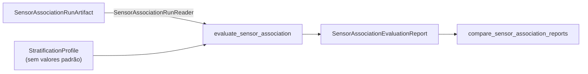

# Avaliação de Sensor Association

Este documento descreve `src/contextmap/evaluation/sensor_association.py`, versão `EVALUATOR_VERSION = "1"`.

Sensor Association é validada como uma etapa de **ancoragem de evidência**: a que distância está a geometria de apoio, quanto de cada região estava visível, com que densidade ela é suportada, onde está na imagem, quão bem a pose se alinha no tempo e qual caminho de features densas foi amostrado. O avaliador lê um run persistido pelo **leitor público** e relata esses fatores mensuráveis **por estrato**, com a linhagem completa. Nada aqui altera um run, e nada vira uma probabilidade única nem se mistura com a confiança semântica.

## Estratificação

`StratificationProfile` traz as bordas de cada estratificação, sem valores padrão: uma faixa que serve a um mapa e a uma câmera não serve a outro. `n` bordas estritamente crescentes dão `n + 1` faixas `(-inf, e0)`, `[e0, e1)`, …, `[e_último, +inf)`; uma lista vazia dá uma faixa só, e a borda pertence à faixa de cima.

| Estratificação | Componente de `ObservationQuality` | Unidade |
| --- | --- | --- |
| `range` | mediana da profundidade do suporte (`support_depth`) | m |
| `visibility` | parcela visível da pegada (`visible_share`) | razão |
| `support_density` | pontos associados por pixel de máscara | pontos/pixel |
| `image_border` | menor distância do suporte à borda da imagem preparada (`border_distance`); separa a periferia e as bordas inválidas de fisheye | px |
| `viewing_angle` | mediana do ângulo do suporte com o eixo óptico (`support_off_axis_angle`) | rad |

Cada estratificação **particiona** as observações: as faixas mais o estrato `unavailable` contêm cada uma exatamente uma vez. Uma medida que não pôde ser feita (por exemplo, a profundidade de uma região sem geometria) vai para `unavailable` e nunca é tratada como zero; já uma densidade `0.0` medida é uma faixa como qualquer outra.

### Denominadores explícitos e frames físicos

Cada `StratumReport` guarda `observation_count` (regiões), `associated_count` e `footprint_count` somados, e `pooled_visible_share = associated_count / footprint_count`, com o denominador à vista (`None` quando nada foi projetado).

Observações são regiões, então cada estrato também conta os **frames físicos** distintos (`physical_observation_count`): várias regiões de um mesmo frame, ou inferência repetida sobre um mesmo frame, não são várias observações físicas.

## Caminhos de features

`FeaturePathReport` descreve como cada canal denso foi amostrado: política de interpolação, as fontes de features exatas do manifest (artefato de origem, espaço de embedding, geometria de amostragem, extrator e melhoria de resolução), frames, pontos elegíveis, amostrados e fora do suporte, e `sampled_ratio` com o denominador à vista. Nativo e melhorado aparecem lado a lado, cada um com a sua identidade.

## Tempo e reprojeção

`TimingReport` resume, por frame físico, a distância da pose ao timestamp do frame e os desfechos do lookup. `ReprojectionReport` só considera os frames com referência confiável: conta frames com e sem referência, correspondências (e as inválidas) e resume, entre os frames, a mediana e o p95 de cada um. Nenhum resíduo é inventado para um frame sem referência.

## Linhagem

`SensorAssociationLineage` copia do manifest tudo o que identifica o run: `run_id`, sequência, seleção, mapa geométrico, trajetória e run de State Estimation, runs de percepção, identidade da calibração, política de visibilidade (com o fingerprint), política de pertencimento, versões das definições, política de pose, tolerâncias, `configuration_fingerprint` e versão do código.

## Comparação controlada

`compare_sensor_association_reports(reports)` compara runs que diferem **apenas** no caminho de features: exige a mesma sequência, seleção, geometria, trajetória, calibração, percepção, política de visibilidade e de pertencimento, política de pose, tolerâncias, versões das definições, perfil de estratificação e versão do avaliador, e recusa se qualquer medida do lado da geometria (estratos, tempo, reprojeção, contagens) diferir. O resultado preserva a identidade, a configuração e os caminhos de features de cada run.

Isso permite medir um caminho nativo e um melhorado mantendo geometria, calibração, percepção e configuração de associação constantes.

## Restrições

- CI usa fixtures sintéticos determinísticos e não exige modelos pesados nem rede;
- um arquivo `.pcd` arbitrário nunca é verdade de referência pelo nome: o avaliador só lê runs pelo leitor, e a referência de reprojeção só existe quando o run a registrou como confiável;
- o avaliador não repara erros de associação nem envolve Semantic Fusion;
- o relatório não tem campo de confiança, de similaridade, de peso nem de nota: as medidas mantêm as suas unidades.

## Como é verificado

Um run sintético com regiões em faixas diferentes de alcance, densidade e distância à borda (incluindo uma região sobreposta e uma sem geometria) e dois frames: partição de cada estratificação, contagens de frames físicos, denominadores, a borda que pertence à faixa de cima, uma lista vazia de bordas, zero medido versus `unavailable`, caminhos nativo e melhorado com a bilinear fora do domínio no canto, tempo e reprojeção com e sem referência, determinismo e JSON, ausência de campos de confiança, o run que não é modificado e a recusa de um run corrompido, e a comparação controlada com cada tipo de deriva. Mutações que enviam a borda para a faixa de baixo, contam regiões como frames físicos, coagem `unavailable` a uma faixa, permitem deriva de perfil ou de geometria ou contam todo elegível como amostrado fazem testes falharem.
