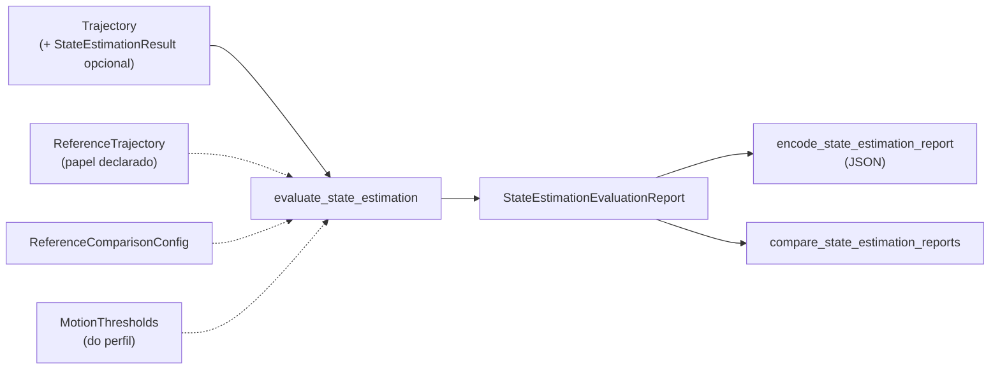

# Avaliação de State Estimation

Este documento descreve `src/contextmap/evaluation/state_estimation.py`.

## Por que existe

State Estimation não é aceito só porque emite poses. A trajetória precisa ser numericamente válida, temporalmente coerente, consistente em frames e, quando existe uma referência confiável, **medidamente** próxima dela. O harness produz um único esquema de relatório para qualquer backend, de modo que o baseline `ExternalPose` e um estimador como o FAST-LIO são comparados sob o mesmo protocolo, cada um com sua identidade e configuração preservadas.

Não faz parte desta avaliação: qualidade semântica ou de percepção, e a correção física da calibração câmera↔LiDAR (a validação por reprojeção pertence a Sensor Association).



## Camadas do relatório

| Seção | O que mede |
| --- | --- |
| `structural` | Estrutura reverificada a partir dos números: valores finitos, maior `\|‖q‖ − 1\|`, menor intervalo, gaps, poses degradadas e observações consumidas/rejeitadas. Os contratos já impedem uma trajetória inválida de existir; o relatório não confia nisso, recalcula. |
| `motion` | Distribuições por intervalo de deslocamento, rotação, velocidade linear e angular, e distribuição do intervalo de amostragem. Saltos só são reportados contra `MotionThresholds`. |
| `temporal` | Métricas de alinhamento temporal de lookups fornecidos (`summarize_lookups`). |
| `transform_trace` | Cadeias reconstruíveis `T_reference_sensor(t) = T_reference_body(t) · T_body_sensor` para poses amostradas, com o erro numérico de composição e de round trip inverso. |
| `accuracy` | Comparação com uma referência confiável: associação, alinhamento, ATE, erro de orientação e RPE. |
| `cost` | Número de poses e tempo de execução. |

Qualidade e custo ficam em seções separadas: um backend mais rápido não é automaticamente melhor, e o JSON só traz `runtime_s` dentro de `cost`.

## Perfil de referência

Tudo o que é específico de um dataset vive em um **perfil de referência**, nunca no harness. `StateEstimationReferenceProfile` reúne a identidade do perfil, o papel declarado do arquivo de referência, o **hash do conteúdo** desse arquivo, os limiares de movimento e o protocolo de comparação, e é lido de um JSON (`decode_reference_profile()`, esquema `contextmap.state_estimation_reference_profile/1`).

`declare_reference(trajectory, source_file=...)` só devolve uma `ReferenceTrajectory` quando duas coisas valem sobre **os mesmos bytes**, lidos uma única vez:

1. o SHA-256 do arquivo é o que o perfil declara: um arquivo não é a referência pelo nome, e uma cópia editada é recusada;
2. **cada pose da trajetória é uma amostra desse arquivo**: o mesmo timestamp (em nanossegundos exatos) e posição e rotação iguais a menos de 1e-9 m e 1e-9 rad, ou seja, só o arredondamento de ponto flutuante (um quaternion que o backend renormalizou continua a mesma rotação). O arquivo é lido como texto TUM (`t x y z qx qy qz qw`: segundos decimais, metros, quaternion `(x, y, z, w)`; linhas em branco e `#` são ignoradas); uma linha que não é uma pose, ou o texto que não é UTF-8, é recusado com o número da linha.

Sem a segunda condição o relatório poderia afirmar o hash de uma fonte enquanto ATE e RPE eram calculados contra outra trajetória (achado da revisão da PR #419). Uma trajetória que cobre só uma **janela** do arquivo (a seleção da sequência) é aceita; uma pose que o arquivo não tem, ou que difere dele, não é. A identidade do perfil, o caminho e o hash da fonte entram no relatório (`reference`), e `compare_state_estimation_reports` recusa comparar relatórios medidos contra arquivos de referência diferentes.

Uma `ReferenceTrajectory` construída diretamente (sem o perfil) não passa por essa prova: o hash que ela carrega é uma afirmação de quem a construiu. Só a declaração pelo perfil vincula a fonte às poses; a comparação de sensibilidade com a referência deslocada no tempo, por exemplo, constrói a referência à mão justamente porque essas poses deixaram de ser amostras do arquivo.

### Limiares vêm do perfil, nunca do código

`MotionThresholds` não tem valores padrão. Cada limite (`max_translation_delta_m`, `max_orientation_delta_rad`, `max_linear_speed_mps`, `max_angular_speed_radps`) é opcional e só é aplicado quando um perfil de referência o fornece; sem limiares, o movimento é medido e nenhuma anomalia é declarada. Limites herdados de um único corredor ou dataset não podem ficar no código.

Cada perfil deve documentar seus limiares e a justificativa:

```text
perfil: <id do perfil>@<versão>
    fonte e hash da referência   <caminho e sha256>
    max_linear_speed_mps         <valor e justificativa>
    max_angular_speed_radps      <valor e justificativa>
    tolerância de associação     <max_time_difference_ns e por quê>
    intervalo do erro relativo   <relative_interval_ns, tolerância e por quê>
    alinhamento adotado          NONE | SE3 e por quê
```

### Perfil `reference-profile:corridor-02@1`

Arquivo: `src/contextmap/evaluation/profiles/corridor-02-state-estimation-v1.json`.

| Campo | Valor | Justificativa |
| --- | --- | --- |
| Fonte e papel | `datasets/corridor-02/corridor-02-gt.txt`, `EVALUATION_REFERENCE`, `sha256:cddb6739…be0a` | Papel declarado pelos mantenedores para esta milestone; o nome do arquivo não o estabelece, o hash sim. A acurácia do próprio arquivo **não é caracterizada pelo dataset** (ver o limite abaixo). |
| `max_linear_speed_mps` | 5,8 | 1,5 × a maior velocidade linear do próprio arquivo de referência (3,86 m/s nas 5522 poses). É um limite derivado do dado, não um limite físico do rig: sinaliza saltos que a referência nunca mostra. |
| `max_angular_speed_radps` | 2,5 | 1,5 × a maior velocidade angular do arquivo (1,65 rad/s), pelo mesmo critério. |
| Limites por intervalo (deslocamento, rotação) | não definidos | Dependem do intervalo entre poses, que varia com os gaps da fonte (até 907 ms); só as velocidades são independentes dele. |
| `max_time_difference_ns` | 10 ms | Os timestamps do arquivo coincidem com os das varreduras LiDAR (diferença máxima de 119 ns) e as poses do FAST-LIO levam o tempo do fim da varredura, ~0,07 ms antes da varredura seguinte; as diferenças medidas têm mediana de 0,03 ms e máximo de 0,20 ms. 10 ms é 10% do período de varredura e vale ≤ 3,9 cm a 3,86 m/s. |
| `alignment` | `SE3` | O frame do FAST-LIO é local (ancorado na primeira pose). Sem alinhamento o erro seria de 136,8 m. |
| Erro relativo | 1,0 s ± 50 ms | Um segundo é a escala de deriva que importa para o mapa; ±50 ms é meio período de varredura. |

**Limite da referência:** o arquivo tem poses estampadas nos mesmos instantes das varreduras LiDAR e nenhum registro de como foi produzido. É provável que seja uma estimativa baseada em LiDAR (há um `corridor-02.pcd` no dataset), não uma medição independente como captura de movimento. O erro medido contra ele é concordância com essa referência, e não pode ser lido como erro absoluto contra a verdade física.

## Referência confiável

Um arquivo de poses nunca é "ground truth" pelo nome. `ReferenceTrajectory` carrega o `reference_id` do perfil que a declara e o `ReferenceRole`. Só `EVALUATION_REFERENCE` é aceito; `INPUT_MEASUREMENT` (uma pose usada como entrada do estimador) levanta `StateEstimationEvaluationError`.

## Protocolo de comparação (`ReferenceComparisonConfig`)

Sempre explícito, sem valores implícitos:

- **Associação:** cada pose estimada é pareada com a pose de referência mais próxima dentro de `max_time_difference_ns`, reutilizando `TrajectoryLookup` (política `NEAREST`). As não pareadas são **contadas**, nunca descartadas em silêncio; nenhuma associável é erro. Domínios de clock diferentes são erro: nunca são comparados implicitamente.
- **Alinhamento:** `NONE` mede o erro incluindo qualquer offset de frame; `SE3` aplica o alinhamento rígido de Horn/Umeyama (rotação e translação, sem escala) que minimiza o erro de posição e o registra no relatório (`alignment`). O alinhamento esconde por construção um offset constante de frame, e com posições colineares a rotação em torno da reta é indeterminada. Exige ao menos três poses associadas. Escolher `SE3` é uma decisão do perfil, registrada; nunca é feito às escondidas para "consertar" o erro que se quer medir.
- **ATE** (erro absoluto de trajetória): distância entre a posição (alinhada, se for o caso) e a de referência; **erro de orientação** em radianos pelo menor ângulo entre as rotações.
- **RPE** (erro relativo): quando `relative_interval_ns` é definido (junto com `relative_interval_tolerance_ns`, sempre explícita), o erro do movimento relativo entre cada pose associada e a pose associada mais próxima de `t + intervalo`, dentro da tolerância. O intervalo é ancorado no **tempo**, não na posição na lista de poses associadas: quando a referência perde poses (o `corridor-02` perde ~25%), um par por índice cobriria mais que o intervalo nominal (medido: 1,0 a 2,0 s para 10 poses) e o erro, que cresce com o intervalo, deixaria de ser comparável. Sem par no intervalo, o RPE é `None`. Independe do alinhamento e expõe deriva que o alinhamento esconde.

Estatísticas (`ErrorStatistics`): contagem, RMSE, média, mediana, p95 (nearest rank) e máximo.

## Reprodutibilidade

O relatório registra: versão do avaliador (`evaluator_version`, incrementada quando uma definição de métrica muda), sequência e seleção, `run_id`, `trajectory_id`, backend, versão e fingerprint de configuração, identidade da calibração, identidade, papel, caminho e hash da fonte da referência e o protocolo de comparação. `encode_state_estimation_report` produz JSON puro com tudo isso.

## Comparação entre backends

`compare_state_estimation_reports` recebe um relatório por backend e devolve uma comparação que preserva a identidade, o fingerprint e a calibração de cada um. Ela **rejeita** relatórios em que mudou mais do que o backend: sequência, seleção, referência (identidade e hash da fonte), protocolo de comparação ou versão do avaliador, e duas calibrações diferentes. Um backend que não consome calibração (`ExternalPose`, identidade `None`) não conflita com um que consome (FAST-LIO); a comparação guarda a identidade de cada entrada. Exige ao menos dois relatórios, todos com comparação contra referência.

## Testes e execução real

A suíte determinística (`tests/evaluation/test_state_estimation_evaluation.py` e `test_state_estimation_reference_profile.py`, `tests/state_estimation/test_state_estimation_backend_evaluation.py`, que avalia e compara os backends reais `ExternalPose` e FAST-LIO com um processo substituto, mais os testes de contrato, lookup, preflight e artifact de `state_estimation`) roda em CI sem dados nem rede, com trajetórias sintéticas de resposta conhecida: offset constante que vira o ATE exato sem alinhamento, offset rígido removido pelo `SE3`, deriva de escala visível no RPE (ancorado no tempo, com poses de referência ausentes), cadeias de transform com valores calculados à mão, o hash do arquivo de referência, o vínculo entre esse arquivo e as poses da referência (uma pose deslocada, uma sem amostra no arquivo, uma janela válida, linhas inválidas) e a comparação de um backend sem calibração com um que a consome. Um teste com dados reais é executado somente quando o dataset existe (variável `CONTEXTMAP_CORRIDOR02_DIR` ou `datasets/corridor-02`), porque o dataset não é versionado; ele declara a trajetória de todas as 5522 poses de `corridor-02-gt.txt` e recusa a mesma trajetória com uma única pose deslocada em 1 mm.

## Relatório-baseline `ExternalPose` (`corridor-02`)

Execução real sobre o arquivo de poses de `corridor-02` (5522 poses), sem comparação contra referência (a trajetória avaliada é ela própria a medição de entrada, então ATE seria trivialmente zero):

- estrutura: todos os valores finitos, maior `\|‖q‖ − 1\|` de 2,2e−16;
- amostragem: intervalo mínimo/mediano/p95/máximo de 100,8 / 100,9 / 302,6 / 907,7 ms; a fonte não cobre o bag de forma contínua;
- movimento: deslocamento por intervalo com mediana de 2,4 cm e p95 de 43 cm; velocidade linear com mediana de 0,18 m/s, p95 de 2,28 m/s e máximo de 3,86 m/s; velocidade angular com mediana de 0,045 rad/s e máximo de 1,65 rad/s.

Esse baseline foi medido antes do perfil de referência existir, por isso não declara anomalias. Sob os limiares do perfil `corridor-02@1`, o próprio arquivo de referência não tem nenhuma (verificado pelo teste com dados reais).

## Relatório FAST-LIO (`corridor-02`, execução real)

**Real**, não de contrato: a trajetória do FAST-LIO da execução descrita em [backends de State Estimation](../../state_estimation/docs/backends.md) (imagem local `sha256:670973462caa…`, base `osrf/ros@sha256:7dbfb957…`, FAST-LIO `7cc4175d…`, `fastlio_mapping` `sha256:2bfa3f97…`, 888 poses; a equivalência da imagem com a receita fixada e o que continua não fixado estão em [backends](../../state_estimation/docs/backends.md)), avaliada contra o `corridor-02-gt.txt` sob o perfil `reference-profile:corridor-02@1`, sobre a janela de 90 s da seleção `sha256:dc641b34…` (85,2 m de percurso, 573° de guinada acumulada). Os relatórios ficam em `workspace/corridor-02/validation-state-estimation-20260921/evaluation/`.

| Medida | Resultado |
| --- | --- |
| Associação | 669 das 888 poses com pose de referência a ≤ 10 ms (diferença máxima de 0,20 ms); as 219 restantes caem nos gaps do arquivo de referência e são contadas, não descartadas |
| ATE (posição, após SE(3)) | RMSE 0,092 m; média 0,086; mediana 0,089; p95 0,139; máximo 0,244 m |
| Erro de orientação (após SE(3)) | RMSE 1,10°; máximo 2,03° |
| RPE 1 s ± 50 ms | 502 pares; translação RMSE 0,080 m (máximo 0,307); rotação RMSE 0,36° (máximo 1,62°) |
| Alinhamento aplicado | translação (114,95; −94,55; −0,49) m, quaternion (0,020; −0,008; 0,844; 0,535); composto com a primeira orientação do FAST-LIO reproduz a orientação de referência na primeira pose a 0,52° |
| Movimento | sem anomalia sob os limiares do perfil; velocidade linear mediana 0,55, p95 2,13, máxima 2,77 m/s |
| Transform trace | erro máximo de composição 0 m / 2,2e−16 rad; round trip 7,9e−15 m |
| Lookup nos 892 timestamps das varreduras | 887 interpoladas, 5 fora do intervalo da trajetória (as primeiras varreduras, antes da inicialização, e a última) |
| Custo (separado) | ~100 s de execução para 90 s de dados |

Verificações de robustez do próprio protocolo:

- **Controle positivo.** O `ExternalPose` sobre o mesmo arquivo, avaliado contra ele mesmo, dá ATE de 5e−14 m e erro de rotação de 2e−16 rad: o avaliador, a associação e o alinhamento não introduzem erro. Como entrada e referência são o mesmo arquivo, esse zero é por construção e **não** é uma medida do `ExternalPose`; a comparação `ExternalPose` × FAST-LIO no mesmo esquema existe (`comparison_externalpose_fast_lio.json`) e deve ser lida assim.
- **Tolerância de associação.** 5, 10 e 50 ms dão os mesmos 669 pares e o mesmo ATE: a associação temporal é exata, não depende da tolerância.
- **Semântica do timestamp.** Deslocar a referência de ±1 varredura (100,9 ms) piora o ATE para 0,184 m (−1) e 0,121 m (+1); o melhor ajuste é com deslocamento zero, coerente com a leitura de que o carimbo do arquivo de referência é o mesmo instante do fim da varredura anterior.
- **Sem alinhamento** o ATE seria de 136,8 m: a comparação só faz sentido com o `SE3` explícito.
- **Repetibilidade.** Três execuções do FAST-LIO sobre a mesma entrada dão trajetórias idênticas byte a byte (não são observações independentes).

**Limites.** Uma sequência e uma única janela de 90 s (a mesma da validação do baseline). A referência não tem acurácia caracterizada e provavelmente é derivada de LiDAR (ver o perfil): a concordância de 9 cm pode compartilhar modos de erro com ela. O alinhamento SE(3) usa todas as poses associadas, então esconde um erro constante de frame por construção; o RPE mostra a deriva local.

**Limites de regressão documentados para este perfil e esta janela** (2× o resultado atual; não são impostos em CI, porque exigem o docker do FAST-LIO e o dataset): ATE RMSE ≤ 0,20 m, RPE de 1 s com translação RMSE ≤ 0,16 m, erro de orientação máximo ≤ 4° e nenhuma anomalia de movimento. Um resultado acima disso é regressão do estimador, do wrapper ou da configuração e não deve ser aceito sem explicação. A parte determinística (perfil, hash, protocolo, comparação entre backends) é coberta em CI; com o dataset presente, `CONTEXTMAP_CORRIDOR02_DIR` também verifica o hash do arquivo de referência e a ausência de anomalias de movimento nele.
