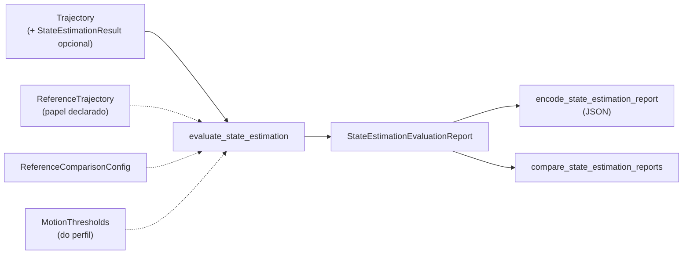

# Avaliação de State Estimation

Este documento descreve `src/contextmap/evaluation/state_estimation.py`.

## Por que existe

State Estimation não é aceito só porque emite poses. A trajetória precisa ser numericamente válida, temporalmente coerente, consistente em frames e, quando existe uma referência confiável, **medidamente** próxima dela. O harness produz um único esquema de relatório para qualquer backend, de modo que o baseline `ExternalPose` e um estimador como o FAST-LIO são comparados sob o mesmo protocolo, cada um com sua identidade e configuração preservadas.

Não faz parte desta avaliação: qualidade semântica ou de percepção, e a correção física da calibração câmera↔LiDAR (a validação por reprojeção pertence a Sensor Association).



## Camadas do relatório

| Seção | O que mede |
| --- | --- |
| `structural` | Estrutura reverificada a partir dos números: valores finitos, maior `\|‖q‖ − 1\|`, menor intervalo, gaps, poses degradadas e observações consumidas/rejeitadas. Os contratos já impedem uma trajetória inválida de existir; o relatório não confia nisso, recalcula. |
| `motion` | Distribuições por intervalo de deslocamento, rotação, velocidade linear e angular, e distribuição do intervalo de amostragem. Saltos só são reportados contra `MotionThresholds`. |
| `temporal` | Métricas de alinhamento temporal de lookups fornecidos (`summarize_lookups`). |
| `transform_trace` | Cadeias reconstruíveis `T_reference_sensor(t) = T_reference_body(t) · T_body_sensor` para poses amostradas, com o erro numérico de composição e de round trip inverso. |
| `accuracy` | Comparação com uma referência confiável: associação, alinhamento, ATE, erro de orientação e RPE. |
| `cost` | Número de poses e tempo de execução. |

Qualidade e custo ficam em seções separadas: um backend mais rápido não é automaticamente melhor, e o JSON só traz `runtime_s` dentro de `cost`.

## Limiares vêm do perfil, nunca do código

`MotionThresholds` não tem valores padrão. Cada limite (`max_translation_delta_m`, `max_orientation_delta_rad`, `max_linear_speed_mps`, `max_angular_speed_radps`) é opcional e só é aplicado quando um perfil de referência o fornece; sem limiares, o movimento é medido e nenhuma anomalia é declarada. Limites herdados de um único corredor ou dataset não podem ficar no código.

Cada perfil de referência deve documentar seus limiares e a justificativa, por exemplo:

```text
perfil: <id do perfil>@<versão>
    sequência/seleção de origem
    max_linear_speed_mps         <valor e justificativa física do rig>
    max_angular_speed_radps      <valor e justificativa>
    tolerância de associação     <max_time_difference_ns e por quê>
    alinhamento adotado          NONE | SE3 e por quê
```

## Referência confiável

Um arquivo de poses nunca é "ground truth" pelo nome. `ReferenceTrajectory` carrega o `reference_id` do perfil que a declara e o `ReferenceRole`. Só `EVALUATION_REFERENCE` é aceito; `INPUT_MEASUREMENT` (uma pose usada como entrada do estimador) levanta `StateEstimationEvaluationError`.

## Protocolo de comparação (`ReferenceComparisonConfig`)

Sempre explícito, sem valores implícitos:

- **Associação:** cada pose estimada é pareada com a pose de referência mais próxima dentro de `max_time_difference_ns`, reutilizando `TrajectoryLookup` (política `NEAREST`). As não pareadas são **contadas**, nunca descartadas em silêncio; nenhuma associável é erro. Domínios de clock diferentes são erro: nunca são comparados implicitamente.
- **Alinhamento:** `NONE` mede o erro incluindo qualquer offset de frame; `SE3` aplica o alinhamento rígido de Horn/Umeyama (rotação e translação, sem escala) que minimiza o erro de posição e o registra no relatório (`alignment`). O alinhamento esconde por construção um offset constante de frame, e com posições colineares a rotação em torno da reta é indeterminada. Exige ao menos três poses associadas. Escolher `SE3` é uma decisão do perfil, registrada; nunca é feito às escondidas para "consertar" o erro que se quer medir.
- **ATE** (erro absoluto de trajetória): distância entre a posição (alinhada, se for o caso) e a de referência; **erro de orientação** em radianos pelo menor ângulo entre as rotações.
- **RPE** (erro relativo): quando `relative_pair_offset` é definido, o erro do movimento relativo entre os pares `i` e `i + offset` de poses associadas. Independe do alinhamento e expõe deriva que o alinhamento esconde.

Estatísticas (`ErrorStatistics`): contagem, RMSE, média, mediana, p95 (nearest rank) e máximo.

## Reprodutibilidade

O relatório registra: versão do avaliador (`evaluator_version`, incrementada quando uma definição de métrica muda), sequência e seleção, `run_id`, `trajectory_id`, backend, versão e fingerprint de configuração, identidade da calibração, identidade e papel da referência e o protocolo de comparação. `encode_state_estimation_report` produz JSON puro com tudo isso.

## Comparação entre backends

`compare_state_estimation_reports` recebe um relatório por backend e devolve uma comparação que preserva a identidade e o fingerprint de cada um. Ela **rejeita** relatórios em que mudou mais do que o backend: sequência, seleção, identidade da calibração, referência, protocolo de comparação ou versão do avaliador. Exige ao menos dois relatórios, todos com comparação contra referência.

## Testes e execução real

A suíte determinística (`tests/evaluation/test_state_estimation_evaluation.py`, mais os testes de contrato, lookup, preflight e artifact de `state_estimation`) roda em CI sem dados nem rede, com trajetórias sintéticas de resposta conhecida: offset constante que vira o ATE exato sem alinhamento, offset rígido removido pelo `SE3`, deriva de escala visível no RPE, cadeias de transform com valores calculados à mão. Um teste com dados reais é executado somente quando o dataset existe (variável `CONTEXTMAP_CORRIDOR02_DIR` ou `datasets/corridor-02`), porque o dataset não é versionado.

## Relatório-baseline `ExternalPose` (`corridor-02`)

Execução real sobre o arquivo de poses de `corridor-02` (5522 poses), sem comparação contra referência (a trajetória avaliada é ela própria a medição de entrada, então ATE seria trivialmente zero):

- estrutura: todos os valores finitos, maior `\|‖q‖ − 1\|` de 2,2e−16;
- amostragem: intervalo mínimo/mediano/p95/máximo de 100,8 / 100,9 / 302,6 / 907,7 ms; a fonte não cobre o bag de forma contínua;
- movimento: deslocamento por intervalo com mediana de 2,4 cm e p95 de 43 cm; velocidade linear com mediana de 0,18 m/s, p95 de 2,28 m/s e máximo de 3,86 m/s; velocidade angular com mediana de 0,045 rad/s e máximo de 1,65 rad/s.

Os limiares que definiriam anomalias para essa sequência dependem do perfil de referência, que ainda não foi definido; portanto nenhuma anomalia é declarada aqui.

**Pendente:** o relatório de referência do FAST-LIO, que depende de uma execução real do FAST-LIO (ver [backends de State Estimation](../../state_estimation/docs/backends.md)) e de uma trajetória de referência declarada como `EVALUATION_REFERENCE` (o quadro de referência do FAST-LIO é local, então exige `SE3` explícito).
