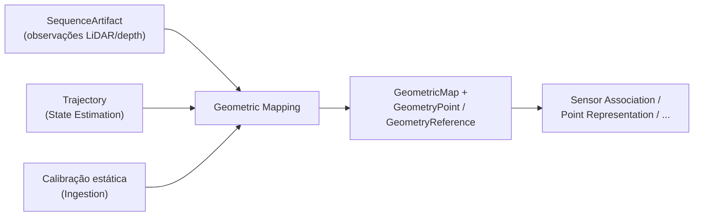

# Geometric Mapping

## Responsabilidade

Produzir a **geometria 3D persistente** no frame global do mapa: a coordenada autoritativa de cada ponto, uma referência estável para ele e a linhagem que explica como cada coordenada foi produzida (fonte, pose, extrínseco, cadeia de transforms, configuração e código). É a fundação espacial autoritativa do restante do pipeline.

Geometria é **onde** algo está. Evidência visual, semântica e identidade de objeto são anexadas depois, por outras capabilities, através de `GeometryReference`; nunca dentro do ponto.

## O que este módulo explicitamente não possui

- labels, `SemanticClaim`, embeddings, entidades ou relações: nenhum campo semântico existe em `GeometryPoint` nem em `GeometricMap`;
- projeção RGB↔LiDAR e associação com imagens: Sensor Association;
- pose e trajetória: State Estimation;
- calibração: Ingestion.

## Estado implementado

Existem os **contratos**, a fronteira de leitura `GeometrySource` e o **estado explícito de correção de movimento** com a política de scans não corrigidos (ver [`motion-correction.md`](motion-correction.md)). Estão **planejados**, e serão documentados aqui quando forem implementados: montagem dos inputs de geometria, transformação fonte→mapa, acumulação com referências estáveis, índice espacial e lookup, `GeometricMapArtifact` e a validação.

## Contratos públicos

- `GeometryPoint`, `GeometryPointProvenance`, `PointOrigin` — um ponto persistente com coordenada autoritativa no frame do mapa, coordenada original no frame do sensor e proveniência.
- `GeometryReference`, `GeometryId`, `MapId`, `geometry_id_for()` — referência compacta `(map_id, geometry_id)`, local ao mapa imutável.
- `TransformLineage`, `TransformStep`, `TransformKind` — a cadeia `T_map_body(t) · T_body_sensor` que produziu a coordenada.
- `GeometricMap`, `GeometricMapProvenance`, `SpatialIndexMetadata` — identidade, frame, limites, observações de origem e proveniência de um mapa.
- `Bounds3D` — caixa alinhada aos eixos que declara o frame em que está expressa.
- `MotionCorrectionState`, `MotionCorrectionRecord`, `MotionCorrectionEvidence`, `MotionCorrectionPolicy`, `ScanDisposition`, `MotionCorrectionVerdict` — se um scan foi corrigido para o movimento da plataforma (`RAW`/`CORRECTED`/`UNKNOWN`), com a evidência que sustenta a afirmação e a política aplicada.
- `GeometrySource` — fronteira de leitura (`get`, `iter_geometry`, `query_bounds`) que Sensor Association e demais consumidores usam sem depender de como o mapa é armazenado ou indexado.

Ver [`contracts.md`](contracts.md) para a referência de campos, as convenções e as invariantes.

## Módulos consumidos

- `contextmap.ingestion`: `FrameId`, `SequenceArtifactId`, `SourceObservationId`, `LidarObservation`.
- `contextmap.state_estimation`: `TrajectoryId`, `StateEstimationRunId`, `PoseEstimateId`, `LookupPolicy`, `TimeBounds`.
- `contextmap.shared`: `SourceTimestamp`, `Vector3`.

## Módulos que consomem este

`sensor_association`, `point_representation`, `semantic_fusion`, `semantic_mapping`, `entity_resolution`, `spatial_relations` e `artifact`, sempre através de `contextmap.geometric_mapping`.

## Onde estão os documentos detalhados

- [`contracts.md`](contracts.md) — contratos, convenções de coordenada, identidade e serialização.
- [`motion-correction.md`](motion-correction.md) — estado de correção de movimento, evidência e política de scans não corrigidos.
- [`docs/architecture.md`](../../../../docs/architecture.md) — ownership e direção de dependências.
- [`docs/CONTRACTS.md`](../../../../docs/CONTRACTS.md) — `GeometryPoint`, `GeometryReference` e `GeometricMap` no contexto global de contratos.
