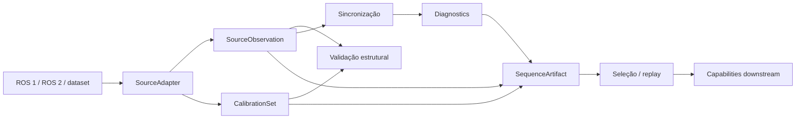

# Ingestion

## Responsabilidade

Normalizar fontes registradas (ROS 1 bags, ROS 2 bags, datasets gravados) em observações de sensor canônicas, agnósticas de backend, que o restante do ContextMap2 pode consumir sem depender de mensagens ROS, APIs de bag ou estruturas específicas de dataset.

## Visão do fluxo de Ingestion

O adapter apenas decodifica e normaliza a fonte. Validação, sincronização, persistência e replay permanecem etapas explícitas e auditáveis. A presença de uma observação no mesmo grupo temporal não altera sua identidade física nem a transforma em verdade persistente.

## O que este módulo explicitamente não possui

- pose canônica do mapa (`PoseEstimate`/trajetória pertencem a State Estimation);
- percepção semântica;
- projeção 2D↔3D;
- fusão ou entidades persistentes;
- armazenamento em nuvem/objeto remoto.

## Contratos públicos

- `SourceObservation` — union das observações canônicas: `ImageObservation`, `LidarObservation`, `ImuObservation`, `ExternalPoseMeasurement`.
- `SourceObservationId`, `SensorId`, `FrameId`, `CalibrationReferenceId` — identificadores tipados.
- `SourceProvenance` — rastreabilidade até a fonte bruta.
- `SequenceArtifactWriter`/`SequenceArtifactReader` — persistência local imutável de uma sequência ingerida; `SequenceArtifactManifest`, `SequenceArtifactFileEntry`, `SequenceArtifactId`.
- `SequenceArtifactError`, `IncompleteSequenceArtifactError` — exceções semânticas de leitura/escrita do artefato.
- `synchronize()` — agrupa observações em `ProcessingObservation`s auditáveis; `SynchronizationConfig`, `ModalityAssociation`, `SynchronizationDiagnostics`, `DroppedEvent`.
- `observation_modality()`, `MODALITY_NAMES` — utilitário para consumir `SourceObservation` de forma genérica por modalidade.
- `CalibrationSet`/`CalibrationEntry` — calibração e frames de coordenadas canônicos; `CameraModel` (`PinholeCameraModel`/`FisheyeCameraModel`/`MeiCameraModel`), `RigidTransform`, `validate_calibration_set()`.
- `resolve_selection()` — lê um subconjunto determinístico de uma sequência; `SequenceSelection` (`FullSequenceSelection`/`FrameRangeSelection`/`TimestampRangeSelection`/`ExplicitIdsSelection`), `selection_identity()`.
- `SourceAdapter` — fronteira (`Protocol`) que qualquer adapter de fonte concreto implementa; `SourceAdapterConfig`, `SourceTopicMapping`, `SourceAdapterCapabilities`, `SourceAdapterWarning`.
- `contextmap.ingestion.adapters.ros1_bag.Ros1BagSourceAdapter` / `contextmap.ingestion.adapters.ros2_bag.Ros2BagSourceAdapter` — implementações concretas para ROS 1/ROS 2 (não reexportadas por `contextmap.ingestion`; importadas pelo path completo, como qualquer backend).
- `SequenceProvenance` — metadata de proveniência/identidade de conteúdo; `compute_content_identity()`, `compute_source_content_hash()`, `compute_configuration_hash()`, `current_code_version()`.
- `validate_observations()` e as checagens individuais (`validate_image_observation()`, `validate_lidar_observation()`, `validate_timestamp_ordering()`, `validate_frame_references()`) — validação estrutural sobre observações decodificadas.
- `summarize_observations()` — sumário legível de uma sequência; `SequenceSummary`, `ModalitySummary`, `SequenceDiagnostics`.

Ver [`contracts.md`](contracts.md) para a referência completa de campos, unidades e exemplos de mapeamento ROS 1/ROS 2, [`artifact.md`](artifact.md) para o formato do artefato persistido e o layout do workspace local, [`synchronization.md`](synchronization.md) para a política de sincronização e suas limitações conhecidas, [`calibration.md`](calibration.md) para o contrato de calibração e convenções de frame, [`selection.md`](selection.md) para o modelo de seleção e replay, [`adapters.md`](adapters.md) para a fronteira de source adapters, [`backends.md`](backends.md) para decisões específicas de cada adapter concreto, [`provenance.md`](provenance.md) para proveniência, integridade e identidade de conteúdo, [`validation.md`](validation.md) para validação estrutural, e [`diagnostics.md`](diagnostics.md) para sumário legível e diagnósticos persistidos.

## Módulos consumidos

Apenas `contextmap.shared` (`SourceTimestamp`).

## Módulos que consomem este

`visual_perception`, `state_estimation`, e demais capabilities a jusante, sempre através de `contextmap.ingestion` (nunca de `contextmap.ingestion.models` diretamente).

## Fluxo interno (alto nível)

Fonte bruta → adapter (`Ros1BagSourceAdapter`/`Ros2BagSourceAdapter`) → `SourceObservation` canônica → validação estrutural opcional (`validate_observations()`) → sincronização/agrupamento temporal (`synchronize()`) → artefato de sequência persistido (`SequenceArtifactWriter`, com calibração/provenance/diagnósticos opcionais) → seleção/replay (`resolve_selection()`) para runs downstream — ver [`docs/PIPELINE.md`](../../../../docs/PIPELINE.md#1-ingestion).

## Onde estão os documentos detalhados

- [`contracts.md`](contracts.md) — campos, unidades, ownership, exemplos de mapeamento ROS 1/ROS 2.
- [`artifact.md`](artifact.md) — formato do artefato de sequência persistido e layout do workspace local.
- [`synchronization.md`](synchronization.md) — política de sincronização/agrupamento temporal e suas limitações conhecidas.
- [`calibration.md`](calibration.md) — contrato de calibração e convenções de frame de coordenadas.
- [`selection.md`](selection.md) — modelo de seleção e replay de sequência.
- [`adapters.md`](adapters.md) — fronteira (`Protocol`) de source adapters.
- [`backends.md`](backends.md) — decisões específicas de cada adapter concreto (ROS 1, ROS 2).
- [`provenance.md`](provenance.md) — proveniência, integridade e identidade de conteúdo.
- [`validation.md`](validation.md) — validação estrutural de observações decodificadas.
- [`diagnostics.md`](diagnostics.md) — sumário legível e diagnósticos persistidos.
- [`docs/architecture.md`](../../../../docs/architecture.md) — ownership e regras de dependência.
- [`docs/CONTRACTS.md`](../../../../docs/CONTRACTS.md) — `SourceObservation` no contexto global de contratos.
