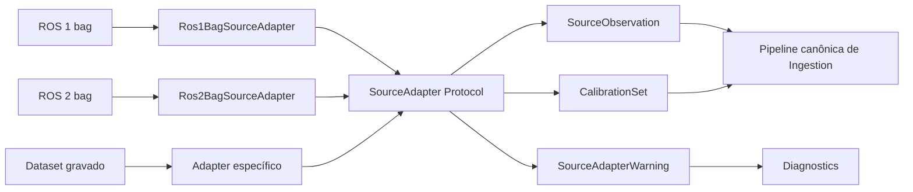

# Fronteira de source adapters

Este documento descreve `src/contextmap/ingestion/source_adapter.py`: o contrato (`Protocol`) que qualquer adapter de fonte (ROS 1, ROS 2, dataset) implementa, e onde implementações concretas devem viver.


## Boundary da fonte



O ponto de integração é o contrato canônico, não a API nativa da fonte. Por isso ROS e datasets permanecem detalhes de borda e não vazam para capabilities downstream.


## Decisão central: adapters produzem `SourceObservation`s, não eventos brutos

`SourceAdapter.read_observations()` produz diretamente `SourceObservation`s canônicas (issue #38) — uma por mensagem física da fonte, **sem agrupamento**. O agrupamento/sincronização (`synchronize()`, issue #40) é um estágio separado, aplicado sobre a saída do adapter. Isso evita duplicar a lógica de sincronização dentro de cada adapter e mantém os adapters simples: decodificar e normalizar, nada além disso.

## Nenhum objeto ROS-nativo cruza a fronteira

Toda assinatura de `SourceAdapter` retorna apenas contratos canônicos (`SourceObservation`, `SourceAdapterCapabilities`, `SourceAdapterWarning`) ou primitivos. Nenhum método aceita ou devolve `rosbag.Bag`, `rclpy` message types, ou qualquer struct nativa de SDK de fonte.

## Onde implementações concretas vivem

Implementações concretas (`Ros1BagSourceAdapter`, issue #44; `Ros2BagSourceAdapter`, issue #45) devem viver em `src/contextmap/ingestion/adapters/<nome>.py`. Isso não é apenas convenção — é **imposto** por `tests/architecture/test_boundaries.py`: `HEAVY_SDK_ROOTS` (`rclpy`, `rosbag`, `rosbag2_py`, `torch`, `transformers`, `segment_anything`) só pode ser importado dentro de `backends/`, `infrastructure/` ou `adapters/` de uma capability. Este módulo (`source_adapter.py`) fica na raiz de `ingestion` porque o `Protocol` em si não depende de nenhuma dessas bibliotecas — só as implementações concretas dependem.

Consequência prática: quem só lê um `SequenceArtifact` já persistido nunca precisa instalar ROS 1, ROS 2 ou qualquer SDK de fonte — essas dependências ficam isoladas em `adapters/`, e `pyproject.toml` as declara como extra opcional.

## Configuração: `SourceAdapterConfig`

Forma comum a todos os adapters, alinhada ao YAML mostrado nas issues #44/#45:

```yaml
source:
  type: ros1_bag       # SourceAdapterConfig.source_type
  path: data/example.bag  # SourceAdapterConfig.path
  timestamp_clock_id: robot-clock  # opcional; compartilhado entre os headers
  topics:                    # SourceAdapterConfig.topics (SourceTopicMapping)
    rgb: /camera/image_raw
    camera_info: /camera/camera_info
    lidar: /velodyne_points
    imu: /imu/data
    pose: /odom
```

`required_topics` (ex.: `{"rgb", "lidar"}`) declara quais campos de `topics` são obrigatórios — se ausentes na fonte real, o adapter levanta `MissingRequiredTopicError` em vez de simplesmente pular a modalidade em silêncio.

`timestamp_clock_id` identifica o domínio de clock de `header.stamp` compartilhado pelos tópicos configurados. Quando omitido, o adapter deriva uma identidade determinística da família e do path da fonte. O timestamp de gravação do bag permanece separado na provenance. `calibration` recebe um `CalibrationSet` canônico opcional, inclusive extrínsecos estáticos que não estejam representados por `CameraInfo`.

Configuração específica de um adapter que não cabe na forma comum (ex.: identidade de storage/serialização do ROS 2) vai em `SourceAdapterConfig.extra`, em vez de a fronteira crescer um campo por família de adapter — mantém o contrato pequeno o suficiente para não precisar de um sistema de plugins genérico.

## Ingerir uma janela temporal da fonte (issue #506)

`SourceAdapterConfig.window` (opcional, `SourceWindow | None`) restringe a leitura a um intervalo `[start_seconds, end_seconds)` do **próprio clock de gravação da fonte** — para um bag ROS, o timestamp que `rosbag record` atribuiu a cada mensagem, não o `header.stamp` decodificado. `Ros1BagSourceAdapter`/`Ros2BagSourceAdapter` são os únicos adapters que honram `window` no v0 (fora de escopo: `PoseFileSourceAdapter`, que sempre lê o arquivo inteiro).

```yaml
source:
  type: ros1_bag
  path: datasets/corridor-02/corridor-02.bag
  window:
    clock_id: "ros1_bag:datasets/corridor-02/corridor-02.bag:recording_time"  # sempre config.resolved_window_clock_id()
    start_seconds: 1724621500.0
    end_seconds: 1724621502.0
```

**Por que um clock separado do `header.stamp`, e não o mesmo usado por `TimestampRangeSelection`.** Medido no `corridor-02.bag` real: o clock de gravação do bag e o `header.stamp` das mesmas mensagens diferem por **anos** (~78.621.358 segundos), não milissegundos — não é uma pequena latência de transporte, é um domínio de clock totalmente diferente (a máquina que gravou o bag e o clock que carimbou os sensores claramente nunca estiveram sincronizados). Tentar converter um limite em `header.stamp` para um limite em tempo de gravação exigiria estimar esse offset, uma heurística silenciosa que o projeto rejeita explicitamente (`AGENTS.md` §7, §26). Em vez disso, a janela é honesta sobre em qual clock ela opera: `SourceWindow.clock_id` deve ser exatamente `config.resolved_window_clock_id()` (`"<source_type>:<path>:recording_time"`, sempre derivado, nunca sobrescrevível) — um adapter recusa (`InvalidSourceWindowError`) qualquer outro valor, para que ninguém confunda os dois domínios silenciosamente. Quando a própria diferença absoluta é o defeito a corrigir (epoch errado num clock cuja progressão relativa continua utilizável), a correção pertence a uma política explícita e com escopo de dataset — [`timestamps.md`](timestamps.md) — nunca a uma heurística dentro deste adapter.

**Por que isso é eficiente.** `rosbags.rosbag1.Reader.messages`/`rosbags.rosbag2.Reader.messages` aceitam `start`/`stop` (nanossegundos) e pulam o *chunk* de dado de qualquer mensagem fora do intervalo sem descomprimi-lo nem decodificá-lo — o índice do próprio bag já sabe o tempo de gravação de cada mensagem sem precisar ler seu conteúdo. Por isso ingerir uma janela custa tempo/memória proporcional à janela, não à fonte inteira: medido no `corridor-02.bag` real (24 GB, 208.697 mensagens), uma janela real de 2 s termina em ~1,4 s e produz 47 imagens + 20 varreduras de LiDAR + 399 IMU — ver a issue #506 para os números completos.

**`observation_id` reinicia do zero relativo à janela.** O contador por tópico (`counters: dict[str, int] = {}`) já começa em zero naturalmente para a primeira mensagem que passa pelo filtro de janela — nenhuma mudança de lógica é necessária além de filtrar antes de contar. Isso significa que o mesmo `observation_id` (ex.: `"camera_1_image_raw-000000"`) pode se referir a mensagens físicas diferentes em duas ingestões com janelas diferentes da mesma fonte. **Nenhum código deve correlacionar observações de duas janelas diferentes pelo `observation_id`** — a correlação correta é sempre pelo `timestamp` físico da observação (o mesmo em qualquer janela que a contenha), nunca pelo id. Uma janela que cobre o início da fonte (offset 0) produz os mesmos ids/conteúdo que uma ingestão sem janela, para as observações em comum — teste de contrato em `tests/ingestion/adapters/test_ros1_bag.py::test_windowed_and_full_ingestion_agree_on_content_for_a_prefix_window`.

**Rejeição explícita, nunca truncamento silencioso.** `end_seconds <= start_seconds` é `ValueError` na construção do `SourceWindow` — inclusive quando os dois limites são iguais: `[t, t)` não contém nenhum instante, então é tratado como configuração inválida (provável erro do chamador), nunca como uma leitura vazia legítima. `start_seconds`/`end_seconds` não finitos (`NaN`, `+-inf`) também são `ValueError` nesse ponto, para falhar com uma mensagem específica em vez de um erro genérico dentro de `round(...)` em `resolve_window_bounds`. Uma janela que não sobrepõe o intervalo real de tempo de gravação da fonte (para os tópicos configurados) é `InvalidSourceWindowError` — nunca um resultado silenciosamente vazio. Para ROS 1, o intervalo real vem do índice por conexão (`reader.indexes`, sem decodificar chunk); para ROS 2 (sem esse índice por tópico na API pública), usa-se `reader.start_time`/`reader.end_time` do bag inteiro como um superconjunto seguro — uma janela que não sobrepõe o bag inteiro certamente não sobrepõe um tópico específico dele.

**`content_hash()` cobre só o que foi lido — e agora faz parte do `SourceAdapter` Protocol.** `Ros1BagSourceAdapter.content_hash()`/`Ros2BagSourceAdapter.content_hash()` acumulam um hash SHA-256 incrementalmente sobre cada mensagem bruta que `read_observations()` efetivamente lê — no mesmo laço de leitura, sem custo extra de I/O. `PoseFileSourceAdapter.content_hash()` cobre o arquivo inteiro (nunca suporta janela). `content_hash()` é um método do `Protocol` (não só um detalhe dos adapters ROS): o runtime (`ingestion_service.source_hash()`) o consome genericamente para declarar a identidade de conteúdo de um pedido com janela, sem exigir uma passada extra O(tamanho da fonte) — ver `IngestionRequest.window`, abaixo. Diferente de `sequence_provenance.compute_source_content_hash()` (uma passada separada sobre o arquivo/diretório inteiro, O(tamanho da fonte)), isso cobre exatamente a janela quando uma é configurada, nunca a fonte inteira só para declarar proveniência de uma fração pequena dela.

**`read_calibration()` NÃO segue a garantia de custo proporcional à janela — decisão explícita.** A garantia "custo proporcional à janela, não à fonte inteira" descrita acima cobre `read_observations()` (para os tópicos rgb/lidar/imu/pose) e `content_hash()`. Ela **não** se estende a `read_calibration()`: `camera_info` é tratado como metadado global da fonte (descreve a câmera para o bag inteiro, não um recorte temporal dele), então `Ros1BagSourceAdapter.read_calibration()`/`Ros2BagSourceAdapter.read_calibration()` sempre leem o tópico `camera_info` inteiro, sem aplicar `start`/`stop` do bag reader — mesmo quando `config.window` está configurado. Isso é intencional: filtrar `camera_info` pela janela poderia fazer uma janela pequena "perder" a única mensagem de calibração do bag e devolver `None` mesmo quando a câmera nunca mudou, ou pior, ficar sujeita a uma mudança de calibração fora da janela invalidar (`CalibrationError`) uma ingestão que seria consistente dentro dela. O que **é** garantido: o scan do `camera_info` acontece no máximo uma vez por instância do adapter — o resultado é cacheado internamente, já que `read_observations()` chama `read_calibration()` internamente (para resolver `calibration_id` por observação) e o runtime (`ingestion_service._read`) chama de novo depois de esgotar as observações; sem esse cache, isso seria dois scans completos do bag só para declarar calibração. Teste de contrato: `tests/ingestion/adapters/test_ros1_bag.py::test_read_calibration_scans_the_bag_only_once_per_adapter_instance` (e o equivalente em `test_ros2_bag.py`).

## Erros vs. warnings

- **Erro** (`MissingRequiredTopicError`, `InvalidSourceWindowError`, ambos `SourceAdapterError`): interrompe a leitura — tópico obrigatório ausente, ou janela que não pode ser honrada. Mensagem estruturalmente incompatível com o kind configurado (`KeyError`/`AttributeError` na decodificação) também interrompe a leitura, propagando a exceção original (ver [`backends.md`](backends.md)); não existe um erro dedicado para "mensagem não suportada".
- **Warning** (`SourceAdapterWarning`, acumulado e devolvido por `warnings()`): mensagem cujo conteúdo não pode ser decodificado (`ValueError` do decoder) e que foi pulada, mas não impede o restante da leitura. Nunca silenciosamente descartada sem rastro — sempre aparece em `warnings()` com `topic`/`message_index`/`reason`.

## Capacidades

`capabilities()` reporta o que a fonte configurada realmente oferece (`rgb`, `lidar`, `imu`, `external_pose`, `calibration`), permitindo que um consumidor decida antecipadamente se uma modalidade necessária está disponível, sem precisar iterar toda a fonte primeiro.

## Mesmo boundary para ROS 1 e ROS 2

Qualquer classe que implemente `capabilities()`, `read_observations()`, `read_calibration()`, `warnings()` e `content_hash()` satisfaz `SourceAdapter` (`Protocol` com `@runtime_checkable`) — código downstream nunca precisa de `if isinstance(adapter, Ros1BagSourceAdapter)` ou qualquer branch por versão de ROS.

## Adapter `pose_file` (issue #376)

`contextmap.ingestion.adapters.pose_file.PoseFileSourceAdapter` lê um arquivo de pose autônomo (não um tópico de bag) e produz `ExternalPoseMeasurement`s. Existe porque nem toda fonte publica pose num tópico ROS — o `corridor-02`, por exemplo, só tem câmera, LiDAR e IMU no bag; sua trajetória (`corridor-02-gt.txt`) é um arquivo texto separado.

Segue a mesma forma de `SourceAdapterConfig` que os adapters de bag, sem usar `topics` (todos os campos ficam `None`/vazios); a configuração específica do formato vai em `extra`:

```yaml
source:
  type: pose_file          # SourceAdapterConfig.source_type
  path: datasets/corridor-02/corridor-02-gt.txt
  timestamp_clock_id: corridor-02-header   # para casar com o clock do bag, quando aplicável
  extra:
    format: tum             # único suportado no v0; "t x y z qx qy qz qw"
    parent_frame: map       # obrigatório — o arquivo não declara frame nenhum
    body_frame: epson       # obrigatório — frame cuja pose o arquivo reporta
    pose_role: ground_truth # obrigatório — ground_truth | odometry | external_localization
    sensor_id: external_pose_file   # opcional, padrão "external_pose_file"
```

`format`, `parent_frame`, `body_frame` e `pose_role` são obrigatórios e validados na construção do adapter (`PoseFileConfigError`, antes de qualquer leitura) — nada é inferido do nome do arquivo. `pose_role` (issue #555) é o vocabulário mínimo e explícito que substitui a antiga convenção informal por nome (um arquivo chamado `*-gt.txt` não vira "ground truth" por si só): `ground_truth`, `odometry` ou `external_localization`, verificado contra esse conjunto fechado na configuração do adapter, nunca um enum novo em `contextmap.ingestion.models`. `format="tum"` já declara a convenção de unidades do v0 (segundos decimais, metros, quaternion unitário `(x, y, z, w)`); um segundo formato com unidades diferentes ganharia seu próprio valor de `format`, não um campo de unidades solto.

Cada observação carrega, em `provenance.raw_metadata`, o `format` e o `pose_role` declarados e o hash `sha256` do conteúdo do arquivo inteiro (`compute_source_content_hash`, de `sequence_provenance.py`) — a mesma função usada para o hash de fonte de bag, computada uma vez por chamada de `read_observations()`. Uma linha malformada (contagem de campos errada, timestamp ou número não finito) vira `SourceAdapterWarning` e é pulada, como nos adapters de bag — nunca interrompe a leitura das demais linhas. `read_calibration()` só repassa `SourceAdapterConfig.calibration`, quando fornecida; o arquivo de pose não tem calibração própria.

Quando um `SequenceArtifact` ingerido por este adapter é usado como pose auxiliar de `state_estimation` (o estágio opcional `pose_ingestion` da runtime, issue #555), `pose_role` decide se ele pode dirigir a trajetória operacional: `ground_truth` nunca pode, a menos que a política `policies.trajectory_mode = "allow_ground_truth"` seja escolhida explicitamente — ver `runtime/docs/composition.md`. `odometry`/`external_localization` não têm essa restrição, pois já são, por natureza, pose operacional.

`observation_id` segue `"<sensor_id>-<número da linha, 6 dígitos>"`, único e estável para uma mesma execução sobre o mesmo arquivo (linhas em branco e comentários `#` não contam como linha de dado, mas contam para a numeração de linha usada nos warnings).
