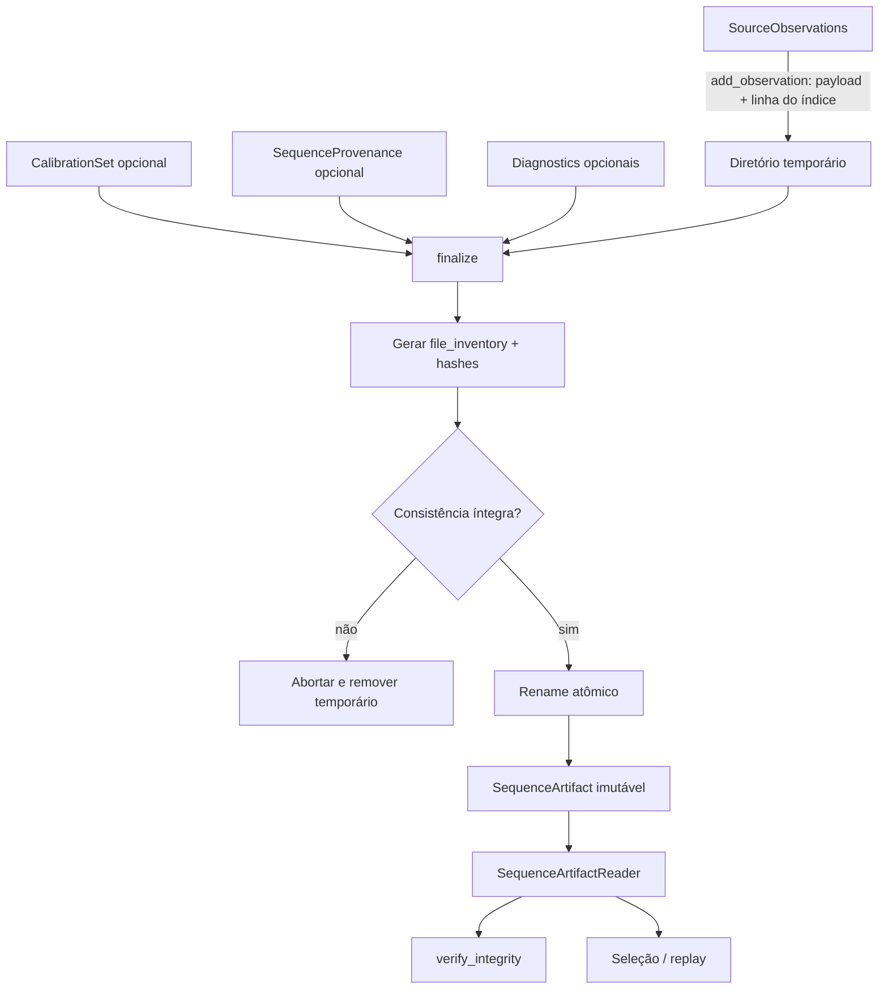

# Artefato de sequência canônica

Este documento descreve o formato v0 do artefato persistido por `SequenceArtifactWriter` (`src/contextmap/ingestion/sequence_artifact.py`) e o layout do workspace local. Para os contratos em memória que este artefato serializa, ver [`contracts.md`](contracts.md). Para as convenções globais de artifact/lineage/immutability, ver [`docs/ARTIFACTS.md`](../../../../docs/ARTIFACTS.md).

## Layout no workspace local

```text
workspace/
└── sequences/
    └── <sequence-name>/
        └── <artifact-id>/
            ├── manifest.json
            ├── index.jsonl
            ├── rgb/
            │   └── <observation-id>.bin
            ├── pointcloud/
            │   └── <observation-id>.bin
            ├── calibration/
            │   └── calibration.json      # opcional, ver calibration.md
            ├── provenance/
            │   └── provenance.json        # opcional, ver provenance.md
            └── diagnostics/
                ├── summary.json            # opcional, ver diagnostics.md
                ├── warnings.jsonl          # opcional, ver diagnostics.md
                ├── synchronization.jsonl   # opcional, decisões por associação
                ├── dropped-events.jsonl    # opcional, eventos não selecionados
                └── frame-graph.json        # opcional, inventário de frames
```

O path não é o contrato semântico — `manifest.json` é o ponto autoritativo, conforme `docs/ARTIFACTS.md`.

## Decisões desta issue (v0)

- **Índice em JSON Lines, não Parquet.** O documento da issue cita `index.parquet` como candidato, mas `pyproject.toml` ainda não tem nenhuma dependência de runtime (`dependencies = []`). Adicionar `pyarrow`/`pandas` só para o índice não se justifica no v0 (YAGNI); `index.jsonl` é inspecionável com ferramentas de texto padrão e não introduz dependência nova. Revisitar se o volume de observações tornar leitura linha-a-linha um gargalo real.
- **IMU e pose externa ficam inline no índice.** Esses registros são pequenos; vetores, covariâncias 3×3/6×6 e twist não justificam payload binário separado, então não existem diretórios `imu/`/`external_pose`.
- **`calibration/`, `provenance/` e `diagnostics/` são opcionais, populados apenas quando `set_calibration()`/`set_provenance()`/`set_diagnostics()` são chamados** (issues #41, #46 e #47, respectivamente).
- **Identidade de conteúdo** é responsabilidade de `contextmap.ingestion.sequence_provenance` (#46), não deste módulo — o manifest só registra hash/tamanho por arquivo (suficiente para detectar corrupção); regras de "mesma fonte + mesma configuração" vivem em `provenance.json`, ver [`provenance.md`](provenance.md).

## `manifest.json`

```json
{
  "artifact_id": "…",
  "sequence_name": "…",
  "schema_version": "0.2.0",
  "created_at": "2026-01-01T00:00:00+00:00",
  "observation_counts": {"image": 2, "lidar": 1, "imu": 1, "external_pose": 1},
  "file_inventory": [
    {"path": "index.jsonl", "size_bytes": 512, "content_hash": "sha256:…"},
    {"path": "rgb/frame-0001.bin", "size_bytes": 921600, "content_hash": "sha256:…"}
  ]
}
```

`file_inventory` cobre todos os arquivos do artefato exceto o próprio `manifest.json`.

## `index.jsonl`

Um objeto JSON por linha, um por observação, na ordem em que foi adicionada ao writer. Cada linha tem um campo `"modality"` (`"image"`, `"lidar"`, `"imu"`, `"external_pose"`) mais os campos do contrato correspondente (ver [`contracts.md`](contracts.md)). Para `image`/`lidar`, o payload binário fica em `rgb/`/`pointcloud/` e a linha do índice referencia o arquivo via `payload_path`; para `imu`/`external_pose`, todos os valores ficam inline.


## Ciclo de persistência



O artefato final só passa a existir depois que o conteúdo temporário foi escrito e verificado. Leitura e replay nunca dependem da fonte ROS/dataset original.

## Escrita em streaming e atômica

`SequenceArtifactWriter.add_observation()` grava o payload (`rgb/`/`pointcloud/`) e a linha de `index.jsonl` no diretório temporário irmão (`.tmp-<artifact-id>-<random>/`) **no momento da chamada**, e calcula o hash de cada arquivo ali mesmo. O writer não retém os bytes do payload: guarda apenas contadores, o inventário parcial de arquivos e uma cópia de cada observação sem payload (`data`), usada para o resumo de diagnostics. O uso de memória do writer cresce com o número de observações, não com o tamanho dos payloads — isso permite ingerir bags maiores que a RAM (o dataset `corridor-02` tem ~24 GB de payload).

Nada é escrito em disco até a primeira observação ou `finalize()`. `finalize()` grava calibração, provenance e diagnostics, gera o manifest, roda uma checagem de consistência interna (todo arquivo referenciado pelo manifest existe, com tamanho e hash corretos) e só então renomeia o diretório para o path final. O path final (`<artifact-id>/`) nunca chega a existir parcialmente escrito.

Como o temporário existe desde a primeira observação, um writer que não chega ao `finalize()` deixaria lixo em disco. Por isso:

- `abort()` fecha o writer e remove o temporário (idempotente; não afeta um artefato já finalizado). Erros ao descarregar o índice são ignorados, pois esses dados estão sendo descartados; uma falha ao remover o diretório é propagada como `OSError` e uma nova chamada de `abort()` tenta a remoção de novo;
- o writer é um context manager — `with SequenceArtifactWriter(...) as writer:` chama `abort()` em qualquer saída que não tenha finalizado. Quando o bloco já está falhando, um erro de limpeza é anexado à exceção original como nota (`add_note`), sem substituí-la;
- qualquer falha em `finalize()` (inclusive "já existe um artefato no path final") e qualquer falha de I/O em `add_observation()` abortam o writer automaticamente, com a mesma regra de nota para não mascarar a causa original;
- um `observation_id` duplicado é rejeitado sem escrever nada e o writer continua utilizável.

Uma consequência do streaming: a checagem "já existe um artefato com este `artifact_id`" continua no `finalize()`, então uma colisão com `artifact_id` explícito só é detectada depois de escrever o conteúdo. Com o id aleatório padrão isso não ocorre.

## Leitura

`SequenceArtifactReader(artifact_dir)` abre um artefato existente, expõe `manifest`, `list_observations()` (todas as observações decodificadas, na ordem do índice), `get_observation(observation_id)` (busca por identidade), `read_calibration()`/`read_provenance()`/`read_diagnostics()` (`None` quando não persistidos) e `verify_integrity()` (lista de problemas estruturais, incluindo cross-references inválidas entre `index.jsonl` e o inventário de arquivos — ver [`provenance.md`](provenance.md); lista vazia = artefato íntegro).

## Reabertura sem a fonte original

Um artefato v0 é reaberto apenas com `manifest.json`, `index.jsonl` e os arquivos em `rgb/`/`pointcloud/` — nenhum deles exige reabrir o bag/dataset original nem depende de tipos ROS-nativos.
