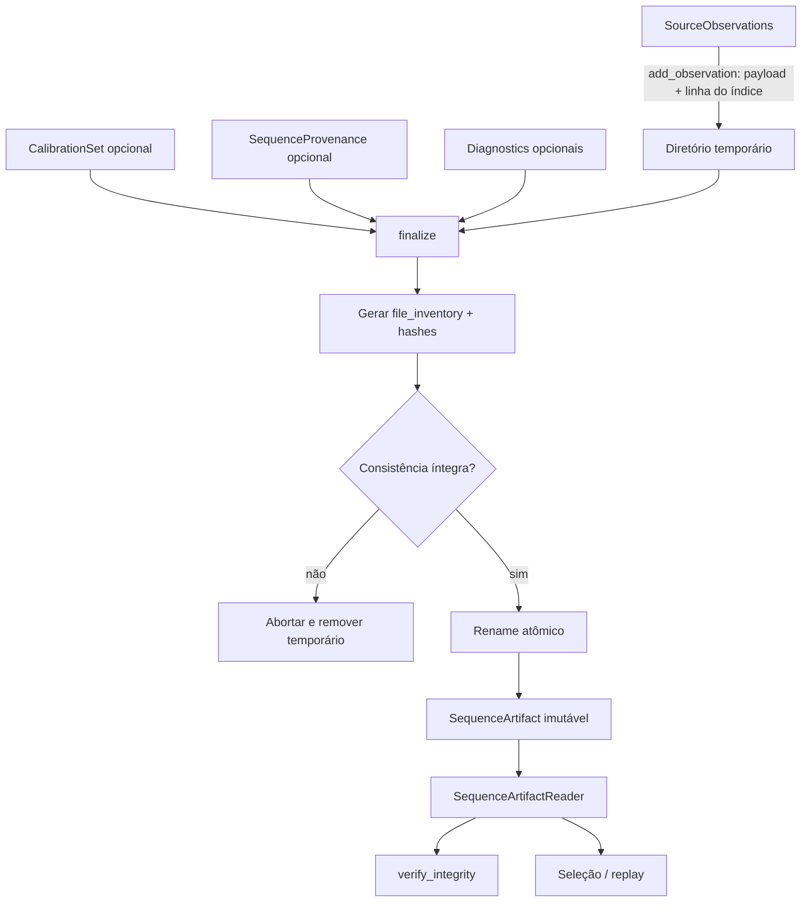

# Artefato de sequência canônica

Este documento descreve o formato v0 do artefato persistido por `SequenceArtifactWriter` (`src/contextmap/ingestion/sequence_artifact.py`) e o layout do workspace local. Para os contratos em memória que este artefato serializa, ver [`contracts.md`](contracts.md). Para as convenções globais de artifact/lineage/immutability, ver [`docs/ARTIFACTS.md`](../../../../docs/ARTIFACTS.md).

## Layout do artefato

O writer não decide onde o artefato mora: quem o chama entrega `output_dir`, o diretório final. No runtime, uma ingestion executada como estágio grava em `<workspace>/<dataset>/<run>/ingestion/` (ver [`docs/ARTIFACTS.md`](../../../../docs/ARTIFACTS.md)); nos testes, é um caminho sob `tmp_path`. O conteúdo do diretório é sempre este:

```text
<output_dir>/
├── manifest.json
├── index.jsonl
├── rgb/
│   └── <observation-id>.bin
├── pointcloud/
│   └── <observation-id>.bin
├── calibration/
│   └── calibration.json      # opcional, ver calibration.md
├── provenance/
│   └── provenance.json        # opcional, ver provenance.md
└── diagnostics/
    ├── summary.json            # opcional, ver diagnostics.md
    ├── warnings.jsonl          # opcional, ver diagnostics.md
    ├── synchronization.jsonl   # opcional, decisões por associação
    ├── dropped-events.jsonl    # opcional, eventos não selecionados
    └── frame-graph.json        # opcional, inventário de frames
```

O path não é o contrato semântico — `manifest.json` é o ponto autoritativo, conforme `docs/ARTIFACTS.md`. O writer não cria registro, não escreve `runs.json` e não toca em nenhum outro diretório além do temporário irmão de `output_dir`, que ele mesmo remove.

## Identidade

`artifact_id` é entregue pelo chamador e gravado no `manifest.json` como recebido; o writer nunca gera um (não há valor padrão). O nome do diretório não é a identidade: `output_dir` e `artifact_id` são independentes, e a identidade do artefato vive no manifest.

## Decisões desta issue (v0)

- **Índice em JSON Lines, não Parquet.** O documento da issue cita `index.parquet` como candidato, mas `pyproject.toml` ainda não tem nenhuma dependência de runtime (`dependencies = []`). Adicionar `pyarrow`/`pandas` só para o índice não se justifica no v0 (YAGNI); `index.jsonl` é inspecionável com ferramentas de texto padrão e não introduz dependência nova. Revisitar se o volume de observações tornar leitura linha-a-linha um gargalo real.
- **IMU e pose externa ficam inline no índice.** Esses registros são pequenos; vetores, covariâncias 3×3/6×6 e twist não justificam payload binário separado, então não existem diretórios `imu/`/`external_pose`.
- **`calibration/`, `provenance/` e `diagnostics/` são opcionais, populados apenas quando `set_calibration()`/`set_provenance()`/`set_diagnostics()` são chamados** (issues #41, #46 e #47, respectivamente).
- **Identidade de conteúdo** é responsabilidade de `contextmap.ingestion.sequence_provenance` (#46), não deste módulo — o manifest só registra hash/tamanho por arquivo (suficiente para detectar corrupção); regras de "mesma fonte + mesma configuração" vivem em `provenance.json`, ver [`provenance.md`](provenance.md).

## `manifest.json`

```json
{
  "artifact_id": "…",
  "sequence_name": "…",
  "schema_version": "0.2.0",
  "created_at": "2026-01-01T00:00:00+00:00",
  "observation_counts": {"image": 2, "lidar": 1, "imu": 1, "external_pose": 1},
  "file_inventory": [
    {"path": "index.jsonl", "size_bytes": 512, "content_hash": "sha256:…"},
    {"path": "rgb/frame-0001.bin", "size_bytes": 921600, "content_hash": "sha256:…"}
  ]
}
```

`file_inventory` cobre todos os arquivos do artefato exceto o próprio `manifest.json`.

## `index.jsonl`

Um objeto JSON por linha, um por observação, na ordem em que foi adicionada ao writer. Cada linha tem um campo `"modality"` (`"image"`, `"lidar"`, `"imu"`, `"external_pose"`) mais os campos do contrato correspondente (ver [`contracts.md`](contracts.md)). Para `image`/`lidar`, o payload binário fica em `rgb/`/`pointcloud/` e a linha do índice referencia o arquivo via `payload_path`; para `imu`/`external_pose`, todos os valores ficam inline. O `payload_path` deriva do `observation_id` e precisa ser um caminho relativo dentro do artifact (`contextmap.shared.is_run_relative_path`): o writer recusa, antes de escrever qualquer arquivo, um id que o levaria para fora (por exemplo, com `../`), e o reader recusa com `SequenceArtifactError` um `payload_path` absoluto ou com `..` num índice adulterado, sem ler o arquivo. O inventário é conferido pela regra compartilhada `check_file_inventory`, com hash em blocos: nenhum payload é lido inteiro na memória só para conferir o hash.


## Ciclo de persistência



O artefato final só passa a existir depois que o conteúdo temporário foi escrito e verificado. Leitura e replay nunca dependem da fonte ROS/dataset original.

## Escrita em streaming e atômica

`SequenceArtifactWriter.add_observation()` grava o payload (`rgb/`/`pointcloud/`) e a linha de `index.jsonl` no diretório temporário irmão de `output_dir` (`.tmp-<nome-de-output_dir>-<random>/`) **no momento da chamada**, e calcula o hash de cada arquivo ali mesmo. O writer não retém os bytes do payload: guarda apenas contadores, o inventário parcial de arquivos e uma cópia de cada observação sem payload (`data`), usada para o resumo de diagnostics. O uso de memória do writer cresce com o número de observações, não com o tamanho dos payloads — isso permite ingerir bags maiores que a RAM (o dataset `corridor-02` tem ~24 GB de payload).

Nada é escrito em disco até a primeira observação ou `finalize()`. `finalize()` grava calibração, provenance e diagnostics, gera o manifest, roda uma checagem de consistência interna (todo arquivo referenciado pelo manifest existe, com tamanho e hash corretos) e só então renomeia o diretório para `output_dir`. `output_dir` nunca chega a existir parcialmente escrito, e um `output_dir` que já exista é recusado, sem alterar o artefato que está lá.

Como o temporário existe desde a primeira observação, um writer que não chega ao `finalize()` deixaria lixo em disco. Por isso:

- `abort()` fecha o writer e remove o temporário (idempotente; não afeta um artefato já finalizado). Erros ao descarregar o índice são ignorados, pois esses dados estão sendo descartados; uma falha ao remover o diretório é propagada como `OSError` e uma nova chamada de `abort()` tenta a remoção de novo;
- o writer é um context manager — `with SequenceArtifactWriter(...) as writer:` chama `abort()` em qualquer saída que não tenha finalizado. Quando o bloco já está falhando, um erro de limpeza é anexado à exceção original como nota (`add_note`), sem substituí-la;
- qualquer falha em `finalize()` (inclusive "já existe um artefato no path final") e qualquer falha de I/O em `add_observation()` abortam o writer automaticamente, com a mesma regra de nota para não mascarar a causa original;
- um `observation_id` duplicado é rejeitado sem escrever nada e o writer continua utilizável.

Uma consequência do streaming: a checagem "já existe um artefato em `output_dir`" continua no `finalize()`, então uma colisão só é detectada depois de escrever o conteúdo no temporário. Como o `finalize()` a recusa e remove o temporário, nada fica para trás e o artefato existente permanece intacto; o chamador que quiser falhar cedo confere `output_dir` antes de começar.

## Leitura

`SequenceArtifactReader(artifact_dir)` abre um artefato existente, expõe `manifest`, `list_observations()` (todas as observações decodificadas, na ordem do índice), `get_observation(observation_id)` (busca por identidade), `read_calibration()`/`read_provenance()`/`read_diagnostics()` (`None` quando não persistidos) e `verify_integrity()` (lista de problemas estruturais, incluindo cross-references inválidas entre `index.jsonl` e o inventário de arquivos — ver [`provenance.md`](provenance.md); lista vazia = artefato íntegro).

### Custo de leitura: índice vs. payload (issue #374)

`list_observations()` é a única operação cujo custo é, por definição, proporcional ao payload total: ela decodifica cada observação, incluindo o binário de `rgb/`/`pointcloud/`, porque seu contrato é devolver a sequência inteira materializada. Toda outra forma de leitura tem custo proporcional apenas ao tamanho do índice (`index.jsonl`), nunca ao payload:

- `get_observation(observation_id)` resolve a identidade através de um índice `observation_id -> offset` (`iter_index()`), construído uma vez por reader a partir do índice e mantido em cache — não mais via varredura linear que decodificava (com payload) cada observação anterior à procurada.
- `read_diagnostics()` resolve os `dropped-events.jsonl` decodificando só os `observation_id` neles referenciados (via o mesmo índice `observation_id -> offset`), não a sequência inteira.
- `iter_index()` expõe `(offset, observation_id, timestamp)` por linha, sem nunca abrir um arquivo de payload; é o que `resolve_selection()` (`sequence_selection.py`) usa para decidir quais observações casam com uma seleção antes de decodificar qualquer uma delas. `observation_at(offset)` decodifica uma única observação (payload incluído, quando a modalidade tiver um) a partir de um offset devolvido por `iter_index()`.

Medido contra o artefato real `corridor-02` (208.697 observações, 24,4 GB de payload, ver issue #374 para o método): `read_diagnostics()` caiu de ~24 GB de pico de RSS para ~605 MB; `resolve_selection()` de uma janela de 90 s (21.035 de 208.697 observações) caiu de 13-24 GB para ~42 MB ao resolver (a seleção só decide *quais* observações casam) e ~2,3 GB caso o chamador efetivamente materialize/acesse o payload de todas as observações selecionadas — esse último número é o tamanho real do payload da janela, não um bug; `get_observation()` caiu de 12,1 s para ~1,6 s.

## Reabertura sem a fonte original

Um artefato v0 é reaberto apenas com `manifest.json`, `index.jsonl` e os arquivos em `rgb/`/`pointcloud/` — nenhum deles exige reabrir o bag/dataset original nem depende de tipos ROS-nativos.
