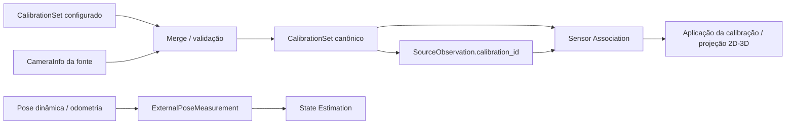

# Calibração e frames de coordenadas

Este documento descreve `src/contextmap/ingestion/calibration.py`: o contrato canônico de calibração e as convenções de frame de coordenadas do ContextMap2.

**Ownership**: Ingestion normaliza e possui a calibração canônica (intrínsecos de câmera, extrínsecos estáticos, identidade de frame). Ingestion **não realiza** projeção 2D↔3D — isso pertence a Sensor Association, que consome este contrato sem conhecimento do formato de origem.


## Ownership e fluxo



A separação é intencional: Ingestion preserva intrínsecos, extrínsecos estáticos e frames; Sensor Association aplica esses dados geometricamente. Movimento no tempo não é transform estático de calibração.


## Pinhole e fisheye sem conversão com perda

`CameraModel = PinholeCameraModel | FisheyeCameraModel` — dois tipos distintos, não um único record genérico. `PinholeCameraModel` usa o modelo de distorção radial/tangencial do OpenCV (`none`, `plumb_bob`, `rational_polynomial`); `FisheyeCameraModel` usa o modelo equidistante (Kannala-Brandt) com exatamente 4 coeficientes. Forçar fisheye em uma representação pinhole perderia informação — por isso nunca há conversão implícita entre os dois; um consumidor precisa tratar cada um explicitamente (`camera_model_kind()` retorna `"pinhole"`/`"fisheye"`).

## Convenção de transform: `T_parent_child`

`RigidTransform` segue a notação `T_parent_child`: o transform leva coordenadas expressas em `child_frame` para `parent_frame` — `p_parent = rotate(rotation, p_child) + translation`. `rotation` é sempre um quaternion unitário na ordem `(x, y, z, w)`. Esta convenção é a mesma usada por `ExternalPoseMeasurement` (issue #38: `parent_frame` → `frame_id`) e por `docs/shared-primitives.md`.

## Transforms estáticos vs. dinâmicos

`CalibrationSet.static_transforms` contém **apenas** transforms que não mudam durante a sequência — tipicamente extrínsecos físicos entre sensores rigidamente montados no mesmo corpo (ex.: câmera → base_link). Um frame cuja pose muda ao longo do tempo (ex.: robô no mundo) **não é calibração** — é reportado por timestamp como `ExternalPoseMeasurement` no stream temporal de observações (issue #38). Esta é uma decisão explícita desta issue: calibração é responsável por relações fixas, não por trajetória.

Adapters que não decodificam TF recebem esses extrínsecos como `SourceAdapterConfig.calibration`. A calibração fornecida é mesclada com intrínsecos descobertos na fonte; conflitos por sensor falham explicitamente. Cada observação cujo `sensor_id` tem uma entrada correspondente carrega o respectivo `calibration_id`, preservando a ligação sem estado implícito.

## `CalibrationEntry` e `SourceObservation.calibration_id`

Cada `CalibrationEntry` tem um `calibration_id` (`CalibrationReferenceId`, já definido pela issue #38) que uma `SourceObservation.calibration_id` referencia. Uma entrada pode não ter `camera_model` (ex.: um LiDAR tem identidade de frame e provenance de calibração, mas nenhum modelo de câmera).

## Auditabilidade

`CalibrationProvenance` registra `original_values` (valores brutos da fonte antes de qualquer normalização) e `conversions_applied` (notas legíveis de qualquer normalização real, ex.: `"reordered quaternion from wxyz to xyzw"`) — nenhuma conversão silenciosa. `CalibrationEntry.content_hash` (calculado por `compute_content_hash()`, cobrindo apenas os valores canônicos — não provenance) permite detectar mudança de calibração entre execuções.

## Validação

`validate_calibration_set()` retorna uma lista de problemas (lista vazia = válido); `ensure_valid_calibration_set()` levanta `CalibrationError` se houver algum. Verificações: `width`/`height`/`fx`/`fy` positivos, contagem de coeficientes de distorção compatível com o modelo declarado, quaternion de cada transform com norma ≈ 1, ausência de transforms duplicados ou com `parent_frame == child_frame`. `SequenceArtifactWriter.set_calibration()` chama `ensure_valid_calibration_set()` automaticamente — não é possível persistir uma calibração inválida.

## Persistência no artefato de sequência

Quando `writer.set_calibration(calibration_set)` é chamado antes de `finalize()`, o artefato passa a incluir `calibration/calibration.json` (formato JSON legível, coberto pelo `file_inventory`/hash do manifest como qualquer outro arquivo — ver [`artifact.md`](artifact.md)). `SequenceArtifactReader.read_calibration()` retorna `None` quando o artefato foi finalizado sem calibração (compatibilidade com sequências da issue #39, anteriores a esta issue).

## Exemplo: mapeamento de uma câmera fisheye ROS

```text
sensor_msgs/CameraInfo (modelo "equidistant", D=[k1,k2,k3,k4])
    → FisheyeCameraModel(width=.., height=.., fx=K[0], fy=K[4], cx=K[2], cy=K[5],
                          distortion_coefficients=(k1, k2, k3, k4))

tf_static: base_link -> camera_optical_frame (translation, quaternion xyzw)
    → RigidTransform(parent_frame="base_link", child_frame="camera_optical_frame",
                      translation=(...), rotation=(...))
```
