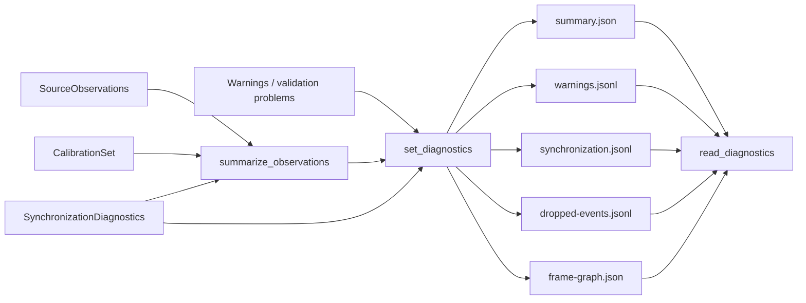

# Diagnósticos e sumário legível

Este documento descreve `src/contextmap/ingestion/diagnostics.py` e a integração opcional com `SequenceArtifactWriter`/`Reader` (issue #39).

## Debug, não contrato

Diagnósticos são evidência de depuração, nunca dependência contratual (`docs/ARTIFACTS.md`: "`outputs/` é contratual, `debug/` não é"). Um `SequenceArtifactReader` funciona plenamente sem nunca chamar nada deste módulo — `read_diagnostics()` retorna `None` quando `set_diagnostics()` nunca foi chamado no writer.

## `summarize_observations()`

Calcula um sumário legível por humano de um conjunto de observações: contagem por modalidade, intervalo de tempo, clocks, fontes, contagem por tópico, resoluções de imagem, layouts de point cloud, inventário de calibração/frames e, quando fornecido, contagens e offsets das decisões de sincronização. Não requer artefato persistido — funciona sobre qualquer `Sequence[SourceObservation]`, incluindo diretamente a saída de um `SourceAdapter` antes mesmo de persistir.

## Fluxo de diagnóstico

Esses arquivos aumentam auditabilidade e inspeção humana, mas permanecem fora do contrato consumido por stages downstream.

## Persistência estruturada

`writer.set_diagnostics(warnings=[...], synchronization=...)` antes de `finalize()` ativa a escrita de diagnósticos. O sumário é computado automaticamente a partir das observações, da calibração e das decisões fornecidas. `reader.read_diagnostics()` reconstrói `SequenceDiagnostics` ou retorna `None` quando diagnósticos não foram persistidos.

Arquivos escritos:

- `summary.json`: agregados legíveis e versão do schema;
- `warnings.jsonl`: warnings textuais em ordem;
- `synchronization.jsonl`: uma decisão estruturada por anchor e modalidade;
- `dropped-events.jsonl`: eventos não selecionados, ligados por `observation_id`;
- `frame-graph.json`: inventário de calibrações, frames e transforms estáticos.

Esses arquivos são evidência de debug. Não substituem as observações, o `CalibrationSet` nem qualquer output contratual usado por capacidades downstream.

## Integração com `validation.py`

Um pipeline de ingestão típico chamaria `validate_observations()` (`docs/validation.md`) antes de `writer.finalize()`, formatando cada problema encontrado como uma entrada da lista `warnings` passada a `set_diagnostics()` — ou decidindo abortar a ingestão se os problemas forem graves o suficiente. Esta issue não impõe essa decisão; fornece os dois primitivos (`validate_observations()`, `set_diagnostics()`) para que o chamador decida a política.
