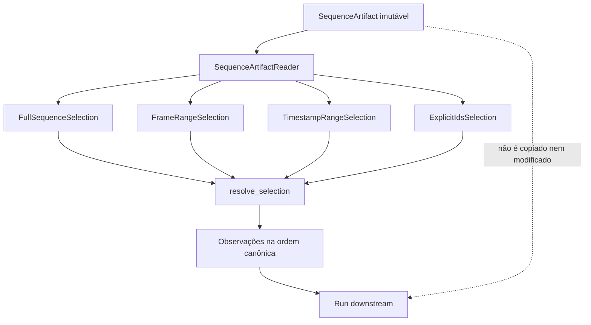

# Seleção e replay de sequência

Este documento descreve `src/contextmap/ingestion/sequence_selection.py`: como um run consome sequência inteira, um intervalo ou um subconjunto explícito de observações sem reescrever ou copiar o artefato de sequência (`SequenceArtifactReader`, issue #39).

## Um único caminho de replay

`resolve_selection(reader, selection)` é o único caminho de leitura para qualquer tipo de seleção. Isso garante a propriedade central desta issue: ler a sequência inteira e ler a porção correspondente de um `FrameRangeSelection` produzem exatamente as mesmas observações para os frames em comum — não há dois caminhos de leitura que possam divergir.


## Fluxo de replay



Todos os tipos convergem para o mesmo caminho de resolução. A seleção descreve o subconjunto consumido; ela não cria um novo artefato nem uma nova identidade física de observação.

## Tipos de seleção (v0)

- `FullSequenceSelection` — sequência inteira.
- `FrameRangeSelection(start_frame_index, end_frame_index)` — intervalo por posição no índice canônico da sequência (0-based, `start` inclusivo, `end` exclusivo). **Atenção**: isto é a posição no `index.jsonl` do artefato de sequência (issue #39), não o `frame_index` de um `ProcessingObservation` sincronizado (issue #40) — são conceitos diferentes: um é a ordem de persistência da sequência bruta, o outro é a indexação de um agrupamento de sincronização específico de um run.
- `TimestampRangeSelection(clock_id, start_seconds, end_seconds)` — intervalo por timestamp normalizado, **dentro de um único domínio de clock**. Uma observação cujo `timestamp.clock_id` seja diferente do `clock_id` da seleção é excluída, nunca comparada como se fosse do mesmo domínio — mesma regra de `docs/synchronization.md`. Os limites (`float`, em segundos) são convertidos uma vez, de forma exata, para nanossegundos inteiros e comparados com `timestamp.total_nanoseconds()`; o timestamp nunca vira `float`.
- `ExplicitIdsSelection(observation_ids)` — conjunto explícito de `SourceObservationId`. A ordem de replay segue sempre a ordem canônica da sequência, nunca a ordem do conjunto fornecido.

## Decisões desta issue

- **Ordenação determinística**: toda seleção, de qualquer tipo, retorna observações na ordem canônica da própria sequência (`SequenceArtifactReader.list_observations()`), nunca na ordem em que os critérios de seleção foram fornecidos.
- **Sem composição/aninhamento de seleções no v0.** Cada seleção é um dos quatro tipos acima, plana. Se uma combinação for necessária, resolva múltiplas seleções e componha do lado do chamador — implementar composição sem um caso de uso real violaria YAGNI.
- **Filtragem por modalidade não é responsabilidade desta issue.** Uma seleção sempre opera sobre `SourceObservation` completas, independente de modalidade; um estágio downstream que só precisa de imagens filtra depois de resolver a seleção.
- **`FrameRangeSelection.end_frame_index` além do tamanho da sequência não é erro** — é recortado (`clip`), permitindo escrever "do frame N até o fim" sem saber a contagem exata. `start_frame_index` além do tamanho **é** erro (`SequenceSelectionError`), pois normalmente indica um engano de configuração — inclusive numa sequência vazia: ali qualquer `start_frame_index > 0` é erro, e só `start_frame_index = 0` resolve, para um resultado vazio.
- **`ExplicitIdsSelection` com qualquer id inexistente é erro.** Diferente do intervalo de frames, um id explícito que não existe quase sempre indica configuração errada (id de outra sequência, typo) — falhar cedo é mais seguro que ignorar silenciosamente.
- **Nenhum payload é copiado ou modificado.** `resolve_selection` referencia as mesmas observações que `list_observations()` retornaria; o artefato de sequência permanece imutável.
- **Resolver uma seleção não decodifica nenhum payload (issue #374).** `resolve_selection` decide quais observações casam usando apenas `SequenceArtifactReader.iter_index()` — identidade e timestamp por linha do índice, sem abrir `rgb/`/`pointcloud/`. `SequenceSelectionResult.observations` devolve uma view preguiçosa: cada observação (payload incluído, quando a modalidade tiver um) só é decodificada quando o chamador efetivamente a acessa (indexação, iteração, `list(...)`), e não é cacheada — acessar a mesma seleção duas vezes decodifica duas vezes. Isso mantém o pico de memória de `resolve_selection` proporcional ao índice, nunca ao tamanho da seleção ou da sequência; o custo de decodificar payload só aparece quando, e na medida em que, o chamador realmente consome as observações.

## Identidade e serialização para manifests de run

`selection_identity(sequence_artifact_id, selection)` retorna um hash determinístico `sha256:...` de `(sequence_artifact_id, selection)` — duas chamadas com os mesmos argumentos sempre produzem a mesma identidade. Essa identidade já é registrada nos manifests dos runs implementados de Visual Perception, State Estimation, Geometric Mapping e Sensor Association; `encode_selection()`/`decode_selection()` fazem a serialização JSON da seleção em si.

## Exemplo

```text
sequence_artifact_id = "corridor-02-a1b2c3"

full sequence
    → geometry once

FrameRangeSelection(start_frame_index=120, end_frame_index=260)
    → perception run A
    → perception run B  (mesma seleção, run independente)

ExplicitIdsSelection({"frame-0135", "frame-0166", "frame-0208"})
    → depuração focada
```

Duas perception runs usando a mesma `FrameRangeSelection` sobre a mesma sequência têm o mesmo `selection_id`, mas permanecem execuções (runs) independentes — a seleção não é a identidade do run, apenas o que ele consumiu.
