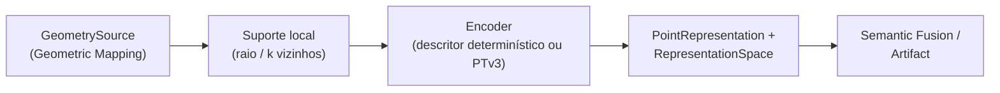

# Point Representation

## Responsabilidade

Produzir uma **descrição numérica da estrutura 3D local** em torno de cada elemento de geometria persistente: qual geometria formou o suporte de cada vetor, em qual espaço de representação ele vive e qual encoder o produziu. A capability é **opcional**: deve justificar seu custo por avaliação controlada (ver `evaluation`) e o pipeline funciona sem ela.

Uma representação é **evidência 3D**: descreve *como a estrutura local se parece*, não *o que ela é*. Fica separada de:

| Canal | Dono | Diz |
| --- | --- | --- |
| `GeometryReference` | Geometric Mapping | **onde** está o suporte |
| `PointRepresentation` | Point Representation | como a estrutura 3D local é representada |
| `VisualFeature` | Visual Perception | como a evidência RGB associada se parece |
| `SemanticClaim` | Visual Perception | o que um backend de percepção hipotetiza |

Nada é concatenado em um vetor único e opaco, e features visuais densas nunca são copiadas para cá só porque estão espacialmente associadas.

## O que este módulo explicitamente não possui

- labels, `SemanticClaim`, embeddings visuais ou qualquer campo semântico;
- fusão entre observações: Semantic Fusion;
- identidade e resolução de entidades;
- geometria e índice espacial: Geometric Mapping (a capability apenas lê pela porta `GeometrySource`);
- projeção 2D↔3D: Sensor Association;
- uma dependência obrigatória de PyTorch, CUDA ou de qualquer biblioteca de modelo no contrato central.

## Estado implementado

Existem os **contratos** (`PointRepresentation`, `RepresentationSpace`, política e suporte espacial, coordenadas preparadas), sua serialização, a **extração de suporte** local sobre `GeometrySource` (`SupportExtractor`) e a porta `PointEncoder` com o serviço de execução independente de backend. Estão **planejados**, e serão documentados aqui quando forem implementados: o descritor geométrico determinístico, o backend opcional PTv3, o `PointRepresentationRunArtifact` e o harness de avaliação.

## Contratos públicos

- `PointRepresentation`, `PointRepresentationId`, `PointRepresentationRunId`, `representation_id_for()` — a representação ancorada a uma geometria, com suporte, espaço, forma, dtype, normalização, referência ao payload e proveniência.
- `PointSupport`, `SupportPolicy`, `SupportType`, `NeighborhoodMethod`, `SupportStatistics` — quais elementos de geometria formaram o insumo do vetor e sob qual política.
- `CoordinatePreparation`, `CenteringMode`, `ScaleNormalization`, `PreparedSupport` — a preparação determinística das coordenadas antes do encoder, sempre registrada.
- `RepresentationSpace`, `representation_space_fingerprint()`, `ensure_compatible_representation_spaces()`, `ensure_compatible_representations()`, `RepresentationSpaceMismatchError` — identidade do espaço vetorial e a regra de comparabilidade.
- `EncoderIdentity`, `RepresentationProvenance` — qual implementação e qual código produziram a representação.
- `PointEncoder`, `EncodedVector`, `UnencodableSupportError` — a porta de encoders: um `PreparedSupport` entra, um vetor sai, e uma falha nunca vira vetor padrão.
- `RepresentationService`, `EncodedRepresentation`, `RepresentationMetrics`, `FailedSupport`, `FailureReason` — a execução independente de backend e seus resultados explícitos; ver [`execution.md`](execution.md).
- `SupportExtractor` — seleciona o suporte (raio ou k vizinhos) de um elemento pela porta `GeometrySource` e prepara suas coordenadas; ver [`support-extraction.md`](support-extraction.md).

Ver [`contracts.md`](contracts.md) para a referência de campos, as convenções e as invariantes.

## Módulos consumidos

- `contextmap.geometric_mapping`: `GeometrySource`, `GeometryPoint`, `GeometryReference`, `Bounds3D`, `MapId`, `GeometryId`.
- `contextmap.shared`: `Vector3`.

## Módulos que consomem este

`semantic_fusion` e `artifact`, sempre através de `contextmap.point_representation`.

## Onde estão os documentos detalhados

- [`contracts.md`](contracts.md) — contratos, identidade, comparabilidade e serialização.
- [`execution.md`](execution.md) — porta `PointEncoder`, serviço de execução, falhas explícitas e métricas.
- [`support-extraction.md`](support-extraction.md) — extração determinística do suporte local, preparação de coordenadas e linha de base de desempenho.
- [`docs/architecture.md`](../../../../docs/architecture.md) — ownership e direção de dependências.
- [`docs/CONTRACTS.md`](../../../../docs/CONTRACTS.md) — contratos no contexto global.
