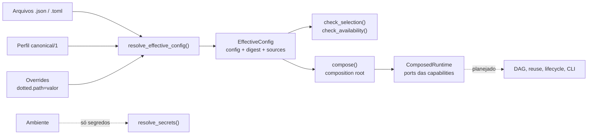

# Runtime

## Responsabilidade

Resolver a configuração de uma execução, selecionar e construir as implementações concretas das capabilities, orquestrar os stages e registrar o que foi executado. **Compõe e executa; não decide ciência.** Segmentação, projeção, fusão e as demais regras de domínio continuam nas capabilities que as possuem.

## O que este módulo explicitamente não possui

- lógica de segmentação, interpretação semântica, projeção, fusão, resolução de entidades ou relações espaciais;
- limiares científicos de outra capability: eles vêm da configuração do usuário e são validados por quem os possui;
- o formato do `ContextMapArtifact`: a versão do schema de configuração é independente da versão do schema do mapa.

## Estado implementado

Existe a **configuração versionada e a resolução da configuração efetiva** (issue #161): o catálogo estático de stages, pontos de variação e backends; o perfil `canonical/1`; a precedência perfil < arquivos < overrides; o digest determinístico; a persistência atômica de `effective_config.json`; a resolução de segredos somente a partir do ambiente; e as verificações de completude e de disponibilidade que rodam antes de qualquer execução pesada.

Existe também a **composition root** (issue #162): `compose()` constrói, a partir da configuração efetiva, as implementações de ingestion, percepção visual, state estimation, point representation e semantic fusion atrás dos ports das capabilities, com falha explícita para backend indisponível ou sem runtime e sem qualquer fallback. Detalhes em [`composition.md`](composition.md).

O DAG, o reuse, a seleção de runs, a CLI e o lifecycle são as demais issues da milestone #17 e ainda não existem. Configuração em [`configuration.md`](configuration.md).

## Contratos públicos

- `resolve_effective_config()`, `EffectiveConfig`, `ConfigurationSource` — a configuração efetiva, seu digest e as camadas que a produziram.
- `RuntimeConfig`, `PipelineConfig`, `ComponentConfig`, `InputsConfig`, `ResourcesConfig`, `PoliciesConfig` — o modelo resolvido, separado por preocupação.
- `parse_override()` — lê um override `dotted.path=valor`.
- `check_selection()`, `check_availability()`, `ConfigProblem`, `ConfigurationError` — problemas reportados de forma explícita, todos de uma vez.
- `resolve_secrets()`, `ResolvedSecrets` — segredos em memória, nunca persistidos nem impressos.
- `write_effective_config()`, `read_effective_config()`, `EFFECTIVE_CONFIG_FILENAME` — persistência e verificação do documento.
- `CANONICAL_PROFILE_ID`, `CONFIG_SCHEMA_VERSION`, `DEBUG_LEVELS` — identidades e constantes.
- `BackendSpec`, `ComponentSpec`, `StageDeclaration`, `RuntimePreset` — o catálogo estático.
- `compose()`, `ComposedRuntime`, `FeatureBuildScope`, `RuntimeProvider` — a composition root e o estado de execução de que os extratores de features precisam.
- `CompositionError`, `BackendConfigurationError`, `BackendUnavailableError`, `BackendRuntimeMissingError`, `StageUnavailableError` — falhas de composição, todas explícitas.
- `check_component_availability()` — a checagem de disponibilidade de um único ponto de variação.

## Módulos consumidos

A configuração e o catálogo não importam capability alguma. A composition root importa, **dentro da factory que os usa**, os backends concretos e as configurações das capabilities que compõe (`ingestion`, `visual_perception`, `state_estimation`, `point_representation`, `semantic_fusion`); é a única exceção permitida à regra de não importar backends. Os testes verificam que as identidades de política e o canal de evidência que o catálogo nomeia ainda existem em `contextmap.semantic_fusion`, e que o catálogo e a tabela de factories concordam.
