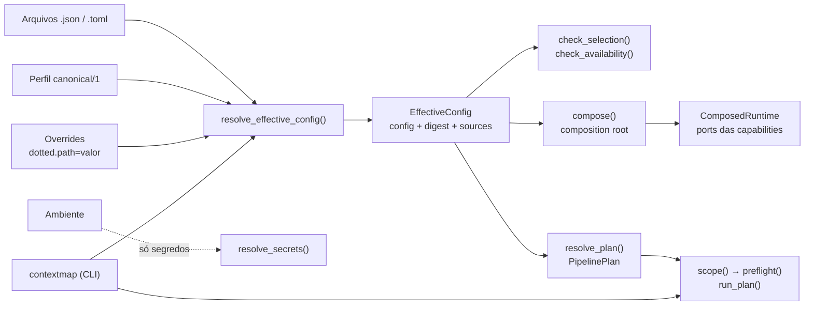

# Runtime

## Responsabilidade

Resolver a configuração de uma execução, selecionar e construir as implementações concretas das capabilities, orquestrar os stages e registrar o que foi executado. **Compõe e executa; não decide ciência.** Segmentação, projeção, fusão e as demais regras de domínio continuam nas capabilities que as possuem.

## O que este módulo explicitamente não possui

- lógica de segmentação, interpretação semântica, projeção, fusão, resolução de entidades ou relações espaciais;
- limiares científicos de outra capability: eles vêm da configuração do usuário e são validados por quem os possui;
- o formato do `ContextMapArtifact`: a versão do schema de configuração é independente da versão do schema do mapa.

## Estado implementado

Existe a **configuração versionada e a resolução da configuração efetiva** (issue #161): o catálogo estático de stages, pontos de variação e backends; o perfil `canonical/1`; a precedência perfil < arquivos < overrides; o digest determinístico; a persistência atômica de `effective_config.json`; a resolução de segredos somente a partir do ambiente; e as verificações de completude e de disponibilidade que rodam antes de qualquer execução pesada.

Existe também a **composition root** (issue #162): `compose()` constrói, a partir da configuração efetiva, as implementações de ingestion, percepção visual, state estimation, geometric mapping, sensor association, point representation, semantic fusion, entity resolution e spatial relations atrás dos ports das capabilities, com falha explícita para backend indisponível ou sem runtime e sem qualquer fallback. `compose_executors()` monta, da mesma configuração, os `StageExecutor` reais que o DAG executa para `state_estimation`, `geometric_mapping`, `sensor_association`, `semantic_fusion`, `entity_resolution` e `spatial_relations`, sem exigir um chamador Python montando-os à mão. Detalhes em [`composition.md`](composition.md).

Existe ainda o **DAG de estágios** (issue #163): `resolve_plan()` deriva da configuração uma topologia determinística e inspecionável, `plan.scope()` escolhe um pipeline completo ou um subgrafo que reutiliza artifacts fornecidos, `preflight()` valida tudo sem carregar modelo, e `run_plan()` executa em ordem de dependência com executores intercambiáveis (incluindo estágios falsos em CI). Detalhes em [`pipeline.md`](pipeline.md).

Existe também o **reuso por identidade** (issue #164): a chave de reuso combina a configuração própria do estágio, o hash de conteúdo das entradas, a identidade do código e identidades extras; o índice guarda só artifacts concluídos e re-validados; e cada estágio registra se foi reutilizado (com o artifact exato) ou recomputado (com o motivo). Detalhes em [`reuse.md`](reuse.md).

Existe ainda a **seleção explícita de runs e o vínculo de linhagem** (issue #165): a configuração escolhe ids exatos, seleções nomeadas ou `latest` (opt-in explícito), a compatibilidade é conferida a partir da linhagem que cada artifact declara (sequência física, seleção de observações, calibração, schema, upstream exato) e uma seleção incompatível falha antes de qualquer execução. Detalhes em [`selection.md`](selection.md).

Existe ainda a **CLI** (issue #166), uma camada fina que traduz flags em overrides e chama esses serviços: `run`, `stage`, `inspect` e `validate`, com dry-run que mostra o plano resolvido sem carregar modelo, saída `--json`, erros acionáveis e verificação de integridade só com a biblioteca padrão. Detalhes em [`cli.md`](cli.md).

Existe ainda o **ciclo de vida do run** (issue #167): estados explícitos (`planned`, `running`, `completed`, `failed`, `blocked`, `cancelled`), eventos estruturados append-only, registro de falha com categoria, cancelamento cooperativo, ambiente para reprodução, segredos sempre redigidos e retomada como um run novo que só reutiliza artifacts que passam nas checagens normais de reuso. Detalhes em [`lifecycle.md`](lifecycle.md). Existe também o **serviço público de ingestion** (issue #263): um caminho único e neutro de frontend (`preflight` e `run` com eventos, cancelamento cooperativo e resultado estruturado) que a CLI, uma TUI e o DAG compartilham, com o adapter vindo da composition root e nenhuma regra de fonte, validação ou sincronização duplicada. Detalhes em [`ingestion-service.md`](ingestion-service.md).

Existe, por fim, a **API pública de aplicação** (issue #264): `contextmap.runtime.Runtime`, a única superfície de que um frontend (CLI, TUI) precisa para descobrir capabilities e backends (sem carregar modelo), resolver configuração e topologia, fazer preflight, executar com eventos e cancelamento e inspecionar runs a partir do registro persistido, com contratos serializáveis, sem classe de backend, objeto ROS nem biblioteca de UI. É uma fachada: cada operação delega ao serviço que a possui. Detalhes em [`api.md`](api.md).

Existem também os **executores de estágio** (issue #177): `contextmap.runtime.executors` roda State Estimation, Geometric Mapping, Sensor Association, Semantic Fusion, Semantic Mapping, Entity Resolution e Spatial Relations gravando só no `StageRequest.output_dir`, e o estágio `ingestion` publica no mesmo diretório. Uma execução idêntica publica a mesma identidade, e um artifact reutilizado é aberto por `StageRequest.directory_of`. A composition root monta os quatro primeiros (State Estimation, Geometric Mapping, Sensor Association e Semantic Fusion) automaticamente da configuração (`compose_executors`); os demais, incluindo Ingestion, continuam exigindo que o chamador os construa e injete. `cli.py` e `Runtime` mesclam o resultado de `compose_executors` com o que o chamador injeta, e o injetado sempre vence. Detalhes e o que ainda falta (percepção, point representation e a montagem do `ContextMapArtifact`) em [`executors.md`](executors.md).

A estratégia de testes, o mapa de cobertura e as invariantes exercitadas estão em [`testing.md`](testing.md). Configuração em [`configuration.md`](configuration.md).

## Contratos públicos

- `resolve_effective_config()`, `EffectiveConfig`, `ConfigurationSource` — a configuração efetiva, seu digest e as camadas que a produziram.
- `RuntimeConfig`, `PipelineConfig`, `ComponentConfig`, `InputsConfig`, `ResourcesConfig`, `PoliciesConfig` — o modelo resolvido, separado por preocupação.
- `parse_override()` — lê um override `dotted.path=valor`.
- `check_selection()`, `check_availability()`, `ConfigProblem`, `ConfigurationError` — problemas reportados de forma explícita, todos de uma vez.
- `resolve_secrets()`, `ResolvedSecrets` — segredos em memória, nunca persistidos nem impressos.
- `write_effective_config()`, `read_effective_config()`, `EFFECTIVE_CONFIG_FILENAME` — persistência e verificação do documento.
- `CANONICAL_PROFILE_ID`, `CONFIG_SCHEMA_VERSION`, `DEBUG_LEVELS` — identidades e constantes.
- `BackendSpec`, `ComponentSpec`, `StageDeclaration`, `RuntimePreset` — o catálogo estático.
- `compose()`, `ComposedRuntime`, `FeatureBuildScope`, `RuntimeProvider` — a composition root e o estado de execução de que os extratores de features precisam.
- `CompositionError`, `BackendConfigurationError`, `BackendUnavailableError`, `BackendRuntimeMissingError`, `StageUnavailableError` — falhas de composição, todas explícitas.
- `check_component_availability()` — a checagem de disponibilidade de um único ponto de variação.
- `resolve_plan()`, `PipelinePlan`, `PlannedStage`, `PlannedInput` — a topologia derivada da configuração, com a ordem e as identidades.
- `StageInput`, `Interception` — a declaração de entradas tipadas e de inserção de um estágio opcional.
- `ExecutionPlan`, `preflight()`, `PreflightReport` — o escopo de uma execução e a validação antes dela.
- `run_plan()`, `StageExecutor`, `StageRequest`, `ArtifactRef`, `ExecutionRecord`, `StageRecord` — a execução e o registro exato de entradas e saídas.
- `write_plan()`, `write_execution_record()`, `read_plan_document()` — a persistência da topologia e da execução.
- `IngestionService`, `IngestionRequest`, `ValidationPolicy`, `IngestionPreflight`, `IngestionResult`, `IngestionFailure`, `IngestionMetrics`, `IngestionStageExecutor` — o serviço público de ingestion e sua execução como estágio do DAG.
- `RunJournal`, `read_run()`, `RunSummary`, `RunStatus`, `FailureRecord`, `resume_plan()`, `check_resumable()` — o journal persistente de um run, sua leitura e a retomada.
- `ExecutionEvent`, `EventSink`, `CancellationToken`, `StageFailure`, `FailureCategory`, `capture_environment()`, `categorize_failure()` — eventos, cancelamento, categorias de falha e ambiente.
- `RunCancelledError`, `RunRecordError`, `ResumeError` — falhas do ciclo de vida, todas explícitas.
- `contextmap.runtime.cli.main()` — a CLI (`contextmap` / `python -m contextmap`); `load_catalog()` lê o arquivo de catálogo que ela usa para resolver seleções.
- `resolve_selections()`, `ResolvedSelections`, `SelectedRun`, `ArtifactCatalog`, `StaticCatalog`, `CatalogEntry`, `Lineage`, `check_lineage()`, `LATEST`, `NAMED_PREFIX` — a seleção explícita de runs e a checagem de linhagem.
- `ReusePolicy`, `ReuseKey`, `ReuseDecision`, `ArtifactStore`, `FileArtifactStore`, `StoreLookup`, `predict_reuse()` — o reuso por identidade e a previsão do que seria reutilizado.
- `plan_context_build()`, `publish_context_build()`, `read_context_build()`, `ContextBuild`, `PlannedContextBuild`, `ContextBuildId`, `ContextBuildError` — a entrada congelada de uma materialização de `ContextMap` a partir de uma revisão de branch (#498).
- `create_branch()`, `open_branch()`, `append_to_branch()`, `ContextBranch`, `ContextBranchMember`, `ContextBranchError` — o acúmulo explícito de ContextRuns sobre uma fundação, em registros imutáveis só por acréscimo (#496).
- `context_scope()`, `publish_context_run()`, `read_context_run()`, `ContextRun`, `ContextArtifact`, `ContextRunId`, `ContextRunError`, `CONTEXT_STAGES` — a execução de contexto sobre uma fundação e seu registro imutável `context_run.json` (#495).
- `foundation_of_run()` — a fundação que o registro de execução de um run concluído nomeia, validada (#502).
- `resolve_spatial_foundation()`, `SpatialFoundation`, `SpatialFoundationId`, `SpatialFoundationError` — a fundação espacial do contexto incremental: sequência, trajetória e mapa validados juntos, com identidade por conteúdo (#494; decisão em [`runtime-composition.md`](../../../../docs/runtime-composition.md#contexto-incremental-v011-decisão-de-arquitetura)).
- `PipelineError`, `PreflightError`, `PlanDocumentError`, `StageExecutionError`, `ReuseError` — falhas do DAG, todas explícitas.
- `Runtime` — a API pública de aplicação para qualquer frontend: `status()`, `capabilities()`, `resolve_config()`, `resolve_plan()`, `preflight()`, `run()`, `reuse_policy()`, `list_runs()`, `inspect_run()` e `ingestion()`.
- `RuntimeStatus`, `RuntimeCapability`, `RuntimeComponent`, `RuntimeBackend`, `ResolvedPipelinePlan`, `RuntimePlanStage`, `RuntimePlanInput`, `RuntimeEdit`, `RuntimePreflightReport`, `RuntimeExecutionEvent`, `RuntimeExecutionResult`, `RuntimeRunRecord`, `RuntimeRunStage`, `RuntimeRunSummary` — os contratos que essa API devolve, todos com `to_document()`.

## Módulos consumidos

A configuração e o catálogo não importam capability alguma. O serviço de ingestion importa **somente a raiz pública** de `contextmap.ingestion` (nunca um adapter). A composition root importa, **dentro da factory que os usa**, os backends concretos e as configurações das capabilities que compõe (`ingestion`, `visual_perception`, `state_estimation`, `point_representation`, `semantic_fusion`, `entity_resolution`, `spatial_relations`); é a única exceção permitida à regra de não importar backends. Os testes verificam que as identidades de política e o canal de evidência que o catálogo nomeia ainda existem em `contextmap.semantic_fusion`, e que o catálogo e a tabela de factories concordam.
