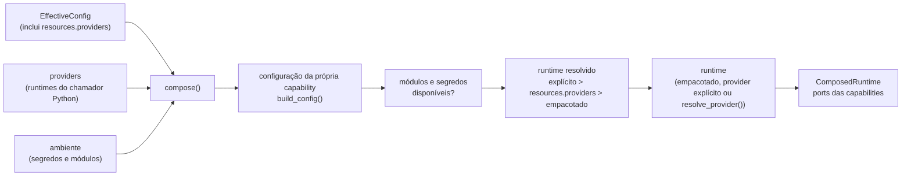

# Composition root

`contextmap.runtime.composition` é o **único** lugar em que backends concretos são nomeados e construídos. Uma capability nunca importa o runtime; um estágio downstream nunca descobre qual backend produziu sua entrada. Cada implementação sai daqui atrás do port que sua capability publica, então trocar de backend é uma mudança de configuração, sem editar código downstream.



## Regras

- **Construir não é carregar.** Os parâmetros são validados pela configuração da própria capability e os módulos/segredos são checados **antes** de qualquer modelo ser pedido. Os loaders empacotados são lazy; um modelo que o repositório não sabe carregar entra por um `RuntimeProvider`.
- **Sem fallback.** Um backend selecionado que não pode ser construído levanta um erro específico. Nada o substitui por outro backend nem remove o estágio.
- **Sem política científica.** As factories só traduzem valores configurados para os tipos da capability. Padrões, faixas e significado são da capability; `build_config()` lê os tipos declarados na dataclass de configuração e converte os valores JSON, então o runtime não duplica parâmetros de backend.
- **Sem registry nem plugin.** A tabela de factories é explícita e fechada; os módulos de backend são importados dentro da factory que os usa, então compor uma configuração importa só o que ela seleciona.

## API

- `compose(effective, providers=..., stages=..., environ=..., module_available=..., on_provider_override=...)` devolve um `ComposedRuntime`.
- `ComposedRuntime` guarda `effective`, os `stages` compostos, os `unavailable_stages` (estágios habilitados sem capability implementada, com o motivo) e as implementações: `source_adapter`, `region_discovery`, `dense_features`, `region_features`, `semantic_interpreter`, `semantic_prompts` (a política de prompt por modo, ver "Política de prompt semântico"), `state_estimator`, `geometric_mapping_pose_lookup`, `motion_correction`, `point_encoder`, `support_policy`, `accumulation_policy`, `occlusion_policy`, `association_tolerances`, `association_pose_policy`, `entity_retrieval_policy`, `entity_comparison_channels`, `entity_resolution_policy` e `spatial_relations_policies` (que já inclui a política de geometry summary — `SpatialRelationsExecutor` a lê só dali, nunca de um segundo parâmetro, revisão do PR #540). Um campo é `None` quando seu estágio não foi composto.
- `compose_executors(effective, providers=..., environ=..., module_available=..., on_provider_override=...)` devolve um `dict[str, StageExecutor]`: é a contraparte automática de `compose()` para o DAG (ver seção própria abaixo).
- `RuntimeProvider` é `Callable[[config, ResolvedSecrets], runtime]`: recebe a configuração da capability, já validada, e **somente** os segredos que aquele backend declara.
- `resolve_provider(component_id, target)` resolve um alvo `"module:attribute"` declarado em `resources.providers` (configuração) no `RuntimeProvider` que ele nomeia — ver a seção própria abaixo. `on_provider_override(component_id)` é chamado quando um `providers=` explícito vence um alvo declarado para o **mesmo** componente (nunca em uma execução comum pelo `contextmap` instalado, que nunca passa `providers=`).
- `FeatureBuildScope` reúne o estado de execução de que um extrator de features precisa (run, estágio, artifact, sink de payload, raiz das imagens preparadas, fonte de máscaras). Um extrator escreve seus payloads no run que o possui, então só pode ser construído quando esse run existe; por isso `dense_features` e `region_features` são factories que recebem o escopo, e a configuração é validada já em `compose()`.

## De onde vem cada runtime

| Ponto de variação | Backend | Runtime |
|---|---|---|
| `ingestion.source_adapter` | `ros1_bag`, `ros2_bag` | adapter construído a cada pedido (`SourceAdapterConfig`); exige `rosbags`; um pedido de outra família de source é recusado |
| `visual_perception.region_discovery` | `sam2`, `sam3`, `florence2` | **provider** (`Sam2Runtime`, `Sam3Runtime`, `Florence2Runtime`) |
| `visual_perception.dense_features` | `dinov2`, `dinov3`, `siglip2` | loader Hugging Face empacotado (lazy; `torch`, `transformers`, `Pillow`) ou provider; `siglip2` tem escopo `dense` **fixado** pelo slot |
| `visual_perception.region_features` | `clip`, `alphaclip` | loader empacotado (HF / oficial) ou provider; `clip` tem escopo `region` **fixado** pelo slot; `alphaclip` exige `mask_source` no escopo |
| `visual_perception.semantic_interpretation` | `qwen`, `gemini`, `florence2`, `eagle2_5` | **provider** (`QwenRuntime`, `GeminiClient`, `Florence2SemanticRuntime`, `EagleRuntime`); `gemini` declara o segredo `GEMINI_API_KEY`; `eagle2_5` exige o orçamento visual `max_dynamic_tiles` ([Eagle 2.5](../../visual_perception/docs/eagle2_5.md)) |
| `state_estimation.estimator` | `external_pose`, `fast_lio` | `external_pose` não precisa de runtime; `fast_lio` usa o runner por subprocesso empacotado, descrito no grupo `runner` (`command`, `timeout_s`, `work_root`), ou um provider |
| `geometric_mapping.pose_lookup`, `sensor_association.pose_policy` | `lookup-policy-v1` | nenhum; constrói um `state_estimation.LookupPolicy` (o tipo é de `state_estimation`, mas cada estágio que o consome declara seu próprio componente — ver "Estágios") |
| `geometric_mapping.motion_correction` | `motion-correction-v1` | nenhum; constrói um `MotionCorrectionPolicy` |
| `sensor_association.occlusion` | `conservative-depth-support-v1` | nenhum; constrói um `OcclusionPolicy` |
| `sensor_association.tolerances` | `diagnostic-tolerances-v1` | nenhum; constrói um `DiagnosticTolerances` |
| `point_representation.encoder` | `geometric_descriptor`, `ptv3` | `geometric_descriptor` não precisa de runtime; `ptv3` exige um provider (`PTv3Runtime`) |
| `semantic_fusion.support`, `semantic_fusion.accumulation` | políticas versionadas | nenhum |
| `entity_resolution.retrieval`, `entity_resolution.resolution`, `entity_resolution.geometry_comparison` | políticas versionadas (obrigatórias) | nenhum |
| `entity_resolution.semantic_compatibility`, `entity_resolution.temporal_compatibility` | políticas versionadas (**opcionais**) | nenhum; `None` quando não selecionado |
| `entity_resolution.appearance`, `entity_resolution.representation` | políticas versionadas (**opcionais**) | **provider** (`FeatureVectorSource`, `RepresentationVectorSource`); `None` quando não selecionado |
| `spatial_relations.frame_conventions`, `spatial_relations.candidate`, `spatial_relations.geometry_summary` | políticas versionadas (obrigatórias) | nenhum; `geometry_summary` constrói um `semantic_mapping.GeometrySummaryPolicy` |
| `spatial_relations.geometric_predicate`, `spatial_relations.contact_predicate` | políticas versionadas (**opcionais**) | nenhum; `None` quando não selecionado |

Um provider fornecido para um backend que também empacota um loader **substitui** o loader e a checagem dos módulos opcionais dele: aqueles módulos passam a ser da responsabilidade do runtime fornecido.

## Grupos de parâmetros reservados

Alguns backends recebem, além da própria configuração, um segundo objeto de configuração. Ele é escrito como um grupo dentro do bloco do backend: `pass_config` e `normalization_config` nos backends de Region Discovery; `support_policy` nos encoders de Point Representation (obrigatório); `runner` no FAST-LIO; `prompt_policy` nos interpretadores semânticos Qwen, Gemini e Eagle 2.5 (obrigatório, ver abaixo). Cada grupo é validado pela dataclass que a capability já define.

### Política de prompt semântico (#542)

A política de prompt de Semantic Interpretation é selecionada pela configuração, antes de qualquer inferência, e nunca por um backend:

```toml
[components.visual_perception.semantic_interpretation]
backend = "qwen"

[components.visual_perception.semantic_interpretation.qwen]
model = "Qwen/Qwen3-VL-4B-Instruct"
precision = "bfloat16"
max_new_tokens = 256
temperature = 0.0
prompt_policy = { scene = "scene/v1", region = "region/v1" }
```

- **Obrigatória para Qwen, Gemini e Eagle 2.5.** O grupo `prompt_policy` é validado por `visual_perception.SemanticPromptPolicy`: cada identidade precisa existir em `SEMANTIC_PROMPT_TEMPLATES` e pertencer ao seu modo. Sem o grupo, ou com uma identidade desconhecida ou de outro modo, `compose()` levanta `BackendConfigurationError` antes de pedir o runtime do modelo. Não há padrão: a política canônica é declarada explicitamente (`scene/v1`/`region/v1`) e reproduz byte a byte o prompt anterior a #542. A mesma política vale para os três backends, que a renderizam de forma idêntica.
- **Florence-2 é nativo da task.** Sua política é o prompt da task configurada (`florence2-task-prompt/1:<task>`), válida só para o modo que a task serve; um `prompt_policy` no bloco `florence2` é recusado com essa explicação, em vez de ser registrado como se o modelo o consumisse.
- **Composição.** `ComposedRuntime.semantic_prompts` mapeia cada modo para um `SemanticRequestPrompt` (`template_id`, `output_schema`), que o `VisualPerceptionExecutor` copia para `prompt_template_id`/`requested_output_schema` de cada request. Um modo sem entrada (o modo que a task do Florence-2 não serve) falha explicitamente ao montar o request, nunca recebe um padrão.
- **Identidade e reuso.** Como qualquer parâmetro de backend, `prompt_policy` entra na configuração efetiva, no seu digest e no `config_digest` do estágio `visual_perception`. Trocar só a política recalcula `visual_perception` e, pelas entradas, os estágios que dependem dele; `ingestion`, `state_estimation` e `geometric_mapping` mantêm a identidade e continuam reutilizáveis. A granularidade é a do estágio: Region Discovery e features são recalculados junto, porque Semantic Interpretation ainda não é um estágio próprio do runtime.

## Ordem de validação

1. a configuração da capability (`build_config()`), com **todos** os problemas de uma vez e a mensagem da própria capability;
2. os módulos opcionais e os segredos declarados no catálogo;
3. o runtime (provider ou loader empacotado).

Assim um checkpoint inválido ou um limiar fora da faixa falha antes de qualquer modelo ser pedido. Os erros são `BackendConfigurationError`, `BackendUnavailableError`, `BackendRuntimeMissingError`, `ProviderConfigurationError` e `StageUnavailableError`, todos `CompositionError`.

## Providers declarados em configuração (`resources.providers`)

Um `RuntimeProvider` é um `Callable` Python: um `providers={...}` em `compose()`/`compose_executors()` só existe para quem embute o runtime (uma API Python, um teste, um futuro TUI). O binário `contextmap` **instalado** — `contextmap run`/`contextmap stage`, chamando `main(argv)` sem nenhum `providers=` — nunca tem como construir esse dicionário: ele só recebe o que a configuração descreve. Por isso um backend sem loader empacotado (SAM2, SAM3, Qwen, Gemini, Florence-2 hoje) também aceita seu provider como um **alvo declarado em configuração**, sob `resources.providers`:

```json
{
  "resources": {
    "providers": {
      "visual_perception.region_discovery": "meu_pkg.contextmap_loaders:load_sam3"
    }
  }
}
```

- **Formato.** O valor é `"módulo:atributo"` — nunca `eval`, nunca uma expressão. `resolve_provider(component_id, target)` (em `composition.py`, perto da própria definição de `RuntimeProvider`) faz `target.partition(":")`, importa o módulo com `importlib.import_module` e lê o atributo com `getattr`. O atributo importado **é** o provider — não existe uma fábrica intermediária que o embrulhe; ele já precisa satisfazer o contrato de `RuntimeProvider` diretamente (`Callable[[config, ResolvedSecrets], runtime]`).
- **Onde mora.** `resources.providers` é um novo campo de `ResourcesConfig` (`config.py`), ao lado de `device`/`workspace`: é uma decisão de composição/implantação (qual processo fornece qual runtime), nunca um parâmetro científico do backend, então nunca mistura com `components.<capability>.<slot>.<backend>`. Ele flui pelas mesmas camadas que qualquer outro campo (perfil < arquivos < overrides, mesclagem chave a chave em camadas de arquivo) e participa do digest da configuração efetiva automaticamente, porque `RuntimeConfig.to_document()` já o inclui.
- **Precedência.** Em `_Context.runtime()`/`_Context.optional_runtime()` (`composition.py`): um `providers=` explícito para um componente sempre vence, mesmo quando a configuração também declara um alvo para o mesmo componente; só na ausência do explícito é que o alvo declarado é resolvido; só na ausência de ambos é que `BackendRuntimeMissingError` é levantado, exatamente como antes. Quando o explícito de fato vence sobre um declarado (os dois existem para o mesmo componente — só acontece com um chamador Python), isso é reportado via `on_provider_override(component_id)` e acaba registrado no evento `run_planned` do próprio run (campo `provider_overrides`), nunca aplicado silenciosamente. Uma execução comum pelo binário instalado nunca passa `providers=`, então esse ramo nunca é exercitado nela.
- **Preguiça.** Um alvo declarado só é resolvido (importado) quando aquele componente está **de fato** sendo composto — nunca antecipadamente para o documento inteiro. Isso preserva a garantia já documentada no topo deste arquivo: compor uma configuração importa só os backends que ela seleciona. `ensure_available()` também para de exigir os módulos opcionais do backend quando um provider é esperado (explícito **ou** declarado): aquele import pesado é responsabilidade do provider, nunca de `contextmap.runtime`.
- **Postura de segurança.** Um alvo `resources.providers` é código Python executado em tempo de execução: só a sintaxe `"módulo:atributo"` é aceita, nenhum módulo é instalado automaticamente, e a resolução é sempre pontual (nunca eager para o documento inteiro). Isso é a **mesma** fronteira de confiança de qualquer outra configuração que nomeia código executável — configuração de origem não confiável nunca deve ser resolvida assim. Não há sandbox nem allowlist (não há um problema concreto que os justifique hoje).

## Estágios

`compose()` monta todo estágio habilitado cuja capability existe e lista os demais em `unavailable_stages`; pedir explicitamente um estágio indisponível levanta `StageUnavailableError`. `stages=[...]` compõe só um subconjunto, e a completude da seleção é exigida apenas para ele.

`geometric_mapping` e `sensor_association` não introduzem um tipo próprio de política: `LookupPolicy` é de `state_estimation`, `MotionCorrectionPolicy` é de `geometric_mapping`, `OcclusionPolicy`/`DiagnosticTolerances` são de `sensor_association`. Cada estágio que consome uma política, mesmo uma que outra capability define, declara seu **próprio** componente sob seu próprio nome (`geometric_mapping.pose_lookup` e `sensor_association.pose_policy` são dois componentes distintos, ambos construindo um `LookupPolicy`): um componente pertence a exatamente um estágio, exatamente como `semantic_fusion.support`/`semantic_fusion.accumulation` já pertencem só a `semantic_fusion` (`tests/runtime/test_runtime_catalog.py::test_every_component_belongs_to_exactly_one_stage_of_its_capability`). `spatial_relations.geometry_summary` segue o mesmo padrão: `GeometrySummaryPolicy` é de `semantic_mapping`, mas o componente pertence a `spatial_relations`, o único estágio que o consome hoje.

### Canais opcionais: `optional=True` no catálogo

`ComponentSpec.optional` marca um ponto de variação que um estágio pode legitimamente deixar sem backend: `check_component_selection`/`check_selection` nunca reportam sua ausência como problema, e a composição constrói o valor apenas quando um backend foi selecionado (`_construct_optional`), devolvendo `None` caso contrário — nunca uma política padrão substituindo "não configurado". `entity_resolution.semantic_compatibility`, `.temporal_compatibility`, `.appearance`, `.representation`, `spatial_relations.geometric_predicate` e `.contact_predicate` são os seis componentes hoje marcados assim; todo outro componente continua obrigatório para o estágio que o possui.

## `compose_executors`: os executores reais do DAG

`compose_executors(effective, providers=..., environ=..., module_available=..., on_provider_override=...)` é a contraparte automática de `compose()` para a execução: em vez de devolver backends e políticas soltos, ela os embrulha na classe concreta de `contextmap.runtime.executors` que cada estágio do DAG precisa, indexada por `stage_id`. É o que deixa o binário `contextmap` instalado executar o DAG real sem um chamador Python montando executores à mão **e** sem um chamador Python montando providers à mão: `resources.providers` supre o segundo caso (ver seção acima).

Hoje ela compõe `state_estimation`, `geometric_mapping`, `sensor_association`, `semantic_fusion`, `entity_resolution`, `spatial_relations` e `context_map` incondicionalmente, `semantic_mapping` quando o chamador também passa `semantic_map_id` e `code_digest` (nenhum dos dois é valor de configuração nem derivável da `EffectiveConfig`, e o writer da run recusa um `code_digest` vazio, então esta função nunca inventa nenhum dos dois), e `visual_perception` quando cada backend selecionado que não empacota loader tem um `RuntimeProvider` disponível — explícito em `providers`, declarado em `resources.providers`, ou os dois (o explícito vence): cada um precisa só da configuração efetiva, dos `providers` recebidos e dos artifacts upstream que o próprio DAG já entrega. Ela **nunca** levanta: um estágio que não pode ser composto por qualquer motivo (seleção incompleta, um parâmetro que o backend rejeita, um módulo/segredo ausente, um provider que faltou ou que não pôde ser resolvido) fica simplesmente ausente do dicionário devolvido, um estágio de cada vez — o fracasso de `sensor_association` nunca custa o executor de `state_estimation`. A ausência é honesta: o `missing_executors`/"no executor is registered" do preflight já explica por que aquele estágio não vai rodar.

Casos que ficam de fora, deliberadamente:

- **`ingestion` e `pose_ingestion`.** `IngestionStageExecutor` precisa de um `IngestionRequest` concreto (caminho da fonte, tópicos, tolerância de sincronização) que nunca é parte de uma `EffectiveConfig` — é o que os próprios flags do comando `ingest` constroem. O caminho canônico é rodar `contextmap ingest` primeiro e alimentar o artifact publicado a `run`/`stage` como entrada fornecida ou selecionada; um chamador que queira `ingestion` (ou seu par opcional `pose_ingestion`, issue #555) dentro de `run_plan` injeta sua própria instância de `IngestionStageExecutor` explicitamente — uma segunda instância, com `stage_id="pose_ingestion"` e um `IngestionRequest` apontando para o adapter `pose_file`, para a auxiliar. Ver a seção da bridge de pose abaixo.
- **`visual_perception`.** Desde #507, `VisualPerceptionExecutor` é montado quando os quatro pontos de variação (`region_discovery`, `dense_features`, `region_features`, `semantic_interpretation`) estão selecionados e disponíveis ao mesmo tempo — uma seleção parcial nunca gera um executor parcial (mesmo padrão `except (ConfigurationError, CompositionError): return None` dos outros quatro estágios). `region_discovery`/`semantic_interpretation` não empacotam loader, então isso também exige um `RuntimeProvider` para cada um — via `providers` (só chamador Python) **ou** via `resources.providers` na própria configuração (também o binário instalado, ver seção acima); sem nenhum dos dois, `compose()` levanta `BackendRuntimeMissingError` e a ausência é honesta, exatamente como para qualquer outro backend sem loader. Ver [`executors.md`](executors.md#visualperceptionexecutor-507).
- **`point_representation`.** Não tem executor real ainda (backend dependente de GPU/modelo, `ptv3`); continua ausente, exatamente como antes.
- **`semantic_fusion` com a política quality-aware.** `SemanticFusionExecutor` só roda a acumulação `baseline-evidence-accumulation-v1`; se o backend selecionado for `quality-aware-evidence-accumulation-v1`, o estágio fica de fora em vez de rodar com a política errada.
- **`semantic_mapping`.** Tem um componente de catálogo (`semantic_mapping.geometry_summary`, o mesmo `GeometrySummaryPolicy` que `spatial_relations.geometry_summary` já compõe) e um executor real, mas dois identificadores que a configuração não carrega (`semantic_map_id`, a identidade do mapa semântico persistente; `code_digest`, exigido pelo writer da run) precisam vir explicitamente do chamador — ver acima.
- **`entity_resolution`** monta sempre o canal de geometria (obrigatório) e só monta `semantic`, `temporal`, `appearance` e `representation` quando o respectivo componente foi selecionado; um canal não selecionado é `None` no `ComparisonChannels`, nunca uma política padrão. `appearance`/`representation`, quando selecionados, ainda dependem de um `RuntimeProvider` (`FeatureVectorSource`/`RepresentationVectorSource`); sem ele, a composição do estágio falha e ele fica ausente, honestamente.
- **`spatial_relations`** monta sempre `frame_conventions`, `candidate` e `geometry_summary`; `geometric`/`contact` são `None` quando seus componentes não foram selecionados.
- **`context_map`** não tem ponto de variação próprio, então compõe sempre que seu preset o declara. Seu `up_axis` vem do mesmo `FrameConventions` que `spatial_relations` já compôs acima, quando disponível -- nunca derivado de novo -- e fica desconhecido caso contrário.

`cli.py` (`main(providers=...)`) e `Runtime` (`api.py`, `Runtime(providers=...)`) repassam `providers` para `compose_executors` na mesma forma e mesclam o resultado com os executores que o chamador forneceu explicitamente, e o explícito sempre vence — assim um teste, ou um chamador que precise substituir um estágio, continua podendo.

## Bridge de pose auxiliar em `state_estimation` (issue #555)

Uma sequência gravada pode não ter pose em nenhum tópico (`corridor-02.bag`, por exemplo): a trajetória vem de um arquivo separado, ingerido pelo `PoseFileSourceAdapter` (`ingestion/docs/adapters.md`) em um **segundo** `SequenceArtifact`, nunca misturado ao principal. `pose_ingestion` é um estágio opcional (`optional=True, default_enabled=False`, sem componente de catálogo próprio) que publica esse segundo artifact; `state_estimation` ganha um input opcional `pose_sequence`, ligado a `pose_ingestion` (`catalog.py`), ausente por padrão exatamente como qualquer outro input opcional (ver "Canais opcionais" acima).

Isto é uma bridge incremental para a #177, não a arquitetura-alvo de "uma aquisição física = um `SequenceArtifact`": carregar só o artifact principal continua sem revelar a trajetória gravada. A fusão dos dois artifacts é decisão do executor, mas o resultado é nomeado explicitamente em `StateEstimationRequest`/`TrajectoryProvenance` sempre que a mesclagem de fato contribui observações (ver abaixo) — a lineage de per-stage input que a runtime já tem (`ArtifactRef`/`StageRequest.inputs`) não é suficiente sozinha, porque o `StateEstimationRunArtifact` precisa ser autoportável: um consumidor que só tenha esse artifact, sem o journal da runtime, ainda precisa conseguir fechar a proveniência de cada pose auxiliar.

- o `pose_role` declarado pela sequência auxiliar (`ground_truth`/`odometry`/`external_localization`, ver `adapters.md`) é checado primeiro: precisa ser único e consistente entre todas as suas observações; ausente ou divergente recusa o merge.
### Política de candidatos de Sensor Association (#562)

`policies.association_max_range_m` é a maior distância, em metros, do centro óptico da câmera em que `sensor_association` ainda avalia um elemento do mapa. `_compose_sensor_association` a repassa como `SensorAssociationExecutor(candidates=CandidateGeometryPolicy(max_range_m=...))`.

Ela é um **policy cruzado da execução**, não um ponto de variação de backend, e por isso vive em `policies` e não em `components`: não há duas implementações de seleção de candidatos entre as quais escolher, há um parâmetro científico de uma delas.

O padrão é ausente (`None`), que avalia o mapa inteiro — exatamente como se a política não existisse —, de modo que ligar o corte é sempre uma decisão deliberada e registrada. Um valor limita o trabalho e a memória por frame pela geometria local em vez do tamanho do mapa, e **estreita a população avaliada**: é uma escolha científica, que o run registra no manifest (`candidate_policy` com seu fingerprint), no `configuration_fingerprint` da associação e nas contagens por frame de `outputs/projection-records.jsonl`. Ver `sensor_association/docs/projection_chain.md`.

- `pose_role="ground_truth"` nunca vira trajetória operacional por padrão: suas observações são descartadas do merge (o run se comporta exatamente como se a sequência auxiliar não existisse) a menos que `policies.trajectory_mode = "allow_ground_truth"` seja escolhido explicitamente na configuração — `_compose_state_estimation` repassa essa política como `StateEstimationExecutor(..., allow_ground_truth_trajectory=...)`, nunca inferida da simples presença do artifact ou da escolha do backend `external_pose`. Uma sequência ground-truth descartada por esta salvaguarda nunca chega a passar pela checagem de clock abaixo: um run em `operational_only` não pode ser bloqueado pela plausibilidade de dados que nunca seriam usados.
- só então `StateEstimationExecutor.execute()` chama `contextmap.ingestion.validate_cross_source_clock_plausibility()` sobre as duas sequências — nunca confia que os dois `timestamp_clock_id` batem só porque a string é igual; um intervalo de tempo disjuntos (o mesmo padrão de defeito que a #554 corrigiu) recusa o merge com um erro explícito. Esta é uma checagem de plausibilidade, não uma prova de alinhamento temporal (ver a docstring de `validate_cross_source_clock_plausibility`).
- quando a mesclagem de fato contribui observações, `StateEstimationExecutor` passa `auxiliary_sequence_artifact_id`/`auxiliary_selection_id` explícitos em `StateEstimationRequest`; `execute_state_estimation()` (não cada backend individualmente) copia esses dois campos para o `TrajectoryProvenance` publicado, qualquer que seja o backend que rodou. Quando a auxiliar é descartada pela salvaguarda de ground truth, os dois campos ficam `None` — o run se comporta, também na lineage persistida, exatamente como se a sequência auxiliar nunca tivesse sido configurada. `StateEstimationRunManifest` espelha os dois campos (`schema_version` `0.2.0`), e `cross_stage.lineage_closure` (`CrossStageInputs.auxiliary_sequence`) verifica, quando o cenário fornece a sequência auxiliar, que o id nomeado bate com o artifact real.

## Lacunas conhecidas

- **Loaders de modelo não empacotados.** O repositório não tem código que carregue SAM2, SAM3, Florence-2, Qwen, Gemini, PTv3 ou os `FeatureVectorSource`/`RepresentationVectorSource` de aparência/representação; esses backends dependem de um `RuntimeProvider`, fornecido por um chamador Python (`providers=`) ou declarado em `resources.providers` (resolvido por `resolve_provider`, ver seção acima — inclusive pelo binário `contextmap` instalado, sem wrapper Python). Nenhum é escolhido por padrão, e a falta de provider é um erro explícito, nunca um fallback.
- **Preset interno de Visual Perception.** A composition root entrega os backends atrás dos ports; ela não monta o `PipelinePreset` interno da percepção. O `CANONICAL_PRESET_V1` ainda usa as operações legadas `interpret_scene`/`interpret_regions`, que Qwen, Gemini e Florence-2 **não** implementam (eles implementam `interpret(request)`), então promover a política de construção de `SemanticInterpretationRequest` continua sendo uma decisão de `visual_perception`, registrada em [`docs/runtime-composition.md`](../../../../docs/runtime-composition.md).
- **`point_representation` sem executor.** Sem um executor real, `compose_executors` nunca o compõe; um run que o inclua precisa de um executor injetado (por exemplo um teste) ou fica bloqueado no preflight, explicitamente.
- **`semantic_mapping` só compõe com identidade explícita.** `semantic_map_id`/`code_digest` não são deriváveis de `EffectiveConfig`; um chamador que não os fornece continua precisando suprir o artifact manualmente (`provided`/`inputs.selections`) para `entity_resolution` consumir.
