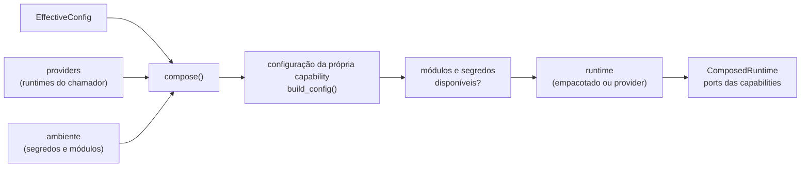

# Composition root

`contextmap.runtime.composition` é o **único** lugar em que backends concretos são nomeados e construídos. Uma capability nunca importa o runtime; um estágio downstream nunca descobre qual backend produziu sua entrada. Cada implementação sai daqui atrás do port que sua capability publica, então trocar de backend é uma mudança de configuração, sem editar código downstream.

## Regras

- **Construir não é carregar.** Os parâmetros são validados pela configuração da própria capability e os módulos/segredos são checados **antes** de qualquer modelo ser pedido. Os loaders empacotados são lazy; um modelo que o repositório não sabe carregar entra por um `RuntimeProvider`.
- **Sem fallback.** Um backend selecionado que não pode ser construído levanta um erro específico. Nada o substitui por outro backend nem remove o estágio.
- **Sem política científica.** As factories só traduzem valores configurados para os tipos da capability. Padrões, faixas e significado são da capability; `build_config()` lê os tipos declarados na dataclass de configuração e converte os valores JSON, então o runtime não duplica parâmetros de backend.
- **Sem registry nem plugin.** A tabela de factories é explícita e fechada; os módulos de backend são importados dentro da factory que os usa, então compor uma configuração importa só o que ela seleciona.

## API

- `compose(effective, providers=..., stages=..., environ=..., module_available=...)` devolve um `ComposedRuntime`.
- `ComposedRuntime` guarda `effective`, os `stages` compostos, os `unavailable_stages` (estágios habilitados sem capability implementada, com o motivo) e as implementações: `source_adapter`, `region_discovery`, `dense_features`, `region_features`, `semantic_interpreter`, `state_estimator`, `point_encoder`, `support_policy` e `accumulation_policy`. Um campo é `None` quando seu estágio não foi composto.
- `RuntimeProvider` é `Callable[[config, ResolvedSecrets], runtime]`: recebe a configuração da capability, já validada, e **somente** os segredos que aquele backend declara.
- `FeatureBuildScope` reúne o estado de execução de que um extrator de features precisa (run, estágio, artifact, sink de payload, raiz das imagens preparadas, fonte de máscaras). Um extrator escreve seus payloads no run que o possui, então só pode ser construído quando esse run existe; por isso `dense_features` e `region_features` são factories que recebem o escopo, e a configuração é validada já em `compose()`.

## De onde vem cada runtime

| Ponto de variação | Backend | Runtime |
|---|---|---|
| `ingestion.source_adapter` | `ros1_bag`, `ros2_bag` | adapter construído a cada pedido (`SourceAdapterConfig`); exige `rosbags`; um pedido de outra família de source é recusado |
| `visual_perception.region_discovery` | `sam2`, `sam3`, `florence2` | **provider** (`Sam2Runtime`, `Sam3Runtime`, `Florence2Runtime`) |
| `visual_perception.dense_features` | `dinov2`, `dinov3` | loader Hugging Face empacotado (lazy; `torch`, `transformers`, `Pillow`) ou provider |
| `visual_perception.region_features` | `clip`, `alphaclip` | loader empacotado (HF / oficial) ou provider; `clip` tem escopo `region` **fixado** pelo slot; `alphaclip` exige `mask_source` no escopo |
| `visual_perception.semantic_interpretation` | `qwen`, `gemini`, `florence2` | **provider** (`QwenRuntime`, `GeminiClient`, `Florence2SemanticRuntime`); `gemini` declara o segredo `GEMINI_API_KEY` |
| `state_estimation.estimator` | `external_pose`, `fast_lio` | `external_pose` não precisa de runtime; `fast_lio` usa o runner por subprocesso empacotado, descrito no grupo `runner` (`command`, `timeout_s`, `work_root`), ou um provider |
| `point_representation.encoder` | `geometric_descriptor`, `ptv3` | `geometric_descriptor` não precisa de runtime; `ptv3` exige um provider (`PTv3Runtime`) |
| `semantic_fusion.support`, `semantic_fusion.accumulation` | políticas versionadas | nenhum |

Um provider fornecido para um backend que também empacota um loader **substitui** o loader e a checagem dos módulos opcionais dele: aqueles módulos passam a ser da responsabilidade do runtime fornecido.

## Grupos de parâmetros reservados

Alguns backends recebem, além da própria configuração, um segundo objeto de configuração. Ele é escrito como um grupo dentro do bloco do backend: `pass_config` e `normalization_config` nos backends de Region Discovery; `support_policy` nos encoders de Point Representation (obrigatório); `runner` no FAST-LIO. Cada grupo é validado pela dataclass que a capability já define.

## Ordem de validação

1. a configuração da capability (`build_config()`), com **todos** os problemas de uma vez e a mensagem da própria capability;
2. os módulos opcionais e os segredos declarados no catálogo;
3. o runtime (provider ou loader empacotado).

Assim um checkpoint inválido ou um limiar fora da faixa falha antes de qualquer modelo ser pedido. Os erros são `BackendConfigurationError`, `BackendUnavailableError`, `BackendRuntimeMissingError` e `StageUnavailableError`, todos `CompositionError`.

## Estágios

`compose()` monta todo estágio habilitado cuja capability existe e lista os demais em `unavailable_stages`; pedir explicitamente um estágio indisponível levanta `StageUnavailableError`. `stages=[...]` compõe só um subconjunto, e a completude da seleção é exigida apenas para ele. `geometric_mapping` e `sensor_association` ainda não têm ponto de variação: seus serviços são código de capability sem estado e ganharão componentes quando um executor consumir seus parâmetros.

## Lacunas conhecidas

- **Loaders de modelo não empacotados.** O repositório não tem código que carregue SAM2, SAM3, Florence-2, Qwen, Gemini ou PTv3; esses backends dependem de um `RuntimeProvider`. Nenhum é escolhido por padrão, e a falta de provider é um erro explícito, nunca um fallback.
- **Preset interno de Visual Perception.** A composition root entrega os backends atrás dos ports; ela não monta o `PipelinePreset` interno da percepção. O `CANONICAL_PRESET_V1` ainda usa as operações legadas `interpret_scene`/`interpret_regions`, que Qwen, Gemini e Florence-2 **não** implementam (eles implementam `interpret(request)`), então promover a política de construção de `SemanticInterpretationRequest` continua sendo uma decisão de `visual_perception`, registrada em [`docs/runtime-composition.md`](../../../../docs/runtime-composition.md).
- **Executores de estágio.** Compor as implementações não é executá-las: a orquestração do DAG vem na issue seguinte e a execução real ponta a ponta, com os parâmetros de política de Geometric Mapping e Sensor Association, pertence à validação end-to-end.
