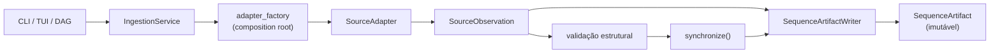

# Serviço público de ingestion

Uma CLI, uma TUI e o DAG precisam executar a ingestion canônica. Sem um serviço comum, cada frontend recomporia adapter, validação, sincronização, provenance e writer. `IngestionService` é esse caminho único: o runtime é dono da **construção, do ciclo de vida, do progresso, do cancelamento e da identidade efetiva do pedido**; **toda** regra sobre fontes, validação, sincronização, calibração e layout do artifact continua em `contextmap.ingestion`.

O serviço importa **só a raiz pública** de `contextmap.ingestion` (nunca um adapter): a família do adapter chega por uma factory construída pela composition root, que **recusa** outra família que não a configurada. Não há fallback silencioso.

## `IngestionRequest`

Composto com os tipos da própria capability (`SourceTopicMapping`, `SynchronizationConfig`, `CalibrationSet`), sem um segundo schema de source/topic/calibração:

| Campo | Significado |
|---|---|
| `source_type`, `source_path` | família do adapter e caminho da gravação |
| `sequence_name` | nome do artifact; um único segmento de caminho (`a/b`, `..` e vazio são recusados) |
| `workspace` | onde publicar `sequences/<nome>/<artifact_id>` |
| `topics`, `required_topics`, `timestamp_clock_id` | o que ler e a identidade do clock de header |
| `synchronization` | modalidade de referência e tolerância |
| `calibration` | calibração externa, mesclada pelo adapter com a da fonte |
| `validation` | `ValidationPolicy(allow_duplicate_timestamps, on_problems="fail"\|"warn")` |
| `hash_source` | hash dos bytes da fonte (O(tamanho)); desligar é registrado na provenance |
| `config_identity` | digest da configuração efetiva do runtime a que o pedido pertence |

`request.identity` é determinística: o digest do documento do pedido **sem o workspace** (onde escrever não é o que é ingerido). Todo campo que muda o resultado muda a identidade. `from_document()` monta um pedido a partir de primitivos (CLI, formulário de TUI); o documento não carrega segredo.

A seleção de sequência (`SequenceSelection`) não faz parte da ingestion: ela é aplicada por replay sobre um artifact **já publicado**.

## `preflight(request)`

Sem ler nenhuma observação, valida e devolve **todos** os problemas de uma vez (`IngestionPreflight`), cada um com o caminho da configuração:

- tópicos: ao menos um de dados; tópico obrigatório sem tópico configurado; modalidade de referência sem tópico; clock vazio;
- caminho da fonte (existe, legível) e do workspace (é diretório, criável/gravável);
- **o adapter é construído**, então uma dependência opcional ausente aparece agora, com a dica de instalação (`adapter.dependency`), e uma família não configurada é `adapter.selection`;
- **o que a fonte realmente fornece** (`capabilities()`): tópico obrigatório ausente (`source.required_topics`) e modalidade de referência ausente (`source.synchronization`). Uma fonte que o adapter não consegue abrir é um problema `source.read` com o tipo da exceção;
- avisos: fonte sem calibração e nenhuma configurada.

O preflight nunca troca o adapter, a política de sincronização nem a calibração.

## `run(request, event_sink=..., cancellation=..., redact=...)`

`preflight` → adapter → leitura → validação → sincronização → provenance → **publicação atômica** → checagem de integridade do que foi publicado.

- **Streaming.** Cada observação é validada (imagem/LiDAR) e escrita no artifact temporário assim que é lida; só metadados sem payload ficam na memória, para a validação entre observações (ordem de timestamp, frames) e para `synchronize()`. Uma gravação maior que a memória pode ser ingerida.
- **Provenance** (`SequenceProvenance`): família e caminho da fonte, hash do conteúdo da fonte, configuração do pedido e seu hash (com a identidade do pedido e a identidade da configuração do runtime), identidade da calibração, política de sincronização, versão do código, avisos. Nada de segredo.
- **Falhas esperadas viram resultado** (`IngestionResult` com `status="failed"`), com `IngestionFailure(category, phase, message, exception_type)`; **nada é publicado**. Uma exceção inesperada emite `ingestion.failed` (categoria `unexpected`) e é relevantada, para um bug não ser engolido.
- **Cancelamento cooperativo** (`CancellationToken`) checado entre observações e fases; `KeyboardInterrupt` emite `ingestion.cancelled` e propaga. Um run falho ou cancelado **aborta o writer**: nem artifact final, nem diretório temporário.

Categorias de falha: `configuration`, `dependency`, `source`, `validation`, `output`, `integrity`, `cancelled`.

### Eventos

`ingestion.planned` → `ingestion.reading-source` (+ `ingestion.progress` a cada N observações) → `ingestion.validating` → `ingestion.synchronizing` → `ingestion.writing-artifact` → `ingestion.completed` | `ingestion.failed` | `ingestion.cancelled`. São `ExecutionEvent`s do ciclo de vida do runtime, numerados e redigidos, entregues a qualquer `EventSink`.

### Resultado

`IngestionResult`: `status`, `sequence_name`, `request_identity`, `artifact_id`, `artifact_path`, `content_hash` (hash do inventário, para a identidade de reuso), contagens por modalidade, avisos, resumo de diagnósticos (grupos sincronizados, eventos descartados, problemas de validação, política) e `IngestionMetrics` (tempo total e por fase, observações lidas, avisos, eventos descartados, bytes e arquivos escritos). Métricas são **operacionais**, não qualidade do mapa. O `SequenceArtifact` persistido segue sendo a autoridade: reabra-o com `SequenceArtifactReader`.

## Como estágio do DAG

`IngestionStageExecutor(service, request)` roda a ingestion como o estágio `ingestion`: devolve um `ArtifactRef(contract="SequenceArtifact", content_hash=<hash do inventário>)` e traduz uma falha em `StageFailure` com a categoria da própria ingestion, então o registro de falha do run diz por quê. Com a `ReusePolicy`, a mesma ingestion é reutilizada por identidade. É o primeiro executor **real** de um estágio do canônico.

## CLI

`contextmap ingest --source PATH --sequence-name NAME --topic KEY=TOPIC... --sync-reference MOD --sync-tolerance-ns N --workspace DIR [--required KEY] [--clock-id ID] [--on-problems fail|warn] [--no-source-hash] [--preflight] [--json]`. O adapter **não** é uma flag: vem do backend selecionado em `components.ingestion.source_adapter.backend` e é composto pela composition root. `--preflight` só confere; sem ele, o progresso sai em stderr e o resultado em stdout (ou JSON com os eventos). Interrupção sai com `130`.

## Lacunas conhecidas

- **Calibração externa pela CLI.** `IngestionRequest.calibration` aceita um `CalibrationSet` (API Python); a CLI ainda não carrega um arquivo de calibração porque o decoder não faz parte da API pública de `contextmap.ingestion`. Fontes com `camera_info` (bag) trazem a calibração pelo adapter.
- **Sem journal de run.** A ingestion publica um artifact e emite eventos; o registro de ciclo de vida (`runtime/run-NNNN`) é do DAG. Rodada como estágio, ela ganha o journal do run.
- **Reuso entre gravações.** O hash da fonte (O(tamanho)) entra na identidade; `--no-source-hash` troca custo por identidade mais fraca e fica registrado.
- **TUI.** O contrato (pedido, preflight, eventos, resultado, cancelamento) está pronto para um frontend externo; a fachada pública única do runtime (issue #264) o expõe junto com o restante.
