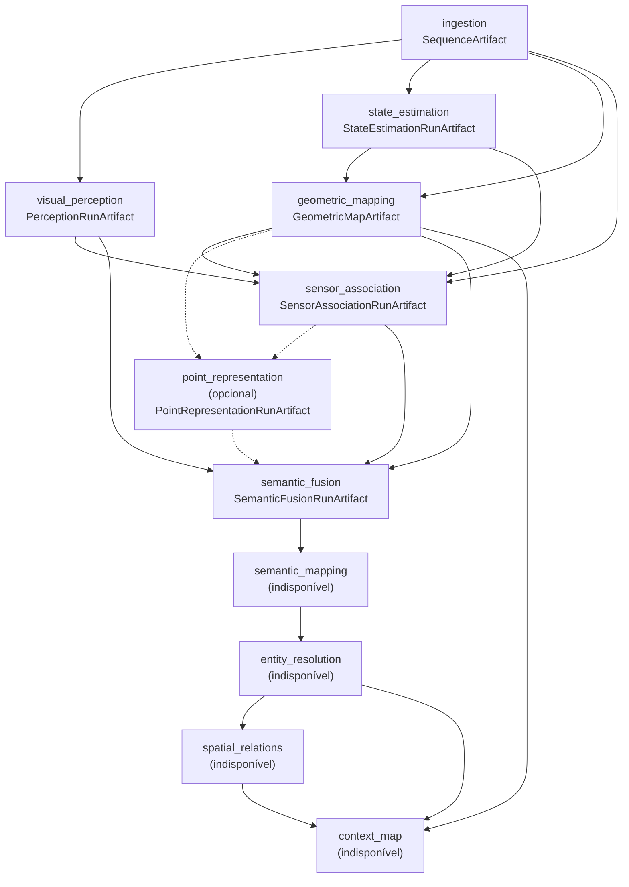

# DAG de estágios

O runtime **não codifica o pipeline canônico**. Um preset declara os estágios, o tipo de artifact que cada um produz e as entradas tipadas que cada um consome, ligadas ao estágio produtor; a configuração escolhe quais estágios opcionais participam. Daí derivam uma topologia determinística, a validação antes de qualquer execução pesada e a execução em ordem de dependência.

É um runner de DAG pequeno, não um motor de workflow: sem scheduler, sem retry, sem descoberta dinâmica. Um estágio só existe quando a transformação tem significado científico, custo e saída próprios; o trabalho científico acontece nos executores, nunca neste módulo.

## Topologia canônica

Uma aresta tracejada é uma entrada **opcional**: ela existe no plano somente quando o estágio de origem participa.

| Estágio | Entradas (contrato ← origem) | Saída |
|---|---|---|
| `ingestion` | — | `SequenceArtifact` |
| `visual_perception` | `sequence` ← `ingestion` | `PerceptionRunArtifact` |
| `state_estimation` | `sequence` ← `ingestion` | `StateEstimationRunArtifact` |
| `geometric_mapping` | `sequence` ← `ingestion`, `trajectory` ← `state_estimation` | `GeometricMapArtifact` |
| `sensor_association` | `sequence`, `perception`, `trajectory`, `geometry` | `SensorAssociationRunArtifact` |
| `point_representation` (opcional) | `geometry` ← `geometric_mapping`, `association` ← `sensor_association` (opcional) | `PointRepresentationRunArtifact` |
| `semantic_fusion` | `association`, `perception`, `geometry`, `representation` ← `point_representation` (opcional) | `SemanticFusionRunArtifact` |
| `semantic_mapping` … `context_map` | indisponíveis (milestones #12–#15) | — |

Os estágios indisponíveis continuam na topologia, com o motivo; o preflight os reporta se o escopo os incluir.

## Estágios opcionais

Há dois padrões, ambos declarativos e validados por contrato:

- **Ramo opcional.** Uma entrada marcada `optional` desaparece do plano quando o estágio de origem não participa e é ligada quando participa (`point_representation` → `semantic_fusion`).
- **Inserção entre produtor e consumidor.** Um estágio opcional declara uma `Interception(consumer, input_name)`: quando participa, ele consome o que a entrada do consumidor lia e produz o **mesmo contrato**, e o consumidor passa a ler dele. O consumidor não é editado e não sabe qual estágio produziu a entrada (o exemplo é `DenseFeatureExtraction → [FeatureResolutionEnhancement] → SensorAssociation`, sem `if loftup` em Sensor Association). Um contrato incompatível falha no preflight. Duas interceptações da mesma entrada também.

## Plano

`resolve_plan(effective)` devolve um `PipelinePlan`:

- **determinístico:** ordem topológica com desempate pela ordem de declaração do preset;
- **inspecionável:** cada `PlannedStage` traz as entradas ligadas a seus produtores, o backend de cada ponto de variação e o `config_digest`;
- **identificado:** `PipelinePlan.digest` cobre a topologia; `PlannedStage.config_digest` cobre a configuração **própria** do estágio (contrato declarado, backend e parâmetros de cada componente), não sua posição. Alterar um estágio muda o digest dele e não o dos demais, o que é a base do reuse por identidade;
- **tolerante na resolução:** origem desconhecida ou desligada, contrato incompatível e ciclo não levantam exceção, ficam em `plan.problems` e o preflight os reporta junto com os demais.

## Escopo e subgrafo

`plan.scope(targets=..., provided=...)` escolhe o que uma execução roda. Um alvo puxa os estágios de que depende transitivamente, **exceto** aqueles cujo artifact foi fornecido explicitamente: um artifact imutável existente é reutilizado em vez de recomputado. Sem `targets`, é o pipeline completo. Nada é inferido: um artifact fornecido que não é necessário, de outro tipo ou de outro estágio é um problema de preflight, nunca ignorado em silêncio.

## Preflight

`preflight(execution, ...)` valida, sem importar módulo nem carregar modelo, e devolve **todos** os problemas de uma vez:

- ciclos, dependências ausentes e incompatibilidade de contrato entre produtor e consumidor;
- artifacts fornecidos de tipo errado ou desnecessários, e alvos desconhecidos;
- estágios do escopo sem capability implementada;
- pontos de variação sem backend, e módulos opcionais e segredos ausentes (com `provided_runtimes` para os runtimes que o chamador fornece);
- estágio do escopo sem executor, quando os executores são informados.

## Execução

`run_plan(execution, executors, ...)` roda o preflight e bloqueia tudo se houver problema. Cada estágio recebe um `StageRequest` com os artifacts exatos que o alimentam (reutilizados ou recém-produzidos) e a configuração de seus componentes, e devolve um `ArtifactRef`. A primeira falha, ou uma saída que contradiz o contrato declarado, levanta `StageExecutionError` com os estágios já concluídos: nada posterior roda e nada é substituído.

O `ExecutionRecord` guarda a ordem, as entradas e saídas exatas de cada estágio, a decisão de reuso de cada um (quando há uma `ReusePolicy`) e os artifacts reutilizados.

## Persistência

`write_plan()` grava `plan.json` (topologia, identidades e ordem) e `write_execution_record()` grava `execution.json`. As duas escritas são atômicas, nunca substituem um arquivo existente e trazem o digest do documento; `read_plan_document()` recusa outra versão de schema e um documento alterado. Um plano com problemas estruturais não é persistido.

## Testabilidade

O DAG roda em CI com executores leves (sem modelo nem GPU): a ordem, as entradas, a inserção de estágios opcionais, o escopo, o preflight e a falha são exercitados com estágios falsos.

## Lacunas conhecidas

- **Não há executores reais das capabilities.** A milestone entrega o runner, o contrato do executor e a topologia; a execução real ponta a ponta exige as políticas de Geometric Mapping e Sensor Association e o vínculo de cada artifact, e pertence à validação end-to-end (#177). O canônico completo resolve e é validado, mas o preflight o bloqueia enquanto as capabilities de #12–#15 não existirem: o caminho suportado é um subgrafo (`targets=[...]`).
- **`FeatureResolutionEnhancement` não é um estágio de topo.** No canônico ele é interno ao preset de Visual Perception; o padrão de inserção acima é o mecanismo, exercitado com estágios de teste.
- **Seleção de runs e lineage** e **lifecycle de falha/retomada** são as issues seguintes da milestone. O reuso por identidade está em [`reuse.md`](reuse.md); sem uma `ReusePolicy`, o reuso é apenas o artifact fornecido explicitamente.
